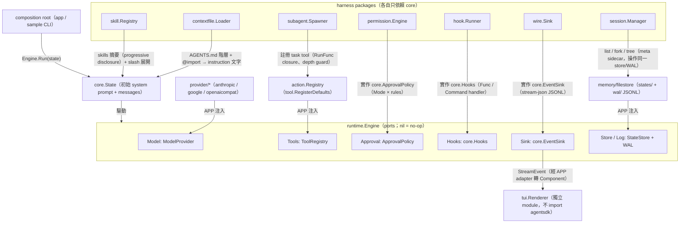
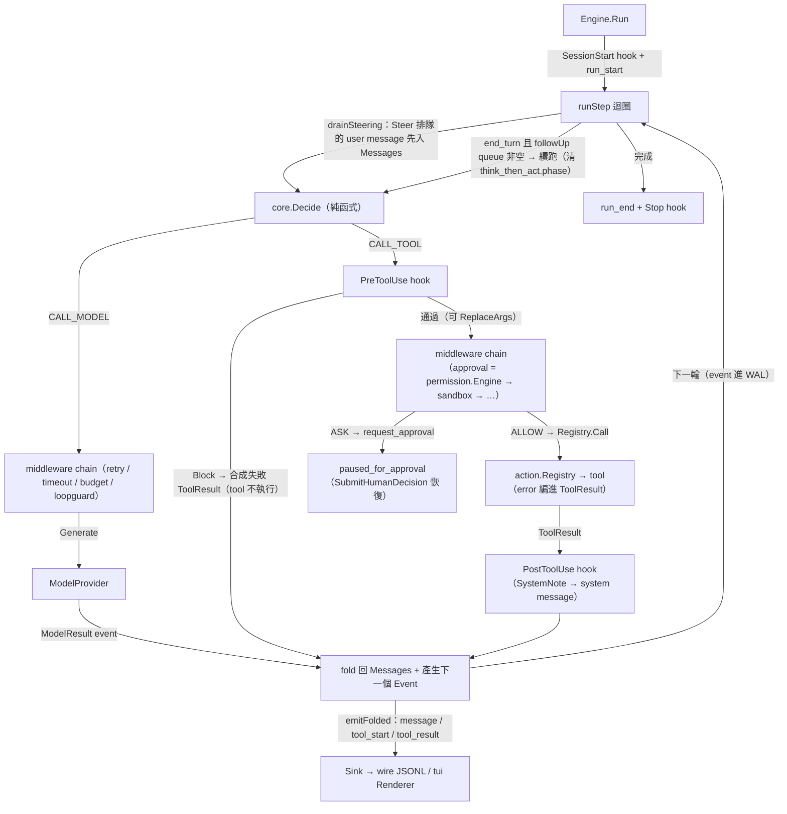

# Agent Client Feature Catalog（claude-code / codex / grok-build / pi）

調查日期：2026-07-19。目的：為 agentsdk 補齊 `harness` 與 `UX` 能力前，先盤點四個標竿 agent client 的完整功能面，並對照 agentsdk 現況。auth 與 API proxy 已由 `github.com/bizshuk/auth`、`github.com/bizshuk/proxy` 覆蓋，本目錄僅列出不展開。

來源：

- claude-code：<https://github.com/anthropics/claude-code>、<https://code.claude.com/docs/en/overview>
- codex：<https://github.com/openai/codex>、developers.openai.com/codex（redirect 後之 docs）
- grok-build：<https://github.com/xai-org/grok-build>
- pi：<https://github.com/earendil-works/pi>（`pi-ai` / `pi-agent-core` / `pi-coding-agent` / `pi-tui` 四個 package README）

## 1. Claude Code（harness 與 UX 的標竿）

### Harness

- Agent loop：streaming、thinking（可調 effort/budget）、model 切換與 fallback、prompt caching、microcompaction（清除舊 tool result）、auto-compact 與 `/compact`。
- Tools：`Read`/`Write`/`Edit`/`NotebookEdit`、`Bash`（background、timeout、sandbox）、`Glob`/`Grep`、`WebFetch`/`WebSearch`、`Task`(subagent)、`TodoWrite`、`AskUserQuestion`、`ExitPlanMode`、`Skill`、MCP tools + `ToolSearch`（deferred tool 載入）。
- Permission 系統：mode（`default`/`acceptEdits`/`plan`/`bypassPermissions`/`dontAsk`）+ 規則（`allow`/`ask`/`deny`，帶 specifier 如 `Bash(git:*)`、`Edit(path/**)`）+ `additionalDirectories`；settings 分層（managed → CLI → local → project → user）。
- Hooks：`PreToolUse`/`PostToolUse`/`UserPromptSubmit`/`Notification`/`Stop`/`SubagentStop`/`PreCompact`/`SessionStart`/`SessionEnd`；command hook 走 JSON stdin/stdout、exit code 2 = block；支援 matcher、timeout、managed hooks。
- Subagents：`.claude/agents/*.md` frontmatter（description/tools/model/effort/isolation）；background agents、agent teams（`SendMessage`）、內建 `general-purpose`/`Explore`/`Plan`；worktree/remote isolation。
- Skills 與 slash commands：`.claude/skills/<name>/SKILL.md`（progressive disclosure：frontmatter → body → references/）、`.claude/commands/*.md`（`$ARGUMENTS`、`!bash` 內插、`@file`）；plugins（marketplace）打包 commands/agents/skills/hooks/MCP；output styles 覆寫回應風格。
- Memory 與 context：`CLAUDE.md` 階層（enterprise/user/project/local）+ `@import`；auto memory（`MEMORY.md` 索引 + 單檔單事實）；`/init`、`/memory`、`/context`。
- Sessions：JSONL transcript per project dir；`--continue`/`--resume`（picker）、session fork、checkpoint + `/rewind`（code 與 conversation 雙軸回退）、`--teleport`/`--cloud`（web ↔ CLI 搬移）、Remote Control、desktop handoff。
- Headless 與 SDK：`claude -p`、`--output-format text|json|stream-json`、`--input-format stream-json`、`--max-turns`、`--allowedTools`、`--permission-prompt-tool`；Agent SDK（TS/Python）暴露 `query()`、`canUseTool`、hooks、in-process 自訂 tool（SDK MCP server）、session 管理。
- Orchestration：background Bash、`Monitor`、task notification、`/loop`、routines（cloud cron）、desktop scheduled tasks、`Workflow`（deterministic script：`agent()`/`parallel()`/`pipeline()`、token budget）。
- 安全：sandboxed bash（macOS Seatbelt / Linux bubblewrap）、network allowlist proxy、untrusted content spotlighting、命令注入偵測。

### UX

- TUI：streaming markdown 渲染、syntax highlight、todo list 顯示、statusline（自訂 command）、themes、vim mode、`!` bash mode、`@` file mention、image paste、queued messages（打字排隊/steering）、`Esc` 中斷、double-`Esc` rewind、`Ctrl+O` transcript 展開、`Shift+Tab` mode 切換、tab thinking 切換。
- Slash UX：`/model`、`/config`、`/doctor`、`/cost`、`/usage`、`/statusline`、`/desktop` 等。
- IDE/其他表面：VS Code/JetBrains（inline diff、selection context）、desktop app（多 session 並排、排程）、web/mobile、Slack `@Claude`、GitHub Actions/GitLab CI、Chrome 整合、Channels（Telegram/Discord/iMessage/webhook）。

## 2. OpenAI Codex

- CLI（Rust）：interactive TUI、`codex exec` 非互動模式（`--json` event stream）、`codex resume`（`--last`/picker）、`--cd`、image input、`@` file search、`Esc-Esc` 回溯編輯舊訊息、transcript mode、shell completion、desktop app（`codex app`）、IDE extension（VS Code/Cursor/Windsurf）、cloud（chatgpt.com/codex）與 GitHub `@codex` review。
- 兩軸安全模型（approval × sandbox，正交設計，值得借鏡）：
    - approval policy：`untrusted` / `on-failure` / `on-request` / `never`（`/approvals` 切換）。
    - sandbox mode：`read-only` / `workspace-write`（network 預設關、writable roots 可調）/ `danger-full-access`；macOS Seatbelt、Linux Landlock+seccomp。
- `config.toml`：model、`model_providers`（自訂 `base_url`/`env_key`/`wire_api` chat|responses）、profiles（一鍵切整組設定）、`model_reasoning_effort`、`approval_policy`、`sandbox_mode` 與 `[sandbox_workspace_write]`、`mcp_servers`、`notify`（事件觸發外部程式）、history 持久化、`shell_environment_policy`、`tools.web_search`、per-project trust、requirements.toml（managed 限制層，如 `allow_managed_hooks_only`）。
- 脈絡與擴充：`AGENTS.md` 階層（`~/.codex/AGENTS.md` → repo root → cwd）、custom prompts（`~/.codex/prompts/*.md`）、2026 已加入 memories、skills、hooks、plugins、subagents、auto-review、chat handoff。
- MCP：client（`mcp_servers`）+ server mode（`codex mcp`，Codex 本身可被當 tool 呼叫）。
- SDK：TypeScript codex-sdk；auth 走 ChatGPT plan 或 API key。

## 3. xAI grok-build

- 型態：fullscreen TUI（mouse、modals、scrollback 管理、theming、keyboard shortcuts）+ headless mode + `ACP`（Agent Client Protocol，讓 editor 內嵌 agent）。
- 進入點：leader / stdio / headless 三種 entry point。
- Harness：checkpoint 系統（保存/回復 agent 狀態）、sandboxing、VCS 整合、長任務管理。
- Tools：terminal、file edit、search、web search。
- 擴充：MCP、skills、plugins、hooks、slash commands、config files；瀏覽器 login auth；跨平台 binaries。

## 4. Pi（earendil-works；modularization 的標竿）

Monorepo 分四個 package，依賴方向嚴格單向：`coding-agent → agent-core → ai`；`tui` 為獨立 presentation 層。外部依賴 pin 精確版本（supply-chain hardening）、內部 package 用 version range。刻意不做內建 permission 系統（隔離交給 container）。

### pi-ai（unified LLM API）

- 30+ providers（OpenAI/Anthropic/Google/Bedrock/OpenRouter/Ollama/vLLM…）單一介面；`stream()`/`complete()` + `streamSimple()` 統一 reasoning 介面。
- Event 化 streaming：`text_*`/`thinking_*`/`toolcall_*`/`done`/`error`，以 `contentIndex` 關聯 block；partial JSON streaming（tool 參數漸進解析）。
- Tool calling：TypeBox schema + `validateToolCall()`；tool result 支援 text/image。
- Thinking levels 統一（`minimal`→`max`）+ provider 特定 option 下鑽。
- Context serialization：對話可序列化、跨 provider handoff（thinking block 自動轉換、tool call 保留）。
- Model registry（models.dev 資料）+ cost/token tracking 內建；credential store 抽象、OAuth flows、custom provider、faux provider（測試用腳本回應）、abort + partial content 回收。

### pi-agent-core（agent runtime）

- `Agent` class：state（systemPrompt/model/thinkingLevel/tools/messages/isStreaming/pendingToolCalls）直接可變 + reactive；`prompt()`/`abort()`/`waitForIdle()`/`subscribe()`。
- Event 序列：`agent_start/end`、`turn_start/end`、`message_start/update/end`、`tool_execution_start/update/end`。
- Tool：TypeBox 驗證、per-tool `executionMode`（parallel/sequential）、streaming `onUpdate`、錯誤用 throw（標記 `isError`）、`terminate` 提前收束。
- Hook：`beforeToolCall`（可 block）+ `afterToolCall`（可改寫結果/terminate）。
- Steering 與 follow-up queue：tool 執行中插話（steer）、結束後追問（followUp）；one-at-a-time 或 all 模式。
- Message transform：`AgentMessage`（可擴充自訂型別）→ `transformContext()`（壓縮/剪枝）→ `convertToLlm()`。
- 低階 `agentLoop()`/`agentLoopContinue()` 可跳過 Agent wrapper 直接迭代。

### pi-coding-agent（CLI 產品）

- 四種模式：interactive TUI / print(`-p`) / JSON lines / RPC（JSONL 協定）+ SDK embedding。
- Tools：read/write/edit/bash/grep/find/ls。
- Sessions：JSONL 存 `~/.pi/agent/sessions/`（按 cwd 分組）、`-c`/`-r` resume、`--fork`、`/tree`（單檔內 in-place branching：任一節點續走、fold/bookmark/搜尋）。
- Compaction：`/compact`（可帶指示）+ 溢出自動壓縮；JSONL 保留完整歷史。
- Extensions：TypeScript module 自訂 tools/commands/shortcuts/UI/permission gate/sub-agent/plan mode；可整組替換內建 tool。
- Skills（SKILL.md 標準）、prompt templates（`{{variable}}`）、themes（hot-reload）、`/model` 跨 provider 即時切換。
- Packages：`pi install npm:...`/`git:...` 發佈 extensions/skills/prompts/themes；project trust 模型（`trust.json` 記住決定）。
- Keyboard：steering queue（`Enter` 插話、`Alt+Enter` 追問）、`Ctrl+O`/`Ctrl+T` 摺疊、`Ctrl+G` 外部 editor、`Shift+Tab` thinking 循環等。

### pi-tui（TUI library）

- Differential rendering 三策略：全量首繪 / 寬度變更清屏 / 游標定位局部重繪；CSI 2026 synchronized output 防閃爍；不用 alternate screen（保留 scrollback）。
- Component 模型：`render(width)` + `handleInput` + `invalidate` 最小契約；Container 樹 + focus 傳遞；overlay（九錨點、margin、responsive 隱藏）。
- 內建 13 個 component：Text/TruncatedText/Input/Editor(autocomplete、slash、paste 摺疊)/Markdown(theme hook、render cache)/Loader/CancellableLoader/SelectList/SettingsList/Spacer/Image(Kitty/iTerm2)/Box/Container。
- ANSI 工具：`visibleWidth`/`truncateToWidth`/`wrapTextWithAnsi`；Kitty keyboard protocol；IME 游標定位（CJK 輸入）；bracketed paste。
- Terminal 抽象：`ProcessTerminal` + `VirtualTerminal`（headless 測試）。

## 5. 跨 client 共同能力叢集 × agentsdk 現況

（`agentsdk 現況` 欄為調查時點快照；同日已依本目錄落地 harness/UX skeleton，銜接見 §7，最新狀態以 `CLAUDE.md` 狀態表為準。）

| 能力叢集 | claude-code | codex | grok-build | pi | agentsdk 現況 |
| --- | --- | --- | --- | --- | --- |
| Agent loop + streaming events | ✅ | ✅ | ✅ | ✅ | 部分：`core`/`runtime` 有 Event，粒度不到 message/tool delta |
| Provider 抽象 + thinking + cost | ✅ | ✅ | ✅ | ✅ | 部分：`provider/*` 3 家；無統一 stream event schema、cost tracking |
| Permission rules × sandbox 兩軸 | ✅ | ✅ | ✅ | ❌(交給 container) | 部分：`action` approval L0-L4 + sandbox，無 rule specifier/mode |
| Lifecycle hooks | ✅ | ✅ | ✅ | ✅(before/after tool) | 缺：middleware 只包 instruction，無對外 hook 事件面 |
| Skills / slash commands / prompts | ✅ | ✅ | ✅ | ✅ | 缺 |
| Subagents | ✅ | ✅ | — | ✅(extension 自建) | 缺 |
| Session resume / fork / tree | ✅ | ✅ | ✅(checkpoint) | ✅ | 部分：`memory` StateStore/WAL/checkpoint 有 runID，無 list/fork/tree |
| Context files（CLAUDE.md/AGENTS.md 階層） | ✅ | ✅ | ✅ | ✅ | 缺 |
| Auto compaction | ✅ | ✅ | — | ✅ | 部分：`memory` compactor 存在，未接 harness 觸發策略 |
| MCP client/server | ✅ | ✅ | ✅ | ❌(extension 承接) | 缺：2026-07-19 已移除 `mcp/`（無 caller） |
| Headless / JSON / RPC 模式 | ✅ | ✅ | ✅ | ✅ | 缺：2026-07-19 已移除 `cli/` envelope（無 caller） |
| TUI（differential rendering） | ✅ | ✅ | ✅ | ✅(獨立 lib) | 缺 |
| Extensions / plugins / packages | ✅ | ✅ | ✅ | ✅ | 缺 |
| Background / scheduling / workflows | ✅ | ✅ | ✅ | ❌ | 缺（pm2 承接 cron 屬 workspace 慣例） |
| Auth（OAuth/device/API key） | ✅ | ✅ | ✅ | ✅ | 已覆蓋：`github.com/bizshuk/auth`（不再重做） |
| Protocol proxy / gateway | — | — | — | ❌ | 已覆蓋：`github.com/bizshuk/proxy`（不再重做） |
| Editor 內嵌協定（ACP） | ✅(IDE ext) | ✅(IDE ext) | ✅(ACP) | ❌ | 缺（低優先） |

## 6. 對 agentsdk 的啟示（結論）

- pi 證明 4 層單向依賴（`ai` → `agent-core` → `coding-agent`，`tui` 獨立）可支撐全部功能；agentsdk 已有等價底 3 層（`provider/*` → `core`+`runtime` → `app`/`sample`），缺的是 harness 面（hooks/permission rules/skills/session UX/context files）與 presentation 面（`tui`、headless wire）。
- codex 的 approval × sandbox 正交兩軸，比單一 L0-L4 更能表達「誰批准」與「能碰什麼」；值得把 `action` 的 policy 拆成兩個可注入維度。
- claude-code 的 hooks 事件面（9 種 lifecycle event、exit-code 契約）是所有擴充功能（format-on-save、custom gate、notification）的最小公倍數，應優先落地。
- 所有 client 的 session 都以 JSONL transcript 為 single source of truth，fork/tree 是檔案層操作；agentsdk 的 WAL 已是 JSONL，缺 session 管理層（list/fork/tree/resume picker）。

## 7. agentsdk 元件銜接（as-built，2026-07-19 skeleton）

依本目錄同日落地的實際銜接；模組設計歷史見 [`plans/2026-08-03-refresh.md`](../../plans/2026-08-03-refresh.md)。

### 7.1 組裝銜接（composition root 做 DI；harness package 只依賴 core）

### 7.2 執行期銜接（一個 turn 的 hook / permission / queue 火點）

兩張圖的鐵則：`HARNESS` 內的 package 彼此零 import、只認 `core` 的型別；`tui` 反向也不認 agentsdk，靠 `StreamEvent` 這一層 JSON-stable 資料流銜接。
