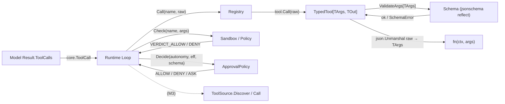
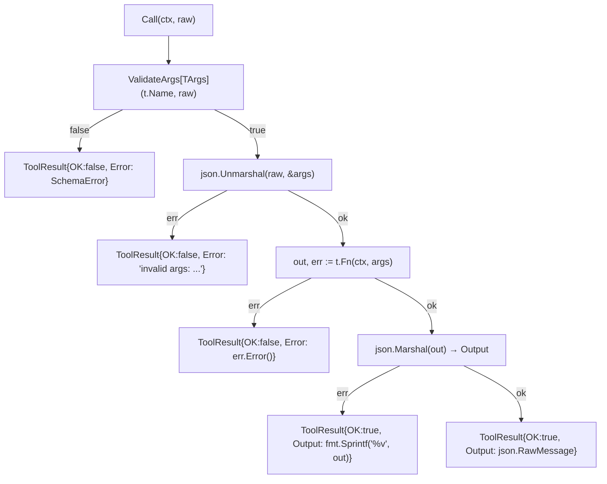
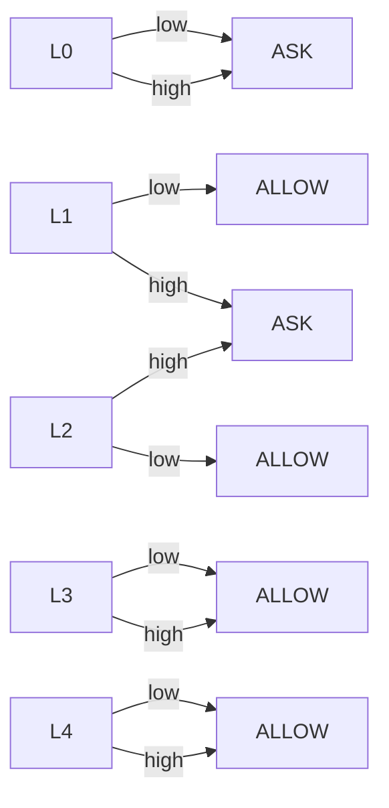

# Spec — action/ 套件 工具支柱 (Tool Pillar)

> 對應里程碑: M3 (工具生態 + 執行期安全) — 核心介面 M1 已備齊,沙箱 / approval / ToolSource 在 M3 補齊
> 日期: 2026-07-07
> 範圍: `action/` 套件 — `TypedTool` / `Registry` / `Schema` / `Sandbox` / `ApprovalPolicy` / `ToolSource` + tests

## 目標

`action/` 是 agent loop 的「輸出 / 行動支柱 (action pillar)」:負責「LLM 想要呼叫 tool → 驗證 → 沙箱檢查 → 批准政策 → 執行 → 回傳結果」的整條鏈。M1 已經備好 `TypedTool` / `Registry` / 反射 schema 的核心介面;M3 在此基礎上補 `Sandbox` (allow/deny)、`DefaultApprovalPolicy` (autonomy × risk grid)、`ToolSource` (MCP-style 動態註冊) 三個擴充面。



## 套件結構

| 檔案 | 角色 | 狀態 | 用途 |
|------|------|------|------|
| `tool.go` | `TypedTool[TArgs, TOut]` | ✅ M1 | 泛型工具包裝,JSON marshal/unmarshal/錯誤處理 boilerplate 全收斂 |
| `registry.go` | `Registry` + `ToolSource` | ✅ M1 / M3 擴充 | 記憶體靜態註冊 + MCP-style 動態發現介面 |
| `schema.go` | `SchemaFor[T]` / `ValidateArgs[T]` | ✅ M1 + M3 | `invopop/jsonschema` 反射 + 輕量校驗 |
| `sandbox.go` | `Sandbox` / `Policy` / `Verdict` | ✅ M3 | allow/deny 政策預設實作 |
| `approval_policy.go` | `DefaultApprovalPolicy` | ✅ M3 | autonomy × risk grid 查表 |
| `action_test.go` | 測試 | ✅ | `TypedTool` happy/error/bad-args、`Registry` get/call |
| `schema_test.go` | 測試 | ✅ | 反射 `Required` 推導、round-trip、validation 四條路徑 |
| `sandbox_test.go` | 測試 | ✅ | allow/deny path + command + case-insensitive + 訊息診斷 |
| `approval_policy_test.go` | 測試 | ✅ | grid 4 象限各一個 case |

## 合約 (Contract)

### `TypedTool[TArgs, TOut]`

```go
type TypedTool[TArgs any, TOut any] struct { /* 見 source */ }
func NewTypedTool[TArgs, TOut](name, desc string, fn) *TypedTool[TArgs, TOut]
func (t) SetRisk(r core.RiskLevel)
func (t) Name() / Description() / Risk() / Schema() core.ToolSchema
func (t) Call(ctx, raw json.RawMessage) (core.ToolResult, error)
```

`Call` 流程:



關鍵設計:

- **JSON marshaling 雙向**:`Schema` 把 `TArgs` 反射成 JSON Schema 給 LLM 看;`Call` 把 LLM 給的 `json.RawMessage` unmarshal 回 `TArgs` 給 Go 函式;`out` 再 marshal 回 `json.RawMessage` 進 `ToolResult.Output`。三段都是原生 JSON,沒有額外 dialect。
- **「`null` / empty 也算合法」**:`len(raw) == 0 || string(raw) == "null"` 不會炸 — 交給 `ValidateArgs` 判斷「`TArgs` 是否全 optional」;若是,放行 zero value。
- **錯誤永遠不向上拋**:`Call` 的 `error` return 保留給「系統級失敗」(目前永遠 nil),應用錯誤一律寫進 `ToolResult.Error` — pattern / loop 看 `OK` 決定下一步。
- **Schema 反射一次 + 快取**:`sync.Once` 包住 `SchemaForTool`,整個 process 同型別只 reflect 一次。
- **沒有 panic**:marshal 失敗 fallback 到 `fmt.Sprintf("%v", out)`,確保 LLM 至少看到人類可讀的描述。

### `Registry`

```go
type Registry struct { /* sync.RWMutex + map[string]core.Tool */ }
func NewRegistry() *Registry
func (r) Register(t core.Tool)
func (r) Get(name string) (core.Tool, bool)
func (r) List() []core.ToolSchema   // 拷貝,呼叫端可任意改
func (r) Call(ctx, call core.ToolCall) core.ToolResult
```

合約:

| 操作 | 行為 |
|------|------|
| `Register` 重名 | 直接覆蓋 — caller 自負,SDK 不擋 (sample 端組合時就要避免) |
| `Get` 找不到 | 回 `(zero, false)` — 不 panic、不 log,符合 Go zero-value 慣例 |
| `List` | 回 slice 拷貝 + 每個 tool 自己的 `Schema()`(也是 cached),呼叫端可平行消費 |
| `Call` 找不到工具 | 回 `ToolResult{OK:false, Error: "tool not found: <name>"}`,`CallID` 仍帶上方便追蹤 |
| 並發 | `RWMutex` 守 map;`Call` 過程中釋放 read lock,讓 long-running tool 不擋其他 Get/Register |

`marshalArgs`:把 `core.ToolCall.Args` (`map[string]any`) marshal 成 `json.RawMessage`,然後丟給 `TypedTool.Call`。中間型別轉換是 LLM 的 `map[string]any` ↔ Go 的 `TArgs struct` 的唯一橋。

### `ToolSchema` 反射 (`schema.go`)

依賴: `github.com/invopop/jsonschema`。

```go
func SchemaFor[T any]() *jsonschema.Schema
func SchemaJSON[T any]() (json.RawMessage, error)
func SchemaForTool[T any](name, desc string, risk core.RiskLevel) (core.ToolSchema, error)
func ValidateArgs[T any](toolName string, raw json.RawMessage) (valid bool, err error)
```

關鍵行為:

- **Required 推導規則**:json tag 含 `omitempty` → optional;否則 required。`invopop/jsonschema` 會在反射時讀 `json` tag 並生成 `required` 陣列。
- **`T` 是 `interface{}`**:回最鬆的 schema (`*jsonschema.Schema{}`),不 panic。
- **複雜型別走 `$ref` + `$defs`**:命名 struct 會被 reflector 拆成 `$defs/<TypeName>`,top-level 只剩 `$ref` 指向它;`SchemaForTool` 序列化時整包丟進 `ToolSchema.Parameters`(`json.RawMessage`)。
- **`ValidateArgs` 輕量校驗**:
    - 空 / `null` payload + `T` 是 zero-field struct → 放行
    - 空 / `null` payload + `T` 有 required → 拒絕
    - 非 JSON object → 拒絕
    - 缺 required 欄位 → 拒絕,回 `SchemaError{Tool, Errors: ["missing required field: <name>"]}`
- **不取代完整 JSON Schema validator** — 註解明確寫「for production-grade validation, plug in santhosh-tekuri/jsonschema」;M3 視需要升級。
- **`resolveRef`**:把 `$ref` 指向 `$defs/<TypeName>` 拉回來,讓 `required` 列表可見 — 這是測試 `findRequired` 必須做的遞迴。

### `Sandbox` (`sandbox.go`)

```go
type Sandbox interface {
    Check(toolName string, args map[string]any) Verdict
}
type Verdict int // VERDICT_ALLOW / VERDICT_DENY
type Policy struct { AllowedPathPrefixes, PathKeys, DeniedCommandSubstrings, CommandKeys }
func DefaultPolicy() *Policy
```

規則:

- **Path allowlist**:`args` 中任何 `PathKeys` 預設 `["path"]` 的字串值,必須是絕對路徑 (`filepath.IsAbs`) 且 `filepath.Clean` 後 `strings.HasPrefix` 於任一 `AllowedPathPrefixes`。
- **Command denylist**:`args` 中任何 `CommandKeys` 預設 `["command", "cmd"]` 的字串值,經 `strings.ToLower` 後不得包含 `DeniedCommandSubstrings` 任一字串。
- **不相關 args**:tool 用不到 `path` / `command` 的 arg,直接放行 — `Check` 只挑 `PathKeys` / `CommandKeys` 檢查。
- **非字串值**:型別不對 → `VERDICT_DENY`(不 silent pass,避免繞過)。
- **沒有 follow symlink**:註解明確「the tool that consumes the path is responsible for following them safely」 — sandbox 只管「字面上路徑字串」。

`DefaultPolicy()` 內建 denylist:

| 類別 | 預設值 |
|------|--------|
| `AllowedPathPrefixes` | `["/tmp"]` |
| `PathKeys` | `["path"]` |
| `DeniedCommandSubstrings` | `"rm -rf /"`、fork bomb `:(){:|:&};:`、`dd if=`、`mkfs.`、`shutdown`、`reboot`、`halt`、`poweroff` |
| `CommandKeys` | `["command", "cmd"]` |

> 預設「所有非 `/tmp` 路徑都拒絕」 — fail-closed;上線前必須顯式擴 allowlist。

### `DefaultApprovalPolicy` (`approval_policy.go`)

實作 `core.ApprovalPolicy` 介面,純查表:



決策邏輯(完全契合 spec doc):

| 條件 | 動作 |
|------|------|
| `autonomy == L0` | `ASK`(不管風險) |
| `risk == low` | `ALLOW`(L1 起自動) |
| `autonomy ∈ {L1, L2}` 且 `risk == high` | `ASK` |
| `autonomy ∈ {L3, L4}` 且 `risk == high` | `ALLOW` |

特性:

- **純宣告式**:不 inspect runtime、不存狀態、不抓外部 policy。
- **gridLookup 獨立函式**:讓測試不必構造完整 `CallToolEffect` / `ToolSchema` 就能驗表。
- **M4 hook**:可疊加「per-tool risk override / 環境變數」動態覆寫,不破壞現有 grid 介面。

### `ToolSource` 介面 (M3 預備)

```go
type ToolSource interface {
    Discover(ctx context.Context) ([]core.ToolSchema, error)
    Call(ctx context.Context, name string, args json.RawMessage) (core.ToolResult, error)
}
```

- 形狀刻意貼近 MCP / OpenAPI — 之後 `mcp/` 子套件實作此介面,`Registry` 內持有 slice 並在 `List` / `Call` 時 fan-out。
- M1 尚未注入 `Registry` — M3 在 `Registry` 加 `Sources []ToolSource` 欄位,`Register` 仍然可單獨用,`Sources` 是 additive 維度。

## 與 runtime 的銜接 (Where It Sits in the Loop)

```mermaid
sequenceDiagram
    participant LLM
    participant Loop as Runtime Loop
    participant Reg as Registry
    participant TT as TypedTool
    participant Sch as Schema.ValidateArgs
    participant SB as Sandbox
    participant AP as ApprovalPolicy
    LLM->>Loop: ModelResult{ToolCalls: [...]}
    Loop->>Reg: Call(ctx, ToolCall{id, name, args})
    Reg->>SB: Check(name, args)
    SB-->>Reg: VERDICT_ALLOW / DENY
    alt VERDICT_DENY
        Reg-->>Loop: ToolResult{OK:false, Error:"sandbox: deny"}
    else ALLOW
        Reg->>Loop: (向 caller 詢問 approval?)
        Loop->>AP: Decide(autonomy, eff, schema)
        AP-->>Loop: ALLOW / ASK / DENY
        alt ASK
            Loop-->>LLM: (發 RequestApproval effect,HITL 等待)
        else ALLOW
            Loop->>Reg: 確認執行
            Reg->>TT: tool.Call(ctx, raw)
            TT->>Sch: ValidateArgs[TArgs](name, raw)
            Sch-->>TT: ok / SchemaError
            TT->>TT: json.Unmarshal → TArgs
            TT->>TT: t.Fn(ctx, args)
            TT-->>Reg: ToolResult{OK, Output}
            Reg-->>Loop: 帶 CallID 回填
        end
    end
```

## 測試覆蓋

| 檔案 | 測試 | 守護 |
|------|------|------|
| `action_test.go` | `TestTypedToolCall` | happy path: `{"message":"hi"}` 走通,`OK=true`,`Name` 帶回 |
| `action_test.go` | `TestTypedToolError` | 函式回 error → `OK=false` + `Error="kaboom"`,不向上拋 |
| `action_test.go` | `TestTypedToolBadArgs` | 非 JSON → `OK=false` + 含 `schema validation failed` |
| `action_test.go` | `TestRegistry` | Register / Get / List 行為 |
| `action_test.go` | `TestRegistryCall` | Call 帶 CallID,ToolResult 帶回 |
| `action_test.go` | `TestRegistryCallUnknownTool` | 缺工具 → `OK=false` + `tool not found` |
| `schema_test.go` | `TestSchemaForContainsRequiredFields` | 非 `omitempty` 進 required,反之不出現 |
| `schema_test.go` | `TestSchemaJSONRoundTrip` | 序列化後 `type=object` + `properties` 含 `path` / `mode` |
| `schema_test.go` | `TestSchemaForToolProducesCompleteToolSchema` | `ToolSchema` 欄位齊全,`Parameters` 解出 required 內含 `path` |
| `schema_test.go` | `TestValidateArgsAcceptsCompletePayload` | 合法 payload → `(true, nil)` |
| `schema_test.go` | `TestValidateArgsRejectsMissingRequired` | 缺 `path` → `(false, SchemaError)` |
| `schema_test.go` | `TestValidateArgsRejectsInvalidJSON` | 非 JSON 拒絕 |
| `schema_test.go` | `TestValidateArgsRejectsEmptyObjectForRequiredOnly` | required-only struct + `{}` → 拒 |
| `schema_test.go` | `TestValidateArgsAcceptsEmptyObjectForAllOptional` | 全 optional + `{}` → 放行 |
| `schema_test.go` | `TestTypedToolSchemaAutoReflected` | `tool.Schema()` 真的從 `TArgs` 反射出 required `path` |
| `schema_test.go` | `TestTypedToolCallValidatesBeforeFn` | validation 失敗時 fn 不被呼叫 (`called == false`) |
| `sandbox_test.go` | `TestPolicyAllowsAllowedPath` | `/tmp/log/app.log` 過 |
| `sandbox_test.go` | `TestPolicyDeniesPathOutsideAllowlist` | `/etc/passwd` 拒 |
| `sandbox_test.go` | `TestPolicyDeniesRelativePath` | 相對路徑拒 |
| `sandbox_test.go` | `TestPolicyDeniesDangerousCommand` | `rm -rf /tmp` / fork bomb 拒 |
| `sandbox_test.go` | `TestPolicyAllowsBenignCommand` | `ls -la /tmp` 過 |
| `sandbox_test.go` | `TestPolicyIgnoresIrrelevantArgs` | 沒 `path` / `command` key 就放行 |
| `sandbox_test.go` | `TestVerdictString` | `String()` 回 `"ALLOW"` / `"DENY"` |
| `sandbox_test.go` | `TestPolicyCaseInsensitiveCommandMatch` | 大小寫不敏感(`RM -RF /tmp` 拒、`echo hello` 過) |
| `sandbox_test.go` | `TestPolicyDenialMessageUseful` | deny verdict string 含 `DENY` |
| `approval_policy_test.go` | `TestDefaultPolicyL0AlwaysAsks` | L0 + low/high 全 ASK |
| `approval_policy_test.go` | `TestDefaultPolicyLowRiskAutoFromL1` | L1~L4 + low 全 ALLOW |
| `approval_policy_test.go` | `TestDefaultPolicyHighRiskAutoFromL3` | L3 / L4 + high 全 ALLOW |
| `approval_policy_test.go` | `TestDefaultPolicyHighRiskAskUntilL2` | L1 / L2 + high 全 ASK |

## 設計決策 (Why)

| 決策 | 理由 |
|------|------|
| `TypedTool` 採泛型 `TArgs` / `TOut` | 取代「手寫 marshal / unmarshal / 包 ToolResult」樣板,並讓 schema 直接從 struct 反射,LLM 與 Go 兩端型別一致 |
| `omitempty` 推 required | 唯一可從 Go struct 表達「必填 vs 選填」的方式,避免再加 `jsonschema` tag 雙源真相 |
| Schema 反射用 `invopop/jsonschema` | 社群主流、`$ref` + `$defs` 處理得乾淨,免去自寫反射 |
| `ValidateArgs` 走輕量 | 完整 JSON Schema 校驗是 santhosh-tekuri 那種獨立 lib 的事;在 tool 入口擋掉 80% 缺欄位 / 型別錯誤就夠 |
| `Sandbox` 是 policy-driven,不接 OS | M3 鋪介面;seccomp / AppArmor / eBPF 是 M4+ 範疇。`Check` 純函式讓測試不必 mock syscall |
| 預設 allowlist 只有 `/tmp` | fail-closed — 上線前必須顯式加 prefix,避免「忘了設 → 全部放行」 |
| `DefaultApprovalPolicy` 用 grid | 易理解、易測試 (`gridLookup` 函式直接查表);M4 再疊加 per-tool override 不破壞介面 |
| `Registry` 重名直接覆蓋 | Sample 端組合期就該避免;SDK 不做 runtime 阻擋以免妨礙測試 fixture 動態替換 |
| `ToolCall.Args` 是 `map[string]any` | LLM 給的 JSON 形狀本身是 object;強轉 typed struct 是 `TypedTool.Call` 的職責,`Registry.Call` 保持中立 |
| `ToolSource` 介面而非具體 impl | `mcp/` 子套件可選不同 transport (stdio / SSE / HTTP),Registry 只 fan-out 介面 |
| 錯誤一律走 `ToolResult.Error`,不 panic 也不往上拋 | Pattern / Loop 看 `OK` 決定下一步;`Call` 的 `error` 保留給「真的系統級失敗」,目前都用不到 |
| `core.Tool` 介面在 `core/tool.go`,`Sandbox` / `ApprovalPolicy` 在 `core/autonomy.go` | 介面契約放 core,實作放 action — 符合「core 純 stdlib、副作用在 action / sample」的邊界 |

## 開放問題 (Follow-ups, 留待 M3/M4)

- `Registry.Sources []ToolSource` 何時注入? — 預計 M3,搭配 `mcp/` 子套件實作;`Discover` 的結果要不要 cache? MCP server 可能重啟,需考慮 TTL。
- `DefaultPolicy` 沒有「per-tool 客製化 prefix」 — 某些 tool (例如 `read_file` vs `read_secret`) 應該各自帶不同 allowlist。M3 可在 `Sandbox.Check` 簽章上引入 `core.Tool` 取代 `toolName string`,然後 policy 內 map[toolName]Sandbox。
- `ApprovalPolicy` 目前是 stateless — M4 的 mid-run approval 流程需要把 `PendingApproval` 持久化進 `state.PendingApprovals`,recover 時還原。`Decide` 介面可能需加 `state` 參數。
- `TypedTool.Call` 對 `TArgs` 為 pointer struct 的行為未測 — `json.Unmarshal` 對 nil pointer 會回 error 還是 zero value? 需補 case。
- 沒有 `Risk` 預設值為 high 的「驚嚇預設」 — 目前 `NewTypedTool` 預設 `RISK_LEVEL_LOW`,若 caller 忘了 `SetRisk` 就有 side-effect 工具自動放行。是否在 M3 改預設 high? 取捨:DX vs safety。
- `Sandbox` 沒有 audit log — 被 deny 的呼叫應該寫進 observability 才有得查。預計由 runtime 統一 log,Sandbox 本身保持純函式。
- `ToolSource.Discover` 失敗時的 fallback — 若 MCP server 暫時連不上,該 cache 舊 schema 還是清空? 屬 reliability 議題,M3 收斂。

## 驗收 (Acceptance)

- [x] `go test ./action/... -count=1` 全綠 (4 個檔案合計 25+ 個 case)
- [x] `TypedTool.Call` 三條路徑(happy / error / bad-args)都驗證
- [x] `Registry` get / call / unknown 行為齊全
- [x] `Schema` 反射的 `Required` 推導有測試守護
- [x] `ValidateArgs` 接受/拒絕 4 種情境都有 case
- [x] `Sandbox` path / command / case-insensitive / 訊息 都覆蓋
- [x] `DefaultApprovalPolicy` 4 象限各一個 case,L0/L1/L2/L3/L4 與 low/high 全配對
- [x] `core/` 純 stdlib 原則不破壞 (`action` 是 framework 層,可 import `invopop/jsonschema` 與 `core`)
- [x] `ToolSource` 介面已定義但尚未注入 `Registry`(M3 follow-up)
