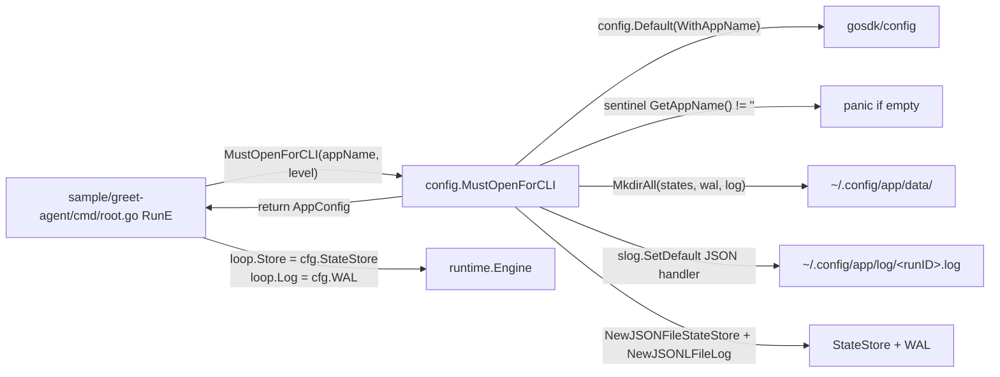

# Spec — `config/` AppConfig + `MustOpenForCLI` Wiring Helper

> 對應里程碑: M4 (架構解耦 + 三 Provider 之外的 sample 體驗統一) + M5 收尾
> 日期: 2026-07-07
> 範圍: `config/app.go` + `config/default.go` + `config/app_test.go`

## 目標

`config/` 把每個 CLI sample 重複的 6 步 boilerplate(gosdk 初始化、mkdir、log 開檔、filestore 建好)下沉到一個呼叫,並用 fail-fast panic 提早暴露 programmer error(忘了 `WithAppName`)。



## 設計原則

- **One call, fail-fast**:`MustOpenForCLI` 是 CLI 入口(`cobra.Execute` 第一行)等價物,失敗必為 programmer error(空 appName、WithAppName 沒呼叫),panic 立刻死,比 `return error` 後 sample 端忘記檢查好
- **Sentinel 用 `GetAppName()`**:`GetAppDataDir()` 在 `WithAppName` 未呼叫時回 `"data"`(經 `filepath.Join("", "data")`),不是空字串 — 真正的「未初始化」sentinel 是 `config.GetAppName()`
- **No path flag**:`~/.config/<appName>/` 是慣例(沿用 gosdk),sample 不開 `--data-dir` / `--log-dir` flag(除了少數 `--data-dir` 自訂需求,例如 sample/logdoctor)
- **不重複造輪子**:底層仍走 `gosdk/config` + `memory/filestore`,不抽 `core.AppConfig` 介面(只有一個實作,過度抽象)

## 套件結構

| 檔案 | 角色 |
|------|------|
| `config/app.go` | `AppConfig` struct + `OpenForCLI` + `MustOpenForCLI` + `openRunLog` |
| `config/default.go` | `DefaultMiddleware`(M2 chain)+ `SecureMiddleware`(M3+M4 chain)|
| `config/app_test.go` | 4 個測試:empty appName error / Must panic / DataDir 路徑 / 檔案建立 |

## 關鍵介面

### AppConfig

```go
type AppConfig struct {
    DataDir    string             // ~/.config/<appName>/data
    LogDir     string             // ~/.config/<appName>/log
    RunID      string             // UnixNano(也作為 states/wal/log 檔名)
    LogFile    string             // <LogDir>/<RunID>.log
    StateStore core.StateStore    // file-backed,ready to use
    WAL        core.WriteAheadLog // file-backed,ready to use
}
```

### OpenForCLI 7 步

```go
func OpenForCLI(appName string, level slog.Level) (*AppConfig, error) {
    // 1. gosdkconfig.Default(gosdkconfig.WithAppName(appName)) — bind APP_CONFIG_DIR
    // 2. sentinel: gosdkconfig.GetAppName() != ""(否則 error)
    // 3. mkdir <DataDir>/states, <DataDir>/wal, <LogDir>(0o750)
    // 4. 開 <LogDir>/<RunID>.log(O_APPEND|O_CREATE, 0o640)
    // 5. slog.SetDefault(slog.NewJSONHandler(f, ...).With(slog.String("runID", runID)))
    // 6. filestore.NewJSONFileStateStore(dataDir) + NewJSONLFileLog(dataDir)
    // 7. runID = UnixNano
}
```

### MustOpenForCLI

```go
func MustOpenForCLI(appName string, level slog.Level) *AppConfig
// 等同 regexp.MustCompile / template.Must 的 panic 慣例
```

### DefaultMiddleware vs SecureMiddleware

```go
// M2 chain: retry → timeout → budget → loopguard(無 security)
func DefaultMiddleware() middleware.Middleware

// M3+M4 chain: M2 + sandbox → approval → spotlight → sanitizer
// nil policy = 關閉對應 middleware(常用於 library 嵌入)
func SecureMiddleware(sandboxPolicy action.Sandbox, approval core.ApprovalPolicy) middleware.Middleware
```

## 行為保證

- **empty appName → error / panic**:`OpenForCLI("", _)` 回 `error` 含 "appName must not be empty";`MustOpenForCLI("", _)` 觸發 panic
- **未呼叫 `WithAppName` → fail-fast**:`OpenForCLI("foo", _)` 在 `gosdkconfig.GetAppName() == ""` 時回 error(panic via Must)
- **目錄全建**:`<DataDir>/states`、`<DataDir>/wal`、`<LogDir>` 都 `MkdirAll(0o750)`
- **Log file 開啟**:`<LogDir>/<RunID>.log` 為 `O_APPEND|O_CREATE|O_WRONLY, 0o640`
- **slog swap**:`slog.SetDefault` 設為 JSON file handler + `runID` attribute,後續所有 `slog.Info` 都帶 `runID`
- **StateStore + WAL ready**:回傳前完成建構,呼叫端直接 `loop.Store = cfg.StateStore`
- **`SecureMiddleware(nil, nil)` 等同 `DefaultMiddleware()` + spotlight/sanitizer**:library 嵌入場景可用

## 樣板削減

| Sample | 前(手抄行數) | 後(`MustOpenForCLI` 4 行) |
|--------|-------------|---------------------------|
| `greet-agent/cmd/root.go` | ~24 行(6 步 boilerplate) | `dirs := config.MustOpenForCLI(appName, slog.LevelInfo); loop.Store = dirs.StateStore; loop.Log = dirs.WAL; ...` |
| `logdoctor/cmd/{run,resume,watch}.go` | 部分用,因有 `--data-dir` 自訂需求仍手抄 | 預設:沿用手抄;若無 `--data-dir` 需求可改用 helper |

## 整合點

- **`runtime.Engine` 不需改**:依然讀 `loop.Store` / `loop.Log`,不綁定 appName(為保留純單元測試)
- **`gosdk` 是 framework 層依賴**:`runtime/` 已是 `import middleware` 級,再多 import `gosdk/config` 是同層級,不違反 CLAUDE.md 的「`core/` 純 stdlib」規則(`core/` 仍純,`config/` 與 `runtime/` 可引)
- **`memory/filestore` 是預設 adapter**:`StateStore` / `WriteAheadLog` 介面契約不動,只換實作就掉其他 backend

## 測試驗證

| 驗收項 | 測試位置 |
|--------|---------|
| empty appName 回 error | `TestOpenForCLIRequiresAppName` |
| empty appName 觸發 panic | `TestMustOpenForCLIPanicsOnEmptyAppName` |
| DataDir/LogDir 路徑前綴 = `~/.config/<appName>` | `TestOpenForCLISetsAppName` |
| states/、wal/、log file 已建立 | `TestOpenForCLICreatesFiles` |
| `StateStore` / `WAL` 欄位非 nil | `TestOpenForCLICreatesFiles` |
| RunID 為純數字(UnixNano) | `TestOpenForCLICreatesFiles` |

`go test ./config/...` 全綠;`go test ./...` 整 workspace 過。

## 對應原始 plan

`plans/inherited-juggling-pinwheel.md`(已晉升為本 spec)。
