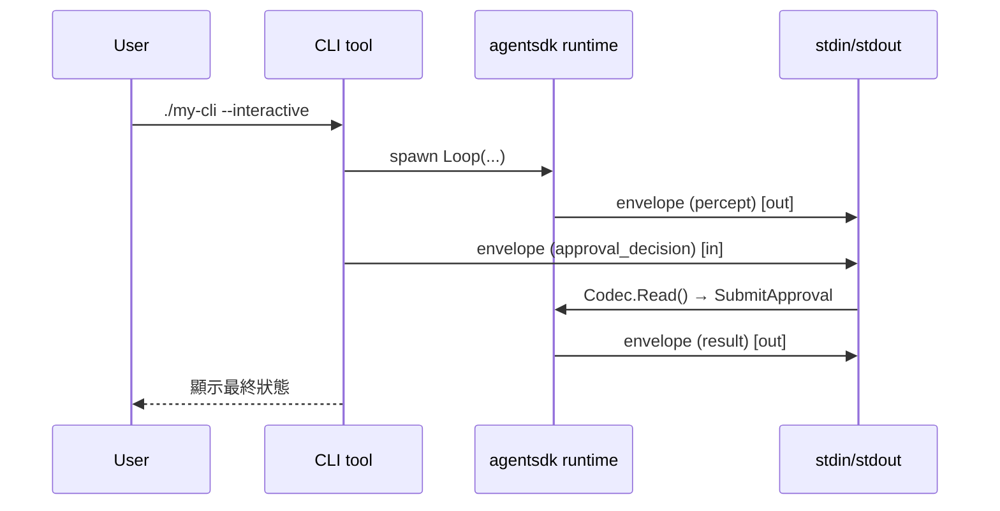

# Spec — cli/ Envelope 與 JSONL Codec

> 對應里程碑: M3 (工具生態 + 執行期安全) 串接面 / M4 (架構解耦 + HITL)
> 日期: 2026-07-07
> 範圍: `cli/envelope.go` + `cli/codec.go` + tests — 9 種 `MessageType`、`Envelope` payload、`JSONLCodec` 編解碼

## 目標

`cli` 套件定義 agentsdk run 在 wire 上的形狀 — `Envelope` 是 JSONL 串流中的一行,`Codec` 是 `Envelope ↔ JSONL bytes` 的雙向翻譯器。設計目的是讓外部進程 (CLI tailer、dashboard、replayer、watcher) 可以「不必 import agentsdk 內部型別」就能讀寫 run 串流,也讓 SDK 把 effect 翻成 envelope 推到 stdout / websocket。

```mermaid
flowchart LR
    L["Loop (runtime)"] -->|"Emitter(eff)"| Bridge["自訂 adapter<br/>(cli.Emitter func(core.Effect))"]
    Bridge -->|"Envelope{...}"| Codec["Codec<br/>(NewJSONLCodec)"]
    Codec -->|"JSONL bytes\n+ newline"| StdIO[("stdout / WS / pipe")]
    StdIO -->|"JSONL bytes"| External["外部進程<br/>(tail -f / dashboard / CLI)"]
    External -->|"JSONL bytes"| CodecR["Codec.Read()"]
    CodecR -->|"Envelope"| CLI["CLI tool<br/>(mcp client / approval)"]
    CLI -->|"SubmitApproval / 外部 side-effect"| Loop
```



## 套件結構

| 檔案 | 角色 | 重點 |
|------|------|------|
| `envelope.go` | `MessageType` (9 種) + `Envelope` + 9 個 payload struct + `MarshalJSON` | wire shape |
| `codec.go` | `Codec` 介面 + `NewJSONLCodec` + `Write` / `Read` / `Flush` + `WriteError` / `WriteResult` sugar | bytes 翻譯 |
| `codec_test.go` | 9 種 envelope round-trip、State mid-run approval round-trip、image chunk round-trip、`WriteError` / `WriteResult` sugar | 測試 |

## `MessageType` 9 種

```go
type MessageType string

const (
    MSG_TYPE_PERCEPT             MessageType = "percept"
    MSG_TYPE_ASSISTANT           MessageType = "assistant"
    MSG_TYPE_TOOL_CALL           MessageType = "tool_call"
    MSG_TYPE_TOOL_RESULT         MessageType = "tool_result"
    MSG_TYPE_APPROVAL_REQUEST    MessageType = "approval_request"
    MSG_TYPE_APPROVAL_DECISION   MessageType = "approval_decision"
    MSG_TYPE_CHECKPOINT          MessageType = "checkpoint"
    MSG_TYPE_RESULT              MessageType = "result"
    MSG_TYPE_ERROR               MessageType = "error"
)
```

| Type | 對應 Effect / 事件 | Payload | 何時 emit |
|------|---------------------|---------|-----------|
| `percept` | 外部輸入 (percept) | `PerceptPayload` | `INPUT_KIND_PERCEPT` 進入 loop |
| `assistant` | LLM 回覆 | `AssistantPayload` (text / tool_calls / stop_reason / usage) | `EFFECT_CALL_MODEL` 完成 |
| `tool_call` | 工具 dispatch 出去 | `ToolCallPayload` (id / name / args / risk) | `EFFECT_CALL_TOOL` 送出 |
| `tool_result` | 工具回傳 | `ToolResultPayload` (call_id / name / ok / output / error / elapsed_ms) | `EFFECT_CALL_TOOL` 完成 |
| `approval_request` | HITL 請求 | `ApprovalPayload` (id / reason / risk / summary / tool_call / requested_at) | `EFFECT_REQUEST_APPROVAL` 進入 state |
| `approval_decision` | operator 決策 | `DecisionPayload` (approval_id / decision / decided_by / decided_at) | `SubmitApproval` 注入 |
| `checkpoint` | State 持久化標記 | `CheckpointPayload` (run_id / turn / reason) | `cp.Checkpoint` 完成 |
| `result` | 終態結果 | `ResultPayload` (status / turn) | 達到 `RUN_STATUS_COMPLETED` / `FAILED` |
| `error` | 不可恢復錯誤 | `ErrorPayload` (message / kind: budget / model / approval_rejected) | middleware 報錯 / dispatch 報錯 |

> `kind` 字串值約定: `"budget"` (BudgetExceededError) / `"model"` (provider 報錯) / `"approval_rejected"` (operator reject) — 取自 `envelope.go::ErrorPayload` 註解。

## `Envelope` 結構

```go
type Envelope struct {
    Type       MessageType       `json:"type"`
    RunID      string            `json:"run_id,omitempty"`
    Turn       int               `json:"turn,omitempty"`
    Timestamp  time.Time         `json:"ts"`
    Percept    *PerceptPayload   `json:"percept,omitempty"`
    Assistant  *AssistantPayload `json:"assistant,omitempty"`
    ToolCall   *ToolCallPayload  `json:"tool_call,omitempty"`
    ToolResult *ToolResultPayload `json:"tool_result,omitempty"`
    Approval   *ApprovalPayload  `json:"approval,omitempty"`
    Decision   *DecisionPayload  `json:"decision,omitempty"`
    Checkpoint *CheckpointPayload `json:"checkpoint,omitempty"`
    Result     *ResultPayload    `json:"result,omitempty"`
    Error      *ErrorPayload     `json:"error,omitempty"`
}
```

不變式 (invariants):

- **恰好一個 payload 指標非 nil**: 每個 Envelope 只有一個 `Type`,對應到單一非 nil payload,外部 consumer 依 `Type` dispatch。
- **JSON tag 全用 `omitempty`**: nil 指標 / 零值字串 / 0 turn 不會汙染輸出 — tail 工具可只看非空欄位。
- **`Timestamp` 預設補 `time.Now().UTC()`**: 自定 `MarshalJSON` 偵測 zero time 並自動填,避免 caller 忘記戳記。

### `MarshalJSON` override

```go
func (e Envelope) MarshalJSON() ([]byte, error) {
    type alias Envelope
    a := alias(e)
    if a.Timestamp.IsZero() { a.Timestamp = time.Now().UTC() }
    return json.Marshal(a)
}
```

用 `type alias` 避免遞迴呼叫 `MarshalJSON`;只為補 timestamp,其他交給 `encoding/json`。

## Payload 細節

| Struct | 重要欄位 | JSON 友善化策略 |
|--------|----------|-----------------|
| `PerceptPayload` | `ID / Source / ObservedAt / Payload` | `Payload any` 直接 marshal,支援 string / map / list |
| `AssistantPayload` | `Text / ToolCalls / StopReason / Usage` | `ToolCalls []ToolCallLite` (id+name+args),`Usage TokenUsageLite` (prompt/completion/total) |
| `ToolCallLite` | `ID / Name / Args` | 精簡版,不含 risk / schema;risk 在 `ToolCallPayload` 才有 |
| `TokenUsageLite` | `PromptTokens / CompletionTokens / TotalTokens` | int 三欄 |
| `ToolCallPayload` | `ID / Name / Args / Risk` | CLI 串流專用,帶 risk 給 operator 看 |
| `ToolResultPayload` | `CallID / Name / OK / Output / Error / ElapsedMS` | `Output any` 支援任意 JSON,`Error` 與 `OK` 二擇一 |
| `ApprovalPayload` | `ID / Reason / Risk / Summary / ToolCall / RequestedAt` | `Risk` 用 string (RISK_LEVEL_LOW / HIGH);`ToolCall` 內嵌 `ToolCallPayload` |
| `DecisionPayload` | `ApprovalID / Decision / DecidedBy / DecidedAt` | `Decision` 對應 `core.ApprovalDecision` 的字串值 (`approve` / `reject`) |
| `CheckpointPayload` | `RunID / Turn / Reason` | `Reason` 例: `"auto"` / `"operator"` |
| `ResultPayload` | `Status / Turn` | 終態 result 的 status 對應 `RunStatus` |
| `ErrorPayload` | `Message / Kind` | `Kind` 三選一: `"budget"` / `"model"` / `"approval_rejected"` |

## `Codec` 介面

```go
type Codec interface {
    Write(env Envelope) error
    Read() (Envelope, error)
    Flush() error
}
```

| 方法 | 用途 |
|------|------|
| `Write(env)` | 把 Envelope 編碼成 JSON,寫入 underlying writer,自動加 `\n`(由 `json.Encoder.Encode` 提供) |
| `Read()` | 阻塞讀一行 JSONL,parse 回 Envelope,EOF 時回 error |
| `Flush()` | 把 buffered writer 沖出去;建議在 critical envelope (`result` / `error`) 後呼叫 |

### `NewJSONLCodec` 預設緩衝

```go
func NewJSONLCodec(r io.Reader, w io.Writer) Codec {
    br, ok := r.(*bufio.Reader); if !ok { br = bufio.NewReader(r) }
    bw, ok := w.(*bufio.Writer); if !ok { bw = bufio.NewWriter(w) }
    return &jsonlCodec{br: br, bw: bw, enc: json.NewEncoder(bw)}
}
```

- 讀端用 `*bufio.Reader`,4096-byte 預設 buffer;若 caller 已經傳入 `*bufio.Reader` 就直接重用。
- 寫端用 `*bufio.Writer` + `json.Encoder`,後者會自動加 newline。
- 兩端都接受「裸 `io.Reader` / `io.Writer`」(典型場景: `os.Stdin` / `os.Stdout`)。

### Sugar

```go
func WriteError(c Codec, runID, kind, msg string) error
func WriteResult(c Codec, runID, status string, turn int) error
```

兩個常用 envelope 的捷徑:典型用法在 `runtime` 終止後寫 `result` envelope,以及 middleware 報錯時寫 `error` envelope。

## 對外部進程控制的支援 (Why)

`Envelope` + `Codec` 讓 agentsdk run 變成「可從外部 stdin 餵 input、可從 stdout 觀察 output」的純文字協定 — 達成兩個目標:

1. **解耦**:外部工具 (CLI tail、dashboard、replayer) 不必 import `agentsdk` Go module,只要會 parse JSONL 就能 replay / monitor。
2. **可逆**:同一份 envelope 既可寫 (`Write`) 也可讀 (`Read`),server mode 可以把外部進程的 `approval_decision` envelope 灌回 `SubmitApproval`,反過來 `percept` envelope 也可以從 stdin 餵進來啟動新 run (配合 `RunWithInput`)。

典型 wire flow:



> 雖然 SDK 端目前沒內建「從 stdin 餵 input」的命令列 sample,但 `Envelope` schema 對稱設計讓 `codec.Read()` 與 `SubmitApproval` 自然對接;M3 / M4 之後要寫 CLI front-end 不必再改 wire shape。

## 測試策略

`codec_test.go` 採 **「全型別 round-trip + 特殊 case」** 兩層:

### 全型別 round-trip (table-driven shape)

`TestCodecRoundTripAllMessageTypes` 把 9 種 `MessageType` 各構造一個 Envelope,寫入 `bytes.Buffer`,再用自製 `bufioSplitLines` 切行,逐行 unmarshal 比對 `Type`:

```go
envs := []cli.Envelope{
    {Type: cli.MSG_TYPE_PERCEPT, ...},
    {Type: cli.MSG_TYPE_ASSISTANT, ...},
    // ... 9 種
}
var buf bytes.Buffer
codec := cli.NewJSONLCodec(nil, &buf)
for _, e := range envs { require.NoError(t, codec.Write(e)) }
require.NoError(t, codec.Flush())
// 逐行 parse 比對
```

此測試的價值:任何新增 `MessageType` 都會被提示要把 fixture 加上,避免「加了常數但忘了 struct 對應」。

### State round-trip (`TestStateRoundTripPreservesMidRunApproval`)

直接對 `core.State` 做 JSON marshal/unmarshal,驗證:

- `PendingApprovals[0].ID` / `ToolCall.Name` 完整保留
- `Status == RUN_STATUS_PAUSED_APPROVAL` 保留

這是因為 `envelope.go` 的 payload 結構都是 `core.State` 欄位的精簡鏡像,`json` tag 對齊,所以 state 本身的 JSON round-trip 也能保證 envelope payload round-trip。

### Image chunk round-trip (`TestImageChunkSurvivesJSONRoundTrip`)

驗證 multimodal abstraction 對 codec / state pipeline 透明:image bytes 經 `json.Marshal` → `json.Unmarshal` 後仍是 `[]byte{0x89, 0x50, 0x4e, 0x47}` 與 `"image/png"` MIME,bytes 不被 base64 編碼。

### Sugar smoke

`TestCodecWriteErrorSugar` / `TestCodecWriteResultSugar`:確認 `WriteError` / `WriteResult` 寫出的字串含 `"kind":"model"` / `"status":"completed"` / `"turn":7`,這是 `runtime` 終止時 caller 期待的字串格式。

### 為什麼用 `bytes.Buffer` 而非真實 `os.Pipe`

- 速度快,純 in-memory,適合 unit test。
- 測試只關心編解碼對稱性,不關心跨 process 行為;跨 process 由 `sample/logdoctor` 與 CLI integration test 守護。
- 缺點:不會測到 newline 之間的 split 邊界 (例如 buffer 切一半)— M3 之後的 codec fuzz test 可補。

## 設計決策 (Why)

| 決策 | 理由 |
|------|------|
| 9 種 `MessageType` 而非泛型 `event` | 外部 consumer 寫 switch case 容易,grep 也好找;新增 type 只需改 `MessageType` 加常數 + payload struct |
| payload 採 optional pointer + `omitempty` | 同一個 `Envelope` 型別表達 9 種,免去 9 個獨立 type;代價是 caller 寫 switch / nil-check,go-1.26 沒有 sum type 沒辦法 |
| 從 `core.State` 派生 payload struct 而非直接 marshal | wire shape 解耦:內部 `core.ToolResult` 變動不影響 CLI 消費者;`ToolResultPayload` 顯式只暴露 `Output / Error / ElapsedMS` 給外部 |
| `Timestamp` 自動補 | 避免 caller 漏戳記導致 tail 工具時間軸錯位;override `MarshalJSON` 只為這一條 |
| `json.Encoder` + `bufio.Writer` | `Encoder.Encode` 自動加 `\n` 與 streaming friendly;buffer 提升 throughput |
| `Codec` 介面而非具象 struct | 測試可注入 mock codec,日後加 `protobuf` / `msgpack` codec 不破壞 caller |
| `WriteError` / `WriteResult` sugar | 最常用的兩個 envelope,避免 caller 每次都建 `Envelope{Type: MSG_TYPE_ERROR, Error: &ErrorPayload{...}}` 樣板 |
| `Decision` / `Status` 走 string 而非 enum | wire 是文字協定,`"approve"` / `"completed"` 對人類與 grep 都友善;internal enum 由 SDK 端映射 |

## 開放問題 (Follow-ups, 留待 M3/M4)

- **缺 `MSG_TYPE_BUDGET` 與 `MSG_TYPE_RETRY`**: 目前 retry / budget 等內部事件沒獨立 envelope,只透過 `error` envelope 在最終失敗時曝光;M3 若要做 live monitoring 應考慮加 internal-event envelope。
- **缺 streaming tool result (multi-chunk)**: `ToolResultPayload.Output` 假設一次性回傳;若 M3 之後要支援 streaming tool (像 `tail -f`),需要拆 `tool_result_chunk` envelope。
- **缺 schema 版本欄位**: 沒有 `ProtocolVersion` 在 envelope 上,日後 wire shape 變更沒辦法 negotiate — 應在 v1 加 `"v": 1` 欄位。
- **缺 `trace_id` / `span_id`**: tracing 整合時,envelope 應有 W3C trace context 欄位串起 effect chain。
- **`bufioSplitLines` 是測試輔助**: 若 codec 進入 fuzz test 階段,應改用 `bufio.Scanner` 標準路徑而非自製。

## 驗收 (Acceptance)

- [x] `go test ./cli/... -count=1` 全綠 (4 個 test:全型別 round-trip、State mid-run approval、image chunk、sugar smoke)
- [x] 9 種 `MessageType` 都有對應的 payload struct 與 fixture
- [x] `Codec` 介面三方法 (`Write` / `Read` / `Flush`) 都有對應 `jsonlCodec` 實作
- [x] `Write` 自動加 newline,`Flush` 暴露底層 buffer 控制
- [x] `MarshalJSON` 自動補 zero `Timestamp` 為 `time.Now().UTC()`
- [x] `core.State` JSON round-trip 保留 `PendingApprovals` / `Status` / `Messages[].Chunks[].Image`
- [x] `WriteError` / `WriteResult` sugar 寫出預期字串欄位
