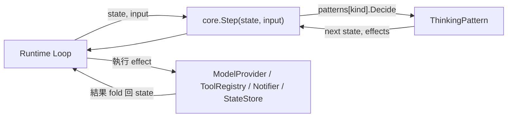
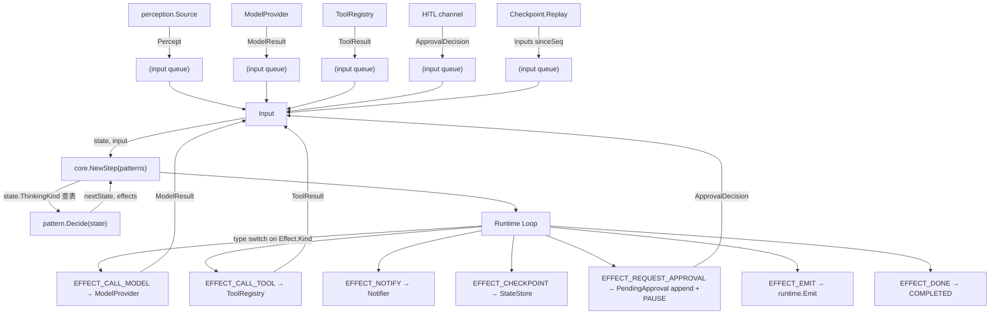
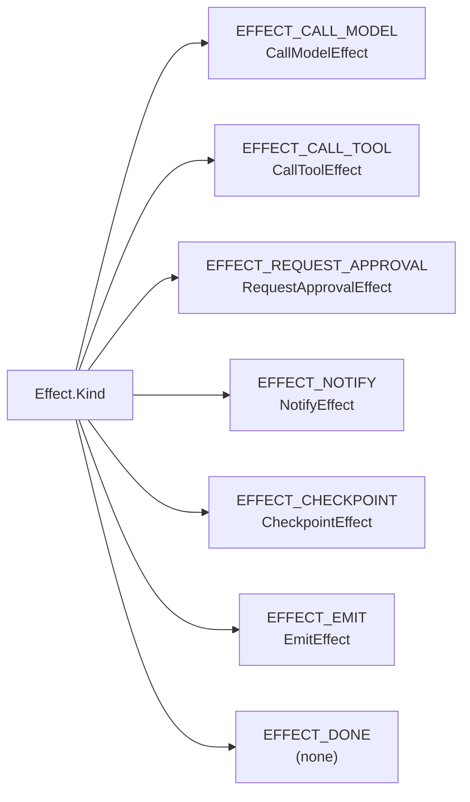
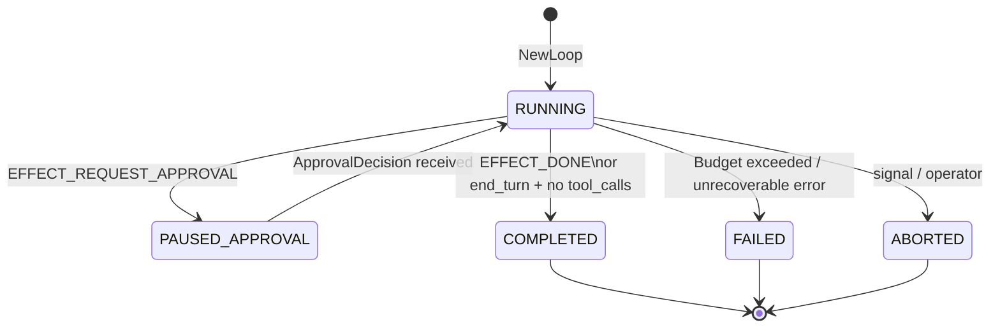
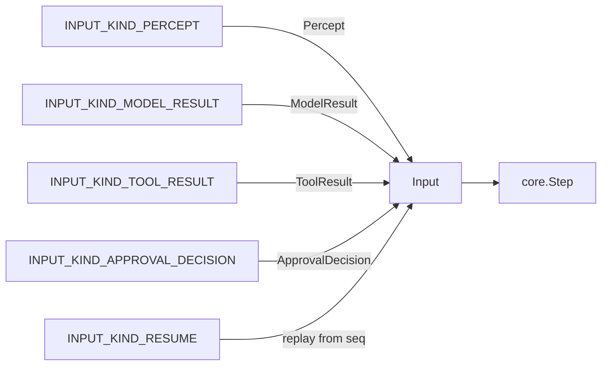
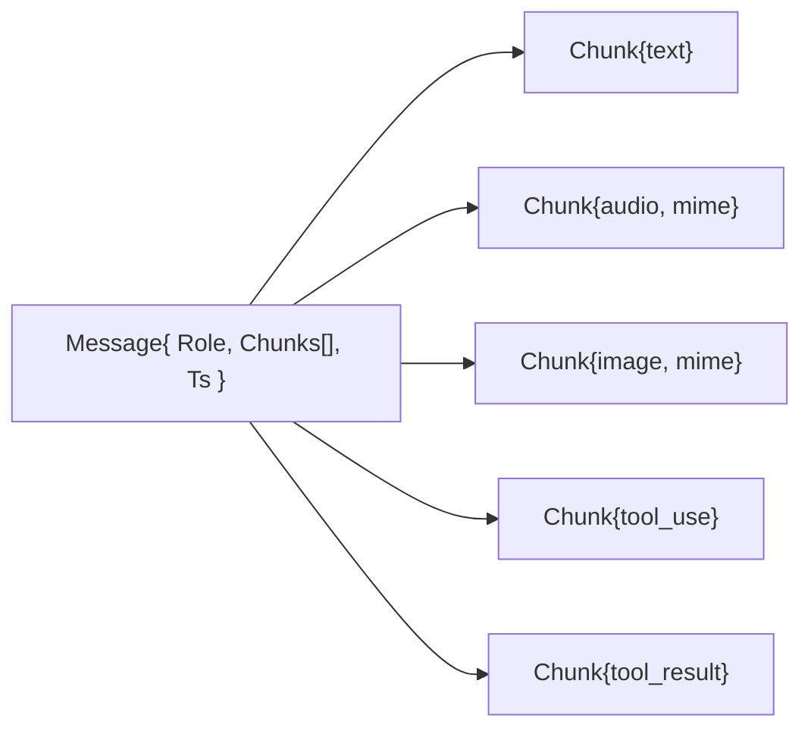
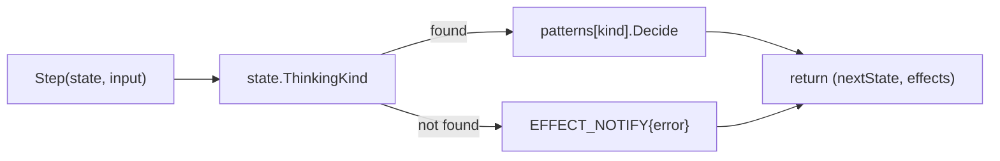

# Spec — core/ 套件 純狀態機 (Pure State Machine)

> 對應里程碑: M1 (核心範式 + sample 骨架) + M2 (系統韌性 + 循環防禦)
> 日期: 2026-07-07
> 範圍: `core/` 套件 — State / Input / Effect / Message / ThinkingPattern / Port / 6 個 effect kind + 4 個 core 介面

## 目標

`core/` 是 `agentsdk` 最底層的「純狀態機 (pure state machine)」,定義 agent run 的資料型別 (state / input / effect / message / chunk)、對外契約 (port) 與 dispatch 入口 (`Step`)。核心承諾:

- **零 vendor 依賴**: 只 import Go standard library,連 `gosdk` 都不引用 — 讓 SDK 可獨立發佈、跨 project reuse。
- **無 I/O**: 不呼叫 model / tool / network / clock,所有 side effect 透過 `Effect` 標記 union 表達,由 runtime 負責執行。
- **可序列化**: 所有 field 都是 JSON-marshalable,`State` 可 round-trip 進 `StateStore` / WAL / checkpoint。
- **可重放 (replayable)**: 給定 `(state, input)` 序列 → 唯一決定下一 `(state, effects)`,WAL replay 才能 re-derive 而不重發 LLM 呼叫。



## 設計原則

| 原則 | 體現 |
|------|------|
| 純函式 (pure function) | `Step` 與 `ThinkingPattern.Decide` 不做 I/O,deterministic 給定 `(state, scratch)` 必回同結果 |
| Tagged union | `Effect` 用 `Kind` discriminator + 7 個 optional pointer 表達 sum type,迴避 Go 沒 native sum type |
| 值語意 (value semantics) | `State` / `Budget` / `Message` 走值傳遞,`Clone()` 提供 deep copy 給需要 mutate 的 caller |
| Reference-type escape hatch | `State.Scratch map[string]any` 是唯一 reference 共享點,作為 pattern ↔ middleware ↔ runtime 的通訊介面 |
| 介面斷耦合 | `ModelProvider` / `StateStore` / `WAL` / `ToolRegistry` / `Notifier` 皆介面,實作在 `provider/*` / `memory/filestore` / `action/` / `gosdk/notify` |
| Autonomy 分級 | `AutonomyLevel L0–L4` 對應「全人工 → 全自動」的信任程度,`ApprovalPolicy` 用它決定是否攔下 `CallToolEffect` |
| Multimodal-first | `Chunk` 內含 text / audio / image / tool_use / tool_result,LLM provider 看到 faithful transcript |

## 型別與結構 (Types & Structures)

### `state.go` — Run 生命週期

#### `AutonomyLevel` (int, L0–L4)

| 常數 | 值 | 語意 |
|------|----|------|
| `AUTONOMY_L0` | 0 | 全手動 (每個動作都需人工核准) |
| `AUTONOMY_L1` | 1 | 低風險自動;高風險 gated (企業 floor) |
| `AUTONOMY_L2` | 2 | 幾乎全自動;高風險 gated (預設 cap) |
| `AUTONOMY_L3` | 3 | 極少 gating |
| `AUTONOMY_L4` | 4 | 全自動 |

`String()` 渲染 `"L0"` ~ `"L4"`,未識別值回 `"L?"`。

#### `RunStatus` (string)

| 常數 | 語意 | 是否 terminal |
|------|------|---------------|
| `RUN_STATUS_RUNNING` | 進行中 | ❌ |
| `RUN_STATUS_PAUSED_APPROVAL` | 等待 HITL 決策 | ❌ |
| `RUN_STATUS_COMPLETED` | 正常完成 | ✅ |
| `RUN_STATUS_FAILED` | 錯誤終止 | ✅ |
| `RUN_STATUS_ABORTED` | 人為取消 | ✅ |

`Terminal() bool` 判斷後三者。

#### `Budget` (struct)

| Field | 型別 | 用途 |
|-------|------|------|
| `MaxTurns` | `int` | 總 turn 上限 (`0` 表不限制) |
| `UsedTurns` | `int` | 已用 turn 數 |
| `MaxTokens` | `int` | 總 token 上限 |
| `UsedTokens` | `int` | 已用 token 數 |
| `MaxWallTime` | `time.Duration` | 牆鐘時間上限 |
| `StartedAt` | `time.Time` | run 啟動時間 (`IsZero` 表未啟動) |
| `NowFunc` | `func() time.Time` | 可注入時鐘;`nil` 時 fallback `time.Now` (`json:"-"` 不序列化) |

`Exceeded() (bool, reason string)`:

- `MaxTurns > 0 && UsedTurns >= MaxTurns` → `"turn_budget"`
- `MaxTokens > 0 && UsedTokens >= MaxTokens` → `"token_budget"`
- `MaxWallTime > 0 && now - StartedAt >= MaxWallTime` → `"wall_time_budget"`

#### `State` (struct, 全部 JSON-marshalable)

| Field | 型別 | 用途 |
|-------|------|------|
| `RunID` | `string` | 唯一識別;`StateStore` / WAL 命名空間 |
| `Turn` | `int` | 已跑幾輪 |
| `Autonomy` | `AutonomyLevel` | 信任分級 |
| `ThinkingKind` | `ThinkingKind` | 目前生效的 pattern discriminator |
| `Messages` | `[]Message` | 對話 transcript (multimodal) |
| `Scratch` | `map[string]any` | pattern ↔ middleware ↔ runtime 共享通訊層 |
| `PendingApprovals` | `[]PendingApproval` | 已開立尚未決議的 HITL gate |
| `Budget` | `Budget` | 資源上限 |
| `Status` | `RunStatus` | 生命週期 |
| `UpdatedAt` | `time.Time` | 最後一次 mutate 時間 |
| `LastInputSeq` | `int` | 已被處理的最大 `Input.Seq` (WAL replay 邊界) |

`Clone()` — `Messages.Chunks` 與 `PendingApprovals` 各自 deep copy;`Scratch` shallow copy (runtime 視為 opaque blob)。

### `input.go` — 事件流

#### `InputKind` (string, 5 種)

| 常數 | 觸發來源 |
|------|----------|
| `INPUT_KIND_PERCEPT` | `perception.Source` 推入新觀察 |
| `INPUT_KIND_MODEL_RESULT` | LLM streaming 折疊成 `ModelResult` |
| `INPUT_KIND_TOOL_RESULT` | `ToolRegistry.Call` 回傳 |
| `INPUT_KIND_APPROVAL_DECISION` | out-of-band HITL 決策 |
| `INPUT_KIND_RESUME` | 從 `INPUT_KIND_RESUME` checkpoint 重啟並 replay inputs |

#### `Percept`

| Field | 型別 | 用途 |
|-------|------|------|
| `ID` | `string` | percept id |
| `Source` | `string` | 邏輯來源 (e.g. `"logfile:/var/log/sys"`) |
| `ObservedAt` | `time.Time` | 觀察發生時間 |
| `Payload` | `any` | opaque — 由 `perception.Normalizer` 轉成 `Message` |

#### `ToolCall` (idempotency key)

| Field | 型別 | 用途 |
|-------|------|------|
| `ID` | `string` | idempotency key;replay 不變 |
| `Name` | `string` | tool name |
| `Args` | `map[string]any` | LLM 輸出的 raw args |
| `Risk` | `RiskLevel` | dispatch 時從 schema 擷取 |

#### `ToolResult`

| Field | 型別 | 用途 |
|-------|------|------|
| `CallID` | `string` | 對應 `ToolCall.ID` |
| `Name` | `string` | tool name |
| `OK` | `bool` | 成功? |
| `Output` | `any` | 成功輸出 (任意型別) |
| `Error` | `string` | 失敗訊息 (panic 也以字串承載,解耦 runtime error flow) |
| `ElapsedMS` | `int64` | 執行耗時 |

#### `ModelChunk` / `ToolUseChunk`

`ModelChunk` 是 provider 串流輸出的最小單位,`runtime` 折疊成 `ModelResult`;`ToolUseChunk` 是 `ModelChunk` 內 tool_call 攜帶的 stub。

#### `ModelResult`

| Field | 型別 | 用途 |
|-------|------|------|
| `Text` | `string` | assistant 文字回覆 |
| `ToolCalls` | `[]ToolCall` | 欲呼叫的工具 (0 個表示純文字) |
| `StopReason` | `string` | `end_turn` / `tool_use` / `max_tokens` / `error` |
| `Usage` | `TokenUsage` | token 會計 |

#### `TokenUsage`

| Field | 型別 |
|-------|------|
| `PromptTokens` | `int` |
| `CompletionTokens` | `int` |
| `TotalTokens` | `int` |

`Add()` 為 value receiver stub — 算術由 caller 端累加,避免雙重計算。

#### `Input` (tagged union, 5 種 payload)

| Field | 型別 | 對應 Kind |
|-------|------|-----------|
| `Kind` | `InputKind` | discriminator |
| `Percept` | `*Percept` | `INPUT_KIND_PERCEPT` |
| `ModelResult` | `*ModelResult` | `INPUT_KIND_MODEL_RESULT` |
| `ToolResult` | `*ToolResult` | `INPUT_KIND_TOOL_RESULT` |
| `ApprovalDecision` | `*ApprovalDecision` | `INPUT_KIND_APPROVAL_DECISION` |
| `Seq` | `int` | monotonic,WAL replay 比對 `LastInputSeq` |
| `ReceivedAt` | `time.Time` | 入 queue 時間 |

`Source` 介面 (`Percepts(ctx) <-chan Percept`) 是 core 對 perception source 的最低假設,真實介面在 `perception/`。

### `message.go` — Multimodal 對話

#### `Role` (string, 4 種)

`ROLE_SYSTEM` / `ROLE_USER` / `ROLE_ASSISTANT` / `ROLE_TOOL`

#### `ChunkKind` (string, 5 種)

`CHUNK_KIND_TEXT` / `CHUNK_KIND_AUDIO` / `CHUNK_KIND_IMAGE` / `CHUNK_KIND_TOOL_USE` / `CHUNK_KIND_TOOL_RESULT`

#### `Chunk` (one fragment of a Message)

| Field | 型別 | 用途 |
|-------|------|------|
| `Kind` | `ChunkKind` | discriminator |
| `Text` | `string` | 純文字內容 |
| `Audio` / `AudioMIME` | `[]byte` / `string` | 音訊 bytes + MIME |
| `Image` / `ImageMIME` | `[]byte` / `string` | 圖片 bytes + MIME |
| `ToolUse` | `*ToolUseChunk` | tool call 請求 |
| `ToolResult` | `*ToolResultChunk` | tool 結果內嵌回 assistant 訊息 |

> Step 不 inspect Chunks;LLM provider 各自轉成自家 dialect。Runtime 把 Chunks 原封不動 pass-through,保留 faithful transcript。

#### `Message`

| Field | 型別 |
|-------|------|
| `Role` | `Role` |
| `Chunks` | `[]Chunk` |
| `Ts` | `time.Time` |

`AppendText(s)` helper:回傳新 message with 新增 `CHUNK_KIND_TEXT` chunk (供測試 / sample 用)。

### `thinking.go` — Pattern 介面

#### `ThinkingKind` (string, 6 種)

| 常數 | Pattern | M1 狀態 |
|------|---------|--------|
| `THINK_REACT` | Reason + Act + Observe | ✅ |
| `THINK_PLANNER_EXECUTOR` | 開 blueprint 再逐步執行 | ✅ |
| `THINK_EXECUTOR_CRITIC` | 執行後 critique,iterate | ✅ |
| `THINK_COT_SINGLESHOT` | 一次 CoT | 🟡 STUB |
| `THINK_REFLEXION` | 失敗反思後重試 | 🟡 STUB |
| `THINK_ROUTER` | 多 agent router | 🟡 STUB |

#### `ThinkingPattern` 介面

```go
type ThinkingPattern interface {
    Kind() ThinkingKind
    Decide(state State) (State, []Effect)
}
```

契約:

- **無 I/O**: `Decide` 不呼叫 model / tool / network。
- **Deterministic**: 給定 `(state, scratch)` 必回同結果 (除 `UpdatedAt` 戳記)。
- **State 值傳遞**: 回傳 `state.Clone()`,in-place 不 mutate。
- **0 effect = stuck**: `Decide` 必回 ≥ 1 個 effect,否則 M2 `loopguard` 視為 stuck。

### `tool.go` — Tool 描述

#### `RiskLevel` (string)

`RISK_LEVEL_LOW` / `RISK_LEVEL_HIGH` — tool 定義時指定,`ApprovalPolicy` 讀這個分級。

#### `ToolSchema` (LLM 看到的形狀)

| Field | 型別 | 用途 |
|-------|------|------|
| `Name` | `string` | tool 名 |
| `Description` | `string` | 給 LLM 看的說明 |
| `Parameters` | `any` | JSON Schema object (`json.RawMessage` 形式) |
| `Risk` | `RiskLevel` | 風險分級 |

#### `JSONSchema`

`Parameters` 內容物的 go-side 註解,`action/schema.go` 用 `jsonschema` 反射 tag 產出;runtime 對接的型別仍是 `ToolSchema`。

### `autonomy.go` — 審批決策

#### `ApprovalDecision` (string, 3 種)

| 常數 | 語意 |
|------|------|
| `APPROVAL_DECISION_APPROVE` | 放行 |
| `APPROVAL_DECISION_REJECT` | 拒絕 |
| `APPROVAL_DECISION_ASK` | 要求更多資訊 (requeue) |

#### `ApprovalAction` (int, 3 種)

| 常數 | 語意 |
|------|------|
| `APPROVAL_ACTION_ALLOW` | 直接放行 |
| `APPROVAL_ACTION_DENY` | 靜默拒絕 (不 surface) |
| `APPROVAL_ACTION_ASK` | 產生 `RequestApprovalEffect` |

#### `ApprovalPolicy` 介面

```go
type ApprovalPolicy interface {
    Decide(ctx struct{}, autonomy AutonomyLevel, eff CallToolEffect, schema ToolSchema) ApprovalAction
}
```

預設實作位於 `action/approval_policy.go`,讀 `Autonomy` + `RiskLevel` 決定動作。`ctx` 故意用 `struct{}` 而非 `context.Context` 保留為之後擴充 (M4)。

### `approval.go` — Pending 結構

#### `PendingApproval`

| Field | 型別 | 用途 |
|-------|------|------|
| `ID` | `string` | approval id |
| `Reason` | `string` | 為何需要 sign-off |
| `Risk` | `RiskLevel` | 對應 tool 風險 |
| `Summary` | `string` | 給人看的摘要 |
| `ToolCall` | `*ToolCall` | 待放行的 tool call (可為 nil) |
| `RequestedAt` | `time.Time` | 開單時間 |
| `Decision` | `ApprovalDecision` | 已決議? |
| `DecidedAt` | `*time.Time` | 決議時間 |
| `DecidedBy` | `string` | 決議者 |

## 資料流 (Data Flow)



End-turn short-circuit (重要): runtime 收到 `ModelResult.StopReason=end_turn` 且無 `tool_calls` 時直接 `COMPLETED`,**不**呼叫 `Step` — 避免 ReAct 等 pattern 在 act phase 對 stale scratch 發出 `CALL_TOOL`。

## 介面 (Interfaces)

| 介面 | 套件實作位置 | 方法 |
|------|------------|------|
| `ModelProvider` | `provider/anthropic`, `provider/google`, `provider/openaicompat` (M4) | `Name()`, `Generate(ctx, req) (ModelResult, error)`, `Stream(ctx, req) (<-chan ModelChunk, error)`, `CountTokens(ctx, msgs) (int, error)` |
| `StateStore` | `memory/filestore.FileStateStore` (M2) | `Save`, `Load`, `List`, `Delete` — 跨 run 並行安全,`RunID` 為 namespace |
| `WAL` | `memory/filestore.FileWAL` (M2) | `Append(runID, seq, in)`, `Replay(runID, sinceSeq) []Input`, `Truncate(runID, uptoSeq)` |
| `ToolRegistry` | `action.Registry` | `Register`, `Get`, `List`, `Call(ctx, call) ToolResult` |
| `Tool` | `action.Tool` (extends) | `Name`, `Description`, `Schema`, `Risk`, `Call(ctx, args) (ToolResult, error)` |
| `Notifier` | `gosdk/notify` (structurally compatible) | `Notify(ctx, message) error` |
| `ThinkingPattern` | `planning/{react,planner_executor,executor_critic,cot_singleshot,reflexion,router}` | `Kind()`, `Decide(state) (State, []Effect)` |
| `ApprovalPolicy` | `action/approval_policy.go` | `Decide(ctx, autonomy, eff, schema) ApprovalAction` |
| `Source` (test-only convenience) | `perception.Source` | `Percepts(ctx) <-chan Percept` |

`Notifier` 方法集刻意與 `gosdk/notify.Notifier` 對齊 → 結構性相容,`gosdk/notify.Multi` / `Stdout` / `Slack` 都不需 adapter。

`ModelRequest`:

| Field | 型別 | 用途 |
|-------|------|------|
| `Messages` | `[]Message` | 對話 transcript |
| `Tools` | `[]ToolSchema` | 開放給 LLM 的工具清單 |
| `MaxTokens` | `int` | 上限 |
| `StopReasons` | `[]string` | 停止條件 (provider-specific) |

## Effect Tagged Union

`Effect` 用 `Kind` discriminator + 7 個 optional pointer 表達 sum type,exactly one pointer non-nil per Kind。



| Kind | Pointer | Runtime 動作 | Payload 重點 |
|------|---------|-------------|-------------|
| `EFFECT_CALL_MODEL` | `CallModelEffect` | `ModelProvider.Generate` / `Stream` | `RequestID`, `Messages`, `Tools`, `MaxTokens` |
| `EFFECT_CALL_TOOL` | `CallToolEffect` | `ToolRegistry.Call` | `Call` (ToolCall) |
| `EFFECT_REQUEST_APPROVAL` | `RequestApprovalEffect` | append `PendingApproval`, pause run,status → `PAUSED_APPROVAL` | `ApprovalID`, `Reason`, `Risk`, `Summary`, `ToolCall` |
| `EFFECT_NOTIFY` | `NotifyEffect` | `Notifier.Notify` | `Level` (`info`/`warn`/`error`), `Message` |
| `EFFECT_CHECKPOINT` | `CheckpointEffect` | `StateStore.Save` (在 dispatch 前自動觸發) | `Reason` |
| `EFFECT_EMIT` | `EmitEffect` | `runtime.Emit` (CLI JSONL / websocket) | `Envelope any` |
| `EFFECT_DONE` | (none) | 終止 run,status → `COMPLETED` | — |

> 註: `EFFECT_CHECKPOINT` 在 runtime dispatch 任何 effect 前都會自動觸發一次,讓 crash 後可從 `LastInputSeq` 復原。

## State & Budget

### State Lifecycle



### Budget 觸發點

| 觸發點 | 守門者 | 後果 |
|--------|--------|------|
| 每輪 dispatch 前 | `middleware/harness/budget.go` | `UsedTurns++`;超限 → `BudgetExceededError` |
| `ModelResult` 折疊後 | `middleware/harness/budget.go` | `UsedTokens += usage.TotalTokens`;超限 → `BudgetExceededError` |
| Wall clock check | `middleware/harness/budget.go` | 比較 `now - StartedAt` 對 `MaxWallTime`;超限 → `BudgetExceededError` |

`BudgetExceededError` 由 runtime 接住,emit `EFFECT_NOTIFY` + 設 `Status = FAILED`。

## Input System

`Input` 是 5 種事件的 tagged union,每輪只一個 pointer 非 nil:



`Seq` 是 monotonic counter,WAL 用它判斷 replay 範圍;`ReceivedAt` 用於觀測。

`Source` 介面 (perception convenience):

```go
type Source interface {
    Percepts(ctx context.Context) <-chan Percept
}
```

真正的 `perception.Source` 介面在 `perception/` 套件,這裡 stub 給 Step / runtime tests compile。

## Message & Chunk



`Chunk` 五種 kind 涵蓋多模態需求:

- `CHUNK_KIND_TEXT` — 文字內容
- `CHUNK_KIND_AUDIO` — 音訊 bytes + MIME
- `CHUNK_KIND_IMAGE` — 圖片 bytes + MIME
- `CHUNK_KIND_TOOL_USE` — assistant 發起 tool call (含 `ToolUseChunk{ID, Name, Args}`)
- `CHUNK_KIND_TOOL_RESULT` — tool 結果內嵌 (含 `ToolResultChunk{CallID, Name, OK, Output, Error}`)

`Step` 不 inspect Chunks;LLM provider 自行轉 dialect。Runtime 透傳 Chunks,保留 faithful transcript。

`ToolResultChunk` 與 `ToolResult` 結構相近 — 前者是 chunk 內嵌版 (用於多輪 tool result 整合進 assistant-style 訊息),後者是 input 級 (從 queue 進來)。

## ThinkingPattern Interface & Dispatch

`Step` 是 pure transition function,合約:

```go
type Step func(state State, input Input) (State, []Effect)
```

不變式 (Invariants):

- **無 I/O**: `Step` 與 `pattern.Decide` 都不呼叫外部資源。
- **Deterministic**: 給定 `(state, input)` 必回同結果。
- **nil State change 合法**: pattern 沒事可做時可回傳 `state` 原值。
- **0 effect 視為 stuck**: terminal inputs (ApprovalDecision / Resume) 以外,空 effect slice 等於 pattern 沒動作,M2 `loopguard` 攔下。
- **Unknown kind → NOTIFY**: `NewStep` 找不到對應 pattern 時 emit `EFFECT_NOTIFY{level:"error"}`,不 panic。

`NewStep(patterns map[ThinkingKind]ThinkingPattern)` 是唯一 dispatch 入口:



兩階段呼叫 (set kind → call Decide) 讓 Step 合約保持純函式 — state 自帶 routing decision,`NewStep` 不用額外參數。

### Scratch convention (重要)

`State.Scratch map[string]any` 是 pattern ↔ middleware ↔ runtime 的通訊介面,Go map reference type 自然跨 stack 共享。慣例:

| 用途 | 範例 |
|------|------|
| Pattern FSM 狀態 | `react.phase`, `pe.phase`, `ec.phase` |
| Pattern 跨迭代資料 | `react.last_call`, `pe.blueprint`, `pe.step_index` |
| Middleware bookkeeping | `loopguard.state` (連續 CALL_TOOL 計數) |
| Runtime pre-populated | `react.last_call_id` (Step 呼叫前寫入) |

Runtime 在 `Step` 呼叫前做 `preStep` 寫入 scratch (e.g. `react.last_call_id`),讓純函式 pattern 讀得到上一輪 dispatch 結果。

## 測試策略 (`core/` 內部)

| 測試檔 | 涵蓋 |
|--------|------|
| `state_test.go` | `Budget.Exceeded` (5 cases table-driven), `State.Clone` deep copy, `State` JSON round-trip, `RunStatus.Terminal`, `AutonomyLevel.String` |
| `step_test.go` | `NewStep` 依 `ThinkingKind` dispatch 對的 pattern, unknown kind surface `NOTIFY`, `Effect` JSON 含 discriminator, `InputKind` 5 個常數字串穩定性 |
| `helpers_test.go` | `jsonMarshal` 共用小工具 |

策略:

- `assert` 為非致命檢查,`require` 為致命 — 與 `playground/CLAUDE.md` 慣例一致。
- table-driven + `t.Run` 為主,測 stub pattern (`*stubPattern`) 模擬 `ThinkingPattern`。
- 不引入 `gosdk` / `testutil` — 守護 `core/` 純 stdlib 原則。
- 不直接 import `runtime` / `planning` / `action` — 守護 `core/` 為最底層的依賴方向。

## 設計決策 (Why)

| 決策 | 理由 |
|------|------|
| `core/` 零 vendor 依賴 | SDK 可獨立發佈,跨 project reuse 不被 gosdk 版本拖住;sample 端做 wiring |
| `Step` 是純函式 | WAL replay 才能 re-derive effects,而不需重發 LLM 呼叫;testability 大幅提升 |
| `Effect` tagged union | Go 沒 native sum type,用 `Kind` discriminator + 7 個 optional pointer 是最 idiomatic 的表達 |
| `State` 值語意 + `Clone()` | pattern 不會 in-place mutate 上一輪 state;deep copy `Messages.Chunks` 與 `PendingApprovals` 保護隔離 |
| `Scratch` 是唯一 reference | Go map 共享語意自然;不需要明確 channel / mutex 也能讓 pattern ↔ middleware ↔ runtime 通訊 |
| End-turn short-circuit | `StopReason=end_turn` + 無 `tool_calls` 直接 COMPLETED,跳過 Step — 避免 ReAct 等 pattern 對 stale scratch 發 CALL_TOOL |
| `Notifier` 結構性相容 `gosdk/notify.Notifier` | 免 adapter 直接用 `gosdk/notify.Multi` / `Stdout` / `Slack`;減少樣板 |
| `State` 全部 JSON-marshalable | Checkpointer / StateStore / WAL round-trip 用同樣的 JSON 編碼;`time.Time` 用 RFC3339 |
| `Budget.NowFunc` 注入時鐘 | 測試可固定時鐘,deterministic 驗證 wall-time budget |
| `ApprovalPolicy.Decide` 收 `struct{}` 而非 `context.Context` | 保留為之後擴充 (M4);目前無 context 需求 |
| `TokenUsage.Add` 是 stub | 算術由 caller 端累加,避免雙重計算風險 |
| `INPUT_KIND_RESUME` 與 `LastInputSeq` 配對 | recovery 流程可從 checkpoint 還原 state + replay WAL inputs,caller 不重發模型呼叫 |

## 開放問題 (Follow-ups, 留待 M3/M4)

- `JSONSchema` 與 `ToolSchema.Parameters` 的雙層結構是否要合併?目前是「`action/schema.go` 反射 → `JSONSchema` → 序列化成 `ToolSchema.Parameters`」兩段,M3 可考慮直接 reflection 到 `any`。
- `Scratch` 鍵集中化:目前 pattern 各用字串 key (`react.phase` 等),容易打錯;當 pattern 數量翻倍時考慮 typed struct (`type reactScratch struct{ Phase string; LastCall ToolCall }`)。
- `ApprovalPolicy.Decide` 第二參數 `ctx struct{}`:M4 真接 `context.Context` 注入 deadline / traceparent。
- `ModelRequest.StopReasons` 是否要拆出 `StopSequences` / `StopTokens`?目前混用 provider-specific 欄位,M4 跨 provider 統一時再 normalize。

## 驗收 (Acceptance)

- [x] `go test ./core/... -count=1` 全綠 (`TestBudgetExceeded` 5 cases + `TestStateClone` + `TestStateJSONRoundTrip` + `TestRunStatusTerminal` + `TestAutonomyString` + `TestNewStepDispatchesByKind` 3 sub-tests + `TestEffectTaggedUnionJSON` + `TestInputKinds`)
- [x] `core/` 不 import 任何 vendor 套件 (只 stdlib)
- [x] `core/` 不 import `gosdk` / `runtime` / `planning` / `action` (守護依賴方向)
- [x] 7 個 `EffectKind` 都定義且有對應 pointer field
- [x] 5 個 `InputKind` discriminator 字串穩定 (`percept` / `model_result` / `tool_result` / `approval_decision` / `resume`)
- [x] 6 個 `ThinkingKind` 對應 6 個 pattern constructor (`planning/`)
- [x] `State` 全部欄位 JSON round-trip 等價
- [x] `State.Clone()` deep copy `Messages.Chunks` 與 `PendingApprovals`
- [x] `Budget.Exceeded` 三種超限 (`turn_budget` / `token_budget` / `wall_time_budget`) 觸發條件正確
- [x] `RunStatus.Terminal` 對 COMPLETED / FAILED / ABORTED 為 true,其他為 false
- [x] `AutonomyLevel.String()` L0–L4 渲染,未識別值回 `L?`
- [x] `NewStep` unknown kind surface `EFFECT_NOTIFY{level:"error"}` 不 panic
- [x] `Effect` JSON 含 `kind` discriminator (`"call_tool"` 等字串)
