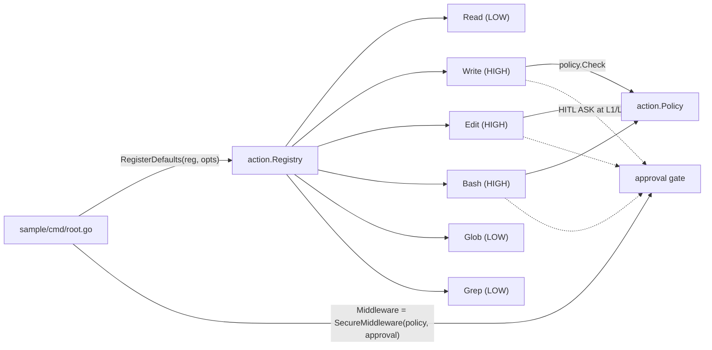

# Spec — `tool/` 套件 6 個內建工具 (Built-in Tools)

> 對應里程碑: M5 (內建工具)
> 日期: 2026-07-07
> 範圍: `tool/` 套件 — `Read` / `Write` / `Edit` / `Bash` / `Glob` / `Grep` + `RegisterDefaults` + tests

## 目標

`tool/` 是 agentSDK 的內建工具集,提供開箱即用的 6 個常見工具(讀檔、寫檔、編輯、shell、glob、grep),任何 agent 都能用 `tool.RegisterDefaults(reg, opts)` 一次註冊,免去自寫 boilerplate。每個工具包裝 `*action.TypedTool[TArgs, TOut]` 並 delegate `core.Tool` 介面,符合既有 composition-root pattern。



## 設計原則

- **Inject at composition root**:`RegisterDefaults(reg, Options{...})` 由 sample 顯式呼叫,`runtime.Engine` 不自動注入 — 與既有 `runtime.Loop.Middleware` 顯式接線一致
- **Wrap `TypedTool`**:每個工具實作一個 `*action.TypedTool[TArgs, TOut]` 加上 `Name/Description/Schema/Risk/Call` 委派(等同 `sample/greet-agent/tool/greet.go` 模式)
- **Risk 對應 HITL**:`Read`/`Glob`/`Grep` = `RISK_LEVEL_LOW`(不需審批);`Write`/`Edit`/`Bash` = `RISK_LEVEL_HIGH`(L1/L2 觸發 `ApprovalGate` 暫停)
- **Sandbox re-check inside tool**:middleware 已檢查 `policy.Check`,工具 fn 內**再**檢查一次(防 middleware 漏接或繞過);`Policy == nil` 時,LOW 工具放行,HIGH 工具建構時就回 error
- **No new deps**:全部 `os` / `os/exec` / `path/filepath` / `regexp` / `bufio` / `io` / `strings` / `net/http` (MIME sniff),std-lib only
- **Atomic + bounded**:`Write` 用 temp + rename 原子寫;`Read` cap 1 MiB;`Bash` cap 1 MiB stdout+stderr + 30s 預設 timeout;`Glob`/`Grep` cap 100 matches 預設

## 套件結構

| 檔案 | 角色 |
|------|------|
| `tool/tool.go` | `Options` / `ReadOptions` / `WriteOptions` / `BashOptions` 等;`RegisterDefaults` 入口;`Sandbox` alias + `checkPathArgs` / `checkCommandArgs` helper |
| `tool/read.go` | `Read` + `ReadArgs{Path, Offset?, Limit?}` + `ReadOutput{Content, Encoding, Truncated, Size, MIME}` |
| `tool/write.go` | `Write` + 原子 temp+rename + `filepath.EvalSymlinks` 二次檢查 |
| `tool/edit.go` | `Edit` + `strings.Replace` exact-match(非 regex);拒絕 0 match / >1 match(除非 `ReplaceAll`);原子寫 |
| `tool/bash.go` | `Bash` + `Executor` interface + `realExecutor` + `limitWriter`(cap output) |
| `tool/glob.go` | `Glob` + 手刻 `doublestarMatch` 處理 `**`(`filepath.WalkDir`,不引 doublestar 依賴) |
| `tool/grep.go` | `Grep` + `GrepMatch{Path, Line, Text}` + `MaxResults` cap + 跳過 binary |
| `tool/fs_helpers.go` | `resolvePath` / `sniffMime` / `atomicWrite` / `safeCwd` |
| `tool/*_test.go` | 769 行測試覆蓋,每個工具獨立 |

## 關鍵介面

### RegisterDefaults

```go
type Options struct {
    Policy     action.Sandbox   // Write/Edit/Bash 必填;Read/Glob/Grep 可 nil
    WorkingDir string           // 預設 "."
    Read  ReadOptions           // { MaxBytes int64 } (0 = 1 MiB)
    Write WriteOptions          // { DefaultMode int } (0 = 0o644)
    Edit  EditOptions
    Bash  BashOptions           // { DefaultTimeout time.Duration, MaxOutputBytes int64, Executor, Env }
    Glob  GlobOptions           // { MaxMatches int } (0 = 100)
    Grep  GrepOptions           // { MaxResults int } (0 = 100)
}

// RegisterDefaults 建好 6 工具並 reg.Register;若 Write/Edit/Bash 缺 Policy 回 error
// 並已註冊成功的工具仍會回傳(partial success)。
func RegisterDefaults(reg *action.Registry, opts Options) ([]core.Tool, error)
```

### 個別工具

| 工具 | Args | Output | Risk | 關鍵行為 |
|------|------|--------|------|---------|
| `Read` | `path`, `offset?`, `limit?` | `content`, `encoding`, `truncated`, `size`, `mime` | LOW | `bufio.Scanner` 逐行;binary → base64 + MIME sniff;cap 1 MiB |
| `Write` | `path`, `content` | `wrote`, `created` | HIGH | `os.WriteFile` 走 temp + rename;`EvalSymlinks` 再對 sandbox 檢查一次 |
| `Edit` | `path`, `old_text`, `new_text`, `replace_all?` | `replacements`, `bytes_after` | HIGH | 全文讀 → `strings.Replace` exact match(非 regex);0 match 拒絕;>1 match 拒絕(除非 `replace_all=true`);原子寫 |
| `Bash` | `command`, `timeout_ms?`, `cwd?` | `stdout`, `stderr`, `exit_code`, `duration` | HIGH | `/bin/sh -c` via `os/exec`;`Executor` interface 供測試 stub;`limitWriter` cap 1 MiB;command 走 `policy.Check` 拒絕 denylist |
| `Glob` | `pattern`, `cwd?` | `matches`, `count` | LOW | 手刻 `**` 比對走 `filepath.WalkDir`;預設 cap 100 |
| `Grep` | `pattern`, `path?`, `glob?`, `case_insensitive?`, `max_results?`, `line_numbers?` | `matches[]`, `count`, `truncated` | LOW | `regexp` + `bufio.Scanner` + `WalkDir`;跳過 binary(用 `http.DetectContentType`) |

### Sandbox Re-check

```go
// tool/tool.go helpers
func checkPathArgs(policy Sandbox, toolName, path string) error
func checkCommandArgs(policy Sandbox, toolName, cmd string) error
```

兩 helper 都在 `action.Policy.Check` 之上加語意化錯誤訊息(`sandbox denied tool "X": path "Y" is not allowed`)。Middleware 已先檢查;工具 fn 再檢查一次是 defense-in-depth。

## 行為保證

### Read
- 路徑:絕對且落在 `Policy.AllowedPathPrefixes`(nil policy 放行)
- 行數:預設所有行,`offset` 從 0 起跳,`limit` 限行數
- 大於 1 MiB 或 `MaxBytes` cap:回 `truncated=true`,不全讀
- Binary:第一個 NUL byte 後切斷,`encoding="base64"`,`mime` 用 `http.DetectContentType` sniff

### Write
- 路徑必須絕對 + policy allow
- 已存在 → overwrite;不存在 → create with `DefaultMode` (0o644)
- 寫入:先寫 `<path>.tmp.<rand>` → `os.Rename` 原子替換
- `filepath.EvalSymlinks` 解析後再 check 一次,防 TOCTOU 繞 sandbox

### Edit
- `old_text` 必須唯一;`replace_all=true` 跳過唯一檢查
- 0 match → `ToolResult{OK:false, Error: "no match"}`
- >1 match + `replace_all=false` → `ToolResult{OK:false, Error: "ambiguous match"}`
- 寫入走 `atomicWrite` 與 Write 同

### Bash
- `command` 必填,timeout 預設 30s
- 危險指令 substring(`rm -rf /`, fork bomb, `dd if=`, `mkfs.`, `shutdown` 等)在 `Policy.DeniedCommandSubstrings` 內
- `limitWriter` 在寫滿 cap 後 close 對應 reader,subprocess 不會因 output pipe 滿 block
- 測試:注入 `Executor` stub 避免真起 subprocess

### Glob / Grep
- `pattern` 是 shell-style glob(`**` 遞迴)
- `Grep` 用 `regexp.Compile` 失敗 → `ToolResult{OK:false, Error: ...}`
- Binary file detect via `http.DetectContentType` → skip
- 超過 cap → `truncated=true` 且只回 cap 數

## 整合點

- **Sandbox middleware** (`middleware/security/sandbox_mw.go`):`Policy.Check(toolName, args)` 已在 `CALL_TOOL` 出口檢查,內建工具用常規 arg keys(`path`, `command`)所以 default policy 不需改
- **Approval gate** (`middleware/security/approval_gate.go`):讀 `eff.CallTool.Call.Risk`;內建工具設好 risk 層級後 gate 自動運作
- **Runtime** (`runtime/loop.go`):**無改動** — loop 對工具無感知
- **Sample wiring**(`sample/greet-agent/cmd/root.go`):用 `builtin.RegisterDefaults(reg, builtin.Options{Policy: action.DefaultPolicy(), WorkingDir: "."})`,並把 `loop.Middleware` 換成 `config.SecureMiddleware(action.DefaultPolicy(), action.DefaultApprovalPolicy{})`,讓 Write/Edit/Bash 在 L2 觸發 HITL

## 測試驗證

| 驗收項 | 測試位置 |
|--------|---------|
| `RegisterDefaults` 6 工具全註冊 + 缺 Policy error | `tool/tool_test.go` |
| `Read` 行數 / offset / 限行 / binary / base64 | `tool/read_test.go` (93 行) |
| `Write` 原子寫 / 拒絕相對路徑 / sandbox | `tool/write_test.go` (81 行) |
| `Edit` exact match / 0 match / >1 match / `replace_all` / 原子寫 | `tool/edit_test.go` (151 行) |
| `Bash` 危險指令阻擋 / timeout / `Executor` stub / cap output | `tool/bash_test.go` (109 行) |
| `Glob` `**` 遞迴 / cap | `tool/glob_test.go` (71 行) |
| `Grep` regex / 跳過 binary / cap / case_insensitive | `tool/grep_test.go` (116 行) |
| `fs_helpers` `EvalSymlinks` / MIME sniff / atomic | `tool/fs_helpers_test.go` (42 行) |

`go test ./tool/... -count=1` 全綠;`go build ./...` 整 workspace 過。

## 對應原始 plan

`plans/ancient-cuddling-quilt.md`(已晉升為本 spec)。
