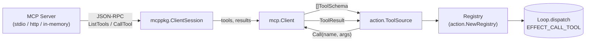

# Spec — mcp/ Client (Model Context Protocol 工具橋接)

> 對應里程碑: M3 (工具生態 + 執行期安全) — `action.ToolSource` 動態發現
> 日期: 2026-07-07
> 範圍: `mcp/client.go` + `mcp/client_test.go` — `Client` 結構、`Discover` / `Call` 介接、heuristic risk 推斷、in-memory test fixture

## 目標

`mcp` 套件把 [Model Context Protocol](https://modelcontextprotocol.io) (MCP) 伺服器的工具表面橋接到 agentsdk 的 `action.ToolSource` 介面,讓 runtime 可以像 dispatch 本地 `TypedTool` 一樣 dispatch 遠端 MCP 工具。Adapter 刻意保持薄 — 只負責「翻譯」,不持有 transport (caller 提供),不管理 session lifecycle,不做 retry / sandbox / approval (留給 runtime middleware)。



## 套件結構

| 檔案 | 角色 | 重點 |
|------|------|------|
| `client.go` | `Client` 結構包 `*mcppkg.ClientSession`、`Discover` / `Call`、heuristic `inferRisk`、compile-time `action.ToolSource` 守護 | 唯一對外入口 |
| `client_test.go` | in-memory MCP server fixture (3 個測試)、risk 推斷斷言 | 行為驗收 |
| `go.mod` | 獨立 module `github.com/bizshuk/agentsdk/mcp`,require `modelcontextprotocol/go-sdk v1.6.1` | module 邊界 |

> mcp/ 為什麼是獨立 `go.mod`? 因為 `modelcontextprotocol/go-sdk` 帶 transitive deps (jsonschema / uritemplate / oauth2 等十數個),不該汙染根 SDK 的 dependency graph;同時也讓 caller 可以選擇「不啟用 MCP 就不拉這條 dep」。

## Protocol 版本與 SDK

| 項目 | 值 |
|------|----|
| 套件 | `github.com/modelcontextprotocol/go-sdk/mcp` |
| 版本 | `v1.6.1` |
| Capability | 預設 `nil` (不宣告 roots / sampling / experimental) |
| Transport | caller 提供:`NewCommandTransport` (stdio) / 自架 `Server` (http) / `NewInMemoryTransports` (測試) |

> 沒有自訂 protocol version,完全跟隨 `mcppkg` SDK 的預設值。MCP 官方目前是 `2025-06-18` revision,SDK 預設會 negotiate。

### Capability 宣告

`mcp.NewClient(session)` 不接 `*mcppkg.ClientCapabilities` 參數,等同於 client 不宣告任何能力 (server-side 不會 push roots / sampling)。若 M4 之後要主動宣告 capability,可在 `NewClient` 擴充 variadic options。

## 兩階段建構 (Construction)

```go
// 1) caller 自行建立 ClientSession (transport 由 caller 決定)
session, err := mcppkg.ClientConnect(ctx, transport, nil)
if err != nil { ... }

// 2) 把 session 包成 agentsdk 的 mcp.Client
c := mcp.NewClient(session)

// 3) Discover 拉工具清單
schemas, err := c.Discover(ctx)
```

兩階段的設計理由:

- `mcp.Client` 與 transport 解耦 — 同一個 `Client` 可以接 stdio / http / in-memory 三種 transport,只差在 session 建法。
- session lifecycle 由 caller 管 (連線、reconnect、close);adapter 只用 session,不管生死。
- 易於測試:測試用 `NewInMemoryTransports` 跳過真實 process,跑起來是 in-process JSON-RPC。

## `Client` 結構

```go
type Client struct {
    session *mcppkg.ClientSession
}

func NewClient(session *mcppkg.ClientSession) *Client {
    return &Client{session: session}
}
```

極簡 — 只有一個 session 欄位。所有方法都是「session 代理」,無內部狀態,無 cache,無 mutex。

## `Discover` — 工具發現

```go
func (c *Client) Discover(ctx context.Context) ([]core.ToolSchema, error)
```

| 步驟 | 動作 |
|------|------|
| 1 | 檢查 `c.session == nil` → 回 `mcp: nil session` |
| 2 | `c.session.ListTools(ctx, &mcppkg.ListToolsParams{})` |
| 3 | 對每個 `mcppkg.Tool` 跑 `mcpToolToSchema(t)`,累積成 `[]core.ToolSchema` |

### `mcpToolToSchema` 轉換規則

| MCP 欄位 | `core.ToolSchema` 欄位 | 備註 |
|----------|------------------------|------|
| `t.Name` | `Name` | 直接 |
| `t.Description` | `Description` | 直接 |
| `t.InputSchema` | `Parameters` | 整包 `any` 透傳 (jsonschema shape) |
| (n/a) | `Risk` | 用 `inferRisk(t.Name)` 推斷 |

> `Parameters` 用 `any` 透傳,讓 LLM 那邊能直接讀 MCP 原生 JSON Schema;agentsdk 不解析,只搬運。

### `inferRisk` heuristic

```go
func inferRisk(name string) core.RiskLevel {
    lowPrefixes  := []string{"get_", "read_", "list_", "search_", "find_"}
    highPrefixes := []string{"delete_", "exec_", "shell_", "write_", "post_"}
    for _, p := range lowPrefixes  { if strings.HasPrefix(name, p) { return core.RISK_LEVEL_LOW  } }
    for _, p := range highPrefixes { if strings.HasPrefix(name, p) { return core.RISK_LEVEL_HIGH } }
    return core.RISK_LEVEL_LOW // 預設 LOW, fail-open
}
```

| Prefix | 推斷 Risk |
|--------|-----------|
| `get_` / `read_` / `list_` / `search_` / `find_` | `LOW` |
| `delete_` / `exec_` / `shell_` / `write_` / `post_` | `HIGH` |
| 其他 | `LOW` (預設) |

不變式:

- **MCP 不帶 risk metadata**,這是 agent 端的 policy 決定 — heuristic 只是 first-order 過濾,production 應該用 allowlist 覆寫 (M4 規劃)。
- **預設 LOW** 是 fail-open:多數 MCP 工具是唯讀查詢,寧可放寬也不要過度打斷 operator 審批。

## `Call` — 工具呼叫

```go
func (c *Client) Call(ctx context.Context, name string, args json.RawMessage) (core.ToolResult, error)
```

| 步驟 | 動作 | 失敗回傳 |
|------|------|----------|
| 1 | `c.session == nil` → `OK: false, Error: "mcp: nil session"` | `ToolResult` 帶 `OK: false`,err 為 `nil`(讓 loop 看 result 即可) |
| 2 | `args` decode 成 `map[string]any`(MCP SDK 要求 loose type) | decode 失敗 → `OK: false, Error: "invalid args: ..."` |
| 3 | `c.session.CallTool(ctx, &mcppkg.CallToolParams{Name, Arguments})` | RPC 報錯 → `OK: false, Error: err.Error()` |
| 4 | `res.IsError` → 取 `res.Content[0].(*mcppkg.TextContent).Text` | 工具回 `IsError: true` → `OK: false, Error: <text>` |
| 5 | 把 `res.Content` 編碼成 `[]map[string]any` 序列,每個項目 `{type, text}` 或 `{type: "other"}` | marshal 失敗 → `OK: false, Error: "marshal: ..."` |
| 6 | `json.Marshal(outputs)` 包成 `json.RawMessage`,回 `OK: true, Output: <raw>` | — |

### 結果內容編碼策略

MCP `CallToolResult.Content` 是 heterogeneous slice(`TextContent` / `ImageContent` / `EmbeddedResource` 等);adapter 只識別 `TextContent`,其他統一標成 `{"type":"other"}` — 這是 M3 簡化版,M4 之後會針對 multimodal 加 `mcppkg.ImageContent` 處理。

JSON shape 範例 (假設工具回 `"hello"`):

```json
[{"type": "text", "text": "hello"}]
```

caller (LLM / test) unmarshal 後讀 `out[0]["text"]`。

### 錯誤傳遞對稱性

| 失敗來源 | 帶 `err` 給 caller? | `ToolResult.OK` |
|----------|---------------------|-----------------|
| nil session | ❌ | false |
| args decode 失敗 | ❌ | false |
| RPC 報錯 | ❌ | false |
| 工具本身回 `IsError` | ❌ | false |
| 結果 marshal 失敗 | ❌ | false |
| 成功 | ❌ | true |

> 永遠回 `err == nil`,錯誤訊息都放 `ToolResult.Error`。理由:runtime loop 透過 `ToolResult.OK` 判斷成功,err 是 transport-level 異常才用;adapter 自己不應該報 transport err。

## 工具發現 → runtime 串接

```mermaid
sequenceDiagram
    participant Loop
    participant TS as mcp.Client (ToolSource)
    participant Reg as Registry
    participant Session as ClientSession
    participant Server as MCP Server

    Note over Loop,Server: 啟動期
    Reg->>TS: Discover(ctx)
    TS->>Session: ListTools
    Session->>Server: ListToolsRequest
    Server-->>Session: ListToolsResult
    Session-->>TS: []mcppkg.Tool
    TS-->>Reg: []core.ToolSchema (含 risk)
    Reg->>Reg: 動態注入 (M3 規劃)

    Note over Loop,Server: runtime 跑起來
    Loop->>Reg: Call(toolCall)
    Reg->>TS: Call(ctx, name, args)
    TS->>Session: CallTool(name, args)
    Session->>Server: CallToolRequest
    Server-->>Session: CallToolResult
    Session-->>TS: *mcppkg.CallToolResult
    TS-->>Reg: core.ToolResult
    Reg-->>Loop: core.ToolResult
```

> **目前 M2 還沒接 Registry 的動態注入** — `Registry.Call` 只查 in-memory `tools map`,不會 fallback 到 `ToolSource`。M3 規劃會把 `ToolSource` 注入到 `Registry`,讓 `List()` 把 discovered schemas 一起列給 LLM。M2 spec 把這條路先備好(`var _ action.ToolSource = (*Client)(nil)` 守護),runtime 端 dispatch 改動最少。

## 測試策略

`client_test.go` 採 **「in-memory MCP server fixture + 黑盒行為斷言」** 模式。

### `newInMemoryServer` fixture

```go
func newInMemoryServer(t *testing.T, tools map[string]func(args map[string]any) (string, error)) *mcp.Client
```

| 步驟 | 動作 |
|------|------|
| 1 | `mcppkg.NewServer(&Implementation{Name: "test"}, nil)` 建 server |
| 2 | 對每個 tool 用 `mcppkg.AddTool` 註冊 — tool handler 回 `(text, err)`,err 非空時 server 自動填 `IsError: true` |
| 3 | `mcppkg.NewInMemoryTransports()` 拉一對 in-memory transport |
| 4 | `go server.Connect(serverTransport, nil)` 把 server 跑在 goroutine |
| 5 | `mcppkg.NewClient(...).Connect(clientTransport, nil)` 建 client session |
| 6 | `mcp.NewClient(session)` 包成 adapter 回傳 |

這個 fixture 讓 3 個測試可以在 in-process 跑完 MCP wire,不必起 stdio 子進程,測試 0–10 ms 完成。

### 三個行為測試

| 測試 | 驗證 |
|------|------|
| `TestDiscoverReturnsDeclaredTools` | `Discover` 回的 schemas 包含所有 `tools map` 的 key (`echo`, `add`) |
| `TestCallForwardsToServer` | `Call("echo", {"text":"hello"})` 回 `OK: true`,`Output` unmarshal 後第一項 text 是 `"hello"` |
| `TestCallReportsToolError` | 工具 handler 回 error → `OK: false`,`Error` 字串含 `"kaboom"` |
| `TestInferRisk` | `read_data` → `LOW`,`delete_data` → `HIGH`(透過 `Discover` 觀察) |

### 為什麼測試 in-memory 而非 stdio 真實 process

- **速度**:in-process 0–10 ms,真實 `mcp.NewCommandTransport` 至少 100 ms 開 process。
- **穩定性**:不依賴外部 binary,CI 跨平台都過。
- **覆蓋面**:in-memory transport 與 stdio 走同樣的 JSON-RPC 編解碼 (SDK 內部統一),adapter 層的差異已經在 fixture 涵蓋。
- **缺點**:不會測到 stdio 的 child process 管理 — 留給 `sample/` 端到端。

## 設計決策 (Why)

| 決策 | 理由 |
|------|------|
| 獨立 `go.mod` | `mcppkg` 帶 10+ transitive deps,根 SDK 應該保持精簡;caller 選擇性引入 |
| 兩階段建構 (caller 給 session) | adapter 與 transport 解耦;同一個 Client 可接 stdio / http / in-memory |
| `Discover` 不快取 | MCP 工具可能動態增減,每次 discover 拿最新;Registry 端要快取再上層做 |
| `inferRisk` heuristic + 預設 LOW | fail-open,避免多數唯讀工具被打斷;M4 加 allowlist 覆寫 |
| 只識別 `TextContent` | M3 簡化,multimodal 留 M4 |
| 錯誤統一放 `ToolResult.Error` | runtime 透過 `OK` 判斷,不依賴 `err` 欄位;adapter 與 typed tool 對齊 |
| `Parameters` 用 `any` 透傳 | jsonschema 原生型別保留,LLM 端直接讀 |
| 測試用 in-memory transport | 速度、穩定性、跨平台都比真實 process 優;end-to-end 留 sample |

## 開放問題 (Follow-ups, 留待 M3/M4)

- **`Registry` 動態注入路徑未實作**: 目前 `Registry.Call` 只查 in-memory map;M3 規劃把 `ToolSource` 注入,`List()` 把 discovered schemas 與 in-memory tools 合併。
- **Multimodal 結果處理**: `mcppkg.ImageContent` / `EmbeddedResource` 目前歸類為 `{type: "other"}`,M4 應直接轉成 `core.Chunk{Image: bytes, ImageMIME: ...}`。
- **Risk allowlist 覆寫**: `inferRisk` 為 heuristic,production 應允許 caller 傳 `map[string]core.RiskLevel` 覆寫。
- **Capability 宣告**: 目前 client 不宣告任何 capability,M4 若要主動使用 `sampling` (call LLM from MCP server) 需擴充 `NewClient` options。
- **Reconnect / session 重試**: adapter 不管 session lifecycle;若 MCP server 死掉,`Call` 會直接回 `OK: false`。M3 之後考慮加 session-level retry。
- **Schema validation**: `Parameters` 透傳不等於驗證,args 是否符合 schema 是 MCP server 端責任,但 agentsdk 端可以選做 jsonschema 驗證以 fail-fast。

## 驗收 (Acceptance)

- [x] `go test ./mcp/... -count=1` 全綠 (4 個 test:Discover、Call forward、Call error、InferRisk)
- [x] `var _ action.ToolSource = (*Client)(nil)` 編譯期守護介面合規
- [x] `Discover` 把 MCP `Tool` 轉成 `core.ToolSchema`,`Risk` 透過 `inferRisk` 推斷
- [x] `Call` 走 `mcppkg.ClientSession.CallTool`,回 `core.ToolResult`
- [x] 錯誤統一走 `ToolResult.Error`(`OK: false`),`err` 永遠 `nil`
- [x] 獨立 `go.mod` 不污染根 SDK 的 dependency graph
- [x] in-memory test fixture 可在 CI 0–10 ms 跑完,無外部 process 依賴
