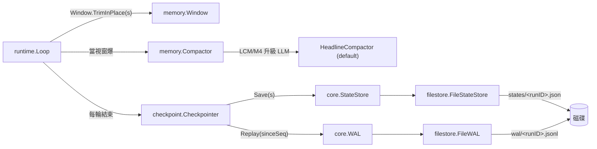
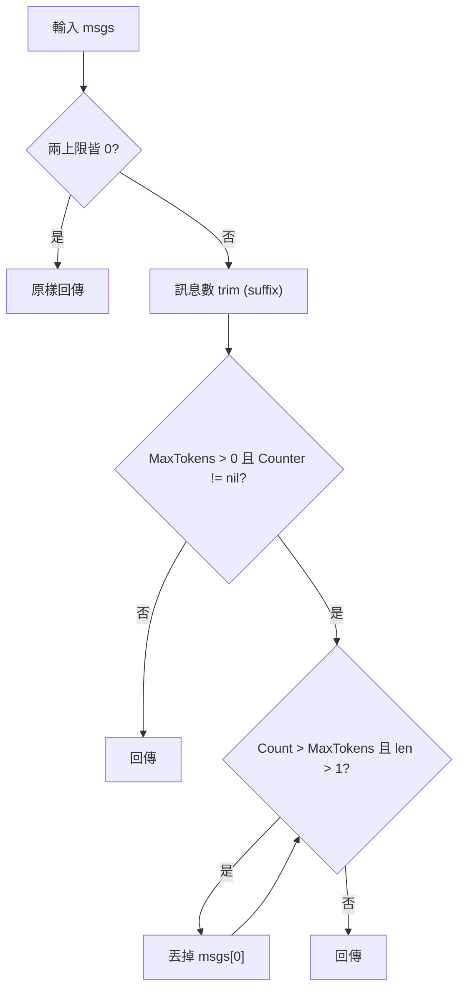
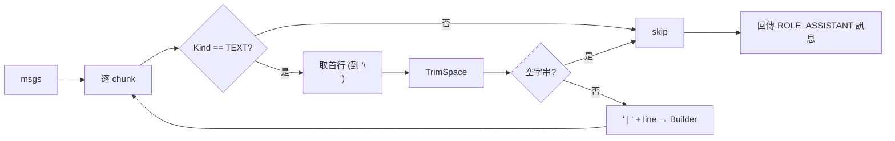
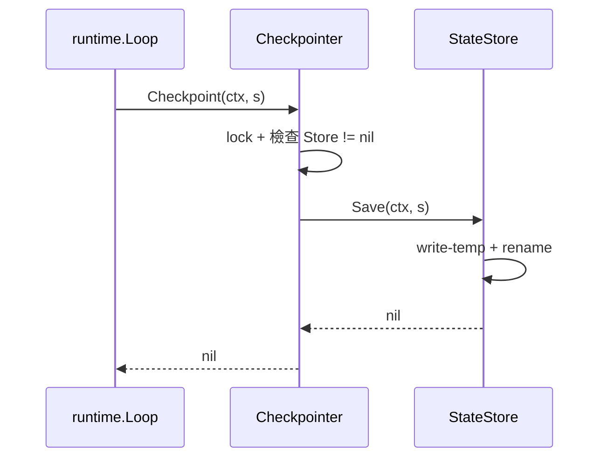
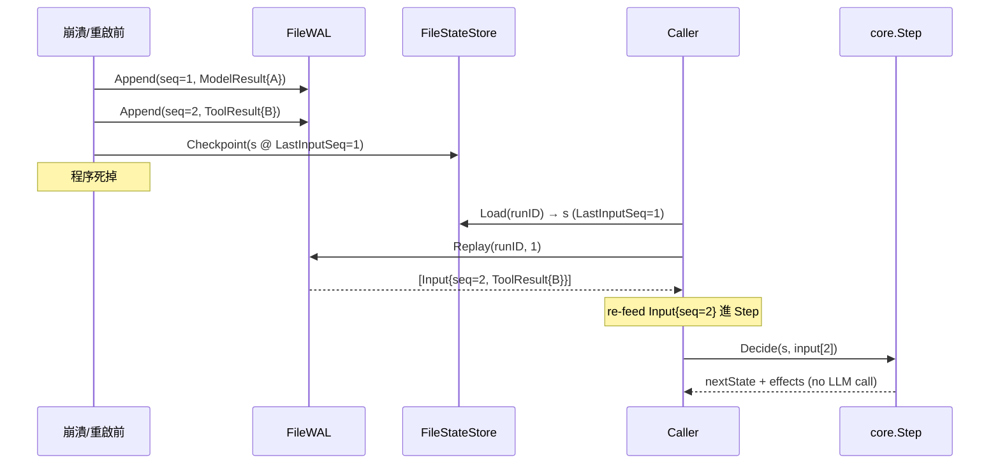

# Spec — memory/ 套件 (State 持久化 + 上下文管理 + 復原)

> 對應里程碑: M2 (系統韌性 + 循環防禦)
> 日期: 2026-07-07
> 範圍: `memory/` 套件 — `Window` / `Compactor` / `checkpoint/` / `filestore/` + 整合測試

## 目標 (Goal)

`memory/` 是 agentsdk 第二支柱 (pillar 2),負責把 `core.State` 與 `core.Input` 流的生命週期延伸到磁碟,讓一個 run 可以:

- 在不超出 token 預算的情況下,把對話視窗 (window) 維持在合理大小;
- 透過 `Compactor` 把舊訊息摘要成單一保留訊息,進一步壓縮上下文;
- 透過 `Checkpoint` 對 `State` 拍快照,並用 `WAL` 逐筆 append 收到的 `Input`;
- 在 crash / `PAUSED_APPROVAL` / `Resume` 時,`Recover` 載回 `State` + 重放 WAL 後半段,**完全不必重新呼叫 LLM**;
- 所有 I/O 介面 (`StateStore` / `WAL`) 都來自 `core.Port`,實作可替換 (memory / Redis / DB)。

`memory/` 的設計契約:

- `core/` 不 import 任何 memory 內部符號 (port 已先在 core 定義),`memory/` 單向依賴 `core`。
- `Compactor` 預設是 **no-LLM** 的 `HeadlineCompactor`,LLM 摘要留待 M4 wiring 三家 provider 後再上;M2/M3 不會因缺 LLM 而無法運作。
- 復原後 runtime 不會重發 `CALL_MODEL`,因為 `WAL` 內含原始的 `ModelResult` / `ToolResult`,replay 即還原因果。

## 子套件結構 (Sub-package Structure)

```text
memory/
├── window.go                     # Window + CharHeuristicCounter + TokenCounter
├── compactor.go                  # Compactor 介面 + HeadlineCompactor (no-LLM)
├── memory_test.go                # 9 個 case 涵蓋四個元件
├── checkpoint/
│   └── checkpointer.go           # Checkpointer 串接 Store + WAL
└── filestore/
    └── filestore.go              # FileStateStore + FileWAL 預設實作
```

| 套件 | 角色 | 對外型別 |
|------|------|----------|
| `memory` | 上下文管理 | `TokenCounter`, `CharHeuristicCounter`, `Window`, `Compactor`, `HeadlineCompactor` |
| `memory/checkpoint` | 耐久性協調 | `Checkpointer`, `RecoverResult` |
| `memory/filestore` | 磁碟預設實作 | `FileStateStore`, `FileWAL` |

## 套件關係



## Window — 視窗管理

### 介面

```go
type TokenCounter interface {
    Count(msgs []core.Message) int
}

type Window struct {
    MaxMessages int           // 0 表示不限制訊息數
    MaxTokens   int           // 0 表示不限制 token;兩者皆 0 = 不 trim
    Counter     TokenCounter  // MaxTokens > 0 時必填
}
```

### `CharHeuristicCounter` (default fallback)

- 公式:`sum over (text chunk): len(c.Text)/4 + 1`。
- `+1` 保證空訊息至少 1 token (避免「0 token」觸發 trim 邏輯死角)。
- 只認 `CHUNK_KIND_TEXT`;`CHUNK_KIND_AUDIO` / `CHUNK_KIND_IMAGE` / `CHUNK_KIND_TOOL_USE` / `CHUNK_KIND_TOOL_RESULT` 不計。
- 確定性、無 I/O,適合測試與 offline budget 估計。
- 真正的 provider (anthropic / google) 會用自家 `TokenCounter` 實作;`openaicompat` 在沒有 native endpoint 時可掛此 heuristic。

### `Trim` / `TrimInPlace` 行為

`Trim(msgs)` 流程:

1. 兩上限皆 0 → 原樣回傳。
2. `MaxMessages > 0` 且 `len(msgs) > MaxMessages` → 取尾段 suffix。
3. `MaxTokens > 0` 且 `Counter != nil` → 由舊到新逐筆丟棄,直到 token 數 ≤ 上限或剩 1 筆為止 (`len(msgs) > 1` 是保護,避免 trim 到空)。
4. 兩個上限可以**同時**設置;訊息數 trim 先行,token trim 後行 (token 預算通常比訊息數更嚴)。



`TrimInPlace(s *core.State)` 直接改寫 `s.Messages`,不動 scratch / status / budget。

## Compactor — 上下文壓縮

### 介面

```go
type Compactor interface {
    Compact(msgs []core.Message) (core.Message, error)
}
```

`Compact` 收到一段訊息,回傳**單一**摘要訊息 (目前固定 `ROLE_ASSISTANT` + 單一 text chunk)。runtime 拿到後會把這段訊息 push 進 `State.Messages`,並在視窗爆時 trim 出去,達成「滾動式摘要 (rolling summary)」。

### `HeadlineCompactor` (M2 預設)

- 逐訊息逐 chunk 抽 text chunk 的**第一行** (以 `'\n'` 切);
- 用 `" | "` 串接;
- 全部空白 / 無 text → 摘要內容為 `(empty)`,prefix 一律 `[compacted summary] `;
- 完全 deterministic,no I/O,test 與 fallback 兩用;
- 完整範例輸入 `[ "first line\nsecond line", "third line" ]` → 輸出 `"[compacted summary] first line | third line"`。



### 觸發時機

- M2 runtime 還**沒**接自動 compaction;觸發點由呼叫方決定 (例如「`Window.Trim` 之後若丟棄 ≥ N 筆,呼叫 `Compactor.Compact` 然後 prepend 摘要」)。
- 預留設計: M3 / M4 升級為 LLM-driven summarization 時只需換實作,不動呼叫端。
- **Why no-LLM default**: 讓 SDK 可以在 M2 沒有任何 provider 的狀態下跑 end-to-end (M1 sample `ScriptedProvider` 也是同樣哲學);`HeadlineCompactor` 雖粗糙但保證 deterministic 與可測。

## Checkpoint — 耐久性協調

### `Checkpointer` 型別

```go
type Checkpointer struct {
    Store core.StateStore
    WAL   core.WAL
    mu    sync.Mutex   // 序列化 Checkpoint / Recover
}
```

`New(store, wal)` 是唯一 constructor,完全可替換 — 只要滿足 `core.StateStore` / `core.WAL` 介面就能掛上。

### `Checkpoint(ctx, s)`

- 行為:把 `s` 序列化到 `Store`,然後 return。
- 序列化由 `Store` 負責 (`FileStateStore` 採 `MarshalIndent` + write-temp + rename)。
- M2 設計刻意**不在 Checkpoint 內同步寫 WAL marker**;WAL 由 runtime 在每個 `Input` fold 之後 append,checkpoint 邊界與 WAL 邊界靠 `LastInputSeq` 對齊。



### `Recover(ctx, runID)`

`Recover` 步驟:

1. `Store.Load(runID)` 拿回上一次 snapshot 的 `State` (含 `LastInputSeq`)。
2. 若 `WAL == nil` → 直接回傳 `RecoverResult{State: s}`,沒有補丁。
3. 否則 `WAL.Replay(runID, s.LastInputSeq)` 拿到所有 `Seq > sinceSeq` 的 `Input`,依寫入順序。
4. 回傳 `RecoverResult{State: s, Inputs: inputs}`,caller 拿到後**重新餵**這些 Input 進 `core.Step` / dispatch,但**不再呼叫 LLM**(見下節 WAL Replay)。

```mermaid
sequenceDiagram
    participant Caller
    participant C as Checkpointer
    participant S as StateStore
    participant W as WAL
    Caller->>C: Recover(ctx, runID)
    C->>S: Load(runID)
    S-->>C: State (含 LastInputSeq)
    C->>W: Replay(runID, LastInputSeq)
    W-->>C: []Input (Seq > sinceSeq, 寫入序)
    C-->>Caller: RecoverResult{State, Inputs}
    Note over Caller: 把 inputs re-feed 進 Step;<br/>不呼叫 LLM
```

## FileStore — 磁碟預設實作

### 目錄佈局

```text
<baseDir>/
├── states/<runID>.json       # State snapshot,pretty-printed
└── wal/<runID>.jsonl         # 一行一個 Input (JSON)
```

`NewFileStateStore(baseDir)` 會 `os.MkdirAll(baseDir+"/states", 0o750)`,`NewFileWAL(baseDir)` 同理建立 `wal/`,兩個 constructor 各自獨立,呼叫端可分開配置。

### `FileStateStore`

| 方法 | 行為 |
|------|------|
| `Save(ctx, st)` | `MarshalIndent` 寫到 `path + ".tmp"`,再 `os.Rename` 到正式檔;`mu` 序列化 |
| `Load(ctx, runID)` | `os.ReadFile` 後 `json.Unmarshal`;不存在回 `"run not found: <id>"` |
| `List(ctx)` | 掃描 `BaseDir`,過濾 `.json` 並去掉副檔名當 runID |
| `Delete(ctx, runID)` | `os.Remove`;不存在視為 idempotent (`os.IsNotExist` → nil) |

**Atomic write-temp + rename 理由**:

- POSIX `rename(2)` 在同一檔案系統內是 atomic — 任何瞬間 reader 看到的是「舊版」或「完整新版」,**不會**看到「半寫入」的截斷檔;
- 寫到 `.tmp` 再 rename 確保崩潰後只可能留下 `.tmp` 殘檔,正式檔永遠是上一次成功的完整狀態;
- M2 不引入 fsync 強制 flush,接受「rename 成功但 page cache 還沒落盤」的微小風險;M3 若要更嚴,可在 rename 前 `f.Sync()`。

### `FileWAL`

| 方法 | 行為 |
|------|------|
| `Append(ctx, runID, _, in)` | `os.OpenFile(O_APPEND|O_CREATE|O_WRONLY)`,寫一行 `json.Marshal(in) + '\n'`;`mu` 序列化 |
| `Replay(ctx, runID, sinceSeq)` | 全檔讀進記憶體,以 `\n` 切行,`json.Unmarshal` 逐筆;只回傳 `Seq > sinceSeq` 的項目;空檔回 `nil, nil` |
| `Truncate(ctx, runID, uptoSeq)` | 從檔頭掃描,**找到「最後一筆連續 `Seq <= uptoSeq`」** 的 byte 位置,把該位置之後的內容寫回;全掃完才都 ≤ uptoSeq → `os.Remove` 整檔 |

> 為何 `Truncate` 用「連續段」而不是「保留所有 `Seq > uptoSeq`」:checkpoint / compaction 通常是「前面的舊 input 已經被 state fold 過了,後面新的還要 replay」,**中間不應有空洞**。一旦遇到 `Seq > uptoSeq` 就 break,代表「這個位置開始是 frontier,不能丟」。

## WAL Replay — 不重發模型呼叫的關鍵

### 介面契約 (來自 `core.WAL`)

```go
type WAL interface {
    Append(ctx, runID, seq, in) error
    Replay(ctx, runID, sinceSeq) ([]Input, error)
    Truncate(ctx, runID, uptoSeq) error
}
```

`FileWAL.Replay` 行為:

- 讀整個 `<runID>.jsonl`,逐行 `json.Unmarshal` 為 `core.Input`;
- 只收 `in.Seq > sinceSeq` 的項目;
- 保留寫入順序 (JSONL append-only 自然單調);
- 缺 `Seq` 欄位的歷史紀錄會被當作 `Seq == 0`,而 `sinceSeq >= 0` 通常會過濾掉 — 註解明示「為舊版無 Seq 的 checkpoint 提供向下相容」。

### 為什麼 Recover 不重新呼叫 LLM

`Input` 是一個 sum-type (tagged union via `Kind` discriminator),其 payload 欄位 (`ModelResult` / `ToolResult` / `Percept` / `ApprovalDecision`) **已經包含執行結果**:

- `INPUT_KIND_MODEL_RESULT` 帶 `ModelResult` (text + tool_calls + stop_reason + usage) — 這就是 LLM 真正回過的東西;
- `INPUT_KIND_TOOL_RESULT` 帶 `ToolResult` (call_id + output) — 這就是 tool 真正執行過的結果。

runtime 拿 `RecoverResult.Inputs` 之後,把它當成「普通的輸入流」重新餵進 `core.Step` 即可:

- pattern (`ReAct` / `PlannerExecutor` / `ExecutorCritic`) 是純函式,只看 scratch + state 就能決定 effect;
- `State.Scratch` 已經跟著 snapshot 一起保存下來 (`State.Scratch` 是 `map[string]any`,JSON-serializable);
- 喂進去後 scratch 會在 pattern 內逐步推進,效果跟正常執行一樣,但**沒有 LLM 流量**。



> **測試守護**: `TestRecoverDoesNotReissueModelCalls` 用 `testutil.FakeProvider` 預先 enqueue 一個 end-turn,然後檢查 `Recover` 後 `prov.CallCount() == 0`。此測試是 replay 語義不退化的契約。

## State Round-Trip — 等價性保證

### 路徑

```mermaid
flowchart LR
    A["runtime.Loop"] -->|"Checkpoint(s)"| B["FileStateStore.Save"]
    B -->|"write-temp + rename"| C[("states/r.json")]
    C -->|"Load(runID)"| D["s' = json.Unmarshal"]
    D -->|"Recover 拿回 s'"| E["checkpointer.RecoverResult.State"]
    E -->|"re-feed Inputs since LastInputSeq"| F["Step"]
    F -->|"scratch 推進"| G["s''"]
    G -->|"應與崩潰前的 s 等價"| H["✅ State round-trip"]
```



### 等價性三層

1. **JSON round-trip**: `core.State` 全部欄位都標 `json:"..."` (`RunID` / `Turn` / `Autonomy` / `ThinkingKind` / `Messages` / `Scratch` / `PendingApprovals` / `Budget` / `Status` / `UpdatedAt` / `LastInputSeq`);`Messages` 內的 `Chunk` 與 `ToolResultChunk` 同步可序列化;`Budget.NowFunc` 標 `json:"-"`,clock 注入不會落地。
2. **Scratch reference**: `Scratch` 是 `map[string]any`,任何 pattern 寫入的 `react.phase` / `pe.blueprint` / `loopguard.state` 等都會跟著 snapshot 走。
3. **WAL frontier**: `LastInputSeq` 是「已跑過的最大 Seq」,Recover 透過它把 WAL 切成「已 fold」與「待 replay」兩段。`State` 載回後,`LastInputSeq` 之後的 `Input` 補回來剛好等於崩潰前那一刻的因果閉包。

測試守護:

- `TestFileStateStoreRoundTrip`:驗證 Marshal → Unmarshal 後所有欄位 (`RunID` / `Turn` / `Status` / `ThinkingKind` / `Autonomy` / `Messages[0].Chunks[0].Text` / `Budget.MaxTurns` / `UpdatedAt`) 等於輸入。
- `TestCheckpointerCheckpointAndRecover`:額外驗 `Recover` 後 `Inputs[0].Seq == LastInputSeq + 1`。
- `TestRecoverDoesNotReissueModelCalls`:驗證 Recover 期間 `FakeProvider.CallCount()` 不增加 (不重跑 LLM)。

## 設計決策 (Design Decisions)

| 決策 | 理由 |
|------|------|
| `core.StateStore` / `core.WAL` 介面在 `core/port.go` 而非 `memory/` | 讓 `runtime` 與 `testutil` 直接依賴介面,`memory/` 只提供實作;介面與實作解耦後,Redis / DB backend 可在不改 runtime 前提下替換 |
| `Window` 採 `int` 上限而非 percentage | token 預算在 `core.Budget` 已是絕對值,Window 跟同一單位保持一致;百分比會在 budget 變動時失同步 |
| `CharHeuristicCounter` 採 `len/4 + 1` | tiktoken 帶 cgo 太重,M2 不引;`+1` 保證空訊息不踩「0 token → 視為不用 trim」的邊角 bug;只計 TEXT chunk 維持簡單可推理 |
| `Compactor` 預設實作為 no-LLM | 讓 M2 在無 provider 情況下可 end-to-end;升級 LLM summarization 不改介面 (`Compact` 一進一出) |
| `HeadlineCompactor` 取首行 + pipe 串接 | 訊息第一行通常是主旨/結論,摘要意圖明顯;全量摘要對 SDK 樣本來說 over-engineering |
| `FileStateStore` 採 write-temp + rename | POSIX rename atomic,讀者不會看到「半寫入」狀態;M2 不強制 fsync 是可接受 trade-off (崩潰時最多丟失最近一次 Checkpoint) |
| `FileWAL` 不 `f.Sync()` | append 模式已足夠 atomic,M2 接受「OS crash 時掉尾部 1 行」,復原時因 `LastInputSeq` 卡在 checkpoint,損失可被偵測 |
| `FileWAL.Truncate` 用「連續段保留」 | 避免在 WAL 中留空洞導致 Replay 失序;遇到 `Seq > uptoSeq` 即停,確保 frontier 完整 |
| `Checkpointer` 自帶 `sync.Mutex` | runtime 端多 goroutine 競爭 Checkpoint / Recover 會導致「Store 與 WAL 對不上」;鎖住整個 Checkpointer 比分別鎖 Store/WAL 簡單且無 deadlock 風險 |
| `Compactor` 介面是 `Compact([]Message) (Message, error)` | 單進單出,易於 chain (未來 LLM-driven compactor 直接 swap);`error` 預留 (LLM 失敗要 surface) |
| Recover 後 **不重發** LLM | WAL 已是因果閉包;重發會浪費 token 且若 LLM 行為不確定 (temperature) 會跑出不同結果;replay 的意義是 deterministic resume |
| `CharHeuristicCounter` 介面 + 預設實作放在 `memory` 而非 `core` | `memory.Window` 才有 `MaxTokens` 需求,放 `core` 會把 memory 概念洩漏出去;`core` 維持純 stdlib |
| `Window.Trim` 不動 `State.Scratch` | scratch 是 pattern / middleware 跨迭代的通訊介面,trim 不該 silent-drop FSM 狀態 |
| `FileWAL.Replay` 不過濾 `INPUT_KIND_RESUME` | 故意 — resume 本身就是 replay 的產物,re-replay 會無窮遞迴;caller 端不寫 resume 進 WAL,介面不特別防呆 |

## 測試策略 (Testing Strategy)

`memory/memory_test.go` 共 9 個 case,涵蓋四個元件:

| 測試 | 對象 | 覆蓋 |
|------|------|------|
| `TestCharHeuristicCounter` | `CharHeuristicCounter.Count` | `len/4 + 1` 公式;多訊息相加;只計 TEXT chunk (測試固定 input) |
| `TestWindowTrimByMessageCount` | `Window.Trim` (訊息數) | suffix 截斷,長度 = `MaxMessages`;順序保留 |
| `TestWindowTrimByTokenCount` | `Window.Trim` (token) | 4 訊息 8 tokens,`MaxTokens=5` → 砍到剩 1-3 筆 (守護 `len>1` 終止條件) |
| `TestHeadlineCompactor` | `HeadlineCompactor.Compact` | 多行取首行;空 chunk 跳過;`second line` 不會出現;`ROLE_ASSISTANT` 訊息 |
| `TestFileStateStoreRoundTrip` | `FileStateStore` | JSON round-trip;所有欄位等價;`t.TempDir()` 隔離 |
| `TestFileWALAppendReplay` | `FileWAL` | 連寫 5 筆,`Replay(_, 0)` 全收;`Replay(_, 3)` 只收 seq 4-5 |
| `TestFileWALTruncate` | `FileWAL.Truncate` | truncate 3 後,後續 replay 只剩 seq 4-5 |
| `TestCheckpointerCheckpointAndRecover` | `Checkpointer` 整合 | Store 載回 + WAL replay;`Inputs[0].Seq == LastInputSeq + 1` |
| `TestRecoverDoesNotReissueModelCalls` | Recover 語義 | `FakeProvider.CallCount() == 0` 守護「replay 不重發 LLM」契約 |
| `TestFileStateStoreListAndDelete` | `List` / `Delete` | housekeeping 方法 + idempotent delete |

測試風格:`testify/assert` (非致命) 與 `testify/require` (致命) 並用,table-driven 留給之後加 case 的人擴充。所有 I/O 走 `t.TempDir()`,並行安全與 fixture 隔離。

## 驗收 (Acceptance)

- [x] `go test ./memory/... -count=1` 全綠 (9 個 case)
- [x] `Window.Trim` 同時支援 `MaxMessages` / `MaxTokens`,且 `MaxTokens == 0` 時不查 `Counter`
- [x] `CharHeuristicCounter.Count` 公式為 `len(text)/4 + 1`,且**只**計 `CHUNK_KIND_TEXT`
- [x] `Compactor` 介面單進單出,`HeadlineCompactor` 為 deterministic no-LLM 預設
- [x] `Checkpointer.Checkpoint` 序列化 `State` 到 `Store`;`Recover` 同時載回 `State` 與 `WAL.Replay(sinceSeq=LastInputSeq)` 之 `Input` 串
- [x] `FileStateStore.Save` 走 write-temp + rename (atomic)
- [x] `FileWAL.Append` 寫一行 JSONL;`Replay(sinceSeq)` 只回 `Seq > sinceSeq` 之項目,保留寫入序
- [x] `FileWAL.Truncate` 保留 frontier,不在 WAL 留空洞
- [x] `Recover` 期間 `FakeProvider.CallCount() == 0` (守護「不重發 LLM」契約)
- [x] State round-trip 後所有 `json` 標籤欄位等價
- [x] `core/` 純 stdlib 原則未受污染 (`memory/` 透過 `core.Port` 反向解耦)
- [x] `Window` / `Compactor` / `Checkpointer` / `FileStateStore` / `FileWAL` 全部以 `sync.Mutex` 序列化寫入,可安全在多 goroutine runtime 中掛載
