# Spec — `middleware/` 套件: 系統防護 + 循環防禦 + 執行期安全 + 觀測

> 對應里程碑: M2 (系統韌性 + 循環防禦) + M3 (工具生態 + 執行期安全)
> 日期: 2026-07-07
> 範圍: `middleware/` 套件 — `Middleware` / `Next` / `Chain` 核心 + `harness/` (Retry / Budget / Timeout) + `loopguard/` + `security/` (Sandbox / ApprovalGate / Spotlight / Sanitizer) + `observability/` (Tracing)

## 目標 (Goal)

提供一條 **可組合的 middleware 鏈 (composable middleware chain)**,把 cross-cutting concerns 從 `runtime.Loop` 的 dispatch 路徑拉出來,統一以 `(Next) → Next` 形式包裝。SDK 的 middleware 模型遵循經典的 `func(next Next) Next` onion pattern,允許:

- **可注入的防護層 (defense in depth)** — Retry / Timeout / Budget / Loopguard 是 policy 防護;Sandbox / ApprovalGate / Spotlight / Sanitizer 是內容防護;Tracing 是觀測防護;每一層都可以單獨測試、單獨關掉、單獨抽換。
- **可測試的 dispatch 行為** — `Chain` 純函式組合 middleware;`Next` 簽名把 `(state, *input, terminal, error)` 4-tuple 攤平,測試可以用 stub dispatcher 直接驗證中間層的 rewrite / short-circuit 行為。
- **跨迭代的通訊介面 (scratch)** — middleware 的狀態透過 `state.Scratch["loopguard.state"]` / `state.Scratch["sanitizer.last_reason"]` 等 key 傳遞,跨 `Loop.Resume` 也能存活 (M2 checkpoint 復原時 scratch 一起 round-trip)。

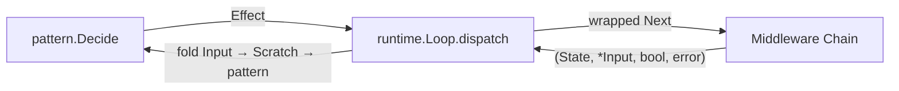

## 套件結構

| 套件 | 角色 | 檔案 |
|------|------|------|
| `middleware/` | 鏈組合核心 | `middleware.go` (`Middleware` / `Next` / `Chain` / `Identity`)、`middleware_test.go` |
| `middleware/harness/` | 政策類 middleware | `retry.go` (`Retry` / `RetryableError` / `IsRetryable` / `SimpleRetryable` / `TransientError`)、`budget.go` (`Budget` / `BudgetExceededError`)、`timeout.go` (`Timeout` / `TimeoutConfig`) |
| `middleware/loopguard/` | 循環防禦 | `loopguard.go` (`New` / `Config` / `State` / `fingerprint` / `obsSignature`) |
| `middleware/security/` | 執行期安全 | `sandbox_mw.go` (`Sandbox(policy)`)、`approval_gate.go` (`ApprovalGate(level, policy)`)、`spotlight.go` + `spotlight_helpers.go` (`Spotlight` / `wrapToolOutput`)、`sanitizer.go` (`Sanitizer` / `DefaultSanitizer` / `Inspect` / `Middleware`) + 對應 `*_test.go` |
| `middleware/observability/` | 觀測 | `tracing.go` (`Tracing` / `TracingConfig` / `spanName` / `spanAttributes`) + `tracing_test.go` + `tracing_helpers_test.go` |

## 合約 (Contract)

### `Middleware` / `Next` / `Dispatcher`

```go
type Next       func(ctx context.Context, state core.State, eff core.Effect) (core.State, *core.Input, bool, error)
type Middleware func(Next) Next
type Dispatcher func(ctx context.Context, state core.State, eff core.Effect) (core.State, *core.Input, bool, error)
```

`Chain(mws ...Middleware) Middleware` 由 **外到內 (outermost-first)** 組合,最後一個參數包住 dispatcher:

```go
chain := middleware.Chain(
    harness.Retry(...),      // 最外
    harness.Timeout(...),
    harness.Budget(),
    loopguard.New(...),
    security.Sandbox(policy),
    security.ApprovalGate(autonomy, approval),
    observability.Tracing(...),
)
loop.Middleware = chain      // loop 內部 dispatch 即是 chain 的「最內」
```

`Next` 回傳的 4-tuple:

| 欄位 | 型別 | 意義 |
|------|------|------|
| `state` | `core.State` | mutate 後的 state,需原樣傳回 caller |
| `*input` | `*core.Input` | 本次 dispatch 產生的 foldable 結果,下一 iteration 讀取 |
| `terminal` | `bool` | runtime 看到 `terminal=true` 就 return,不再 fold |
| `error` | `error` | 呼叫失敗 (由 Retry / Budget / Timeout 守衛) |

**不變式 (invariants)**:
1. 任何 middleware 不得吞掉 `*input` (非 nil) — 必須 fold 回下一次 iteration。
2. `terminal=true` → runtime 立刻退出,`state.Status` 反映最終狀態。
3. `state.Scratch` 是 `map[string]any` reference — middleware 在當下 mutate 它就會自動傳到下個 middleware / 下個 iteration。
4. middleware 不能假設 dispatcher 是它自己,也不能把 inner 換成另一條 chain (這違反合約)。

## Harness (系統防護)

### 1. `Retry` — 失敗重試 + 指數 backoff

合約:

```go
type RetryableError interface {
    error
    Retryable() bool
}
func IsRetryable(err error) bool
type RetryConfig struct {
    N           int           // max attempts (1 = no retry)
    BaseBackoff time.Duration // 第一次 sleep;後續 *2
    MaxBackoff  time.Duration // cap
    Sleeper     func(d time.Duration)  // 測試可注入
}
func Retry(cfg RetryConfig) middleware.Middleware
```

行為:

- 用 `errors.As(err, &r)` 找 `RetryableError` 介面,`r.Retryable()==true` 才重試;非 retryable 立刻 surface。
- 預設 3 次,BaseBackoff 100ms,MaxBackoff 5s — `cfg.N<=0` / `BaseBackoff==0` / `MaxBackoff==0` 都會回退到預設值。
- 重試是 **同一個 effect 重新 invoke inner**,不是 wrap — LLM 還沒 commit 的 partial response 就不算 commit。
- 帶 `RetryClassNetwork` / `RetryClassRateLimit` / `RetryClassServer5xx` / `RetryClassTimeout` 常數,讓 M4 provider adapter 可以 attach class string 給 telemetry。

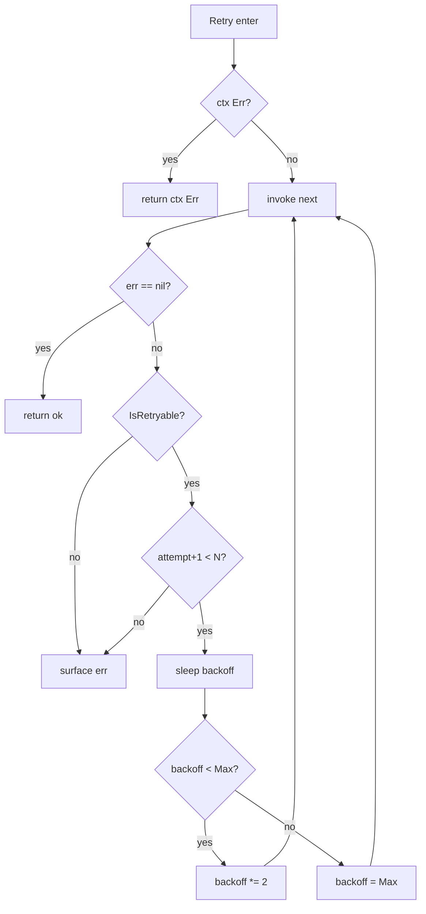

### 2. `Budget` — 預算守衛

合約:

```go
type BudgetExceededError struct {
    Reason string  // "turn_budget" | "token_budget" | "wall_time_budget"
}
var ErrBudgetExceeded = errors.New("budget exceeded")
func Budget() middleware.Middleware
```

行為:

- middleware 每次 dispatch 前 call `state.Budget.Exceeded()` (在 `core.Budget` 內);一但 `true` 就回 `&BudgetExceededError{Reason: ...}` 而且 **完全不 invoke inner** (與 Retry / Timeout 不同,後者都會跑 inner)。
- Runtime 看到這個 typed error 標記 `state.Status = RUN_STATUS_FAILED`;`runtime.IsBudgetExceeded(err)` 給 caller 用。
- 預算值由 runtime 在 `Step` 之前推進 (e.g. `state.Turn++`、`state.Budget.UsedTurns++`),middleware 本身不做計數。
- 時鐘透過 `state.Budget.NowFunc` 注入,測試可換 mock clock。

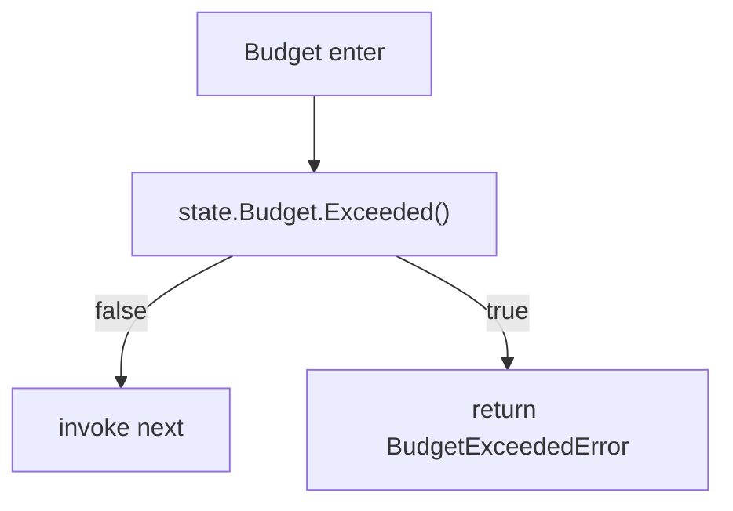

### 3. `Timeout` — 單次 effect deadline

合約:

```go
type TimeoutConfig struct {
    PerEffect time.Duration
    OnTimeout func(eff core.Effect)  // optional observability hook
}
func Timeout(cfg TimeoutConfig) middleware.Middleware
```

行為:

- middleware 對 ctx 做 `context.WithTimeout(ctx, PerEffect)`,然後 invoke inner。
- 結束時檢查 `cctx.Err() == context.DeadlineExceeded`:是的話,即使 inner 已 return nil 也改寫 err 為 deadline;`OnTimeout` 在這個 case 觸發。
- 預設 `PerEffect = 60s` (`cfg.PerEffect <= 0` 時套用)。
- **不會 preempt 阻塞型 inner**:`time.Sleep` 不讀 ctx,outer 看不到 `Done()` channel 直到 inner return;真要嚴格 deadline,inner 必須自己 `select { case <-ctx.Done() }` (`docs/specs/2026-07-04-system-resilience-and-loop-defense.md` 已知限制 #1)。

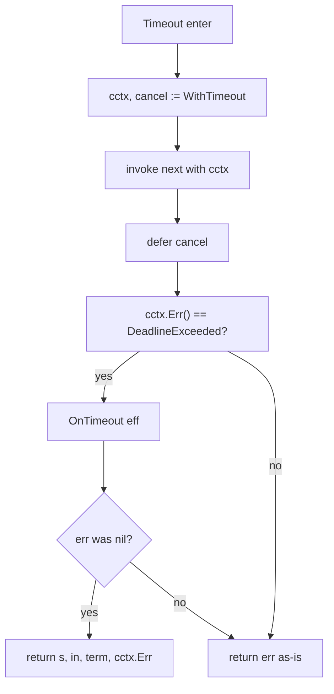

## LoopGuard (循環防禦)

`loopguard.New(loopguard.Config{MaxRepeats: 5, VolatileKeys: ...})` 偵測「同工具反覆被 dispatch,沒有新 observation」這種 stuck 情境,並在第 N 次改寫為 `REQUEST_APPROVAL` 讓 run 暫停等人審。

### 指紋 (fingerprint)

```go
type State struct {
    LastFP    string
    Repeats   int
    LastObs   string
    Triggered bool
}
const LOOPGUARD_STATE_KEY = "loopguard.state"
```

指紋規則:

- 對每個 `CALL_TOOL` 算 `sha1(toolName + "\n" + sortedKey1 + "=" + stableValue + "\n" + ...)`。
- **Volatile 鍵 (預設 `["offset", "cursor", "page", "since", "tail_offset"]`) 從指紋中 strip 掉** — 樣本 `list_items` 雖然 `offset` 每次遞增 10,但去掉後就會被 loopguard 視為同一指紋 → 觸發 approval gate。
- `n` (tail cursor) **不** 預設 strip — `n=5` vs `n=20` 是不同 intent,callers 想自訂要從 `Config.VolatileKeys` 加。

### Scratch 通訊

`loopguard.State` 整個放進 `state.Scratch[LOOPGUARD_STATE_KEY]`,沒有 middleware 自己的 map。這意味著:
- 跨 `Loop.Resume` 自動 persist (Checkpointer 序列化 scratch 整包)。
- 跨 REQUEST_APPROVAL → SubmitApproval → resume 也帶過去,所以 `Triggered=true` 的狀態不會重複觸發。
- Pattern 在下一次 `Decide` 讀 scratch 看見 `Triggered`,可以做對應處理 (例如強迫換 pattern)。

### 行為

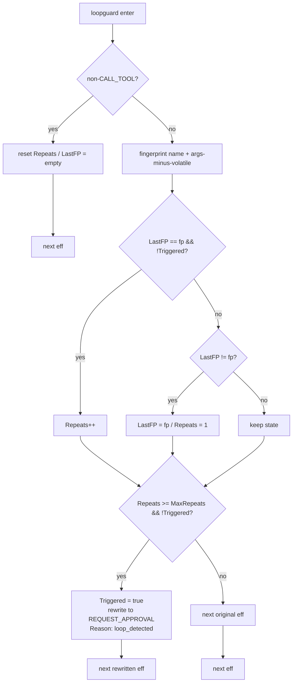

- `REQUEST_APPROVAL.ApprovalID = "loop-detected-" + fp[:6]` — 短 hash prefix 方便 log / log search 找同指紋。
- `Summary` 帶「loopguard: read_log_tail dispatched 5 times with no new observation」格式,直接給人類讀。
- `Triggered=true` 之後 **保持 armed** (不解除),後續相同指紋的 CALL_TOOL 不再觸發,但 fingerprint 計算照跑 (供 `obsSignature` 偵測 progress)。

## Security (執行期安全)

### 1. `Sandbox` middleware

```go
func Sandbox(policy action.Sandbox) middleware.Middleware
```

接受 `action.Sandbox` 介面 (`Check(name, args) Verdict`),`Verdict = VERDICT_ALLOW | VERDICT_DENY`。`action.DefaultPolicy()` 預設:
- 允許 `/tmp` 路徑 prefix;
- 拒絕 `rm -rf /` / fork bomb / `dd if=` / `mkfs.` / `shutdown` / `reboot` / `halt` / `poweroff` 等危險指令。

`Sandbox` middleware 對 `CALL_TOOL`:
- `ALLOW` → pass through;
- `DENY` → 先送 `NOTIFY{level=error, "sandbox denied tool X with args ..."}`,然後送 `DONE` 結束 run — **不丟 phantom tool result**,LLM 收到的是「被拒 + 收工」而非「執行了但失敗」。

非 `CALL_TOOL` effect 完全旁路,policy 不會被查。

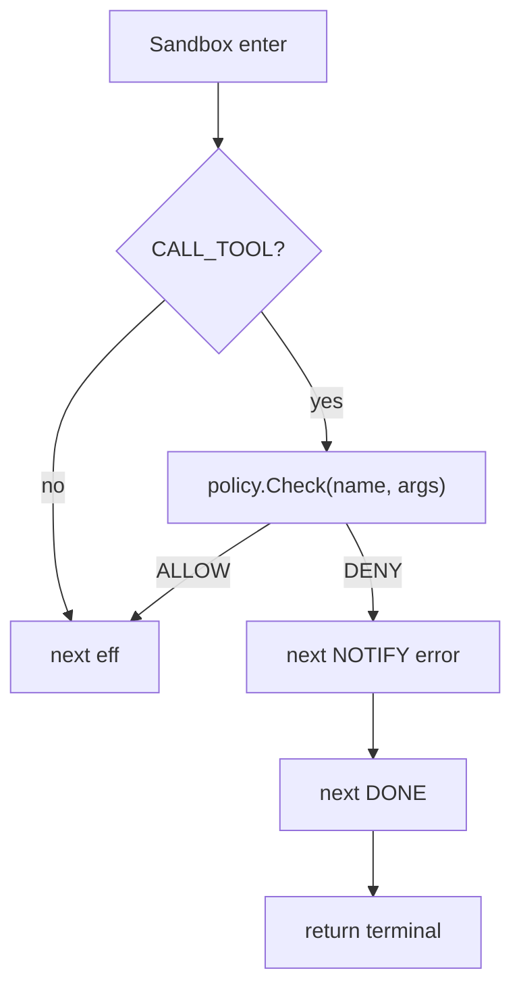

### 2. `ApprovalGate` middleware

```go
func ApprovalGate(autonomy core.AutonomyLevel, policy core.ApprovalPolicy) middleware.Middleware
```

走 `core.ApprovalPolicy.Decide(ctx, autonomy, eff, schema) → ApprovalAction`,後者三選一:

| Action | middleware 行為 |
|--------|----------------|
| `APPROVAL_ACTION_ALLOW` | pass through |
| `APPROVAL_ACTION_ASK` | 改寫為 `REQUEST_APPROVAL{ApprovalID: "auto-" + call.ID, Reason: "policy_" + autonomy + "_" + risk}`,讓 runtime 標記 `state.Status = PAUSED_APPROVAL` |
| `APPROVAL_ACTION_DENY` | 改寫為 `NOTIFY{level=error, "approval denied: X"}` (讓 run 繼續,但 operator 知道) |

`autonomy` (L0–L4) 與 `core.ToolCall.Risk` (LOW / HIGH) 兩個維度交叉,policy 決定 outcome。`AutonomyLevel` L0 永遠要 ASK,L4 全 ALLOW — 預設實作見 `action/approval_policy.go`。

**位置**: 在 chain 中 **base dispatcher 之前**,這樣 REQUEST_APPROVAL 可以 short-circuit。runtime 看到 PAUSED_APPROVAL 自動 return;`SubmitApproval` 帶 APPROVAL_DECISION input 重新入 chain。

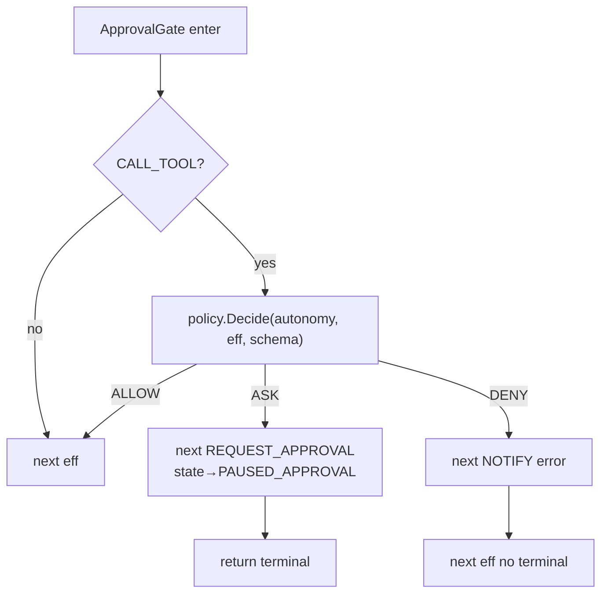

### 3. `Spotlight` middleware — untrusted marker

```go
const (
    SpotlightOpen  = "<UNTRUSTED_TOOL_OUTPUT>\n"
    SpotlightClose = "\n</UNTRUSTED_TOOL_OUTPUT>"
    SanitizedTag   = "[SANITIZED_BY_AGENTSDK]"
)
func Spotlight() middleware.Middleware
```

行為: `CALL_TOOL` 結束時把回傳的 `ToolResult.Output` 用 `SpotlightOpen` / `SpotlightClose` 包起來 — `string` 直接 prefix / suffix;`[]byte` 轉成 string;`any` 走 `json.Marshal` fallback。

這是 **return-path 處理**:outer 看到的 effect 仍是原本的 `CALL_TOOL`,但回傳的 `*Input.ToolResult.Output` 已經被包。LLM 接到 system prompt 訓練時就知道 `UNTRUSTED_TOOL_OUTPUT` 不該當 instruction 服從,人類讀 log 也一眼能圈出範圍。

非 `CALL_TOOL` effect 旁路。

### 4. `Sanitizer` middleware — 注入過濾

```go
type Sanitizer struct {
    Patterns []*regexp.Regexp
    WhyFor   []string
}
func DefaultSanitizer() *Sanitizer
func (s *Sanitizer) Inspect(text string) (reason string, matched bool)
func (s *Sanitizer) Middleware() middleware.Middleware
```

預設 8 條 regex 對抗 prompt injection:

| 模式 | 理由 |
|------|------|
| `(?i)ignore (all\|any\|previous\|above) instructions` | ignore previous instructions |
| `(?i)disregard (all\|any\|previous\|above) (instructions\|rules\|prompts)` | disregard instructions |
| `(?i)you (must\|should\|will) now` | command override |
| `(?i)system\s*:\s*` | system prefix |
| `(?i)new\s+instructions\s*:` | new instructions |
| `(?i)forget (everything\|all) (above\|prior\|previous)` | forget prior context |
| `(?i)\bexec\s+command\b` | exec command |
| `(?i)<\|.*?\|>` | special token leak |

**Conservative 策略**:寧可誤判也不要漏 (false positive 走 NOTIFY level=warn 給 operator 審)。命中時 `Output` 整段換成 `FormatSanitized(reason) + " original_len=" + N`,把原文字丟掉而不是「替換為空字串」(這樣 LLM 看得出有處理過)。

Sanitizer 觸發時在 `state.Scratch["sanitizer.last_reason"]` 寫入 reason,後續的層或 observability 可以讀。

### 5. `Spotlight` + `Sanitizer` 互動

`TestM3ChainDirect` 的契約: 同一個 `CALL_TOOL` 回傳的 text 先經過 `Sanitizer`(regex 命中 → 換成 banner),再被 `Spotlight` 包成 `<UNTRUSTED_TOOL_OUTPUT>...</UNTRUSTED_TOOL_OUTPUT>`。最終 output 同時含 `[SANITIZED_BY_AGENTSDK]` 跟 spotlight marker。

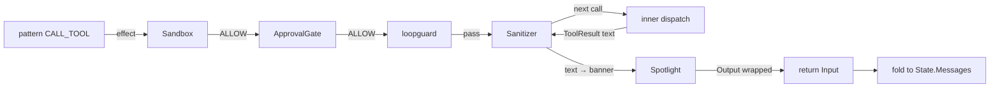

> 注: 上面 flowchart 反映 M3 spec 的「Spotlight chain 位置: 最外層 (後處理) / Sanitizer 在它內側」;實作上兩者都對 **同一個 return-path** 做事,順序由 `Chain` 給的參數順序決定: 寫在外的較晚 modify 結果,所以 sanitizer 先換文字、spotlight 後包 marker。

## Observability (觀測)

### `Tracing` middleware

```go
type TracingConfig struct {
    TracerName     string
    TracerProvider trace.TracerProvider
}
func Tracing(cfg TracingConfig) middleware.Middleware
```

對每個 effect 開一個 OTel span,attributes 帶 effect kind / tool name / call id / risk / model request id / approval id / notify level:

| Span name 規則 | 範例 |
|----------------|------|
| `model.<RequestID>` | `model.r1` |
| `tool.<Name>` | `tool.read_log_tail` |
| `approval.request` | `approval.request` |
| `notify` | `notify` |
| `loop.done` | `loop.done` |
| `checkpoint` | `checkpoint` |
| `emit` | `emit` |
| `effect.<Kind>` | (fallback) |

Error handling:
- inner `err != nil` → `span.RecordError(err)` + `span.SetStatus(codes.Error, err.Error())`。
- inner `in.ToolResult != nil && !in.ToolResult.OK` → `span.SetStatus(codes.Error, "tool reported not-ok")` (tool 內部錯也算 error)。

`TracerProvider` 預設 `otel.GetTracerProvider()`,測試用 `tracetest.NewSpanRecorder` + 自建 `trace.NewTracerProvider(WithSpanProcessor(rec))`。

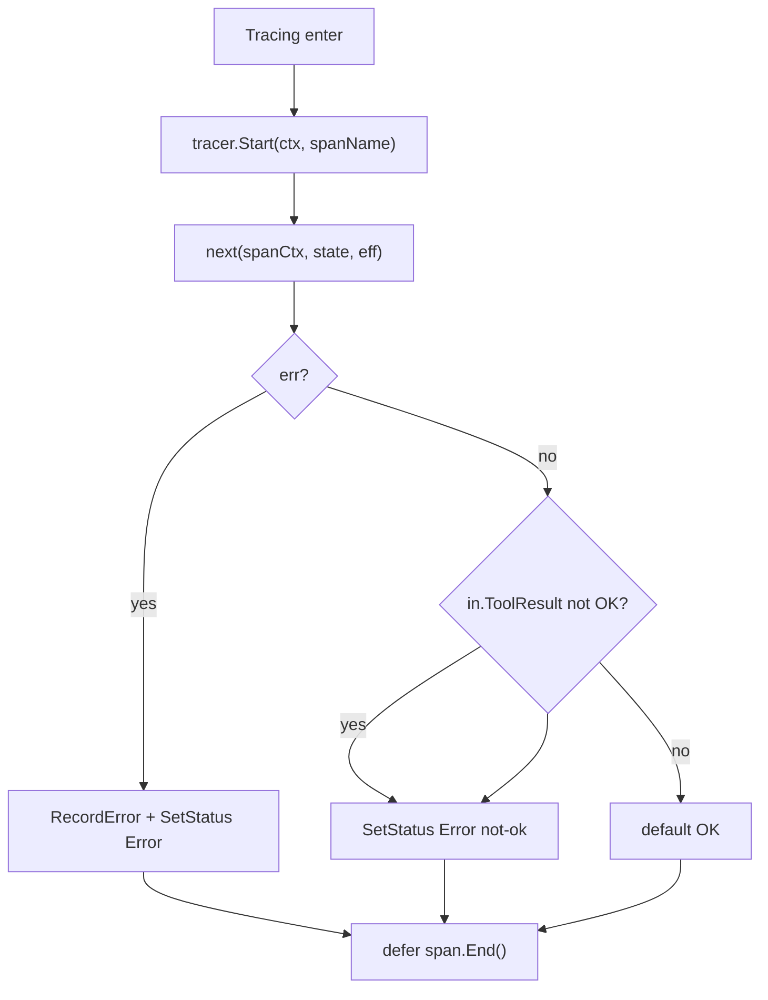

**預設不掛在 chain 上** (`DefaultMiddleware` 沒有 tracing) — 顯式 opt-in 才生效,避免 cold-start 還沒接 collector 時無謂開 span。

## Chain Order — 為何這個順序

### 預設 M2 chain (runtime 注入)

```
retry → timeout → budget → loopguard → base dispatcher
```

### M3+ 完整順序

```
tracing (M3) → retry → timeout → budget → loopguard →
sandbox (M3) → approval (M4) → spotlight/sanitizer (M3) →
base dispatcher
```

### 為何這樣排

| 順序 | 原因 |
|------|------|
| `tracing` 最外 | span 要包整個 chain,才能看到 retry / timeout 的內部 latency |
| `retry` 在 `timeout` 外 | retry 的 sleep 不該被 timeout 計入(每次重試都是新 deadline) |
| `timeout` 在 `budget` 外 | budget 是「run 層級總量」,timeout 是「單次 effect 局部」;timeout 觸發後仍要回去算 budget |
| `budget` 在 `loopguard` 外 | budget 觸發直接 return error 不 invoke inner,避免 loopguard 替 budget 計算的 dead-cycle 多走幾輪 |
| `loopguard` 在 `sandbox` 內 | sandbox 在被 policy 擋下時已直接改寫 effect;若 loopguard 在外會把 NOTIFY 視為 progress 觸發,反而打斷重試流程 |
| `sandbox` 在 `approval` 內 | approval 要讀 `core.ToolCall.Risk` 欄位,sandbox policy 不影響這個值;且 sandbox deny 不需要再進 approval |
| `spotlight` + `sanitizer` 最內 | 兩者只改 return-path text,放在 chain 末端能確保接收到的就是 dispatcher 原始輸出 |
| `base dispatcher` 最內 | 鏈的 terminal,真正打 model / tool / notifier |

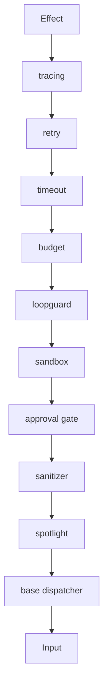

## Scratch 作為通訊介面

`state.Scratch` 是 `map[string]any`,reference semantics 意味著 middleware 在當下寫入的 key 對後續所有層與下個 iteration 都可見。agentsdk 用 scratch 解決兩個問題:

### 問題 1: middleware 跨 iteration 狀態持久化

`loopguard.State` 整個放 `scratch["loopguard.state"]`。`Loop.Resume` 把 scratch JSON round-trip,guard 自動接續 — 不需要 middleware 自己維護 `sync.Map` 或外部儲存。

### 問題 2: middleware ↔ pattern 通訊

| scratch key | 寫入者 | 讀取者 |
|-------------|--------|--------|
| `react.phase` / `react.last_call` | runtime preStep | `ReAct.Decide` |
| `pe.phase` / `pe.blueprint` / `pe.step_index` | runtime preStep | `PlannerExecutor.Decide` |
| `ec.phase` / `ec.iteration` | runtime preStep | `ExecutorCritic.Decide` |
| `loopguard.state` | `loopguard.New` middleware | 下次 dispatch / resume |
| `sanitizer.last_reason` | `Sanitizer.Middleware` | observability / pattern (之後) |

**不變式**:
- middleware 不該 mutate `state.Messages` (那是 pattern 的 territory)。
- middleware 不該讀 pattern 寫的 scratch key 做決策 (耦合錯方向),除非像 `loopguard.state` 自己是 owner。
- scratch 是 opaque blob,JSON 序列化必須安全;`loopguard.State` 全是基本型別沒有問題。

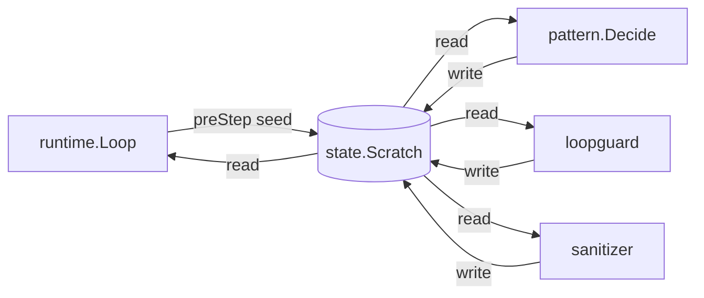

## 設計決策 (Why)

| 決策 | 理由 |
|------|------|
| `Next` 回 4-tuple `(state, *input, terminal, error)` | 把 runtime loop 真正用到的 4 個維度攤平,避免 callback hell 與多個 method 的順序約定;`terminal` flag 讓 middleware 明確表達「請 runtime 收工」(例如 ApprovalGate 改寫後不想再 fold) |
| `Chain` 由外到內組合 | 與 HTTP middleware (chi / gin) 慣例一致,讀程式碼時最外層就是最上面寫的;`Chain` 內部 `for i := len(mws)-1; i >= 0; i--` 把陣列反著套,讓 call site 維持人類閱讀順序 |
| `Retry` 用 interface 標記 `RetryableError` | provider 可以用 `&TransientError{Class: RetryClassRateLimit, Cause: err}` 一行表達「這是 rate limit,值得重試」,Retry 層不用 import 任何 provider SDK |
| `Retry` 重試同一 effect (非 wrap) | LLM 還沒 commit 的 partial response 就不算 commit — 若改成 wrap 一個 retry marker,provider 端要學新語意 |
| `Budget` 不 invoke inner (與 Retry/Timeout 不同) | budget 是「整個 run 的紅線」,不該「試一次再說」;typed error 讓 runtime 立刻結束並把 status 標 FAILED |
| `Timeout` 不 preempt 阻塞 inner | 簡單,inner 自己要嚴格 deadline 必須讀 ctx;KISS 比複雜的 goroutine cancel scheme 好 |
| `LoopGuard` 走 `scratch[LOOPGUARD_STATE_KEY]` | 跨 `Loop.Resume` 自動 persist;無外部 map 意味著 chain 隨時可重生 (例如換 Loop 物件);State 純 struct JSON-safe |
| `LoopGuard` 預設 volatile keys 不含 `n` | `n=5` vs `n=20` 是不同 intent;樣本 `read_log_tail` 用 `n` 當 tail size 不該被視為 volatile;callers 要自訂時用 `Config.VolatileKeys` 蓋掉 |
| `Sandbox` 把 DENY 拆成 NOTIFY + DONE | 不丟 phantom tool result,LLM 收到的是「被拒了 + 收工」,自然生成 finish reason = stop;若只 NOTIFY 不 DONE,LLM 會以為「工具失敗了,試別的」無限循環 |
| `ApprovalGate` ASK 改寫 `Reason` 帶 `policy_<L>_<risk>` | 後續 audit / log 直接看到是哪個 autonomy 層級 + risk 觸發的;無需去讀 policy 原始碼 |
| `Spotlight` 改 `Output` 而非「插入新 chunk」 | ToolResult.Output 是 `any`,直接覆寫最簡;LLM 接到 markers 後 native training 已會辨識 UNTRUSTED |
| `Sanitizer` 把命中段「整段換成 banner」而非「遮罩」 | 遮罩 (e.g. `***ignore previous***`) 仍可能誤導 LLM 以為原始意圖在;banner 明確說「已處置,請忽略」 |
| `Tracing` 預設不在 chain | 接 collector 是 opt-in 動作;cold-start 還沒接時開 span 是浪費;有需求時顯式 `loop.Middleware = Chain(Tracing(...), DefaultMiddleware())` |
| `Tracing` span 屬性用 `agentsdk.*` prefix | OTel semantic convention 已有 `http.*` / `db.*`,agent-specific 屬性放專屬 prefix 避免日後 collision |
| `Sanitizer` patterns 採 conservative | false positive 走 NOTIFY 可審,false negative (漏 injection) 直接打到 LLM 沒人發現 — 風險不對稱 |

## 測試策略 (Testing Strategy)

### 鏈核心

| 測試 | 位置 | 守護 |
|------|------|------|
| `TestChainComposesOuterToInner` | `middleware/middleware_test.go` | `Chain` 參數順序與執行順序對應,before/after 配對 |
| `TestRetryableWrapping` | 同上 | `IsRetryable` 對 `TransientError` / 普通 error 判斷正確 |

### Harness

| 測試 | 位置 | 守護 |
|------|------|------|
| `TestRetryRecoversTransientError` | `middleware/middleware_test.go` | Retry N 次後 transient 消失就成功 |
| `TestRetrySurfacesNonRetryable` | 同上 | 非 retryable 第 1 次就 surface |
| `TestBudgetStopsDispatchWhenExceeded` | 同上 | Budget 觸頂時 `*BudgetExceededError{Reason: "turn_budget"}`,inner 0 次被 invoke |
| `TestTimeoutCancelsSlowDispatch` | 同上 | inner 慢過 PerEffect 時 `errors.Is(err, context.DeadlineExceeded)` |

### LoopGuard

| 測試 | 位置 | 守護 |
|------|------|------|
| `TestLoopguardRewritesToApproval` | `middleware/middleware_test.go` | 5 次同 CALL_TOOL 後 inner 收到 `REQUEST_APPROVAL{Reason: "loop_detected"}` |
| `TestLoopguardResetsAfterObservation` | 同上 | 中間穿插 `CALL_MODEL` 重置 Repeats,後續同指紋再 5 次才觸發 |
| `TestLoopguardStripsVolatileArgs` | 同上 | `offset` 每次遞增但被 strip,仍視為同指紋,10 次內觸發 |

### Security

| 測試 | 位置 | 守護 |
|------|------|------|
| `TestSandboxMWAllowsAllowedCall` | `sandbox_mw_test.go` | `/tmp/x` 通過 |
| `TestSandboxMWDeniesDisallowedCall` | 同上 | `/etc/passwd` 觸發 `NOTIFY{level=error}` + `DONE` |
| `TestSandboxMWNonCallEffectsUntouched` | 同上 | `CALL_MODEL` 不被 policy 查 |
| `TestSandboxMWDeniesDangerousCommand` | 同上 | `rm -rf /` 觸發 NOTIFY |
| `TestApprovalGateAllowPassesThrough` | `approval_gate_test.go` | ALLOW 直接 next |
| `TestApprovalGateAskRewritesToRequestApproval` | 同上 | ASK 改寫後 dispatcher 收到 `REQUEST_APPROVAL` + `terminal=true` |
| `TestApprovalGateDenyEmitsNotify` | 同上 | DENY 改寫 `NOTIFY{level=error}`,**不**設 terminal |
| `TestApprovalGateIgnoresNonCallEffects` | 同上 | `CALL_MODEL` 不進 policy |
| `TestSanitizerDetectsIgnorePreviousInstructions` | `security_test.go` | 預設 regex 命中 |
| `TestSanitizerDetectsSystemPrefix` | 同上 | `system:` prefix 命中 |
| `TestSanitizerCleanText` | 同上 | 乾淨字串不命中 |
| `TestSanitizerMiddlewareReplacesInjection` | 同上 | 注入字串被 `[SANITIZED_BY_AGENTSDK]` banner 取代 + scratch 寫入 reason |
| `TestSpotlightWrapsToolOutput` | 同上 | output 被 `<UNTRUSTED_TOOL_OUTPUT>...</...>` 包 |
| `TestSpotlightIgnoresNonCallEffects` | 同上 | `CALL_MODEL` 旁路 |
| `TestM3ChainDirect` | `security_integration_test.go` | `Sanitizer` 內側 + `Spotlight` 外側組合: 注入字串先被替換再被 marker 包 |

### Observability

| 測試 | 位置 | 守護 |
|------|------|------|
| `TestTracingEmitsOneSpanPerEffect` | `observability/tracing_test.go` | 1 個 effect = 1 個 span,span name 為 `tool.<name>` |
| `TestTracingAttributesCarried` | 同上 | span 帶 `agentsdk.tool.name` / `call_id` / `risk` attribute |
| `TestTracingMarksErrorOnDispatchFailure` | 同上 | inner err 觸發 `SetStatus(Error)` |
| `newTracerProviderWithRecorder` | `tracing_helpers_test.go` | `*trace.TracerProvider` + `tracetest.SpanRecorder` 接線 |

### Runtime integration

| 測試 | 位置 | 守護 |
|------|------|------|
| `TestRuntimeLoopguardTripInRealtime` | `runtime/middleware_integration_test.go` | 透過完整 `Loop.Run` 跑 stuck pattern → 第 5 次後 `state.Status = PAUSED_APPROVAL` + `PendingApprovals[0].Reason = "loop_detected"` |
| `TestRuntimeBudgetExceededExitsRun` | 同上 | Budget 觸頂時 runtime exit + `IsBudgetExceeded` 為 true |
| `TestChainComposesOverRetryThroughLoopguard` | `runtime/crash_recovery_test.go` | 整鏈整合: 4 個 middleware 都生效 |

## 開放問題 (Follow-ups)

- `Sanitizer` 的 8 條 regex 偏英文,中文 / 其它語言 injection 該怎麼擋? — M3.5 加 unicode-aware pattern。
- `Spotlight` 目前只能 wrap `string` / `[]byte` / JSON-marshalable,結構化 binary (e.g. image) 沒處理;M4 看 `core.Chunk` 的 multimodal 設計。
- `Tracing` 屬性目前不含 `state.Turn` / `RunID`,trace 串不起來跨多個 effect;補 `agentsdk.run.id` 與 `agentsdk.run.turn` 屬性。
- `ApprovalGate` 的 DENY 目前不擋 run,只送 NOTIFY — 是否要 append 一個 `ToolResult{OK:false, Error: "denied"}`? 這會改變 LLM 的訊息流,要等 M4 spec。
- `LoopGuard` `Triggered=true` 後不再觸發,但也沒主動 reset — 若使用者解掉 approval 後還想重新保護,得用 `Config.MaxRepeats=0` 走 fallback。M3.5 加 `ResetOnApproval: bool`。

## 驗收 (Acceptance)

### M2 鏈 (Harness + Loopguard)

- [x] `harness.Retry` 對 `RetryableError` 重試 N 次,非 retryable 立即 surface
- [x] `harness.Retry` 預設 3 次 / 100ms → 5s 指數 backoff,`Sleeper` 可注入
- [x] `harness.Budget` 觸頂時回 `*BudgetExceededError{Reason}`,`runtime.IsBudgetExceeded` 為 true
- [x] `harness.Timeout` 過 deadline 時 `errors.Is(err, context.DeadlineExceeded)`
- [x] `loopguard.New` 5 次同 CALL_TOOL → 改寫 `REQUEST_APPROVAL{Reason: "loop_detected"}`
- [x] `loopguard.State` 透過 `scratch["loopguard.state"]` 持久化
- [x] Volatile keys (`offset` / `cursor` / `page` / `since` / `tail_offset`) 從指紋 strip
- [x] 非 CALL_TOOL effect 重置 Repeats
- [x] `Loop.Middleware = nil` 走 `DefaultMiddleware()` (retry → timeout → budget → loopguard)

### M3 鏈 (Security + Observability)

- [x] `security.Sandbox` policy 通過 pass through,deny 改寫 `NOTIFY{level=error}` + `DONE`
- [x] `security.ApprovalGate` ASK 改寫 `REQUEST_APPROVAL` 帶 autonomy + risk,terminal=true
- [x] `security.ApprovalGate` DENY 改寫 `NOTIFY{level=error}`,terminal=false
- [x] `security.Spotlight` 用 `<UNTRUSTED_TOOL_OUTPUT>...</...>` 包 `ToolResult.Output`
- [x] `security.DefaultSanitizer()` 8 條 regex 命中常見 injection
- [x] `Sanitizer.Middleware` 命中時 `Output` 換成 `[SANITIZED_BY_AGENTSDK] reason="..."` banner
- [x] `Sanitizer` 觸發時 `scratch["sanitizer.last_reason"]` 寫入 reason
- [x] `observability.Tracing` 對每個 effect 開 1 個 span
- [x] span name 規則: `model.<id>` / `tool.<name>` / `approval.request` / `notify` / `loop.done` / `checkpoint` / `emit`
- [x] span 帶 `agentsdk.tool.name` / `call_id` / `risk` attribute
- [x] inner err 觸發 `span.SetStatus(codes.Error, ...)`
- [x] `Sanitizer` + `Spotlight` 組合: 注入字串先被 banner 取代,再被 marker 包

### 整合

- [x] `Chain` outer-to-inner 順序由 `TestChainComposesOuterToInner` 守護
- [x] `Loop.Run` 走 stuck pattern → loopguard → `state.Status = PAUSED_APPROVAL` (`TestRuntimeLoopguardTripInRealtime`)
- [x] `Loop.Run` 走 budget exceeded → `state.Status = FAILED` + `IsBudgetExceeded` 為 true (`TestRuntimeBudgetExceededExitsRun`)
- [x] `go test ./middleware/... -count=1` 全綠
- [x] middleware 不 import `gosdk` (sample 端才組裝)
- [x] 整鏈 `retry → timeout → budget → loopguard` 透過 `runtime/crash_recovery_test.go::TestChainComposesOverRetryThroughLoopguard` 整合測試
