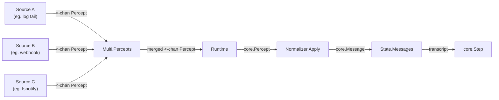
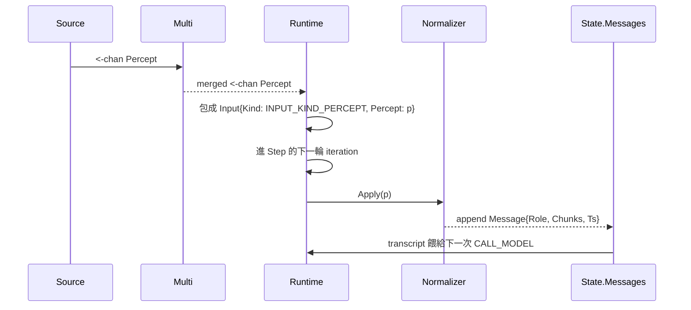

# Spec — perception/ 套件 輸入支柱 (Input Pillar)

> 對應里程碑: M1 (核心範式 + sample 骨架)
> 日期: 2026-07-07
> 範圍: `perception/` 套件 — `Source` 介面 + `Multi` fan-in + `Normalizer` + tests

## 目標

`perception/` 是 agent loop 的「輸入支柱 (input pillar)」:負責把外部世界的觀察 (log 行、webhook body、filesystem 事件) 統一成 `core.Percept`,再透過 `Normalizer` 轉成 LLM 看得懂的 `core.Message`。整個套件保持極小 — 只兩個檔案,純邏輯、無 I/O 副作用、不依賴 `gosdk`。



## 套件結構

| 檔案 | 角色 | 用途 |
|------|------|------|
| `source.go` | `Source` 介面 + `Multi` fan-in | 抽象外部觀察源,並把多源合併成單一 channel |
| `normalize.go` | `Normalizer` + `NormalizeFunc` | 把 `Percept.Payload` 轉成 `Message`,附掛到 transcript |
| `perception_test.go` | 測試 | table-driven + testify,守護 fan-in 與 default/custom 兩條 normalize 路徑 |

## 合約 (Contract)

### `Source` 介面

```go
type Source interface {
    Name() string
    Percepts(ctx context.Context) <-chan core.Percept
}
```

不變式:

- **穩定名稱 (Name)**:用於診斷 (例如 log 標頭、metrics label)。字串約定 `<type>:<locator>` (如 `logfile:/var/log/sys`)。
- **Channel close 語意**:Source 關閉自己的 channel 即代表「暫時沒有更多了」;runtime 讀到 close 就退出目前的 `for p := range ch`。
- **Context 取消**:Source 必須在 `ctx.Done()` 時停止發送 — 通常實作為 `select { case out <- p: case <-ctx.Done(): return }`。
- **不重啟 (no respawn)**:Source 不需要自己重連 — 那是上層 supervisor (sample) 的職責。

> 註:`core.Source` 介面在 `core/input.go` 是個「測試用的最小鏡像」(只有 `Percepts(ctx) <-chan Percept`),避免 `core/` 反向 import `perception/`。正式合約以 `perception.Source` 為準。

### `Multi` fan-in

```go
type Multi struct{ Sources []Source }
func (m *Multi) Percepts(ctx context.Context) <-chan core.Percept
func (m *Multi) Name() string // 回 "multi"
```

關鍵行為:

| 情境 | 行為 |
|------|------|
| `len(Sources) == 0` | 立刻 `close(out)`,回一個立即讀完的 channel |
| 任一 source 關閉其 channel | 該 goroutine 退出,但其他 goroutine 繼續,out **不**關閉 |
| **所有 source 都關閉** | `sync.WaitGroup` 歸零 → 額外 goroutine `close(out)` |
| `ctx.Done()` | 所有 per-source goroutine 收到 cancel,各自 return;`wg.Wait()` 通過後 `close(out)` |
| 跨 source 順序 | **best-effort** — 不保證 A 在 B 之前送達,因為 push 時機取決於 select 排程 |

實作細節:

- 每個 source 一個 goroutine + `wg.Add(1)` / `defer wg.Done()`。
- `out` channel 帶 buffer `32`,降低 source 間互相 head-of-line block 的機率。
- 一個獨立 goroutine `go func() { wg.Wait(); close(out) }()` 確保 close 一定在「所有 source 真的收完尾」之後 — 這是 M1 修正重點,不能用「任一 source close 就 close out」,否則 race。

### `Normalizer` 與 `NormalizeFunc`

```go
type NormalizeFunc func(p core.Percept) core.Message
type Normalizer struct {
    Fn      NormalizeFunc
    MaxSize int // 0 = unbounded
}
func (n *Normalizer) Apply(p core.Percept) core.Message
```

合約:

- **預設行為 (Fn 為 nil)**:把 `p.Payload` 強轉 string,產 `ROLE_USER` + 單一 `CHUNK_KIND_TEXT` chunk,`Ts = p.ObservedAt`。用於「最常見的字串 payload」零設定路徑。
- **自訂 Fn**:由 sample 提供 — 例如 logdoctor 把 `Payload` 渲染成 `ROLE_SYSTEM` 的 `[log] <line>` 格式,讓模型在 system context 看到「即時事件」而非「使用者訊息」。
- **`MaxSize`**:留作 transcript 容量上限 hook;M1 尚未實作裁切,僅保留欄位。實際裁切由 `memory/window.go` 在 fold 回 `state.Messages` 時負責。
- **單純的 (pure) 函式**:`Apply` 不寫狀態、不做 I/O — 給定同樣 `Percept` 必回同樣 `Message`(除 `Ts` 外 `Ts` 取自 `p.ObservedAt`,已經 deterministic)。

## 與 runtime 的銜接 (Where It Sits in the Loop)



注意 `perception/` 自己不直接寫 `State.Messages` — 那是 runtime 收到 `INPUT_KIND_PERCEPT` 後,在 dispatch effect 之間 fold 進去的職責。`Normalizer` 只負責「單一 Percept → 單一 Message」的純轉換。

## 測試覆蓋 (`perception_test.go`)

| 測試 | 守護 |
|------|------|
| `TestMultiFanOut` | 兩個 source (3 個 percept) 全部被收到,無漏接;用 `map[string]bool` 累積避免依賴順序 |
| `TestNormalizerDefault` | `Fn=nil` 時 `Payload` 是 string → `ROLE_USER` + 1 個 text chunk;`Ts` 跟 `ObservedAt` |
| `TestNormalizerCustom` | 自訂 Fn 把 `FATAL: oom` 渲染成 `[log] FATAL: oom` + `ROLE_SYSTEM` |

輔助工具:

- `testSource` struct:`Name() string` + `Percepts(ctx) <-chan core.Percept`,把所有預設 percept 先 push 進 buffered channel 然後 close,簡單重現「一發即結束」的 source 行為。

## 設計決策 (Why)

| 決策 | 理由 |
|------|------|
| `Source.Percepts` 回 channel,不回 slice/iterator | 多源、串流、長時間觀察都適配;close 信號原生支援 |
| `Multi` 用 `sync.WaitGroup`,不是「任一 close 就 close out」 | 避免「A 結束就誤判全部結束」導致丟失其他 source 的資料 (M1 修正重點) |
| `Multi` 不保證跨 source 順序 | 強保序需要 mutex + slice,犧牲 throughput;agent 不需要嚴格 global ordering,只要「所有 percept 都到」 |
| `Normalizer` 接受 `NormalizeFunc` 而非介面 | 函式即策略,符合 Go 慣例;sample 一個 closure 就能寫完,不必 struct boilerplate |
| 預設 Fn 把 `Payload` 當 string | 最常見的 case (log line) 零設定;其他型別自然走自訂 Fn |
| `MaxSize` 留欄位不實作 | transcript 容量控制屬 `memory/window.go` 職責,不在 perception 層;先佔位避免介面 churn |
| `core/input.go` 有個 `Source` 鏡像介面 | 避免 `core/` 反向 import `perception/`(守護 `core/` 純 stdlib 原則);`perception.Source` 才是正約 |
| 整個套件不 import `gosdk` | 守護「SDK 核心無外部依賴」,`gosdk` wiring 只在 sample 組合根 (M2 之後) |

## 開放問題 (Follow-ups, 留待 M3/M4)

- `Multi` 沒有 backpressure 策略 — 若 consumer 慢,buffer 滿了會 block 在 `out <- p` (但已有 `ctx.Done()` 出口)。M3 可以加 `semaphore` 或動態 drop-oldest。
- `Normalizer.MaxSize` 還沒實作裁切 — 何時補? 屬 `memory/window.go` 的 SLIDING-WINDOW 策略,還是 per-source 各自 cap? 待 M2 memory 收斂後再決定。
- 多源時的 attribution:目前 `Percept.Source` 是字串,但寫進 `Message` 後就丟了 — 若模型需要回頭追溯「這則 message 來自哪個 stream」,M4 可加 metadata chunk。
- 是否要 `Source.SetRisk` 介面,把風險標註推到 source 端 (例如 tail 機密 log 視為 `RISK_LEVEL_HIGH`)? 目前所有 source 都預設 low。

## 驗收 (Acceptance)

- [x] `go test ./perception/... -count=1` 全綠 (3 個 case)
- [x] `Multi` 對空 `Sources` / 1 個 / 多個 source 都能正確 close
- [x] `Normalizer` default / custom 兩條路徑都驗證
- [x] 不 import `gosdk`
- [x] `sync.WaitGroup` close 行為有測試守護 (M1 修正重點)
