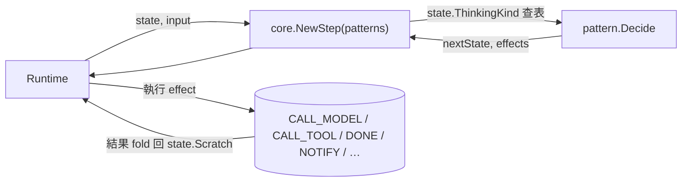
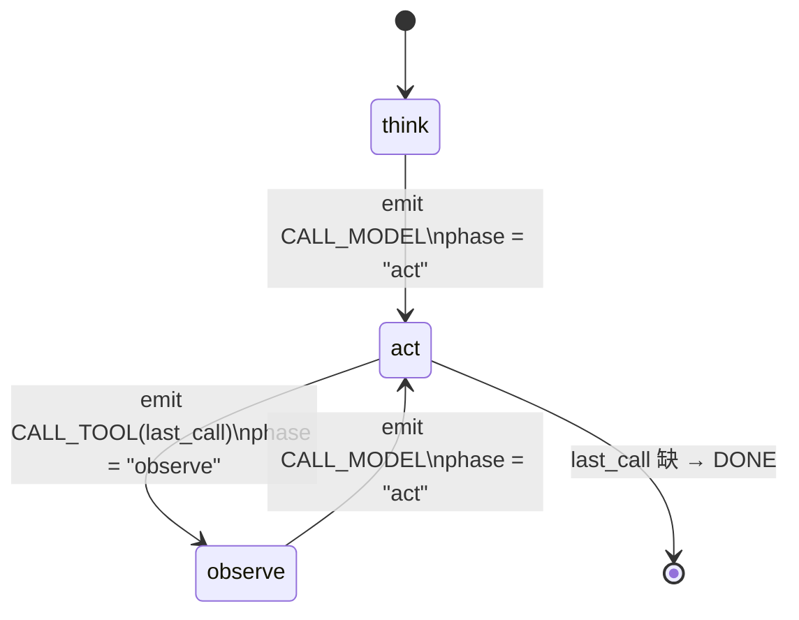
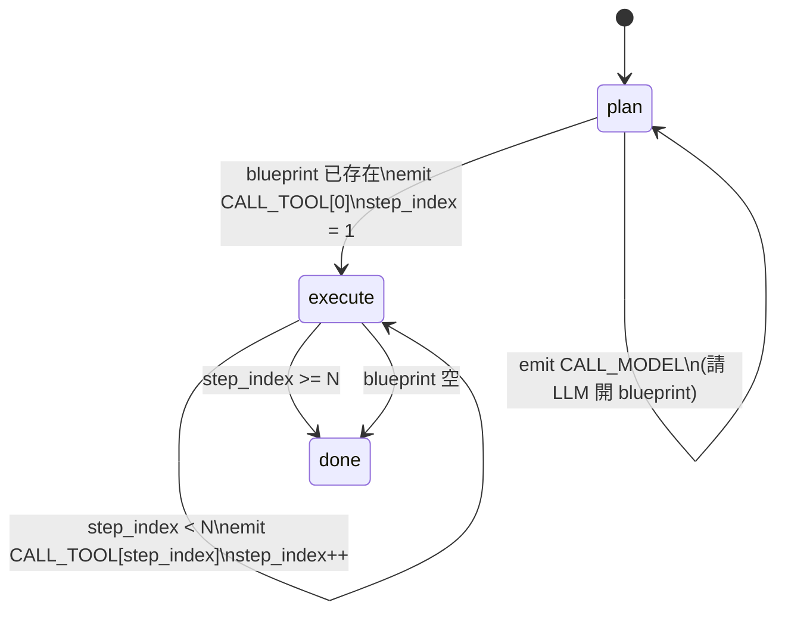
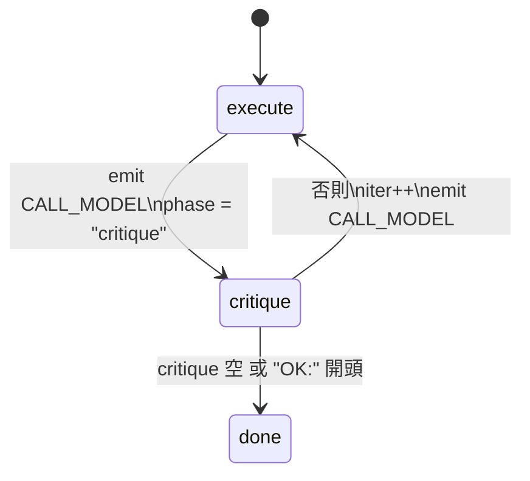

# Spec — planning/ 套件 6 個 ThinkingPattern 實作

> 對應里程碑: M1 (核心範式 + sample 骨架)
> 日期: 2026-07-07
> 範圍: `planning/` 套件 — 6 個 `ThinkingPattern` + helpers + tests

## 目標

實作 `core.ThinkingPattern` 介面,提供 6 種「思考模式 (thinking pattern)」的純函式 reducer。Pattern 只決定「下一步要做什麼」,不實際執行 I/O;runtime 收到 effect 後負責 dispatch 並把結果 fold 回 `State.Scratch`。



## 套件結構

| 檔案 | Pattern | 狀態 | 用途 |
|------|---------|------|------|
| `react.go` | `ReAct` | ✅ 完整 | 經典 Reason → Act → Observe 三相 FSM |
| `planner_executor.go` | `PlannerExecutor` | ✅ 完整 | 先請 LLM 開 blueprint,再逐步執行 |
| `executor_critic.go` | `ExecutorCritic` | ✅ 完整 | Execute → Critique;不通過就 iterate |
| `cot_singleshot.go` | `COTSingleshot` | 🟡 STUB | 一次 `CALL_MODEL` + `DONE` |
| `reflexion.go` | `Reflexion` | 🟡 STUB | 一次 `CALL_MODEL` + `DONE` |
| `router.go` | `Router` | 🟡 STUB | `NOTIFY(warn)` + `DONE` |
| `helpers.go` | — | ✅ | scratch 讀寫 / Effect 建構 / id / time helper |
| `planning_test.go` | — | ✅ | table-driven + testify |

## 合約 (Contract)

每個 pattern 都滿足 `core.ThinkingPattern`:

```go
type ThinkingPattern interface {
    Kind() ThinkingKind
    Decide(state State) (State, []Effect)  // 純函式,no I/O
}
```

不變式 (invariants):

- **無 I/O**: `Decide` 內不能呼叫 model / tool / network / clock 副作用。
- **決定論**: 給定 `(state, scratch)` 必須回同樣結果 (除 `time.Now` 戳記外)。
- **State 值傳遞**: 回傳 `state.Clone()`,不 in-place mutate 傳入的 `State`(雖然 Go 值語意自然保險,但要明確 clone 才能寫 scratch)。
- **Scratch 跨迭代**: `state.Scratch` 是 `map[string]any` reference — pattern 把 bookkeeping 寫回 scratch,下一輪 `Decide` 自然讀到 (這也是 pattern ↔ runtime ↔ middleware 的通訊介面)。
- **0 effect 視為 stuck**: 當前 6 個 pattern 至少回 1 個 effect (DONE 也算);M2 loopguard 會攔下「pattern 沒動作」的狀態。
- **預設 fallback**: 任何未識別的 phase 值會回 `DONE` — fail-closed,避免無限循環。

## 完整實作 (3)

### 1. `ReAct` — think → act → observe

Scratch 鍵:

| 鍵 | 型別 | 用途 |
|----|------|------|
| `react.phase` | string | `think` / `act` / `observe` |
| `react.last_call_id` | (隱式 — `react.last_call` 為 `ToolCall`) | 下一步要 dispatch 的 tool call |

FSM:



特殊處理:

- `act` 階段若 scratch 沒 `REACT_LAST_CALL` → 直接 `DONE` (沒事可做就結束)。
- **不解析模型輸出**: pattern 不讀 `ModelResult`,純靠 scratch 推進 — 這是 runtime ↔ pattern 的邊界契約。Sample / fixture 用 `SeedAct(s, call)` 顯式塞 call 來推進。

### 2. `PlannerExecutor` — plan → execute → done

Scratch 鍵:

| 鍵 | 型別 | 用途 |
|----|------|------|
| `pe.phase` | string | `plan` / `execute` / `done` |
| `pe.blueprint` | `[]ToolCall` | LLM 開出的有序步驟清單 |
| `pe.step_index` | int | 下一個要執行的 index |

FSM:



- `SeedBlueprint(blueprint)` 跳過 LLM 開計畫階段,直接進 `execute` 從 step 0 開始 (測試 / fixture 用)。
- 走完最後一步仍會發 `CALL_TOOL` 然後 step_index 超過,下一輪才轉 `done`。

### 3. `ExecutorCritic` — execute → critique → iterate / done

Scratch 鍵:

| 鍵 | 型別 | 用途 |
|----|------|------|
| `ec.phase` | string | `execute` / `critique` / `done` |
| `ec.critique_text` | string | 上一輪 critique 內容;`OK:` 開頭視為通過 |
| `ec.iteration` | int | 已 iterate 幾輪 |

FSM:



- `hasOKPrefix` 認字首三字 `"OK:"` (cheap predicate);`SeedCritiqueOK(s, text)` 會自動加 prefix。
- **無 hard cap**: iteration 數由 caller 透過 `state.Budget` 控管 (M2 Budget middleware),pattern 自己不擋。

## STUB 實作 (3)

`COTSingleshot` / `Reflexion` / `Router` 都是「介面合規 + 不 panic」的佔位,等後續里程碑補:

- `COTSingleshot` / `Reflexion`:固定吐 `CALL_MODEL` 後接 `DONE`。
- `Router`:多吐一個 `NOTIFY{level: "warn", message: "router pattern is a STUB; emitting DONE"}`,方便從 log 識別。
- STUB 必須有 `DONE` 才有合法 termination — `planning_test.go::TestStubPatternsDoNotPanic` 驗證此契約。

## `helpers.go` 共用工廠

集中放 pattern 共用的純工具,避免每個檔案重複:

| 函式 | 用途 |
|------|------|
| `nowOrZero(state)` | UpdatedAt 戳記;零值用 `time.Now().UTC()`,測試可換 clock (M2 從 `Budget.NowFunc` 注入) |
| `scratchString / scratchInt / scratchCall / scratchBlueprint` | 帶型別斷言的 scratch 讀取器;缺 key 回 default |
| `scratchSet` | lazy init `state.Scratch` map |
| `callModelFromMessages(state)` | 建 `EFFECT_CALL_MODEL` effect,統一帶新 `RequestID` |
| `callToolEffect(call)` | 建 `EFFECT_CALL_TOOL` effect |
| `doneEffect()` | 建 `EFFECT_DONE` effect |
| `newID / formatUint` | process-local uint64 計數器產 id;不依賴外部套件 |

> `newID` 採 uint64 自增,deterministic 測試可直接寫死 `RequestID` 比對,不依賴時鐘或隨機源。

## 測試覆蓋 (`planning_test.go`)

- `ReAct` 三相各一個 case:
    - `TestReactFirstThinkEmitsCallModel` — 預設 phase 為 `think`,吐 `CALL_MODEL` 並把 scratch 推到 `act`。
    - `TestReactActEmitsCallTool` — `SeedAct` 後吐 `CALL_TOOL`,帶正確 `call.ID` / `call.Name`。
    - `TestReactObserveEmitsCallModel` — `observe` 吐 `CALL_MODEL` 回到 `act`。
- `PlannerExecutor`:
    - `TestPlannerExecutorSkipsToExecuteWhenBlueprintSeeded` — `SeedBlueprint` 後直接從 step 0 開始,`step_index` 推到 1。
    - `TestPlannerExecutorEmitsDONEWhenBlueprintExhausted` — index 超出長度,轉 `DONE`。
- `ExecutorCritic`:
    - `TestExecutorCriticOKCritiqueEmitsDONE` — `SeedCritiqueOK` 走 `DONE`。
    - `TestExecutorCriticRejectCritiqueEmitsCallModel` — reject 後回 `execute`、iter 推進。
- 三個 STUB 走 table-driven (`TestStubPatternsDoNotPanic`):`Kind()` 對、`Decide` 不空、必含 `DONE`。

## 設計決策 (Why)

| 決策 | 理由 |
|------|------|
| Pattern 不解析模型輸出 | runtime 在 dispatch `CALL_MODEL` 拿到 `ModelResult` 後,把 tool call 寫回 scratch 再呼叫下一次 `Decide`。Pattern 純函式因此「給定 scratch 就能預測 effect」,WAL replay 也能 re-derive |
| 預設 `DONE` fallback | fail-closed — 未知 phase 寧可停,不要無限循環 |
| 沒有 iteration hard cap 在 ExecutorCritic | 該職責屬 `core.Budget` (由 runtime / middleware 強制);pattern 只負責 state transition |
| `Router` STUB 加 `NOTIFY` | 從 log/notify 一眼看出是 STUB,不是真的 router 決策結果,避免誤判 |
| helpers 集中在 `helpers.go` | 6 個檔案共用 scratch 操作 + effect 建構,各自重複會失同步 |
| `newID` 不引入外部 uuid | process-local counter 足夠,免去 `crypto/rand` / `uuid` 依賴污染 `core/` 的「純 stdlib」原則 |
| `Seed*` 函式 export | 測試 / sample 顯式驅動 FSM,不必每次都走 fake model round-trip |

## 開放問題 (Follow-ups, 留待 M3/M4)

- `COTSingleshot` 何時補? — 需先確認 CoT prompt 模板該放在 SDK 還是 sample。
- `Reflexion` 需要記憶體基礎設施 (`memory/` 已有) — 實作時要決定 reflection 寫入哪個 window / scratch。
- `Router` 需要子 agent registry 機制 — 屬 `action/` 的 `ToolSource` 動態註冊那一波。
- 是否要把 scratch 鍵集中成 typed struct (`type reactScratch struct{ Phase string; LastCall ToolCall }`) — 現況用字串 key 簡單但容易打錯,等 pattern 數量再翻倍時再考慮。

## 驗收 (Acceptance)

- [x] `go test ./planning/... -count=1` 全綠 (8 個 case + 1 個 table-driven STUB 群組)
- [x] 6 個 pattern 都有 `Kind()` 對應到 `core.ThinkingKind` 常數
- [x] 3 個完整 pattern 都有對應的 `Seed*` helper 供測試驅動
- [x] STUB pattern 必含 `DONE` (測試守護)
- [x] 不 import `gosdk` (守護 `core/` 純 stdlib 原則的延伸)
- [x] `helpers.go` 的 `newID` / `nowOrZero` 不引入時鐘或隨機外部源
