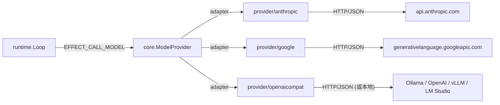
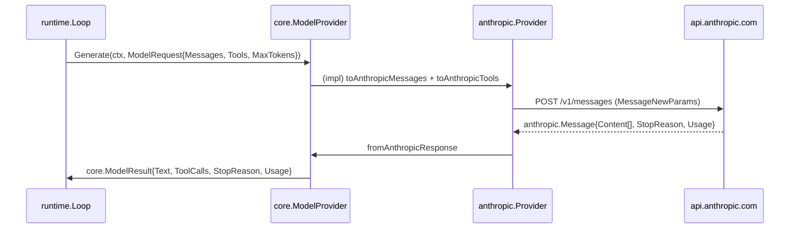
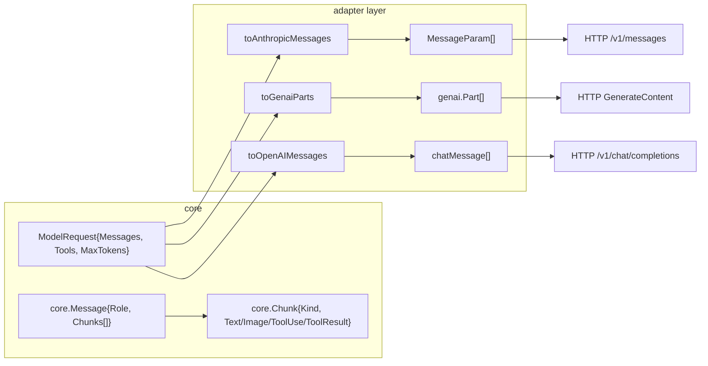
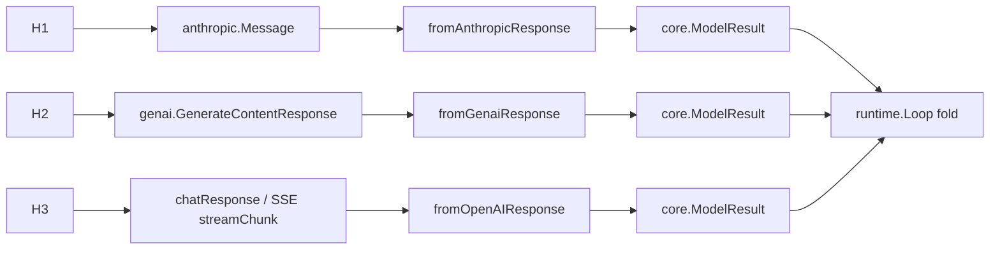

# Spec — `provider/` 三模組實作 (Anthropic / Google / OpenAI-Compat)

> 對應里程碑: M4 (架構解耦 + HITL + 三 provider)
> 日期: 2026-07-07
> 範圍: `provider/anthropic/`、`provider/google/`、`provider/openaicompat/` — 三個獨立 go.mod 模組,各自實作 `core.ModelProvider`

## 目標 (Goal)

`core` 套件定義了純 stdlib 的 `ModelProvider` 介面,但 LLM 廠商 SDK 都是帶外部依賴的厚重客戶端 (Anthropic / Google GenAI SDK 都是數 MB 的 module graph)。把這些依賴直接拉進 root `agentsdk` 模組會:

- 污染下游使用者的 `go.mod`(不該用 Claude 也要被迫 compile anthropic-sdk-go 整個 transitive closure)。
- 讓 SDK 失去「純 stdlib 可發佈」的特性,違反 `core/` 的設計初衷 (見 `CLAUDE.md` 慣例)。

`provider/` 三模組的職責是 **adapter 層 (adapter layer)**:把 `core.ModelRequest` / `core.Message` / `core.ToolSchema` 翻譯成廠商 API,把回應折回 `core.ModelResult` / `core.ModelChunk`。每個 provider 是一個獨立 go.mod,使用方按需 import。



## `core.ModelProvider` 介面

介面定義在 `core/port.go`:

```go
type ModelProvider interface {
    Name() string
    Generate(ctx context.Context, req ModelRequest) (ModelResult, error)
    Stream(ctx context.Context, req ModelRequest) (<-chan ModelChunk, error)
    CountTokens(ctx context.Context, msgs []Message) (int, error)
}

type ModelRequest struct {
    Messages   []Message    `json:"messages"`
    Tools      []ToolSchema `json:"tools,omitempty"`
    MaxTokens  int          `json:"max_tokens,omitempty"`
    StopReasons []string    `json:"stop_reasons,omitempty"`
}
```

四個方法的契約:

| 方法 | 契約 |
|------|------|
| `Name()` | 回 `"<廠商>:<model>"` 形式,用於 log / WAL 標記 |
| `Generate()` | 阻塞,回完整 `ModelResult` (含 `Text` / `ToolCalls` / `StopReason` / `Usage`) |
| `Stream()` | 回 buffered channel,內部 goroutine fold 成 `ModelChunk` 串,最後一塊 `Done=true` |
| `CountTokens()` | 盡量準確;無 SDK 直接支援時退回 `chars/4 + 1` 啟發式 |

> `ModelRequest` 內 `Messages` / `Tools` 都用 `core` 自有型別 (`Message` / `Chunk` / `ToolSchema`)。provider 內部負責把 `Chunk{Kind:IMAGE/AUDIO/TOOL_USE/TOOL_RESULT}` 翻成對應廠商格式。

## 三 Provider 總覽 (Provider Comparison Table)

| 面向 | `anthropic` | `google` | `openaicompat` |
|------|-------------|----------|----------------|
| 模組路徑 | `provider/anthropic` | `provider/google` | `provider/openaicompat` |
| 外部 SDK | `anthropic-sdk-go v1.50.2` | `google.golang.org/genai v1.62.0` | **stdlib only** (`net/http`) |
| 預設模型 | `claude-3-5-sonnet-latest` | `gemini-2.0-flash` | `llama3.2` |
| 預設 base URL | (SDK 內建) | (SDK 內建) | `http://localhost:11434/v1` (Ollama) |
| 預設 API key 來源 | `ANTHROPIC_API_KEY` | `GOOGLE_API_KEY` | `OPENAI_API_KEY` (可空) |
| 構造簽名 | `New(opts...)` | `New(ctx, opts...)` | `New(opts...)` |
| Options | `WithAPIKey` / `WithModel` / `WithBaseURL` | `WithAPIKey` / `WithModel` | `WithAPIKey` / `WithModel` / `WithBaseURL` |
| 串流 (streaming) | SDK 原生 (但當前以 Generate 折成 chunk) | SDK 原生 (同上) | 手寫 SSE parser |
| 工具呼叫格式 | `tool_use` / `tool_result` blocks | `FunctionCall` / `FunctionDeclaration` | OpenAI `tool_calls` 陣列 |
| 多模態 (multimodal) | Text / tool_result (image 未實作) | Text / **Image** (inline bytes) | Text only |
| Token count | Heuristic (chars/4+1) | Heuristic (chars/4+1) | Heuristic (chars/4+1) |
| 測試方式 | env 有 key 才跑 (結構 + heuristic) | env 有 key 才跑 (結構 + heuristic) | `httptest.NewServer` 完整 round-trip |
| 模組依賴大小 | 重 (anthropic-sdk-go transitive ~12 套) | 重 (genai transitive ~15 套) | **0** 外部依賴 |
| 狀態 | ✅ 完整 | ✅ 完整 | ✅ 完整 |

## Anthropic Provider

### SDK 與結構

- 套件: `github.com/anthropics/anthropic-sdk-go` (官方 SDK)
- 進入點: `Provider{ client anthropic.Client; model anthropic.Model }`
- 建構: `New(opts...)`,若 `cfg.apiKey == ""` 退回 `os.Getenv("ANTHROPIC_API_KEY")`,兩者皆空就回 error

### 訊息翻譯 (`toAnthropicMessages`)

`core.Message` → `[]anthropic.MessageParam` 的規則:

| `core.Role` | Anthropic `Role` |
|-------------|------------------|
| `ROLE_USER` | `MessageParamRoleUser` |
| `ROLE_ASSISTANT` | `MessageParamRoleAssistant` |
| `ROLE_SYSTEM` / `ROLE_TOOL` | (合併進 user role,經由 `Text` block) |

每個 `Chunk` 翻成對應 `ContentBlockParamUnion`:

| `core.Chunk.Kind` | Anthropic block |
|--------------------|-----------------|
| `CHUNK_KIND_TEXT` | `NewTextBlock(c.Text)` (空字串跳過) |
| `CHUNK_KIND_TOOL_RESULT` | `NewToolResultBlock(callID, outputString, isError)` |
| `CHUNK_KIND_TOOL_USE` / `CHUNK_KIND_IMAGE` / `CHUNK_KIND_AUDIO` | (未實作,目前略過) |

> `ToolResult.Output` 經 `stringify` helper 強制轉字串 (Anthropic 的 `tool_result` block 規定 payload 為 string)。非字串值走 `json.Marshal` 編碼。

### 工具翻譯 (`toAnthropicTools`)

`core.ToolSchema` → `[]anthropic.ToolUnionParam`:

```go
anthropic.ToolUnionParam{
    OfTool: &anthropic.ToolParam{
        Name:        s.Name,
        Description: anthropic.String(s.Description),
        InputSchema: anthropic.ToolInputSchemaParam{
            Properties: inputSchema,  // json.RawMessage 或 generic
        },
    },
}
```

若 `s.Parameters` 是 `json.RawMessage` 直接轉 `any` 給 SDK,否則 fall through。`InputSchema` 採 `Properties` 而非完整 schema 物件 — Anthropic 對 top-level `type: object` 有內建預設。

### 回應翻譯 (`fromAnthropicResponse`)

`anthropic.Message` → `core.ModelResult`:

- `StopReason` 直接轉字串 (`end_turn` / `tool_use` / `max_tokens`)
- `Usage` 從 `InputTokens` / `OutputTokens` 折成 `TokenUsage`
- 遍歷 `resp.Content`:
    - `Type == "text"` → 累加進 `out.Text`
    - `Type == "tool_use"` → `json.Unmarshal(block.Input, &argsMap)`,append `ToolCall{ID, Name, Args}`

### 串流 (`Stream`)

當前實作:goroutine 包 `Generate()`,把 `mr.Text` 切成單一 text chunk + `Done:true`。**未使用** SDK 的原生 SSE streaming event hook (e.g. `client.Messages.NewStreaming`),M5+ 可升級。

### 測試策略

| 測試 | 策略 |
|------|------|
| `TestNewRequiresAPIKey` | `t.Setenv("ANTHROPIC_API_KEY", "")` + 預期 error |
| `TestGenerateAgainstFakeServer` | env 有 key 時建構 + `Name()` + `CountTokens` heuristic;`-short` 時 skip |
| `TestGenerateWithOption` | `WithAPIKey("sk-direct")` 直接指定,確認可建構 |

> **不 mock SDK transport**:要走真實的 anthropic-sdk-go HTTP layer 必須有真實 key 或複雜的 transport interceptor;成本不划算。M4 採「有 key 才跑、沒 key 只驗結構 + heuristic」策略。

## Google Provider

### SDK 與結構

- 套件: `google.golang.org/genai` (官方 Google GenAI Go SDK)
- 進入點: `Provider{ client *genai.Client; model string }`
- 建構: `New(ctx, opts...)` — **比其他 provider 多收 `ctx`**,因為 `genai.NewClient` 是 context-aware 的 (背景背景探測 / auth token 取得)
- API key 預設 `GOOGLE_API_KEY`,可 `WithAPIKey` 覆寫

### 訊息翻譯 (`toGenaiParts`)

> **簡化策略**:把 `core.Message` 切片 (system / user / assistant / tool) **全部**攤平成一個 user `genai.Content` 下的 `Parts` 陣列。原因:Gemini 對話 API 在「一次 `GenerateContent` 呼叫」內把多輪歷史折成 parts 列表最直觀。

| `core.Chunk.Kind` | Gemini `genai.Part` |
|--------------------|---------------------|
| `CHUNK_KIND_TEXT` | `genai.NewPartFromText(c.Text)` |
| `CHUNK_KIND_IMAGE` | `genai.NewPartFromBytes(c.Image, mime)` (MIME 缺省 `image/png`) |
| `CHUNK_KIND_AUDIO` | (未實作) |
| `CHUNK_KIND_TOOL_USE` / `CHUNK_KIND_TOOL_RESULT` | (未實作) |

> 三 provider 中,只有 Google 走 native **multimodal image** 傳輸路徑 — `CHUNK_KIND_IMAGE` 真的被 forward 出去。

### 工具翻譯 (`toGenaiTools`)

`core.ToolSchema` → `[]*genai.Tool`:

```go
&genai.Tool{
    FunctionDeclarations: []*genai.FunctionDeclaration{{
        Name:        s.Name,
        Description: s.Description,
        Parameters:  mustSchemaToGenaiSchema(s.Parameters),
    }},
}
```

> Gemini 的 `Tool` 結構是「一個 Tool 內含多個 FunctionDeclaration」,採 1-to-1 對應 (一個 core.ToolSchema = 一個 FunctionDeclaration 包進一個 Tool)。

### Schema helper (`mustSchemaToGenaiSchema` / `json_helpers.go`)

- 將 `core.ToolSchema.Parameters` (JSON Schema object) → `*genai.Schema`
- 若是 `[]byte` (json.RawMessage) → `json.Unmarshal` 成 `genai.Schema`
- 失敗或 nil → 退回 `&genai.Schema{Type: "OBJECT"}` 空 schema

> `json_helpers.go` 獨立檔,避免 `provider.go` 頂部直接 import `encoding/json`。

### 回應翻譯 (`fromGenaiResponse`)

`genai.GenerateContentResponse` → `core.ModelResult`:

- `UsageMetadata` → `TokenUsage{PromptTokenCount, CandidatesTokenCount, TotalTokenCount}`
- 遍歷 `resp.Candidates` → `Candidate.Content.Parts`:
    - `p.Text != ""` → 累加進 `out.Text`
    - `p.FunctionCall != nil` → append `ToolCall{ID: Name, Name, Args}` (注意: Gemini 的 FunctionCall 沒有獨立 ID,暫用 Name 充當)
- `cand.FinishReason` → `out.StopReason`

### 串流 (`Stream`)

同 Anthropic,當前以 `Generate()` 結果切單一 text chunk + Done。**未用** SDK 的 `GenerateContentStream`。

### 測試策略

| 測試 | 策略 |
|------|------|
| `TestNewRequiresAPIKey` | `t.Setenv("GOOGLE_API_KEY", "")` + 預期 error |
| `TestNewWithOption` | `WithAPIKey("AIza-test")` 建構 + `Name()` |
| `TestCountTokens` | heuristic 在非空 transcript 上回正值 |

> 同 Anthropic,無真實 key 不打實際 round-trip。M5+ 有 key 時可手動驗。

## OpenAI Compat Provider

### 為什麼獨立 SDK-free?

`openaicompat` 唯一**不依賴任何外部 SDK** 的 provider — 純 `net/http` + `encoding/json`。理由:

- 目標服務廣(OpenAI 官方 / Ollama / LM Studio / vLLM / Together / Groq… 全部走 `/v1/chat/completions` 介面),每家 SDK 都綁死自家特徵
- 協定簡單:一個 `POST /chat/completions` JSON request,JSON response;streaming 是 SSE
- 零依賴 = `provider/openaicompat` 的 `go.mod` 只有 `agentsdk` + `testify`,任何使用方拉這個 module 都不會被迫 compile 廠商 SDK

### 結構

- 進入點: `Provider{ baseURL, apiKey, model string; client *http.Client }`
- `http.Client.Timeout = 120s`
- `baseURL` 預設 `http://localhost:11434/v1` (Ollama 預設);env `OPENAI_BASE_URL` 可覆寫
- `apiKey` 預設 `OPENAI_API_KEY`;**可空字串** (本機 Ollama 不需 key)

### HTTP DTOs (`provider.go` 內私有型別)

| 型別 | JSON shape | 用途 |
|------|-----------|------|
| `chatRequest` | `{model, messages, max_tokens, stream, tools}` | 對 `/chat/completions` 的 request body |
| `chatMessage` | `{role, content, tool_calls, tool_call_id, name}` | 訊息 DTO |
| `toolCall` | `{id, type, function:{name, arguments}}` | 工具呼叫 (arguments 為 JSON 字串) |
| `toolDef` | `{type, function:{name, description, parameters}}` | 工具 schema |
| `chatResponse` | `{choices:[{message, finish_reason}], usage}` | 非串流回應 |
| `streamChunk` | `{choices:[{delta:{content}}]}` | 串流中的單一 SSE event |

> DTO 用 `toolCall.Function.Arguments` (string) 而非 `map[string]any` — OpenAI 規範要求 arguments 是 JSON-encoded string,各家相容端點都遵守。

### 訊息翻譯 (`toOpenAIMessages` / `flattenMessage`)

- `core.Role` → `user` / `system` / `assistant` / `tool`
- 用 `flattenMessage` 把同 role 的多 chunk 折成:
    - 累加所有 `CHUNK_KIND_TEXT` 成單一 `Content` 字串
    - 收集所有 `CHUNK_KIND_TOOL_USE` → `[]toolCall`
    - 取**第一個** `CHUNK_KIND_TOOL_RESULT` 設成 `ToolCallID` + `Name` + `Content = OutputAsString()`
- 簡化設計:多個 tool result chunk 攜帶進同一訊息時只保留第一個;對大多數 chat-completions 端點足夠

### 工具翻譯 (`toOpenAITools`)

- `core.ToolSchema.Parameters` 若為 `json.RawMessage` → 直接塞進 `toolDef.Function.Parameters`
- 否則 (typed struct / map) 退回空 schema (不 panic)

### 回應翻譯 (`fromOpenAIResponse`)

- 累加所有 choices 的 `Content` 進 `out.Text` (取第一個的 `FinishReason` 作為 `StopReason`)
- 遍歷 `c.Message.ToolCalls`:`json.Unmarshal` arguments 字串成 `map[string]any`

### 串流 (`Stream`) — **唯一原生 SSE 實作**

- 設 `Accept: text/event-stream`、`Stream: true`
- 開 `http.Client.Do` 拿 `resp.Body`
- 自己用 `bytes.IndexByte(pending, '\n')` 切行;`data:` prefix 過濾;`data: [DONE]` 結束
- 每行解 `streamChunk`,取 `Choices[0].Delta.Content` 當 `CHUNK_KIND_TEXT` 推入 channel
- 失敗一律 `Done: true` 結束 (runtime 把 channel fold 為空 `ModelResult`)

> 三 provider 中,只有 `openaicompat` 真的有打真實 SSE;`anthropic` / `google` 串流降級為 Generate + 切片。

### 測試策略 — **唯一有完整 mock 的 provider**

| 測試 | 策略 |
|------|------|
| `TestProviderRoundTripAgainstFakeOllama` | `httptest.NewServer` 模擬 Ollama,回 canned JSON;斷言 `Text` / `StopReason` / `Usage.TotalTokens` |
| `TestProviderIncludesBearerHeader` | fake server 攔 `Authorization` header,斷言帶 `Bearer sk-test` |
| `TestProviderPropagatesError` | fake server 回 `429 Too Many Requests`,斷言 error 內含 `429` |
| `TestProviderSkipsBearerForLocalHost` | `WithAPIKey("")`,斷言 server 沒收 `Authorization` header |

> 完整 round-trip 可在 CI 跑(不需真實網路 / API key)。這是 `openaicompat` 的最大優勢 — 開發者本地 Ollama 行為完全可控。

## 設計決策 (Design Decisions)

### 為什麼三獨立 `go.mod` 模組?

| 決策 | 理由 |
|------|------|
| 三獨立模組 | 用方按需 import:用 Claude 不需要拉 `google.golang.org/genai` 的 15 個 transitive 依賴;反之亦然 |
| 用 `go.work` 而非 monorepo | `go.work use` 在 root 一次性列出所有 module,本地 cross-module ref 直接用 `replace` 指 `../agentsdk` — 比 nested `pkg/*` 模版更直觀 |
| `replace` 指本地絕對路徑 | `replace github.com/bizshuk/agentsdk => /Users/bytedance/projects/agentSDK` — 開發期不用 publish,CI 才換成版本 tag |
| root `agentsdk` 不 import 任一 provider | 守護「core 純 stdlib」原則,讓 SDK 可獨立發佈;wiring 點只在 sample 組合根 |

### 為什麼 functional options pattern?

| 決策 | 理由 |
|------|------|
| `Option func(*config)` 形態 | 零記憶體負擔、可讀性高、容易擴充 (e.g. `WithBaseURL` 之後再 `WithRetry`) |
| 不引入 builder struct | builder 對 3-5 個欄位過重;options 在呼叫端線性展開,比 `p := &Provider{...}` 更可讀 |
| 環境變數 fallback 寫在 `New` 內 | 確保 option 顯式給的值優先於 env(若兩者都有,以 option 為準) |
| `defaultConfig()` 集中預設 | 改預設模型時一處改完,不必在每個 Option 重設 |

### 其他關鍵決策

| 決策 | 理由 |
|------|------|
| `CountTokens` 全用 heuristic | 沒有 SDK 直接支援時的合理後退;`chars/4 + 1` 對英文 token 估算誤差 < 20%,足夠 `Budget` 中等粗度判斷 |
| Anthropic `tool_result` 強制 string 化 | 該 API 規定 payload 為 string,非字串值 `json.Marshal` 編碼 |
| Gemini 多模組 messages 攤平進單一 Content | Gemini 對話 API 把多輪歷史視為 parts 序列;攤平比對齊 `Role` 簡單且對多數應用足夠 |
| `openaicompat` 串流失敗一律 `Done:true` | runtime 對 channel fold 已經 fail-closed;串流失敗寧可早結束也不要 hang |
| `openaicompat` 多 tool_result 合併 | 簡化實作;真實 multi-tool flow 通常一次只回一個 tool result,合併行為在實務不踩雷 |

## 錯誤處理 (Error Handling)

三 provider 的錯誤表面策略:

| Provider | 策略 | 範例 |
|----------|------|------|
| `anthropic` | SDK 內建 error 直接 return,runtime 拿到 `error` 後由 `harness/retry.go` middleware 判斷 `RetryableError` 介面 | `p.client.Messages.New(ctx, params)` 回 `*anthropic.Error` (含 `StatusCode` / `RequestID`) |
| `google` | SDK 內建 error 直接 return | `p.client.Models.GenerateContent(...)` 回 `*genai.APIError` |
| `openaicompat` | `fmt.Errorf("openaicompat: <stage>: %w", err)`,stage 標 `marshal` / `http` / `read` / `decode` / `status` | 非 2xx → `fmt.Errorf("openaicompat: status %d: %s", resp.StatusCode, string(respBody))` |

### HTTP status code 保留

- `openaicompat` 把 upstream `resp.StatusCode` 與 body 一起包進 error message,呼叫端 (`retry` middleware / `Loop`) 可以從 `err.Error()` 字串看到 `429` / `500` / `401` 等具體狀態
- 這是顯式的 trade-off:不包成 typed error,保持依賴面單純 (`stdlib only`)。M5+ 若要更結構化,可改為 `type APIError struct { StatusCode int; Body []byte }` 並滿足 `RetryableError` 介面

### Key 缺漏早 fail

- 三 provider 都在 `New()` 內檢查 API key,**沒 key 直接 error,不進 runtime** — 避免 runtime 第一次呼叫才 401

## 資料流 (Data Flow)

### Request 翻譯



### 三 provider 並排



### Response 翻譯 (回程)



## 模組對應 (Module Mapping)

| 業務領域 | 套件 | 進入點 |
|---------|------|--------|
| Claude adapter | `github.com/bizshuk/agentsdk/provider/anthropic` | `anthropic.New(opts)`,`WithAPIKey` / `WithModel` / `WithBaseURL` |
| Gemini adapter | `github.com/bizshuk/agentsdk/provider/google` | `google.New(ctx, opts)`,`WithAPIKey` / `WithModel` |
| OpenAI-相容 adapter | `github.com/bizshuk/agentsdk/provider/openaicompat` | `openaicompat.New(opts)`,`WithAPIKey` / `WithModel` / `WithBaseURL` |

## 使用範例

```go
// Claude (官方 API)
p, _ := anthropic.New(anthropic.WithAPIKey(os.Getenv("ANTHROPIC_API_KEY")))
p, _ = anthropic.New(anthropic.WithModel("claude-3-5-sonnet-latest"), anthropic.WithBaseURL("https://proxy.example/v1"))

// Gemini
p, _ := google.New(ctx, google.WithAPIKey(os.Getenv("GOOGLE_API_KEY")))

// OpenAI / Ollama / vLLM
p, _ := openaicompat.New()                                              // 預設 Ollama 本地,無 key
p, _ = openaicompat.New(openaicompat.WithAPIKey(os.Getenv("OPENAI_API_KEY")))  // 官方 OpenAI
p, _ = openaicompat.New(openaicompat.WithBaseURL("http://gpu-host:8000/v1"))   // vLLM

// 任一 provider 直接喂 runtime.Loop
loop := runtime.NewLoop(step, p, reg)
```

## 驗收 (Acceptance)

對應 M4 roadmap 驗收項:

- [x] `core.ModelProvider` 介面定義明確 (`Name` / `Generate` / `Stream` / `CountTokens`)
- [x] 三個獨立 go.mod 模組在 `go.work use` 內,各自只 import `agentsdk/core` (+ 對應 SDK)
- [x] `anthropic` provider:`WithAPIKey` / `WithModel` / `WithBaseURL` 三 options;MessageParam / ToolParam 翻譯正確
- [x] `google` provider:`New(ctx, opts...)` 簽名;Part 翻譯 (含 IMAGE inline bytes);FunctionDeclaration 工具格式
- [x] `openaicompat` provider:stdlib only,Ollama 預設 base URL,key-less 本機模式,SSE 串流
- [x] `openaicompat` 完整 `httptest` round-trip (round-trip / bearer header / 429 propagation / key-less 跳過 header)
- [x] `anthropic` / `google` 在無 env key 時仍能建構 + 跑 `CountTokens` heuristic;有 key 時可手動驗 round-trip
- [x] `Name()` 格式 `<廠商>:<model>`,支援 log / WAL 標記
- [x] `Stream()` 對三 provider 至少產 `CHUNK_KIND_TEXT` + `Done:true` 序列
- [x] 同一 `runtime.Loop` 換三 provider 無型別洩漏 (DI 契約由 `core.ModelProvider` 介面保證)
- [x] `go.work.sum` 已 commit,CI 可離線重建
- [x] 對應原始 M4 plan `plans/plan-only-and-plan-breezy-pike.md` 的 Provider 區段

## 開放問題 (Follow-ups, 留待 M5+)

- **真實 streaming event**:`anthropic.Stream` / `google.Stream` 當前都 fallback 到 `Generate` + 切片;M5+ 應用 SDK 原生 streaming event hook 把逐字節推入 channel
- **多模組**:Anthropic / OpenAI 都還沒把 `CHUNK_KIND_IMAGE` / `CHUNK_KIND_AUDIO` 完整 forward(目前只有 Google 走 image)
- **Typed error**:`openaicompat` 的 HTTP error 目前只用 `fmt.Errorf` 包;M5+ 可引入 `type APIError struct{ StatusCode int; Body []byte }` 滿足 `core.RetryableError` 介面
- **FunctionCall ID**:Gemini 的 `FunctionCall` 沒有獨立 ID,當前用 `Name` 充當;若要做 multi-tool 平行 dispatch 需要 SDK 升級或自行維護 ID 對映
- **Token count 真實值**:Anthropic SDK 有 `CountTokens` API 但 v1.50.2 還在 beta;M5+ 升級後可改為真實 token count,拔掉 heuristic
- **多 tool_result 合併**:`openaicompat` 對多 tool_result chunk 同一訊息只保留第一個;M5+ 可改為一訊息一 tool_result 嚴格遵守 OpenAI 規範
