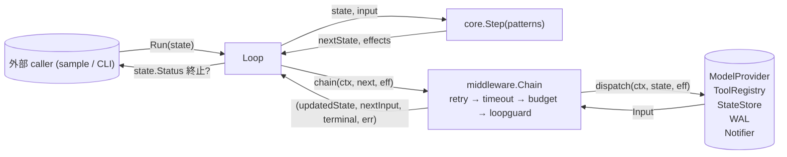
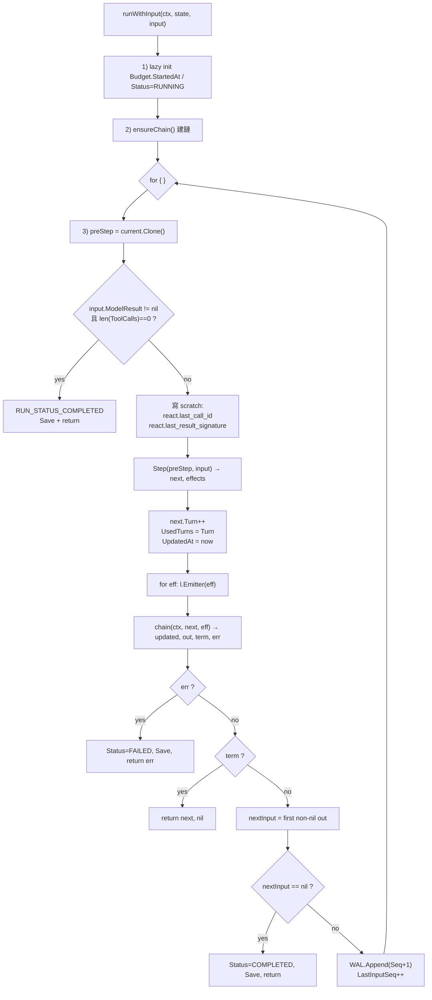
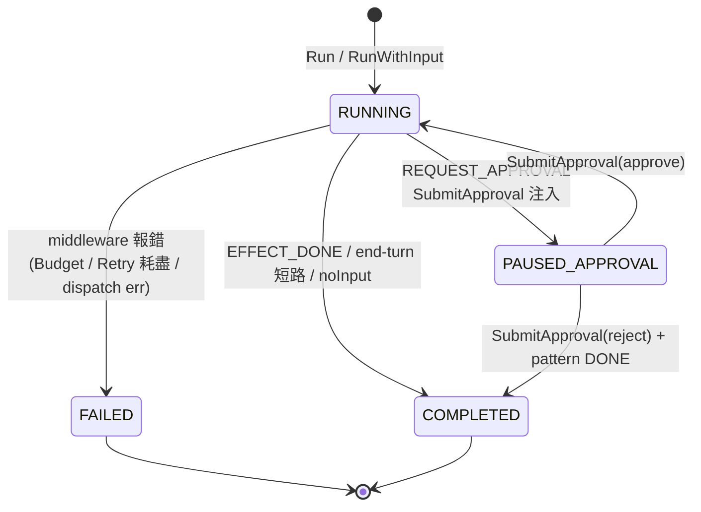

# Spec — runtime/ Loop 殼層 (Shell)

> 對應里程碑: M1 (核心範式 + sample 骨架) + M2 (系統韌性 + 循環防禦)
> 日期: 2026-07-07
> 範圍: `runtime/loop.go` + tests — `Loop` 結構、`Run` / `Resume` / `SubmitApproval`、middleware 鏈、end-turn short-circuit、crash recovery

## 目標

`runtime` 套件是 `core.Step` 的 shell。它把 pattern 吐出的 `Effect` 真正分派 (dispatch) 到綁定的 `ModelProvider` / `ToolRegistry` / `StateStore` / `WAL` / `Notifier` 等 port,並把結果 fold 回 `Input` 推動下一輪 iteration;同時把 `M2` 的 middleware 鏈 (`retry → timeout → budget → loopguard`) 套在 dispatcher 外面,讓 SDK 的復原、限速、循環防禦等橫切關注 (cross-cutting concern) 與 pattern 的純函式邏輯解耦。



## 套件結構

| 檔案 | 角色 | 重點 |
|------|------|------|
| `loop.go` | Loop 結構、Run / Resume / SubmitApproval、preStep scratch seed、end-turn short-circuit | 唯一對外入口 |
| `loop_test.go` | ReAct end-turn、one tool call、PlannerExecutor blueprint、Budget exceed、Store + WAL、Notify、RunWithInput seed | 主要 loop 行為 |
| `crash_recovery_test.go` | FileStateStore + FileWAL round-trip、Recover 期間不重發模型、Loop.Resume | M2 驗收 |
| `di_integration_test.go` | 兩個 FakeProvider 替換、IMAGE chunk end-to-end | M4 DI 概念驗證 |
| `middleware_integration_test.go` | loopguard 連續 CALL_TOOL → REQUEST_APPROVAL、Budget via runtime、Resume from WAL | M2 middleware 整合 |

## `Loop` 結構

```go
type Loop struct {
    Step       core.Step
    Model      core.ModelProvider
    Tools      core.ToolRegistry
    Store      core.StateStore
    WAL        core.WAL
    Approval   core.ApprovalPolicy   // optional
    Notifier   core.Notifier         // optional
    Emitter    Emitter               // optional, 接到 cli.Codec
    Middleware middleware.Middleware // optional, 預設 = DefaultMiddleware

    chain     middleware.Dispatcher  // lazy build
    chainOnce boolError              // 一次守衛
}
```

### DI 對照表 (Loop 欄位 ↔ port)

| 欄位 | 介面 (port) | 用途 | 預設行為 |
|------|-------------|------|----------|
| `Step` | `core.Step` | pattern 派發入口 (`core.NewStep(patterns)`) | **必要** — 無預設 |
| `Model` | `core.ModelProvider` | LLM 呼叫 (`Generate(ModelRequest) → (ModelResult, error)`) | **必要** — 缺則 `CALL_MODEL` effect 直接報錯 |
| `Tools` | `core.ToolRegistry` | 工具 dispatch (`Call(ToolCall) → ToolResult`) | **必要** — 缺則 `CALL_TOOL` effect 直接報錯 |
| `Store` | `core.StateStore` | `Save / Load` State 持久化 | 可選 — nil 時跳過 save,`Resume` 會回 error |
| `WAL` | `core.WAL` | `Append` / `Replay` Input 序列 | 可選 — nil 時跳過 append 與 replay |
| `Approval` | `core.ApprovalPolicy` | HITL gate (`Decide(autonomy, ToolCall, Schema) → ApprovalAction`) | 可選 — nil = 沒有 approval gate |
| `Notifier` | `core.Notifier` | `Notify(level, message)` 側通道 | 可選 — nil 時 `EFFECT_NOTIFY` no-op |
| `Emitter` | `Emitter func(core.Effect)` | 把 effect 推到 `cli.Codec` / websocket | 可選 — nil 時不 emit |
| `Middleware` | `middleware.Middleware` | 外包 dispatcher 的鏈 | 可選 — nil 時 `resolve()` 回 `DefaultMiddleware()` |

建構式 (minimal surface):

```go
func NewLoop(step core.Step, model core.ModelProvider, tools core.ToolRegistry) *Loop
```

只要求三個必要 port;`Store` / `WAL` / `Approval` / `Notifier` / `Emitter` / `Middleware` 都可後續注入 — 這是 M4「DI provider swap」的關鍵。

### Middleware 預設鏈

```go
func DefaultMiddleware() middleware.Middleware {
    return middleware.Chain(
        harness.Retry(harness.RetryConfig{N: 3, BaseBackoff: 100*time.Millisecond, MaxBackoff: 5*time.Second}),
        harness.Timeout(harness.TimeoutConfig{PerEffect: 60*time.Second}),
        harness.Budget(),
        loopguard.New(loopguard.Config{MaxRepeats: 5}),
    )
}
```

包裝順序 (由外到內): `retry → timeout → budget → loopguard → base dispatch`。

- `retry` 認 `RetryableError`,指數 backoff,失敗 N 次後 surface。
- `timeout` 對每次 effect 加 `WithTimeout(PerEffect)`。
- `budget` 守 `state.Budget.Exceeded`,超限直接 `BudgetExceededError`。
- `loopguard` 指紋 (sha1 + volatile strip) 偵測連續 CALL_TOOL,5 次連發 → REQUEST_APPROVAL。

### `chain` lazy build

```go
func (l *Loop) ensureChain() middleware.Next {
    if !l.chainOnce.value {
        base := middleware.Next(l.dispatch)
        l.chain = middleware.Dispatcher(l.resolve()(base))
        l.chainOnce.value = true
    }
    return middleware.Next(l.chain)
}
```

第一次 `Run` / `Resume` / `SubmitApproval` 呼叫時才建鏈;之後重用同一個 `middleware.Dispatcher`。`boolError` 是 1-bit 守衛取代 `sync.Once`,節省 64-byte 開銷。

## `Run` vs `Resume`

| 函式 | 何時用 | 入口 | 中途重發 model? |
|------|--------|------|-----------------|
| `Run(ctx, state)` | 新 run,從 scratch 開始 | 第一輪 `input = core.Input{}` (空 Input) | — |
| `RunWithInput(ctx, state, seed)` | 測試 / sample 顯式餵第一輪 | 提供 `seed Input` (Percept / ModelResult) | — |
| `Resume(ctx, runID)` | 從 `StateStore` 撈 state,WAL 補回 missing Inputs | `Store.Load(runID) → WAL.Replay(runID, LastInputSeq) → runWithInput(in order)` | **否** — WAL 內含原 `ModelResult` / `ToolResult`,dispatcher 識別後直接 fold 不重發 |
| `SubmitApproval(ctx, runID, decision, decidedBy)` | mid-run HITL,把 operator 的決定回灌 | `Store.Load → mutate PendingApprovals → runWithInput(APPROVAL_DECISION Input)` | 視 `decision` 而定 |

### `Resume` 細節

```go
func (l *Loop) Resume(ctx context.Context, runID string) (core.State, error) {
    if l.Store == nil { return core.State{}, fmt.Errorf("resume requires Store") }
    s, err := l.Store.Load(ctx, runID)
    if err != nil { return core.State{}, err }
    if l.WAL == nil { return l.Run(ctx, s) }          // 沒 WAL 就直接 Run
    inputs, err := l.WAL.Replay(ctx, runID, s.LastInputSeq)
    if err != nil { return core.State{}, fmt.Errorf("resume replay: %w", err) }
    for _, in := range inputs {
        s, err = l.runWithInput(ctx, s, in)
        if err != nil { return s, err }
    }
    return s, nil
}
```

關鍵不變式 (WAL replay 語意):

- `WAL.Replay(runID, sinceSeq)` 回傳所有 `input.Seq > sinceSeq` 的 `Input` (見 `core.WAL` 介面)。
- `State.LastInputSeq` 是「已被跑過的最大 Seq」,呼叫端不重發模型呼叫。
- WAL 內含的 `ModelResult` / `ToolResult` 透過 `runWithInput` 的 preStep scratch seed 與 `input.ModelResult.ToolCalls` 短路,model 不會真的被叫。

驗收測試: `TestCrashRecoveryFullCycle` — Recover 後 `prov.CallCount()` 與 `callsBefore` 相等,證明沒有重發。

### `SubmitApproval` 細節

```go
func (l *Loop) SubmitApproval(ctx context.Context, runID string, decision core.ApprovalDecision, decidedBy string) (core.State, error) {
    s, err := l.Store.Load(ctx, runID)
    // 找第一個 Decision 為空的 PendingApproval,寫入 decision / decidedAt / decidedBy
    // Save 回 Store,然後餵 INPUT_KIND_APPROVAL_DECISION 給 runWithInput
}
```

mid-run HITL 的端到端契約:

1. Operator 看到 `MSG_TYPE_APPROVAL_REQUEST` envelope (透過 `Emitter` 或 store watch)。
2. 透過 out-of-band channel (CLI flag,webhook,UI button) 呼叫 `SubmitApproval`。
3. `runWithInput` 收到 `INPUT_KIND_APPROVAL_DECISION` 後,preStep 把 `react.last_decision` 寫進 scratch,讓 ReAct / PlannerExecutor 各自決定下一步。
4. 若 decision 是 `REJECT`,pattern 通常會 `DONE`;若是 `APPROVE`,會重新 `CALL_TOOL` 並推進 phase。

## `runWithInput` 主迴圈



### Pre-step scratch seed (關鍵不變式)

`patterns` 是純函式 — 它們看不到 `Input`,只能讀 `state.Scratch`。runtime 在呼叫 `Step` 之前必須把 Input 內含的資訊 fold 進 scratch:

```go
preStep := current.Clone()
if preStep.Scratch == nil { preStep.Scratch = make(map[string]any, 4) }

// end_turn / max_tokens / error → 短路 COMPLETED
if input.ModelResult != nil && len(input.ModelResult.ToolCalls) == 0 {
    preStep.Status = core.RUN_STATUS_COMPLETED
    if l.Store != nil { _ = l.Store.Save(ctx, preStep) }
    return preStep, nil
}

if input.ModelResult != nil && len(input.ModelResult.ToolCalls) > 0 {
    preStep.Scratch["react.last_call_id"] = input.ModelResult.ToolCalls[0]
}
if input.ToolResult != nil {
    preStep.Scratch["react.last_result_signature"] = input.ToolResult.CallID
}
```

| 鍵 | 寫入時機 | 讀者 |
|----|----------|------|
| `react.last_call_id` | `Input.ModelResult.ToolCalls[0]` 不為空 | `ReAct` act 階段 — 拿來發 CALL_TOOL |
| `react.last_result_signature` | `Input.ToolResult.CallID` | `ReAct` observe 階段 — 標記本輪已收 |

### End-turn short-circuit

`ModelResult.StopReason=end_turn` (或 `max_tokens` / `error`) 且 `len(ToolCalls)==0` 時,`Step` 完全不會被呼叫,直接回 `RUN_STATUS_COMPLETED`。原因:

- ReAct pattern 在 act 階段若 `react.last_call_id` 缺就會 `DONE`,但這需要先 dispatch CALL_MODEL;end-turn 短路省下 LLM round-trip。
- 避免 stale scratch 導致誤判:若前一個 iteration 是 act 階段,本輪若不短路,ReAct 看到 `react.last_call_id` 還在會誤以為該 dispatch tool。

驗收測試: `TestReActEndTurnExitsLoop` 驗證 end_turn → `RUN_STATUS_COMPLETED` 且 `prov.CallCount() == 1`(只呼一次 LLM)。

### 終止條件

| 條件 | 處理 |
|------|------|
| `EFFECT_DONE` 走完 | `next.Status = RUN_STATUS_COMPLETED`,return |
| `EFFECT_REQUEST_APPROVAL` 走完 | `Status = RUN_STATUS_PAUSED_APPROVAL`,PendingApprovals append,return |
| middleware 報錯 (e.g. Budget) | `Status = RUN_STATUS_FAILED`,Save 帶錯誤,return err (`harness.BudgetExceededError` 透傳) |
| 沒下一個 Input (`nextInput == nil`) | 視為 `COMPLETED` |
| `terminal` flag | 提早離開 effect loop,但仍走 Save |

## `dispatch` 端點 — 7 種 Effect 處理

```go
func (l *Loop) dispatch(ctx context.Context, s core.State, eff core.Effect) (core.State, *core.Input, bool, error) {
    switch eff.Kind {
    case EFFECT_CALL_MODEL:    // 叫 l.Model.Generate,折成 ModelResult Input
    case EFFECT_CALL_TOOL:     // 叫 l.Tools.Call,折成 ToolResult Input + append tool message
    case EFFECT_REQUEST_APPROVAL: // append PendingApproval,Status=PAUSED,terminal=true
    case EFFECT_NOTIFY:        // 叫 l.Notifier.Notify
    case EFFECT_CHECKPOINT:    // 叫 l.Store.Save
    case EFFECT_EMIT:          // 已被 Run 在 chain 之前 emit 過,no-op
    case EFFECT_DONE:          // Status=COMPLETED,terminal=true
    }
}
```

| Effect | 必要 port | 回傳 nextInput? | terminal? | mutate state? |
|--------|-----------|-----------------|-----------|---------------|
| `CALL_MODEL` | `Model` | ✅ `INPUT_KIND_MODEL_RESULT` | 否 | 否 (input 自帶訊息) |
| `CALL_TOOL` | `Tools` | ✅ `INPUT_KIND_TOOL_RESULT` | 否 | ✅ append tool message 到 `s.Messages` |
| `REQUEST_APPROVAL` | — | ❌ | ✅ | ✅ `PendingApprovals` append,`Status=PAUSED` |
| `NOTIFY` | `Notifier` (可選) | ❌ | 否 | 否 |
| `CHECKPOINT` | `Store` (可選) | ❌ | 否 | 否 (Store 自己 snapshot) |
| `EMIT` | — | ❌ | 否 | 否 |
| `DONE` | — | ❌ | ✅ | ✅ `Status=COMPLETED` |

> `CALL_TOOL` 是唯一會 mutate `state.Messages` 的 effect (append 一個 `Role=ROLE_TOOL` 的 Message + `CHUNK_KIND_TOOL_RESULT` chunk);其餘都把狀態交給 input / store。

## `RunStatus` 生命週期



| Status | 進入條件 | 出口 |
|--------|----------|------|
| `RUNNING` | `Run` / `RunWithInput` / `Resume` 啟動 | 任何終止條件 |
| `COMPLETED` | end-turn 短路 / `EFFECT_DONE` / `nextInput == nil` | — |
| `PAUSED_APPROVAL` | `EFFECT_REQUEST_APPROVAL`(loopguard / high-risk tool) | `SubmitApproval` 注入 → 回到 `RUNNING` 或 `COMPLETED` |
| `FAILED` | middleware 回 `err`(Budget exceeded, dispatch 報錯) | — |

`Status == ""` 時 `runWithInput` 自動補 `RUNNING`,`Status == ""` 且 `terminal` 提早 return 時,fallback 寫 `PAUSED_APPROVAL`(預防:mid-run approval 場景)。

## `IsBudgetExceeded` 輔助

```go
func IsBudgetExceeded(err error) bool {
    var be *harness.BudgetExceededError
    return errors.As(err, &be)
}
```

`runtime` re-export 一個小 helper 給 caller 快速判斷;canonical 仍是 `errors.As` 對 `harness.BudgetExceededError`。

## Crash Recovery 流程

```mermaid
sequenceDiagram
    participant Caller
    participant Loop
    participant Store
    participant WAL
    participant Checkpoint
    participant Provider
    Caller->>Loop: Run(state) (with Store + WAL)
    Loop->>Provider: CALL_MODEL
    Provider-->>Loop: ModelResult (tool_use)
    Loop->>Store: Save(state)
    Loop->>WAL: Append(Seq+1, ModelResult Input)
    Note over Loop: *** crash here ***
    Loop->>Checkpoint: Checkpoint(state)  // 顯式
    Checkpoint->>Store: Save
    Checkpoint->>WAL: Append(checkpoint marker)
    Caller->>Loop: Resume(runID)
    Loop->>Store: Load(state) — 拿到 LastInputSeq
    Loop->>WAL: Replay(runID, LastInputSeq)
    WAL-->>Loop: []Input  (ModelResult / ToolResult)
    loop 每個 replayed input
        Loop->>Loop: runWithInput(state, input)
        Note over Loop: preStep 短路 / fold scratch 不重發
    end
    Loop-->>Caller: final state
```

關鍵點 (M2 驗收):

- `Recover` 期間 `FakeProvider.CallCount()` 維持不變 (測試守護 `assert.Equal(t, callsBefore, prov.CallCount(), "Recover must not issue model calls")`)。
- `finalBytes == recBytes` (JSON 等價) — Recover 出的 State 與 crash 前 snapshot 完全等價。
- `Loop.Resume` 走完 replay 仍能繼續 `Run`(若還沒達到 terminal status)。

## DI 整合測試模式

`di_integration_test.go::TestDIProviderSwap` 示範 M4 概念驗證:同一份 `core.Step` + 同一個 `Registry`,換兩個 `FakeProvider` 都跑得通。

```go
t.Run("provider A", func(t *testing.T) {
    provA := testutil.NewFakeProvider()
    provA.EnqueueToolCall("c1", "noop", ...)
    provA.EnqueueEndTurn("from-A")
    loop := runtime.NewLoop(step, provA, reg)
    loop.Approval = stubApproval{}
    loop.Emitter = func(eff core.Effect) {}
    final, err := loop.Run(context.Background(), state())
    require.NoError(t, err)
    assert.Equal(t, core.RUN_STATUS_COMPLETED, final.Status)
})
```

`di_integration_test.go::TestImageChunkSurvivesRunLoop` 驗證 multimodal abstraction: image bytes 走過 `Run` 後仍原封不動在 `state.Messages[].Chunks[].Image`,證明 runtime 不重新編碼 binary payload。

## 設計決策 (Why)

| 決策 | 理由 |
|------|------|
| `Loop` 採 optional injection | 新 run / Resume / 換 provider 都不必重寫 constructor,符合 M4 解耦目標 |
| pre-step scratch seed 由 runtime 寫 | pattern 保持純函式,只讀 scratch;讓 WAL replay 可 re-derive,測試可直接 `SeedBlueprint` 驅動 FSM |
| end-turn 短路在 chain 之前 | 省下 ReAct 對 stale scratch 誤判的 LLM round-trip;同時 `prov.CallCount()` 維持精準(測試守護) |
| `chain` lazy build + `boolError` | 第一次 dispatch 才建 middleware 鏈,避免 `NewLoop` 後馬上做 reflection 成本 |
| `CALL_TOOL` append tool message | tool result 同時存在 `Input.ToolResult`(給 pattern 讀 scratch)與 `state.Messages`(給 LLM 看歷史)兩處,避免 model 在下一輪看不到自己剛呼叫的 tool |
| `SubmitApproval` 走 `runWithInput` 而非新 run | 維持 RunStatus 連續性,`UsedTurns` 與 `LastInputSeq` 延續,讓 mid-run HITL 對外部觀察者無感 |
| `Resume` 沒 WAL 時降級為 `Run` | 純 `StateStore` 而無 WAL 的場景仍可 resume(從 snapshot 直接接,中間的細部 events 不重要) |

## 開放問題 (Follow-ups, 留待 M3/M4)

- **`Emitter` 與 `Notifier` 重疊**: 兩者都是「觀察者」視角,但 `Emitter` 是 effect-level (給 cli / ws),`Notifier` 是語意層 (給 ops / Slack)。M3 之後可能拆出 `Observer` 介面統一。
- **mid-run approval 持久化**: `SubmitApproval` 後 WAL 會再 append 一個 APPROVAL_DECISION,但 checkpoint 標記未在 `dispatch` 內強制觸發,目前依賴 caller 顯式 `cp.Checkpoint()`。
- **loopguard 與 preStep scratch 衝突**: loopguard 走 scratch (`loopguard.state`) 累計指紋,但 preStep 在每次 iteration 都會重設 `react.*` 鍵;兩者用獨立 namespace,不互相干擾,但未來若 pattern 數量增加需明確合約。
- **`Dispatcher` signature 與 `dispatch` 對應**: middleware `Next` 簽名是 `func(ctx, state, eff) (state, *Input, bool, error)`,而 `core.DispatchFn` 介面是另一個近似形 (M3 規劃要把兩者合流)。

## 驗收 (Acceptance)

- [x] `go test ./runtime/... -count=1` 全綠 (ReAct end-turn、one tool call、blueprint、Budget、Store+WAL、Notify、Resume、CrashRecovery、loopguard realtime、ProviderSwap、Image chunk)
- [x] `Loop.Run` / `Resume` / `SubmitApproval` / `RunWithInput` 對外 API 形狀一致,共用 `runWithInput` 引擎
- [x] `DefaultMiddleware` 鏈順序為 `retry → timeout → budget → loopguard`(與 plan-only-and-plan-breezy-pike.md 對齊)
- [x] pre-step scratch 至少寫 `react.last_call_id` 與 `react.last_result_signature`
- [x] end-turn 短路條件 `ModelResult.ToolCalls 為空` 命中時 `Status=COMPLETED` 且 LLM 不會被叫第二次
- [x] `harness.BudgetExceededError` 從 middleware 透傳到 caller,`runtime.IsBudgetExceeded(err)` 可判斷
- [x] Crash recovery: 同一個 `Loop` 跑 `Run` → `cp.Checkpoint` → `cp.Recover` → `Resume`,`FakeProvider.CallCount()` 不變
