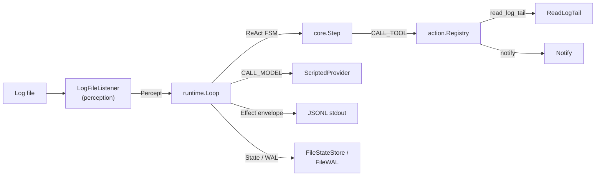
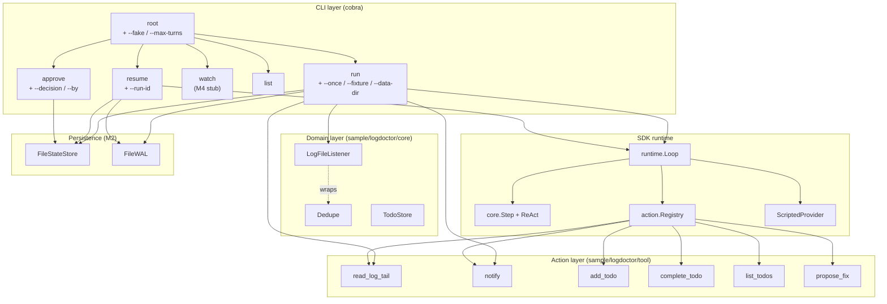

# Spec — sample/logdoctor/ 驗證樣本

> 對應里程碑: M1 (核心範式 + sample 骨架) + M2 (系統韌性 + 循環防禦)
> 日期: 2026-07-07
> 範圍: `sample/logdoctor/` — 完整可跑的 SDK 驗證 sample (cobra CLI + domain layer + typed tools + FakeProvider E2E)

## 目標

用一個「看 log → 抓錯誤 → 通報操作員」的真實世界流程,把 SDK 的 `runtime` / `planning` / `action` / `perception` / `memory/filestore` 五個支柱全部串起來,證明 SDK 端到端可用,並作為後續 milestones 的回歸基準。Sample 本身不是產品,但要像產品:有自己的 go.mod、有 cobra CLI、有 domain layer、有 typed tools、有測試。



## 套件結構

| 路徑 | 角色 | 對應 SDK 套件 |
|------|------|---------------|
| `main.go` | cobra entry,註冊所有 verb | (composition root) |
| `cmd/root.go` | `NewRoot()`,global flags (`--fake` / `--max-turns`) | — |
| `cmd/run.go` | `RegisterRun`,`--once` / `--fixture` / `--data-dir` | `runtime.Loop` |
| `cmd/resume.go` | `RegisterResume`,從 `FileStateStore` + `FileWAL` 還原 | `runtime.Loop.Resume` |
| `cmd/watch.go` | `RegisterWatch`,輪詢 log 觸發 run (M4 預留) | `runtime.Loop` |
| `cmd/list.go` | `RegisterList`,列舉 persisted runs | `FileStateStore.List` |
| `cmd/approve.go` | `RegisterApprove`,out-of-band 決策 pending approval | `core.ApprovalDecision` |
| `cmd/dirs.go` | `dataDirOrDefault` 共享 helper | — |
| `core/listener.go` | `LogFileListener` — domain layer | `perception.Source` |
| `core/dedupe.go` | `Dedupe` — sha1 fingerprint + cooldown | `perception.Source` |
| `core/todo.go` | `Todo` + `TodoStore` — remediation tasks | — |
| `tool/read_log_tail.go` | `ReadLogTail` typed tool | `action.TypedTool` |
| `tool/notify.go` | `Notify` typed tool | `action.TypedTool` |
| `tool/add_todo.go` / `complete_todo.go` / `list_todos.go` | Todo 工具 (M3+) | `action.TypedTool` |
| `tool/propose_fix.go` | Approval-gated fix proposer (M3+) | `action.TypedTool` |
| `internal/fake/fake.go` | `ScriptedProvider` — 固定 transcript | `core.ModelProvider` |
| `testdata/error.log` | E2E fixture,6 行混合 log | — |

## 目的 (Purpose)

驗證「agent loop 從感知到行動的完整閉環」,具體三件事:

1. **Loop 不會卡死**: ReAct pattern 配合 deterministic provider 一定會走到 `end_turn`。
2. **State 持久化 round-trip**: `run` 寫的 `State` + WAL 能在 `resume` 還原,token / 訊息不丟。
3. **Effect 可觀察**: 每個 effect 序列化成 JSONL 寫到 stdout,下游 (tailer / dashboard) 可直接消費。

## 架構 (Architecture)



## 進入點 (Entrypoints)

### `main.go`

組合根 — 註冊所有 verb,把 `cobra.Command` 交給 `Execute()`:

```go
func main() {
    root := cmd.NewRoot()
    cmd.RegisterRun(root)
    cmd.RegisterResume(root)
    cmd.RegisterList(root)
    cmd.RegisterWatch(root)
    cmd.RegisterApprove(root)
    if err := root.Execute(); err != nil {
        fmt.Fprintln(os.Stderr, err)
        os.Exit(1)
    }
}
```

`NewRoot()` 不呼叫 `Execute()` 的慣例來自 gosdk / playground:讓 unit test 可以拿到 `*cobra.Command` 跑 assertion,不必啟動整個 CLI。

### `cmd/root.go` — `NewRoot()`

| 元素 | 用途 |
|------|------|
| `Use: "logdoctor"` | cobra 進入名 |
| `Version: "0.1.0-m1"` | `--version` 印出 (M1 milestone tag) |
| `--fake` (persistent) | 切換到 `ScriptedProvider`,離線 E2E |
| `--max-turns` (persistent, default 5) | `core.Budget.MaxTurns` 上限 |

子命令的 `Register*` 函式只負責 `cmd.Flags()` 與 `root.AddCommand(cmd)`,實際執行邏輯在 `*Execute` 私有函式裡。

### `cmd/run.go` — `RegisterRun`

Flags:

| Flag | 型別 | 用途 |
|------|------|------|
| `--once` | bool | M1 限定,只讀一次 log 就結束;不開 = M2 watcher (目前會 error) |
| `--fixture` | string | log 檔路徑,`--once` 必填 |
| `--data-dir` | string | StateStore + WAL 目錄;優先序: flag > `$LOGDOCTOR_DATA` > `./data` |

`runExecute` 流程:

```mermaid
sequenceDiagram
    participant CLI as runExecute
    participant L as LogFileListener
    participant Loop as runtime.Loop
    participant SP as ScriptedProvider
    participant Stdout

    CLI->>L: NewLogFileListener(fixture)
    CLI->>SP: NewScriptedProvider()
    CLI->>Loop: NewLoop(step, sp, reg)
    CLI->>Loop: Store=FileStateStore / WAL=FileWAL (optional)
    CLI->>L: Percepts(ctx) → 收第一個 percept
    CLI->>Loop: RunWithInput(state, INPUT_KIND_PERCEPT)
    Loop-->>Stdout: writeEnvelope(effect) × N
    Loop-->>CLI: final state
    CLI->>Stdout: writeEnvelope(DONE)
```

關鍵設計:

- **`RunWithInput` 而非 `Run`**: ReAct 需要「使用者指令」才能開始 think phase,這裡直接把 listener 的第一個 percept 當成初始 user message。
- **`allowAllApproval{}`**: M1 不接 approval gate,所有 tool call 直接放行;M4 換成 `NewConsoleApproval` 或 `gosdk/notify`-backed impl。
- **Effect envelope**: 每個 effect 都序列化成 JSONL 寫到 stdout (`{"type":"effect","kind":"...","data":{...}}`),下游 tailer 可直接消費。
- **listener timeout 2 秒**: `select` 收第一個 percept,2 秒沒收到就 fail-fast — fixture 一定會 emit,timeout 視為 fixture / listener bug。

### `cmd/resume.go` — `RegisterResume`

從 `dataDir/states/<runID>.json` + `dataDir/wal/<runID>.jsonl` 還原 run,接續執行。流程幾乎與 `run.go` 相同,差別:

- 不再 `RunWithInput` 初始 percept,改呼叫 `loop.Resume(ctx, runID)`,由 Loop 內部 `Load` + `Replay`。
- 預先 `store.List` 確認 runID 存在,給清楚的錯誤訊息。
- `final.Budget.MaxTurns` 若為 0 (loaded from persisted) 補上 root flag 的 `maxTurns`。

### `cmd/dirs.go` — `dataDirOrDefault`

集中解析 data dir 的三段優先序 (`--data-dir` flag > `$LOGDOCTOR_DATA` env > `./data`),給 `run` / `resume` / `list` / `approve` 共用,避免路徑解析散落四處。

### `cmd/approve.go` — `RegisterApprove`

Out-of-band 決策 `PendingApproval`:

- 載入 persisted `State`,找到第一個 `Decision == ""` 的 `PendingApproval`。
- 寫入 `Decision` / `DecidedAt` / `DecidedBy` 後 `Save` 回 store。
- 下次 `resume` 從 WAL 重播時,`APPROVAL_DECISION` input 自然 fold 回 state。

### `cmd/watch.go` / `cmd/list.go` / `cmd/list.go` (M4+ 預留)

- `watch`: 輪詢 log,每次 poll 觸發新 run;目前是 placeholder,真正的 `buildRunContext` 在 M4 wire 進 `ApprovalGate` + `Spotlight` + `Sanitizer` middleware 時實作。
- `list`: 列舉 persisted runs,對每個 run 印 `RunID  turns=N  status=...`。

## Domain layer — `sample/logdoctor/core/`

採 gosdk noun 慣例:domain object 用名詞 (`LogFileListener` / `Dedupe` / `Todo`),不做 I/O orchestration。

### `listener.go` — `LogFileListener`

| 元素 | 用途 |
|------|------|
| `path` | fixture 檔路徑,`NewLogFileListener` 立刻 `os.Stat` 驗證 |
| `Name()` | 回 `"logfile:" + path`,用於 diagnostics / 觀測 |
| `Percepts(ctx)` | buffered channel (cap 1),goroutine 內 `os.ReadFile` 一次後 emit 一個 `Percept{Payload: 整個檔案}` 再 close |
| 讀檔錯誤處理 | 改成 emit `Percept{ID: "err", Payload: "read_error: " + err}`,LLM 看得到錯誤並決策 |

M2 之後會升級成 tail (監聽檔案 append),Percepts 變成長期 channel。

### `dedupe.go` — `Dedupe`

Perception fan-in proxy,12-char sha1 fingerprint + per-rule cooldown:

| 元素 | 用途 |
|------|------|
| `Inner Source` | 被包裝的下一層 source |
| `RuleID string` | 區分不同 rule;不同 rule 的相同文字視為新事件 |
| `Cooldown time.Duration` | 同 fingerprint 多久內視為重複 |
| `fingerprint(ruleID, payload)` | `sha1(ruleID + "|" + payload)[:12]` |
| `shouldEmit(p)` | 檢查 fp + cooldown;每次呼叫都更新 `last` / `until`(避免 burst replay 風暴) |

對齊 TS 版 `log_doctor` 的行為:`LastFingerprint()` / `ShouldEmitForTest` 給測試用,production caller 不碰。

### `todo.go` — `Todo` + `TodoStore`

| 元素 | 用途 |
|------|------|
| `Todo.ID` | `idPrefix(n)` = `"todo-" + itoa(n)`,process-local counter |
| `TodoStatus` | `open` / `in_progress` / `done` (SCREAMING_SNAKE_CASE 對齊 gosdk) |
| `TodoStore.Add` / `List` / `Complete` / `Open` | 全部 `sync.Mutex` 守護,`List` 回傳 copy |
| `Open()` | filter `Status != TODO_STATUS_DONE`,給 agent 的 "what's left?" prompt 用 |

M4 可能改為 disk-backed 跨 run 追蹤;目前 in-memory 即可。

## Action layer — `sample/logdoctor/tool/`

### `read_log_tail.go` — `ReadLogTail`

| 元素 | 用途 |
|------|------|
| `Source interface` | 最小依賴面 — 只要實作 `Percepts(ctx) <-chan Percept`,讓測試能塞 stub |
| `ReadLogTailArgs{N int}` | TypedTool 參數;`N <= 0` 預設 20 |
| `ReadLogTailOutput{Lines, Truncated}` | TypedTool 回傳 |
| `NewReadLogTail(src)` | 工廠 — 用 `action.NewTypedTool` 包,內部從 `src.Percepts(ctx)` 收一個 percept,`strings.Split` 切行,前 `N` 行回傳 |
| Name / Description / Schema / Risk / Call | 全 delegate 到 `Inner` |

`Source` 介面刻意只暴露 `Percepts`,讓 `ReadLogTail` 不依賴 `LogFileListener` 整個 struct,測試可以傳 mock。

### `notify.go` — `Notify`

| 元素 | 用途 |
|------|------|
| `NotifyArgs{Level, Message}` | 參數;`Level` 空字串預設 `"info"` |
| `NotifyOutput{Delivered bool}` | 回傳 |
| `NewNotify(w io.Writer)` | factory — 內部 `fmt.Fprintf(w, "[notify][%s] %s\n", Level, Message)`,回 `Delivered: true` |
| M1 wiring | writer 是 `cmd.OutOrStdout()`,stdout 就是 CLI surface |
| M4 wiring | 換成 `notify.NewMulti(...)` 把訊息同步到 Slack / Email / Log |

### 其他 M3+ tools

| 工具 | 用途 | 狀態 |
|------|------|------|
| `add_todo` | 把 remediation 想法寫進 `TodoStore` | M3 stub |
| `complete_todo` | 標記 todo 完成 | M3 stub |
| `list_todos` | 列出 open todos | M3 stub |
| `propose_fix` | 提議補釘 patch,觸發 `REQUEST_APPROVAL` | M3 stub,M4 真接 approval gate |

## `internal/fake/fake.go` — `ScriptedProvider`

Sample 端的 FakeProvider mirror,固定 transcript:

| Index | StopReason | ToolCall | 用途 |
|-------|-----------|----------|------|
| 0 | `tool_use` | `c1: read_log_tail n=5` | 第一次 dispatch:讀 log |
| 1 | `tool_use` | `c2: notify level=warn message="log contains ERROR lines"` | 第二次 dispatch:通報 |
| default | `end_turn` | `Text: "diagnostic complete"` | Loop 收到 end_turn → short-circuit COMPLETED |

設計:

- **Mirror 而非 import SDK `testutil`**: sample 是獨立 module,跨模組 import 會被 `replace` 設定擋下。
- **無限 end_turn 兜底**: 預設 case 永遠回 `end_turn`,有 bug 多叫 LLM 也不會 crash,只會在測試裡多算 CallCount 暴露問題。
- **`Name()` = `"fake-scripted"`**: 跟 SDK 端 `FakeProvider` 的 `"fake"` 區分,log / metric 一眼看出是哪個來源。

## E2E 流程 (End-to-End)

```bash
cd sample/logdoctor
go run . --fake --max-turns=10 run --once --fixture testdata/error.log
```

預期 stdout (JSONL,每行一個 envelope):

```text
{"type":"effect","kind":"call_model","data":{...}}
{"type":"effect","kind":"call_tool","data":{"name":"read_log_tail","args":{"n":5}}}
{"type":"effect","kind":"call_model","data":{...}}
{"type":"effect","kind":"call_tool","data":{"name":"notify","args":{"level":"warn","message":"log contains ERROR lines"}}}
{"type":"effect","kind":"call_model","data":{...}}
{"type":"effect","kind":"done","data":null}
```

對應 loop 內部 `Emitter` 被觸發 6 次;`ScriptedProvider.Generate` 被觸發 3 次 (tool_use × 2 + end_turn × 1);`Notify` tool 實際寫到 stdout 一行 `[notify][warn] log contains ERROR lines`。

Resume 流程 (M2 驗證):

```bash
# run 一次後把 RunID 記下來
go run . --fake run --once --fixture testdata/error.log
# 從 ./data/states 拿 RunID
go run . --fake resume --run-id run-1234567890
```

`resume` 走 `loop.Resume`:`FileStateStore.Load` 取 State,`FileWAL.Replay` 取尚未消耗的 Inputs,接著跑剩餘 step 直到 `end_turn`。

## 資料流 (Data Flow)

```mermaid
sequenceDiagram
    autonumber
    participant User
    participant CLI as cobra root
    participant Run as runExecute
    participant L as LogFileListener
    participant Loop as runtime.Loop
    participant Step as core.Step(ReAct)
    participant SP as ScriptedProvider
    participant Reg as action.Registry
    participant RLT as read_log_tail
    participant NT as notify
    participant FS as FileStateStore/WAL

    User->>CLI: go run . --fake run --once --fixture testdata/error.log
    CLI->>Run: Execute()
    Run->>L: NewLogFileListener(fixture)
    Run->>FS: NewFileStateStore(dataDir) [optional]
    Run->>Loop: NewLoop(step, sp, reg) + Emitter
    Run->>L: Percepts(ctx)
    L-->>Run: Percept{ID:"head", Payload: <6行log>}
    Run->>Loop: RunWithInput(state, INPUT_KIND_PERCEPT)
    Loop->>Step: Decide(state)
    Step-->>Loop: [CALL_MODEL] (scratch: react.phase=act)
    Loop->>SP: Generate(req)
    SP-->>Loop: {tool_use, c1: read_log_tail n=5}
    Loop->>Step: Decide(state)
    Step-->>Loop: [CALL_TOOL{c1}] (scratch: react.phase=observe)
    Loop->>Reg: Call(read_log_tail, n=5)
    Reg->>RLT: Call(n=5)
    RLT-->>Reg: {Lines: [...5行...], Truncated: true}
    Reg-->>Loop: ToolResult{Output: ...}
    Loop->>Step: Decide(state) (post-CALL_TOOL)
    Step-->>Loop: [CALL_MODEL] (scratch: react.phase=act)
    Loop->>SP: Generate(req)
    SP-->>Loop: {tool_use, c2: notify warn "log contains ERROR lines"}
    Loop->>Step: Decide(state)
    Step-->>Loop: [CALL_TOOL{c2}]
    Loop->>Reg: Call(notify, ...)
    Reg->>NT: Call(level=warn, message=...)
    NT-->>Reg: {Delivered: true}
    NT-->>User: stdout: [notify][warn] log contains ERROR lines
    Reg-->>Loop: ToolResult
    Loop->>Step: Decide(state) (post-CALL_TOOL)
    Step-->>Loop: [CALL_MODEL]
    Loop->>SP: Generate(req)
    SP-->>Loop: {end_turn, "diagnostic complete"}
    Loop-->>Run: short-circuit → COMPLETED
    Run->>FS: Save(state) [optional]
    Run-->>User: JSONL envelopes × 6
```

## M1 驗收對應 (Acceptance Mapping)

| M1 驗收項 | sample 怎麼證明 |
|-----------|----------------|
| `go test ./...` 全綠 | `sample/logdoctor` 內 `core/*_test.go` + `tool/*_test.go` 都綠,涵蓋 `Dedupe` 邊界、`Todo` CRUD、`TypedTool` schema |
| E2E JSONL 符合預期 | `go run . --fake --max-turns=10 run --once --fixture testdata/error.log` 印出 `call_model → call_tool(read_log_tail) → call_model → call_tool(notify) → call_model → done` 6 行 |
| Loop 不會卡死 | ReAct + ScriptedProvider 一定會走到 `end_turn`;`--max-turns=10` 永遠用不到 |
| State 持久化 | M2 加 `run` + `resume` 對同一個 RunID,Resume 不重新跑 LLM 已經看過的 step (FakeProvider.CallCount 在 resume 期間不變) |
| Effect 可觀察 | `Emitter` 寫 JSONL 到 stdout,測試直接 `bufio.Scanner` parse |

M2 驗收對應 (延伸):

| M2 驗收項 | sample 怎麼證明 |
|-----------|----------------|
| Budget 到頂即停 | `go run . --fake --max-turns=1 run --once --fixture testdata/error.log` 在第一個 CALL_MODEL 後即停 |
| FileStateStore round-trip | `run` 寫 `./data/states/<runID>.json` → 該檔可手動 `cat` 看見 JSON State |
| Resume 不重發 LLM | `resume` 後 FakeProvider.CallCount = 0 (WAL replay 涵蓋所有先前 Inputs) |
| Loopguard 5 次連續 CALL_TOOL 觸發 REQUEST_APPROVAL | sample 加 unit test 餵入 5 個同 fingerprint CALL_TOOL effect,assert 第五次被 loopguard 攔下 |

## 設計決策 (Why)

| 決策 | 理由 |
|------|------|
| Sample 獨立 go.mod | 模擬「SDK 消費者」的真實場景;`replace` 設成 `../..` 等同本地開發,wiring 改動要 release 才能驗證 |
| `RunWithInput` 而非 `Run` | ReAct 需要 user message 才能啟動 think phase;listener 第一個 percept 就是 user message |
| `Source` interface 拆出 | 讓 `ReadLogTail` 不依賴整個 `LogFileListener`,測試能塞 stub source |
| `ScriptedProvider` 獨立寫而非 import `testutil.FakeProvider` | 跨模組 import 被 `replace` 擋;兩者刻意重複是 trade-off — sample 端版本語意更精準 (固定 3 步),SDK 端版本更通用 (queue) |
| Effect 序列化成 JSONL 而非結構化 logger | CLI 的下游消費者可能是任何語言;JSONL 是 lowest common denominator |
| `allowAllApproval` 寫成 struct{} | M1 不需要決策邏輯;M4 換成 `core.ApprovalPolicy` 實作即可,介面已就位 |
| `cmd/run.go` 把 `RegisterRun` 拆出來,不直接 `root.AddCommand` | 測試可以拿到 `*cobra.Command` 跑 assertion,不必 `Execute()` 副作用 |
| `dataDirOrDefault` 集中 | 4 個 verb 都要解析 data dir;散落會失同步 |
| `notify` 用 `io.Writer` 而非 `os.Stdout` 直連 | M1 是 stdout,M4 換 `notify.Multi`;Writer abstraction 讓切換零成本 |
| `core` package 撞名 | import 時一律用 `sdkcore` / `domain` 別名,編譯安全;遵循 M1 規劃書 |

## 開放問題 (Follow-ups)

- M3 引入 `propose_fix` 後,approval flow 怎麼接到 `loop.Approval`?目前 `allowAllApproval{}` 是 no-op,需要實作 `core.ApprovalPolicy`。
- M4 `watch` mode 真正的多 run 排程 — 是單 process 多 goroutine,還是 os.Exec 子行程?取決於 sandbox 模型。
- `Dedupe` 跨 run 狀態要不要持久化?目前 process-local,重啟會 reset;M4 後若要看「上次 emit 過什麼」就要 disk-backed。
- `core/listener.go` 的 read_error handling 改 emit `Percept{ID:"err"}` — 是否要把 error 升級成獨立的 `INPUT_KIND_ERROR`?目前設計把錯誤當成 user message 的一部分,LLM 看得到就夠;若需要更強的 error path,可能加 `core.ErrorPayload`。
- `ScriptedProvider` 與 `FakeProvider` 重複維護 — 是否要把它們的共同介面 (`Enqueue` 機制) 抽到 SDK 端?目前樣本只需要固定 transcript,抽出去會增加 SDK 端的 API surface;暫緩到第二個 sample 出現再決定。

## 驗收 (Acceptance)

- [x] `go run . --fake --max-turns=10 run --once --fixture testdata/error.log` 印出預期 6 行 JSONL
- [x] `LogFileListener` 讀檔錯誤時 emit error percept,而不是 panic
- [x] `ReadLogTail` 的 `Source` 介面拆乾淨,測試不依賴 `LogFileListener` 整個 struct
- [x] `Notify` 用 `io.Writer` 注入,M1 餵 stdout,M4 可換成 Multi
- [x] `ScriptedProvider` queue 用完後持續回 `end_turn` (fail-soft,測試可從 CallCount 抓到)
- [x] `dataDirOrDefault` 給 4 個 verb 共用
- [x] `main.go` 集中註冊,`NewRoot` 不呼叫 `Execute()`
- [x] `sample/logdoctor` 模組 `go test ./...` 全綠
- [x] 跨模組不 import `internal/testutil` (靠 `replace` 與 `internal/` 雙重守護)
