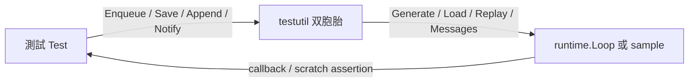
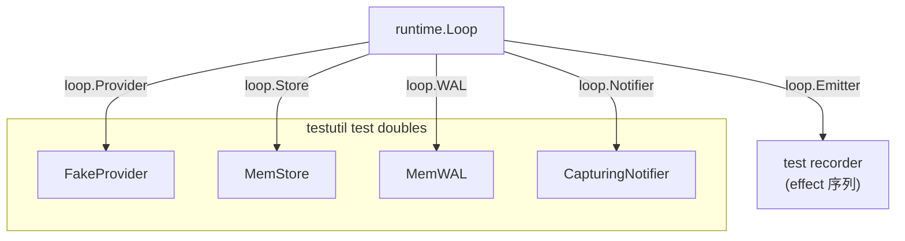

# Spec — internal/testutil/ 測試輔助套件

> 對應里程碑: M1 (核心範式 + sample 骨架) + M2 (系統韌性 + 循環防禦)
> 日期: 2026-07-07
> 範圍: `internal/testutil/` — SDK 與 sample 共享的測試元件 (`FakeProvider` / `MemStore` / `MemWAL` / `CapturingNotifier`)

## 目標

提供「deterministic、可斷言、不打網路」的測試雙胞胎 (test double),讓 SDK 與 sample 的整合測試能在 CI 內零外部依賴跑完。所有元件都是 `core` 介面的 in-memory 實作,並發安全 (mutex 守護),因此可以同時餵給多個 goroutine。



## 套件結構

| 檔案 | 元件 | 對應 `core` 介面 | 用途 |
|------|------|------------------|------|
| `fake_provider.go` | `FakeProvider` | `core.ModelProvider` | 腳本化 LLM 模擬,`CallCount` 追蹤 |
| `mem_store.go` | `MemStore` | `core.StateStore` | In-memory 狀態保存,`ErrNotFound` 區分「不存在」 |
| `mem_store.go` | `MemWAL` | `core.WAL` | In-memory WAL,`Append` / `Replay` / `Truncate` |
| `capturing_notifier.go` | `CapturingNotifier` | `core.Notifier` | 收集所有 `Notify` 訊息供斷言 |

## 為什麼放 `internal/`

- `internal/` 是 Go 編譯器的 enforcement 邊界:同 module 內的子套件可以 import,跨 module 編譯就會直接失敗。
- 防止 `production` 程式碼意外依賴測試元件 — `runtime` / `planning` / `sample/logdoctor` 都不能把 `FakeProvider` 帶到 release binary。
- 樣本獨立 module (`sample/logdoctor`) 走 `replace github.com/bizshuk/agentsdk => ../..`,跨模組 import 也會被擋下來;`FakeProvider` 的 sample-side mirror (`internal/fake.ScriptedProvider`) 才是 sample 用的。
- 慣例守護:任何 `testutil` 的 import 必須只出現在 `_test.go` 檔案內;CI 可加 `grep -R "agentsdk/internal/testutil" --include="*.go" | grep -v _test.go` 強制。

## `FakeProvider` — 腳本化 LLM

| 欄位 | 型別 | 用途 |
|------|------|------|
| `queue` | `[]core.ModelResult` | 預錄的 transcript,FIFO 取用 |
| `calls` | `int` | `Generate` 累計呼叫次數 (`CallCount` 回傳) |
| `streams` | `int` | `Stream` 累計呼叫次數 (debug 用) |
| `OnGenerate` | `func(core.ModelRequest)` | 每次 `Generate` 觸發前的 hook,測試可 capture 觸發 request |

公開 API:

| 函式 | 用途 |
|------|------|
| `NewFakeProvider()` | 空佇列起步 |
| `Enqueue(rs ...ModelResult)` | 追加多個 scripted result |
| `EnqueueToolCall(id, name, args)` | sugar — 單一 `tool_use` 結果 |
| `EnqueueEndTurn(text)` | sugar — 單一 `end_turn` 文字 |
| `Generate(ctx, req)` | 取下一個 queued result;queue 空回 `ErrQueueEmpty` |
| `Stream(ctx, req)` | 同上,包成 channel 形式回傳 |
| `CountTokens(ctx, msgs)` | 直接回 `len(msgs)` — token 計算不在測試斷言範圍 |
| `CallCount()` | 取累計呼叫次數 |
| `Name()` | 回 `"fake"` (符合 `core.ModelProvider`) |

合約:

- **決定論**: 給定同樣的 queue 與 request sequence,結果完全可重現。
- **錯誤處理**: 佇列耗盡時回 `ErrQueueEmpty` (sentinel error),`errors.Is(err, testutil.ErrQueueEmpty)` 可用於斷言。
- **併發安全**: `sync.Mutex` 保護 queue 與計數;`OnGenerate` 在 lock 內呼叫,callback 內不可重入 `Enqueue` (會 deadlock)。
- **Stream 簡化**: 一次送一個 `CHUNK_KIND_TEXT` chunk 並 `Done: true`,不模擬 SSE 多 chunk;測試需要多 chunk 應直接用 channel 自建 mock。

典型使用:

```go
fp := testutil.NewFakeProvider()
fp.EnqueueToolCall("c1", "read_log_tail", map[string]any{"n": 5})
fp.EnqueueEndTurn("done")
// ... 把 fp 餵給 loop.Run
require.Equal(t, 2, fp.CallCount())  // 2 次 LLM 呼叫
```

## `MemStore` — In-memory StateStore

| 欄位 | 型別 | 用途 |
|------|------|------|
| `states` | `map[string]core.State` | key 為 `RunID`,value 為 `State.Clone()` |

公開 API:

| 函式 | 用途 |
|------|------|
| `NewMemStore()` | 空 store 起步 |
| `Save(ctx, st)` | 寫入並 clone,避免外部 mutate 影響內部 |
| `Load(ctx, runID)` | 找不到回 `ErrNotFound`;找到回 `Clone()` |
| `List(ctx)` | 回所有 `RunID` slice (順序未定義) |
| `Delete(ctx, runID)` | 刪除一筆;不存在靜默成功 |
| `ErrNotFound` | sentinel error,sample-side 用來判斷 `run resume` 的存在性 |

合約:

- **深拷貝**: `Save` / `Load` 都 `Clone()` — caller 修改回傳的 `State` 不會污染 store。
- **併發安全**: `sync.RWMutex` — `Load` / `List` 用 read lock,`Save` / `Delete` 用 write lock。
- **跨 run 隔離**: 純粹靠 `RunID` 區分,沒有 scope 概念,測試可同時存多 run。

## `MemWAL` — In-memory WAL

| 欄位 | 型別 | 用途 |
|------|------|------|
| `byRun` | `map[string][]core.Input` | key 為 `RunID`,value 為 append-only `Input` 序列 |

公開 API:

| 函式 | 用途 |
|------|------|
| `NewMemWAL()` | 空 WAL 起步 |
| `Append(ctx, runID, seq, in)` | append 進 slice (不檢查 seq 連續性 — 測試信任 caller) |
| `Replay(ctx, runID, sinceSeq)` | 回 `Inputs[sinceSeq:]` 的 copy |
| `Truncate(ctx, runID, uptoSeq)` | 把前 `uptoSeq` 筆丟掉,保留後段 |

合約:

- **Replay 語意**: 對齊 `core.WAL` 介面 — 回傳 `Seq > sinceSeq` 的所有 input。`sinceSeq >= len(all)` 回 `(nil, nil)`,不視為錯誤。
- **Truncate 語意**: `uptoSeq` 之前的全部丟掉 (對齊 `file.WAL.Truncate`)。`uptoSeq >= len(all)` 是 no-op。
- **併發安全**: `sync.Mutex` 保護所有操作。
- **沒有 seq 連續性檢查**: Sample 可以故意跳號測試 recovery 路徑。

## `CapturingNotifier` — 訊息收集

| 欄位 | 型別 | 用途 |
|------|------|------|
| `msgs` | `[]string` | 累積所有 `Notify` 訊息 |

公開 API:

| 函式 | 用途 |
|------|------|
| `Notify(ctx, msg)` | 收訊息並 append |
| `Messages()` | 回傳 slice 的 copy (避免外部 mutate) |

合約:

- **錯誤永遠 nil**: Notifier 介面需要回 error,但收集器不模擬失敗 — 測試需要失敗路徑應自建 mock。
- **併發安全**: `sync.Mutex` 守護。
- **Not 結構性相容**: `core.Notifier` 只要求 `Notify(ctx, string) error`,`CapturingNotifier` 滿足。

## 整合測試組合 (Composition)

四個元件可獨立使用,但典型場景是「四件套一起餵給 Loop」:



整合測試骨架 (簡化):

```go
func TestSampleLogDoctor_E2E(t *testing.T) {
    fp := testutil.NewFakeProvider()
    fp.EnqueueToolCall("c1", "read_log_tail", map[string]any{"n": 5})
    fp.EnqueueToolCall("c2", "notify", map[string]any{"level": "warn", "message": "ERROR found"})
    fp.EnqueueEndTurn("done")

    store := testutil.NewMemStore()
    wal := testutil.NewMemWAL()
    notifier := testutil.NewCapturingNotifier()

    loop := runtime.NewLoop(step, fp, reg)
    loop.Store = store
    loop.WAL = wal
    loop.Notifier = notifier

    // ... 餵 percept
    final, _ := loop.Run(ctx, state, input)

    assert.Equal(t, 3, fp.CallCount())               // LLM 3 次
    assert.Equal(t, 1, len(notifier.Messages()))     // notify 1 次
    reloaded, _ := store.Load(ctx, final.RunID)
    assert.Equal(t, final.Turn, reloaded.Turn)      // state 持久化 round-trip
}
```

## 測試策略 (Testing Strategy)

| 場景 | 用什麼 | 為什麼 |
|------|--------|--------|
| 純函式 pattern 邏輯 | (不需要雙胞胎) — `Seed*` helper | scratch 直接 seed,跳過 LLM round-trip |
| 單一 effect dispatch | `FakeProvider` 1 個 Enqueue | 驗證 effect shape |
| 完整 transcript | `FakeProvider` 串多個 Enqueue | 驗證 Step 與 runtime 銜接 |
| State persistence | `MemStore` | 跨 `Run` / `Resume` 驗證 |
| WAL replay | `MemWAL` | 驗證 `loop.Resume` 從 `sinceSeq` 還原 |
| Notify 副作用 | `CapturingNotifier` | 驗證 `effect.notify` 觸發次數與內容 |
| Loop + Middleware 端到端 | 四件套一起 | M2 budget / retry / loopguard 的整合斷言 |

慣例:

- **決定論優先**: 測試裡的 `FakeProvider` queue 永遠寫死內容,不要靠隨機 / time-based 變化。
- **CallCount 是契約**: middleware / runtime 改了 dispatch 順序,`CallCount` 會跟著動,測試要跟著改 — 這是「LLM 呼叫次數變了」的可觀察訊號。
- **`ErrQueueEmpty` 是失敗訊號**: 測試結束時 queue 還有剩 → 沒走完整 transcript;queue 不夠 → setup 漏了 enqueue,Runtime 多叫了 LLM。兩者都要 fail-fast 修測試,不要用 `EnqueueEndTurn(...)` 把多餘的 call 吸掉。
- **避免在 production code import**: CI 加 grep 守護 `internal/testutil` 只在 `_test.go` 出現。

## 與 sample-side `internal/fake` 的分工

| 元件 | 位置 | 對象 |
|------|------|------|
| `internal/testutil.FakeProvider` | SDK module | SDK 內部測試 (e.g. `runtime/loop_test.go` 可能用到) |
| `internal/fake.ScriptedProvider` | sample module | sample E2E (e.g. `cmd/run.go --fake`) |

兩者刻意分離:

- SDK 測試需要 queue-based 通用 `FakeProvider`;sample 只需要固定 transcript 的 `ScriptedProvider`。
- 跨模組 import 會被 `replace` 設定擋下,雙胞胎不會意外互通。
- 命名 `internal/fake` 是 gosdk 的 noun 慣例,語意為「給 sample 內部用的 fake」,與 SDK 端的 testutil 不混淆。

## 設計決策 (Why)

| 決策 | 理由 |
|------|------|
| `FakeProvider` 用 FIFO queue 而非 function callback | 測試 setup 階段就能完整列舉 transcript,比 callback 鏈更直觀;`OnGenerate` 仍提供 hook 給需要 capture request 的場景 |
| `MemStore` / `MemWAL` 都做 deep clone | 測試改 `State` 不會污染 store;`Clone()` 是 `core.State` 已提供的廉價深拷貝,成本可接受 |
| `MemStore.ErrNotFound` 是 sentinel 而非 typed error | sample 的 `cmd/resume.go` 用 `errors.Is` 判斷 run 是否存在;`typed error` 對 sample 來說綁手綁腳 |
| `MemWAL.Truncate` 不檢查 seq 連續 | 測試需要能故意製造「刪掉前 N 筆」驗證 `Replay(sinceSeq)` 邊界,production WAL 不會這樣用 |
| `CapturingNotifier` 不模擬失敗 | 失敗路徑需要不同的斷言語意 (e.g.「呼叫 3 次第 2 次失敗」),混進 `CapturingNotifier` 會膨脹 API;測試自己寫 |
| `internal/` 守護而非 `pkg/testutil/` | Go 編譯器直接擋跨 module,不需要靠 linter / convention;零設定成本 |
| `ErrQueueEmpty` 是 exported sentinel | 測試需要 `errors.Is` 判斷「scripted 走完」,比 `err == nil` 多一層語意 |

## 開放問題 (Follow-ups)

- M3 引入 MCP `ToolSource` 動態註冊後,`MemWAL` 可能要支援「只 replay 部分 kind」來對應 sandbox diff 測試。
- M4 `mid-run approval` 落地後,`MemStore` 要不要也支援「只 Save 不觸發副作用」?現有設計已經滿足 (Save 本身無副作用),但測試 helper 仍可加 `MemStore.WithHook(...)` 觀察寫入時機。
- 是否要把 `FakeProvider.CallCount` 改成 `GenerateCalls` / `StreamCalls` 分別計數?目前 `Stream` 也有 `+1` 到 `calls`,但 `CallCount()` 名稱容易誤以為只看 `Generate`。先保留但加 docstring 警示。
- `CountTokens` 永遠回 `len(msgs)` 對 budget middleware 測試是「有夠用」,但若要測 budget 邊界,需要能注入計數函式 — M2 是否需要 `NewFakeProviderWithTokenCount(fn)` 變體,等 M2 budget test 寫了再決定。

## 驗收 (Acceptance)

- [x] `FakeProvider` 提供 `Enqueue` / `EnqueueToolCall` / `EnqueueEndTurn` / `Generate` / `CallCount`
- [x] `FakeProvider.Generate` queue 空時回 `ErrQueueEmpty` (`errors.Is` 可用)
- [x] `MemStore` 提供 `Save` / `Load` / `List` / `Delete`,Load 找不到回 `ErrNotFound`
- [x] `MemWAL` 提供 `Append` / `Replay` / `Truncate`,三個函式都做 deep copy 避免外部 mutate
- [x] `CapturingNotifier.Messages()` 回傳 slice copy
- [x] 四個元件都執行緒安全 (mutex 守護)
- [x] `internal/testutil` 只在 `_test.go` 出現 (CI grep 守護)
- [x] 跨模組 `sample/logdoctor` 不 import `internal/testutil` (靠 `replace` 設定擋)
