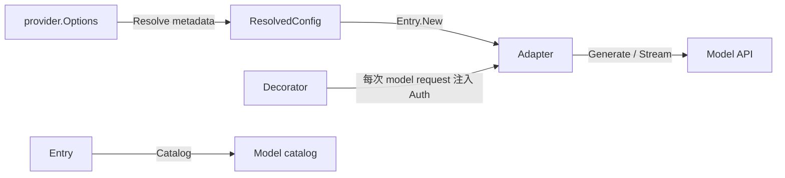
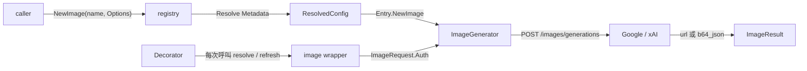

# Provider 認證與圖片能力規格

`狀態：已落地`

## 1. 目標與範圍 (Goal & Scope)

讓 `provider` 在不擴肥 `core.Provider` 的前提下，具備一致且可發現的：

- request-time 認證 (authentication)：同一套 credential resolution 同時覆蓋 model 與 image API。
- 圖片生成 (image generation)：支援 OpenAI-compatible
  `POST /v1/images/generations` contract。

首批 transport 實作為已由官方文件確認支援該 endpoint 的 `google` 與 `grok`。

本次不包含：

- 圖片編輯、variation 或 image streaming。
- 新增 agent instruction、tool 或 runtime image state。
- 在 adapter 內重做 login、refresh 或 credential store；這些仍由
  `provider/credential` 與外部 `auth` module 擁有。
- 把不支援 image endpoint 的 adapter 偽裝成可用。

## 2. 現況架構 (Current Architecture)



目前 `Decorator` 只包住 `Generate` / `Stream`，registry 也只有 model
factory；因此新增 image method 到某個 concrete adapter 並不足夠：
credential decorator 會遮掉 optional method，caller 也沒有一致的建構與
unsupported error。

## 3. 架構位置與邊界 (Placement & Boundaries)

```tree
provider/
├── image.go                    # ImageGenerator、request/result、decorator
├── capability.go               # capability vocabulary + unsupported error
├── registry.go                 # NewImage factory 與統一 resolve path
├── sample/                     # direct provider/auth/chat-image-audio access
├── protocol/openaiimage/       # OpenAI-compatible image JSON codec
├── google/image.go             # Google transport + auth header
└── grok/image.go               # xAI transport + auth header
```

- `core`：不變；agent runtime 沒有 image consumer，不新增 image port。
- `provider`：擁有 image caller contract、registry discovery 與 credential
  decoration。
- `provider/protocol/openaiimage`：只擁有已證明共享的 wire codec，不讀 env、
  不選 provider、不取得 credential。
- concrete adapter：只擁有 endpoint、default image model、HTTP transport 與
  vendor error prefix。
- `provider/sample`：直接消費 registry 與 model/image factory；audio 在獨立 contract
  與 adapter consumer 出現前只回 typed unsupported，不經 chat path 靜默降級。
- `provider/credential`：繼續是唯一可 import `github.com/bizshuk/auth` 的 package。

原 adapter 內只放 env / endpoint 常數的 `auth_api.go` 已統一改名為
`config.go`；它們不是 auth API，避免檔名誤導 ownership。

## 4. 介面與資料流 (Interfaces & Data Flow)

公開介面維持四個：

```go
type ImageGenerator interface {
	GenerateImage(context.Context, ImageRequest) (ImageResult, error)
}

func NewImage(name string, options Options) (ImageGenerator, error)

func (Entry) Supports(Capability) bool

func WithImageDecorator(
	name string,
	generator ImageGenerator,
	decorator Decorator,
) ImageGenerator
```



`ImageRequest.Auth` 是單次呼叫 override。完整 credential 優先序固定為
`單次 request Auth → 明示 Options.APIKey → Decorator → env`，與 model request
規則一致。

## 5. 清晰與可擴充性檢查 (Clarity & Scalability Check)

- 單一職責：auth 是跨 API policy，image 是 optional capability，兩者不混成 fat
  adapter interface。
- 單向依賴：`core <- provider <- concrete adapter`；protocol package 只依賴
  provider-neutral contract。
- 可替換性：不支援 images 的 provider 回傳可用 `errors.Is` 判斷的 typed error。
- 可擴充性：下一個 OpenAI-compatible adapter 只需新增 `NewImage` factory；非相容
  wire format 可自行實作 `ImageGenerator`，不必修改 shared codec。
- 安全性：成功 image response 上限 `128 MiB`；API error body 上限 `1 MiB`，
  保留的 structured details 上限 `16 KiB`，不回傳未清理的完整 upstream body；
  credential 不進 error 或 result。

## 6. 落地與驗證 (Landing & Verification)

1. [x] 新增 image domain contract、capability discovery、typed unsupported/API error。
2. [x] 把 registry 的 config resolution 抽成 model/image 共用路徑，補 decorator tests。
3. [x] 以 Google / xAI 跨 adapter contract test 鎖定共同 JSON，再建立
       `protocol/openaiimage` codec。
4. [x] 接上兩個 adapter 的 `/images/generations` transport 與 auth header。
5. [x] 統一 adapter config 檔名，更新 `README.md`、`CLAUDE.md` 與 `README.todo`。
6. [x] 驗證 root tests、adapter tests、dependency boundary、`gofmt`、`go vet` 與
       `git diff --check`。

## 7. 官方契約來源 (Official Contract Sources)

- [OpenAI Image API](https://developers.openai.com/api/docs/guides/image-generation)
- [Google Gemini OpenAI compatibility](https://ai.google.dev/gemini-api/docs/openai)
- [xAI Images REST API](https://docs.x.ai/developers/rest-api-reference/inference/images)
