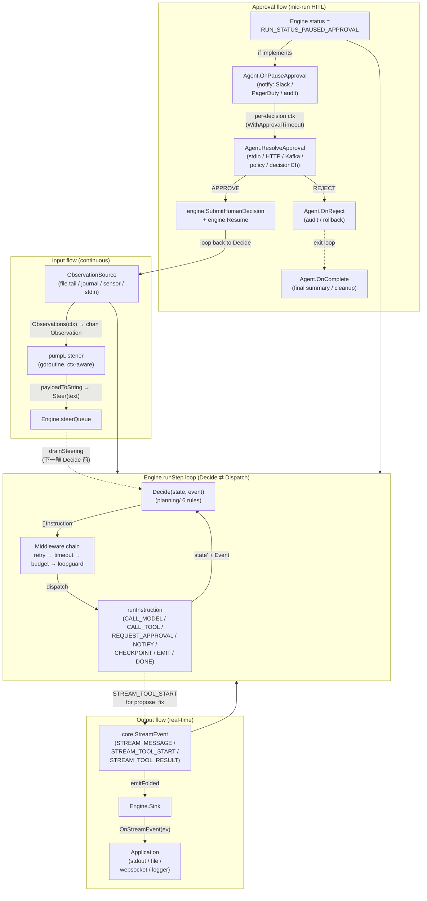
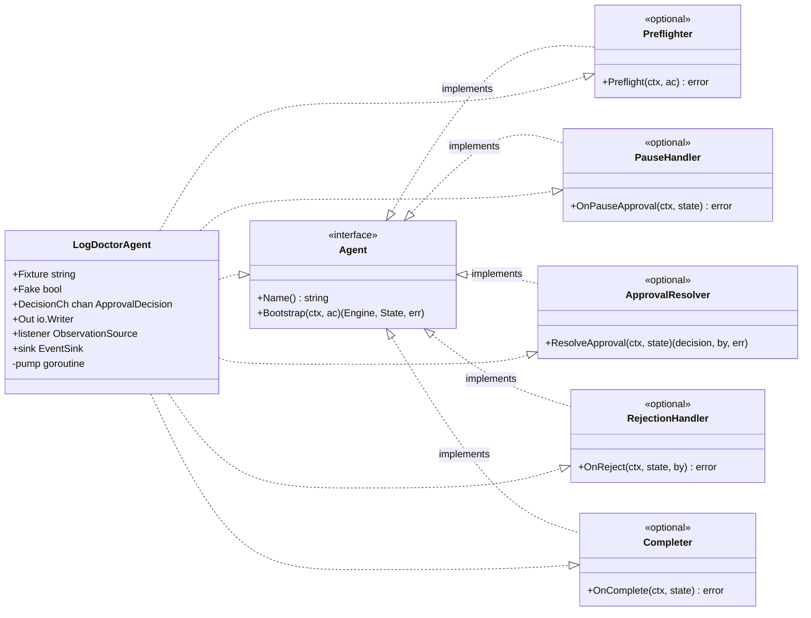
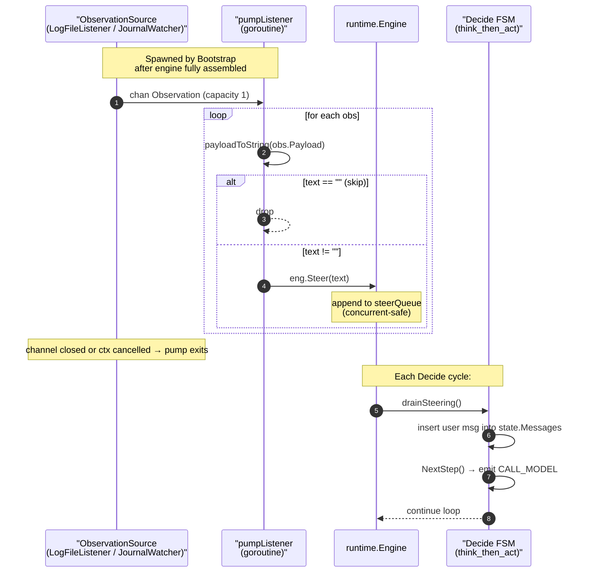
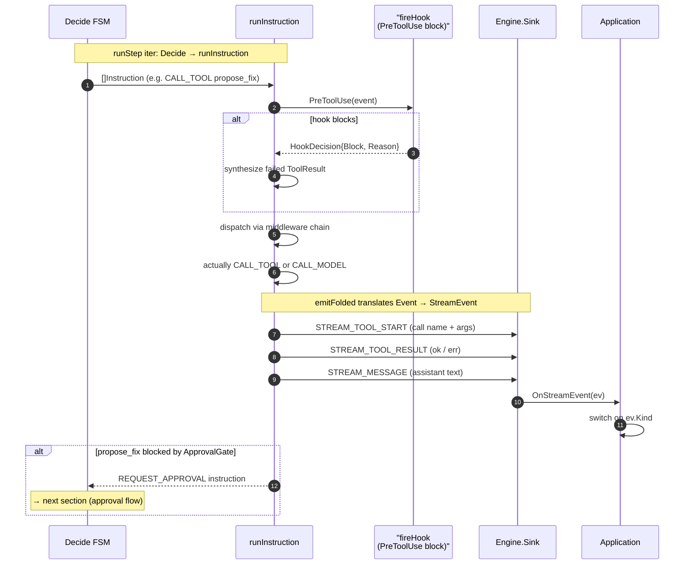
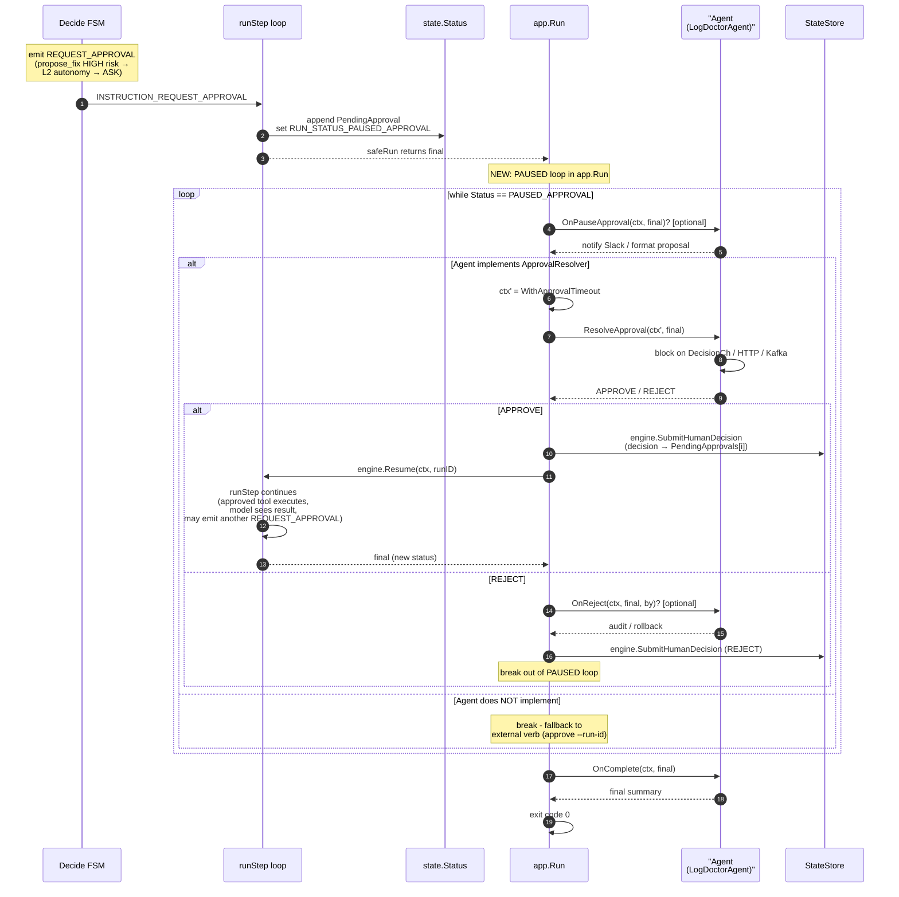
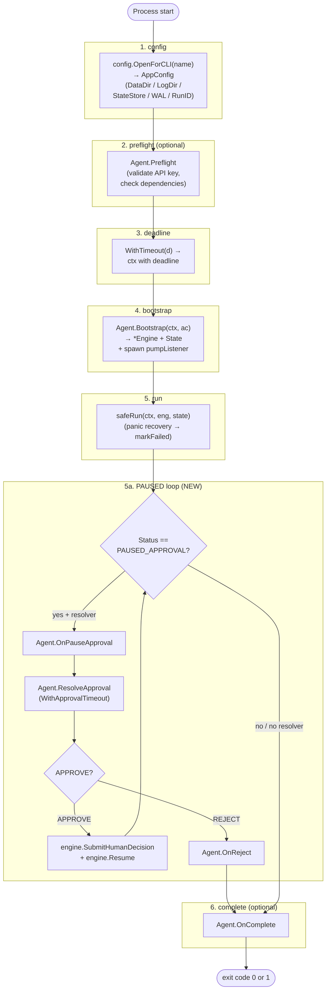

# Approval Mechanism Flow Diagram

> `SUPERSEDED 2026-07-24` — 已被 [`plans/2026-07-24-round-batch-and-interactive-seam.md`](../../../plans/2026-07-24-round-batch-and-interactive-seam.md) 取代。
> 修正版流程圖見新 plan §14；本檔的 §5 sequence diagram 畫的 `SubmitHumanDecision` → `Resume` 兩段驅動是錯的。

> 對應 plan：[`2026-07-23-agent-approval-resolver.md`](2026-07-23-agent-approval-resolver.md)
>
> 涵蓋三條流：input（listener → engine）、output（engine → sink）、approval（pause → resolver → resume），以及 agent 結構與 `app.Run` lifecycle。

---

## 1. 三流合一總覽



---

## 2. Agent 結構（單一 type 整合三介面）



**關鍵設計**：

- 五個 optional interface 全是 `func` 單一 method，可獨立 stub
- 不實作任何 optional interface = 既有行為（exit + 外部 verb）
- 實作 `ApprovalResolver` 但不實作 `PauseHandler` = 仍會通知但沒 Slack 推播
- 實作 `RejectionHandler` = 拒絕時觸發 audit；不實作 = 仍 reject 但無 audit hook

---

## 3. Input flow 細節



**資料形狀對應**：

```text
core.Observation.Payload  (any)              core.Engine.Steer (string)
   │                                                  │
   └─ payloadToString  ──────────────────────────────→┘
        ├─ nil        → "" (drop)
        ├─ string     → 原文
        ├─ Stringer   → .String()
        └─ 其他         → fmt.Sprintf("%v", ...)
```

---

## 4. Output flow 細節



**三種 `core.StreamEvent` 對應**：

| `ev.Kind` | 欄位 | 應用拿到什麼 |
| --- | --- | --- |
| `STREAM_MESSAGE` | `Text` | 完整 assistant 文字（一次一則） |
| `STREAM_TOOL_START` | `ToolCall` (含 Name + Args) | model 決定要呼叫的工具（**pre-dispatch**，可在 approval gate 前觀察） |
| `STREAM_TOOL_RESULT` | `ToolResult` (含 OK + Output + Error) | 工具實際回傳（含 hook 阻擋的 failed 結果） |

**關鍵時點**：`STREAM_TOOL_START` 是 **pre-dispatch**，所以 sink 可以在 engine pause 之前就先通知 operator。`STREAM_TOOL_RESULT` 是 **post-dispatch**，所以 hook 阻擋會反映在這裡（OK=false）。

---

## 5. Approval flow 細節（Q13 提案的核心）



**State 機狀態轉換**：

```text
COMPLETED ←────── (DONE instruction) ──────────── Decide FSM
   │
   │
FAILED ←────────── (panic / error) ──────────────── safeRun
   │
   │
PAUSED_APPROVAL ←─ (REQUEST_APPROVAL) ───────────── Decide FSM
   │
   ├─→ [PauseHandler] OnPauseApproval
   ├─→ [ApprovalResolver] ResolveApproval
   │     ├─ APPROVE → SubmitHumanDecision + Resume
   │     │     ├─ approved tool runs → next Decide → may PAUSE again
   │     │     └─ done naturally → COMPLETED
   │     └─ REJECT  → [RejectionHandler] OnReject → exit
   └─→ (no resolver) → exit, leave PendingApprovals for external verb
```

---

## 6. `app.Run` lifecycle 全圖（含 PAUSED loop）



**每段契約**：

| 段 | 必跑？ | 失敗時 | 輸出 |
| --- | --- | --- | --- |
| 1. config | 必 | exit 1 + slog error | AppConfig |
| 2. preflight | optional | exit 1（早於所有副作用）| — |
| 3. deadline | optional（default 30min）| ctx cancel | bounded ctx |
| 4. bootstrap | 必 | exit 1 | Engine + State |
| 5. run | 必 | panic → markFailed(FAILED) + exit 1 | final State |
| 5a. PAUSED loop | optional（resolver 存在才跑）| ResolveApproval error → exit 1 | 繼續 ResolveApproval 直到 non-paused |
| 6. complete | optional | exit 1 | final State |

---

## 7. 三流的 timing 對齊（同一個 run 內）

```mermaid
gantt
    title Input / Output / Approval timing within one run
    dateFormat X
    axisFormat %s

    section Input
    listener emits obs1      :a1, 0, 2
    listener emits obs2      :a2, 3, 5
    listener emits obs3      :a3, 6, 8

    section Decide cycle
    Decide round 1           :b1, 1, 2
    Decide round 2           :b2, 4, 5
    Decide round 3           :b3, 7, 10
    Decide round 4 (post-approval) :b4, 13, 14

    section Output
    sink emits msg           :c1, 1, 2
    sink emits tool_start    :c2, 7, 8
    sink emits tool_result   :c3, 9, 10

    section Approval
    pause + resolve          :d1, 11, 13
    submit + resume          :crit, 13, 14
```



時間軸：

```text
t=0   listener.emit(obs1) ──────────────┐
t=1   Decide(round1)                    │
t=2     emit CALL_MODEL                 │
t=3   listener.emit(obs2)               │ drainSteering 在 Decide 前
t=4   Decide(round2)                    │
t=5     append obs2 to state.Messages   │
t=6   listener.emit(obs3)               │
t=7   Decide(round3)                    │
t=8     CALL_TOOL propose_fix           │
        sink emits STREAM_TOOL_START    │
t=9     approval_gate → REQUEST_APPROVAL
        sink emits STREAM_TOOL_RESULT (failed)
t=10    Status = PAUSED_APPROVAL
        app.Run enters PAUSED loop
t=11  OnPauseApproval → Slack notify
t=12  ResolveApproval blocks on DecisionCh
        operator types "y"
t=13  SubmitHumanDecision(APPROVE)
      Resume → next Decide
t=14  Decide(round4)
      approved tool runs
      model emits DONE
      Status = COMPLETED
t=15  OnComplete → exit 0
```

---

## 8. 失敗 mode 與 fallback 對照

| 失敗 mode | 觸發條件 | 既有行為 | 新行為（有 resolver） |
| --- | --- | --- | --- |
| background process 無人值守 | `ResolveApproval` 阻塞中 | n/a（無 resolver） | `WithApprovalTimeout` 觸發 ctx cancel → exit 1 + 已 persist 的 PendingApprovals 留在 Store |
| operator 拒絕 | `ResolveApproval` 回 REJECT | n/a | `OnReject` 跑 + exit 0（audit 一致） |
| Resolver panic | user code panic | n/a | `safeRun` 已有 panic recovery；新 loop 在 safeRun 外，**需擴充 panic recovery**（見 plan Task 3） |
| Hook blocked + Approval 雙重阻擋 | PreToolUse block + ApprovalGate ASK | hook 阻擋優先 → failed ToolResult → model 看到 | 同上；resolver 不會被呼叫 |
| 跨 process 審批 | Agent 不實作 ApprovalResolver | exit，operator 跑 `approve --run-id` + `resume --run-id` | **保留不變**——loop 偵測無 resolver 就 break |
| 多重 pending approval | 短時間內 2 個 REQUEST_APPROVAL | 第一次 pause 後，runtime 不再處理（直到 resume） | loop 連續 resolve：第一個 approve → resume → 下一輪 decide → 第二個 pause → 第二次 resolve |

---

## 9. 對應程式碼位置速查

| 概念 | 檔案 | 行（plan 對應） |
| --- | --- | --- |
| `PauseHandler` interface | `app/agent.go` | Task 1 |
| `ApprovalResolver` interface | `app/agent.go` | Task 1 |
| `RejectionHandler` interface | `app/agent.go` | Task 1 |
| `WithApprovalTimeout` option | `app/app.go` | Task 2 |
| PAUSED loop | `app/app.go::Run` | Task 3 |
| `agent.WithListener` | `agent/options.go` | 既有 |
| `agent.WithSink` / `SinkFunc` | `agent/options.go` | 既有 |
| `pumpListener` goroutine | `agent/build.go::Bootstrap` | 既有 |
| `Engine.Steer` / `drainSteering` | `runtime/harness.go` | 既有 |
| `Engine.SubmitHumanDecision` | `runtime/loop.go:308-334` | 既有 |
| `Engine.Resume` | `runtime/loop.go` | 既有 |
| `REQUEST_APPROVAL` instruction 觸發 pause | `runtime/loop.go:154-168` | 既有 |
| `LogDoctorAgent` 範例 | `sample/logdoctor/agent.go` | Task 4 |
| 架構圖 §10 三軸 | `docs/architecture.svg` | 既有 |

---

## 10. 一句話總結

> Agent = input listener（goroutine → Steer queue）+ output sink（nil-safe StreamEvent 出口）+ approve resolver（block on decision channel）三流的**單一 type 整合點**；`app.Run` 在 `RUN_STATUS_PAUSED_APPROVAL` 時 loop 呼叫 `OnPauseApproval` → `ResolveApproval` → `SubmitHumanDecision + Resume`，直到非 paused；不實作 `ApprovalResolver` = 退回既有「exit + 外部 verb」語意，跨 process 場景自動 fallback。