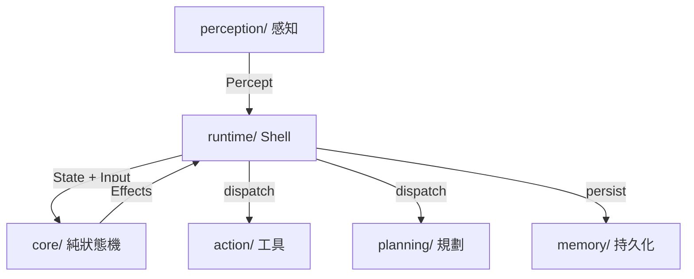
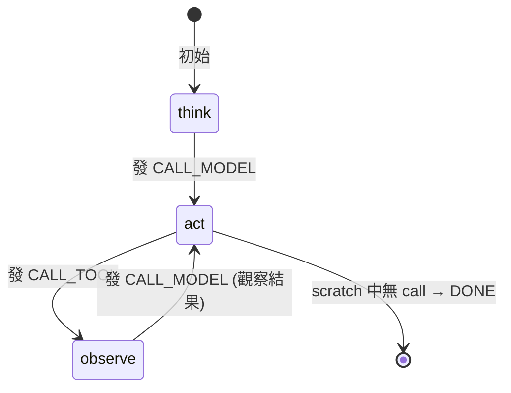

# agentSDK Tutorial — Build an Agentic Loop in Go

`agentSDK` 是一個純 Go 的目標導向控制迴圈 (Goal-directed Control Loop) SDK。
本教學帶你從零開始：理解核心概念、定義工具、組合 runtime，最後跑通第一個 agent。

## 前置需求

- Go 1.26+
- 已 clone `agentSDK` 且 `go work sync` 完成

```bash
cd agentSDK
go work sync
go mod download
```

## 架構總覽

agentSDK 分四層，每一層是一個頂層 package：



| 層 | Path | 角色 |
|----|------|------|
| 核心狀態機 | `core/` | `State`, `Effect`, `Step`, `ThinkingPattern` — 純函式,零依賴 |
| 感知 | `perception/` | `Source` 介面 — 外部事件進入迴圈 |
| 規劃 | `planning/` | 6 種 `ThinkingPattern` — 決定下一步做什麼 |
| 行動 | `action/` | `TypedTool`, `Registry` — 註冊與呼叫工具 |
| Shell | `runtime/` | `Loop` — 把上面的零件串起來，跑控制迴圈 |
| 持久化 | `memory/` | `StateStore`, `WAL`, checkpoint / recovery |

## 1. 核心概念

### 1.1 State — 一次 run 的可序列化快照

```go
import "github.com/bizshuk/agentsdk/core"

state := core.State{
    RunID:        "my-first-run",
    ThinkingKind: core.THINK_REACT,      // 選擇思考模式
    Autonomy:     core.AUTONOMY_L2,      // 自主等級
    Budget:       core.Budget{MaxTurns: 10},
}
```

`State` 是整個 run 的唯一真實來源。所有欄位都是 JSON-marshalable，
所以可以暫停、序列化、從硬碟恢復後繼續執行。

### 1.2 Effect — 狀態機輸出的副作用

`Step` 不回傳 I/O 結果，只回傳 `[]Effect` — 一種 tagged union：

```go
// 7 種 Effect kind
core.EFFECT_CALL_MODEL    // 叫 LLM
core.EFFECT_CALL_TOOL     // 呼叫工具
core.EFFECT_REQUEST_APPROVAL // HITL 審批
core.EFFECT_NOTIFY        // 通知操作員
core.EFFECT_CHECKPOINT    // 保存進度
core.EFFECT_EMIT          // 對外推送事件
core.EFFECT_DONE          // 結束
```

Runtime 拿到 effects 後逐個 dispatch 到對應的 port (ModelProvider / ToolRegistry / Notifier ...)。
Effect 是宣告式的 — pattern 只說「我想做什麼」，runtime 決定「怎麼做」。

### 1.3 Input — 驅動一步轉換

```go
// 5 種 Input kind
core.INPUT_KIND_PERCEPT          // 新觀察
core.INPUT_KIND_MODEL_RESULT     // LLM 回傳結果
core.INPUT_KIND_TOOL_RESULT      // 工具執行完畢
core.INPUT_KIND_APPROVAL_DECISION // HITL 決定
core.INPUT_KIND_RESUME           // checkpoint 恢復
```

### 1.4 Step — 純轉換函式

```go
type Step func(state State, input Input) (State, []Effect)
```

`Step` 是 **純函式**：無 I/O、給定 (state, scratch) 時具確定性。
這是 agentSDK 最重要的設計約束 — pattern 永遠不直接呼叫 LLM 或工具。

`NewStep` 是唯一 dispatch 點，依 `state.ThinkingKind` 選擇 pattern：

```go
step := core.NewStep(map[core.ThinkingKind]core.ThinkingPattern{
    core.THINK_REACT: planning.NewReAct(),
})
```

## 2. 定義工具 (Tool)

工具用泛型 `TypedTool[TArgs, TOut]` 定義，args schema 由 reflection 自動生成：

```go
import (
    "github.com/bizshuk/agentsdk/action"
    sdkcore "github.com/bizshuk/agentsdk/core"
)

// Step 1: 定義 args 與 output struct
type GreetArgs struct {
    Name string `json:"name"`
}

type GreetOutput struct {
    Reply string `json:"reply"`
}

// Step 2: 用 NewTypedTool 包裝你的函式
greetTool := action.NewTypedTool(
    "greet",                        // tool name (LLM 會看到)
    "Greet someone by name",        // description
    func(ctx context.Context, a GreetArgs) (GreetOutput, error) {
        return GreetOutput{Reply: "Hello, " + a.Name + "!"}, nil
    },
)

// Step 3: 如果需要審批，設定 risk level
greetTool.SetRisk(sdkcore.RISK_LEVEL_HIGH)
```

### 2.1 註冊到 Registry

```go
reg := action.NewRegistry()
reg.Register(greetTool)

// 也可以包裝成 struct 隱藏內部 TypedTool：
type GreetTool struct {
    Inner *action.TypedTool[GreetArgs, GreetOutput]
}

func (g *GreetTool) Name() string                { return g.Inner.Name() }
func (g *GreetTool) Description() string         { return g.Inner.Description() }
func (g *GreetTool) Schema() sdkcore.ToolSchema  { return g.Inner.Schema() }
func (g *GreetTool) Risk() sdkcore.RiskLevel     { return g.Inner.Risk() }
func (g *GreetTool) Call(ctx context.Context, args json.RawMessage) (sdkcore.ToolResult, error) {
    return g.Inner.Call(ctx, args)
}
```

## 3. 感知輸入 (Perception)

`perception.Source` 是外部世界進入 agent 的入口：

```go
type Source interface {
    Name() string
    Percepts(ctx context.Context) <-chan core.Percept
}
```

實作一個簡單 Source：

```go
type StdinSource struct{}

func (s *StdinSource) Name() string { return "stdin" }

func (s *StdinSource) Percepts(ctx context.Context) <-chan core.Percept {
    ch := make(chan core.Percept, 1)
    go func() {
        defer close(ch)
        scanner := bufio.NewScanner(os.Stdin)
        for scanner.Scan() {
            ch <- core.Percept{
                ID:         fmt.Sprintf("msg-%d", time.Now().UnixNano()),
                Source:     "stdin",
                ObservedAt: time.Now().UTC(),
                Payload:    scanner.Text(),
            }
        }
    }()
    return ch
}
```

多個 Source 可以用 `perception.Multi` 合併：

```go
multi := &perception.Multi{Sources: []perception.Source{
    &StdinSource{},
    &LogFileListener{},
}}
```

## 4. ThinkingPattern — 選擇思考模式

agentSDK 提供 6 種 pattern，透過 `state.ThinkingKind` 選擇：

| Pattern | Kind | 適合場景 |
|---------|------|---------|
| ReAct | `THINK_REACT` | 通用: think → act → observe 循環 |
| Planner-Executor | `THINK_PLANNER_EXECUTOR` | 先產出藍圖,再逐步執行 |
| Executor-Critic | `THINK_EXECUTOR_CRITIC` | 執行後自我批評,迭代改進 |
| CoT Singleshot | `THINK_COT_SINGLESHOT` | 一次性思考鏈 (STUB) |
| Reflexion | `THINK_REFLEXION` | 記住失敗,反思重試 (STUB) |
| Router | `THINK_ROUTER` | 多 agent 路由 (STUB) |

`ReAct` 是最簡單的起點。它的 FSM 透過 `scratch["react.phase"]` 驅動：



### 4.1 使用 Scratch 注入工具呼叫

Pattern 不解析 LLM 輸出 — runtime 在呼叫 Step 前把 model result 寫入 scratch，
pattern 從 scratch 讀取：

```go
// runtime preStep 做的事 (自動)：
if input.ModelResult != nil && len(input.ModelResult.ToolCalls) > 0 {
    preStep.Scratch["react.last_call_id"] = input.ModelResult.ToolCalls[0]
}
```

這讓 `Step` 保持純函式 — 它只讀 `state.Scratch` 而非 `Input`。

## 5. 組合 Runtime

`runtime.Loop` 把所有零件串起來：

```go
import (
    "github.com/bizshuk/agentsdk/action"
    "github.com/bizshuk/agentsdk/core"
    "github.com/bizshuk/agentsdk/planning"
    "github.com/bizshuk/agentsdk/runtime"
)

// 1. 工具註冊表
reg := action.NewRegistry()
reg.Register(greetTool)

// 2. ThinkingPattern
step := core.NewStep(map[core.ThinkingKind]core.ThinkingPattern{
    core.THINK_REACT: planning.NewReAct(),
})

// 3. 建立 Loop（至少需要 step + model + tools）
loop := runtime.NewLoop(step, myModelProvider, reg)

// 4. 選擇性掛載
loop.Emitter = func(eff core.Effect) {
    // 每個 effect 都會回呼這裡 — 適合 JSONL 輸出或 WebSocket
    enc := json.NewEncoder(os.Stdout)
    enc.Encode(eff)
}
loop.Notifier = myNotifier  // 實作 core.Notifier 介面
loop.Approval = myPolicy    // 實作 core.ApprovalPolicy 介面
```

### 5.1 初始化 State 並啟動

```go
state := core.State{
    RunID:        "run-" + time.Now().Format("20060102-150405"),
    ThinkingKind: core.THINK_REACT,
    Autonomy:     core.AUTONOMY_L2,
    Budget:       core.Budget{MaxTurns: 10},
}

// Run 從空 Input 開始（pattern 看 state.Messages）
final, err := loop.Run(context.Background(), state)

// 或 RunWithInput — 先注入一個 Percept
final, err := loop.RunWithInput(context.Background(), state, core.Input{
    Kind:    core.INPUT_KIND_PERCEPT,
    Percept: &firstPercept,
})
```

## 6. Middleware 鏈 — 系統韌性

Runtime 自帶一條 middleware chain，執行順序 (外→內)：

```text
retry → timeout → budget → loopguard → base dispatch
```

| Middleware | Path | 功能 |
|------------|------|------|
| Retry | `middleware/harness/retry.go` | 最多 N 次,指數 backoff |
| Timeout | `middleware/harness/timeout.go` | 每個 effect 的 wall-time 上限 |
| Budget | `middleware/harness/budget.go` | token / turn / wall-time 用完即停 |
| Loopguard | `middleware/loopguard/loopguard.go` | 指紋去重,連續 CALL_TOOL → REQUEST_APPROVAL |

預設 chain 開箱即用。你也可以自訂：

```go
loop.Middleware = middleware.Chain(
    harness.Retry(harness.RetryConfig{N: 5, BaseBackoff: 200 * time.Millisecond}),
    harness.Timeout(harness.TimeoutConfig{PerEffect: 30 * time.Second}),
    harness.Budget(),
    loopguard.New(loopguard.Config{MaxRepeats: 3}),
    // M3/M4 slot: sandbox, approval, spotlight ...
)
```

### 6.1 Budget guard 行為

當 budget 超限時，runtime 回傳 `harness.BudgetExceededError`，caller 可用 `errors.As` 檢測：

```go
if runtime.IsBudgetExceeded(err) {
    log.Println("run stopped: budget exceeded")
}
```

## 7. 持久化 — StateStore + WAL + Resume

### 7.1 FileStateStore

```go
import "github.com/bizshuk/agentsdk/memory/filestore"

store, _ := filestore.NewFileStateStore("./data")
loop.Store = store
```

### 7.2 WAL (Write-Ahead Log)

```go
wal, _ := filestore.NewFileWAL("./data")
loop.WAL = wal
```

### 7.3 Resume — 從中斷恢復

```go
// Run 被中斷後，用 Resume 從上次 checkpoint 繼續
// WAL replay 不回發 LLM 呼叫 — 原始 ModelResult 已在 WAL 中
final, err := loop.Resume(context.Background(), "my-run-id")
```

Resume 語意：
1. 從 Store 載入 State
2. 從 WAL replay `Seq > state.LastInputSeq` 的 Inputs
3. WAL 本身包含 `ModelResult` / `ToolResult`，所以不重複呼叫 LLM
4. 回到正常 loop 繼續

## 8. 完整範例 — 從零打造 greet-agent

以下是一個最小可行的 agent：它讀取 stdin 輸入的名字，然後用 `greet` 工具回覆。

### 8.1 專案結構

```text
greet-agent/
├── main.go
├── tool/
│   └── greet.go
└── internal/
    └── fake/
        └── provider.go
```

### 8.2 定義工具 (`tool/greet.go`)

```go
package tool

import (
    "context"
    "encoding/json"
    "fmt"

    "github.com/bizshuk/agentsdk/action"
    sdkcore "github.com/bizshuk/agentsdk/core"
)

type GreetArgs struct {
    Name string `json:"name"`
}

type GreetOutput struct {
    Reply string `json:"reply"`
}

type Greet struct {
    Inner *action.TypedTool[GreetArgs, GreetOutput]
}

func NewGreet() *Greet {
    t := action.NewTypedTool("greet",
        "Greet someone by name and return a friendly reply",
        func(_ context.Context, a GreetArgs) (GreetOutput, error) {
            if a.Name == "" {
                return GreetOutput{}, fmt.Errorf("name is required")
            }
            return GreetOutput{Reply: fmt.Sprintf("Hello, %s! Nice to meet you.", a.Name)}, nil
        })
    return &Greet{Inner: t}
}

// 實現 core.Tool 介面
func (g *Greet) Name() string                       { return g.Inner.Name() }
func (g *Greet) Description() string                { return g.Inner.Description() }
func (g *Greet) Schema() sdkcore.ToolSchema          { return g.Inner.Schema() }
func (g *Greet) Risk() sdkcore.RiskLevel             { return g.Inner.Risk() }
func (g *Greet) Call(ctx context.Context, raw json.RawMessage) (sdkcore.ToolResult, error) {
    return g.Inner.Call(ctx, raw)
}
```

### 8.3 Scripted Provider (`internal/fake/provider.go`)

```go
package fake

import (
    "context"
    "github.com/bizshuk/agentsdk/core"
)

type ScriptedProvider struct{ idx int }

func NewScriptedProvider() *ScriptedProvider { return &ScriptedProvider{} }

func (p *ScriptedProvider) Name() string { return "fake-greet" }

func (p *ScriptedProvider) Generate(_ context.Context, _ core.ModelRequest) (core.ModelResult, error) {
    switch p.idx {
    case 0:
        p.idx++
        // 第一次呼叫: 要求呼叫 greet 工具
        return core.ModelResult{
            StopReason: "tool_use",
            ToolCalls: []core.ToolCall{{
                ID:   "c1",
                Name: "greet",
                Args: map[string]any{"name": "World"},
                Risk: core.RISK_LEVEL_LOW,
            }},
        }, nil
    default:
        // 第二次呼叫: 結束 (runtime short-circuit 到 COMPLETED)
        return core.ModelResult{
            StopReason: "end_turn",
            Text:       "All done!",
        }, nil
    }
}

func (p *ScriptedProvider) Stream(_ context.Context, _ core.ModelRequest) (<-chan core.ModelChunk, error) {
    ch := make(chan core.ModelChunk, 1)
    ch <- core.ModelChunk{Kind: core.CHUNK_KIND_TEXT, Text: "done", Done: true}
    close(ch)
    return ch, nil
}

func (p *ScriptedProvider) CountTokens(_ context.Context, msgs []core.Message) (int, error) {
    return len(msgs), nil
}
```

### 8.4 組合 (`main.go`)

```go
package main

import (
    "context"
    "encoding/json"
    "fmt"
    "os"
    "time"

    "github.com/bizshuk/agentsdk/action"
    "github.com/bizshuk/agentsdk/core"
    "github.com/bizshuk/agentsdk/planning"
    "github.com/bizshuk/agentsdk/runtime"

    "greet-agent/internal/fake"
    "greet-agent/tool"
)

func main() {
    // 1. 註冊工具
    reg := action.NewRegistry()
    reg.Register(tool.NewGreet())

    // 2. 選擇 ReAct pattern
    step := core.NewStep(map[core.ThinkingKind]core.ThinkingPattern{
        core.THINK_REACT: planning.NewReAct(),
    })

    // 3. Scripted provider (開發階段, 不需真實 LLM)
    provider := fake.NewScriptedProvider()

    // 4. 建立 loop
    loop := runtime.NewLoop(step, provider, reg)

    // 5. 掛 JSONL emitter
    loop.Emitter = func(eff core.Effect) {
        enc := json.NewEncoder(os.Stdout)
        enc.Encode(eff)
    }

    // 6. 初始 state
    state := core.State{
        RunID:        fmt.Sprintf("greet-%d", time.Now().UnixNano()),
        ThinkingKind: core.THINK_REACT,
        Autonomy:     core.AUTONOMY_L2,
        Budget:       core.Budget{MaxTurns: 10},
    }

    // 7. 注入初始 instruction 作為 Percept
    final, err := loop.RunWithInput(context.Background(), state, core.Input{
        Kind: core.INPUT_KIND_PERCEPT,
        Percept: &core.Percept{
            ID:         "start",
            Source:     "cli",
            ObservedAt: time.Now().UTC(),
            Payload:    "Please greet the user named World.",
        },
    })
    if err != nil {
        fmt.Fprintf(os.Stderr, "error: %v\n", err)
        os.Exit(1)
    }

    fmt.Fprintf(os.Stderr, "final status: %s (turn %d)\n", final.Status, final.Turn)
}
```

### 8.5 執行

```bash
go run .
```

預期輸出 (JSONL)：

```json
{"kind":"call_model","call_model":{"request_id":"1","messages":null}}
{"kind":"call_tool","call_tool":{"call":{"id":"c1","name":"greet","args":{"name":"World"},"risk":"low"}}}
{"kind":"call_model","call_model":{"request_id":"2","messages":[...]}}
{"kind":"done"}
```

```text
final status: completed (turn 2)
```

## 9. 換成真實 LLM Provider (M4)

M4 提供三個 provider adapter，都實作 `core.ModelProvider` 介面：

```go
// Anthropic
import anthropicprovider "github.com/bizshuk/agentsdk/provider/anthropic"

provider := anthropicprovider.New(
    anthropicprovider.WithAPIKey(os.Getenv("ANTHROPIC_API_KEY")),
    anthropicprovider.WithModel("claude-sonnet-4-6"),
)

// OpenAI-compatible
import openaiprovider "github.com/bizshuk/agentsdk/provider/openaicompat"

provider := openaiprovider.New(
    openaiprovider.WithAPIKey(os.Getenv("OPENAI_API_KEY")),
    openaiprovider.WithBaseURL("https://api.openai.com/v1"),
)

// Google GenAI
import googleprovider "github.com/bizshuk/agentsdk/provider/google"

provider := googleprovider.New(
    googleprovider.WithAPIKey(os.Getenv("GOOGLE_API_KEY")),
)
```

切換 provider 只需改一行 — `Loop` 不關心 provider 實作細節。

## 10. HITL (Human-in-the-Loop) 審批

當 tool 標記 `RISK_LEVEL_HIGH` 且 `Autonomy` 不足時，loopguard 或 approval policy 會發 `REQUEST_APPROVAL`。
Run 進入 `PAUSED_FOR_APPROVAL` 狀態，caller 可以：

```go
// 外部系統收到 approval request 後，注入決定
decision := core.ApprovalDecision{
    // ...
}
final, err := loop.SubmitApproval(ctx, "my-run-id", decision, "operator-name")
```

## 11. 與 gosdk 整合

`core.Notifier` 與 `gosdk/notify.Notifier` 方法集結構性相容：

```go
import "github.com/bizshuk/gosdk/notify"

// gosdk notifier 直接傳入，無需 adapter
loop.Notifier = notify.NewMulti(
    notify.NewStdout(),
    notify.NewSlack(os.Getenv("SLACK_WEBHOOK")),
)
```

`core.StateStore` / `core.WAL` 也可以換成 gosdk 的 Redis / DB 實作。

## 下一步

- 閱讀 `docs/specs/` 下的 milestone 規格了解更多細節
- 參考 `sample/logdoctor/` 看更完整的範例 (含 persistence + resume)
- 看 `planning/` 下的其他 pattern 選擇適合的思考模式
- M3 的 sandbox / MCP / tracing 功能用 `middleware.Chain` 插入

---

## 常見問題

**Q: core/ 為什麼連 gosdk 都不依賴？**
A: 保持核心可獨立發佈。所有 I/O 與 vendor 依賴都在 `runtime/` 和 `provider/`。

**Q: 我可以同時註冊多個 ThinkingPattern 嗎？**
A: 可以，但一個 run 只用一個 (由 `state.ThinkingKind` 決定)。不同 run 可以選不同 pattern。

**Q: 怎麼處理 tool 內部錯誤？**
A: `ToolResult.OK = false` + `ToolResult.Error` 字串。LLM 會看到 error 並決定下一步。
不要 panic — runtime 不會 recover tool panic。

**Q: 怎麼測試我的 agent？**
A: 用 `internal/testutil` 的 `FakeProvider` / `MemStore` / `MemWAL`。
`ScriptedProvider` pattern (見 `sample/logdoctor/internal/fake/`) 適合 E2E 測試。
