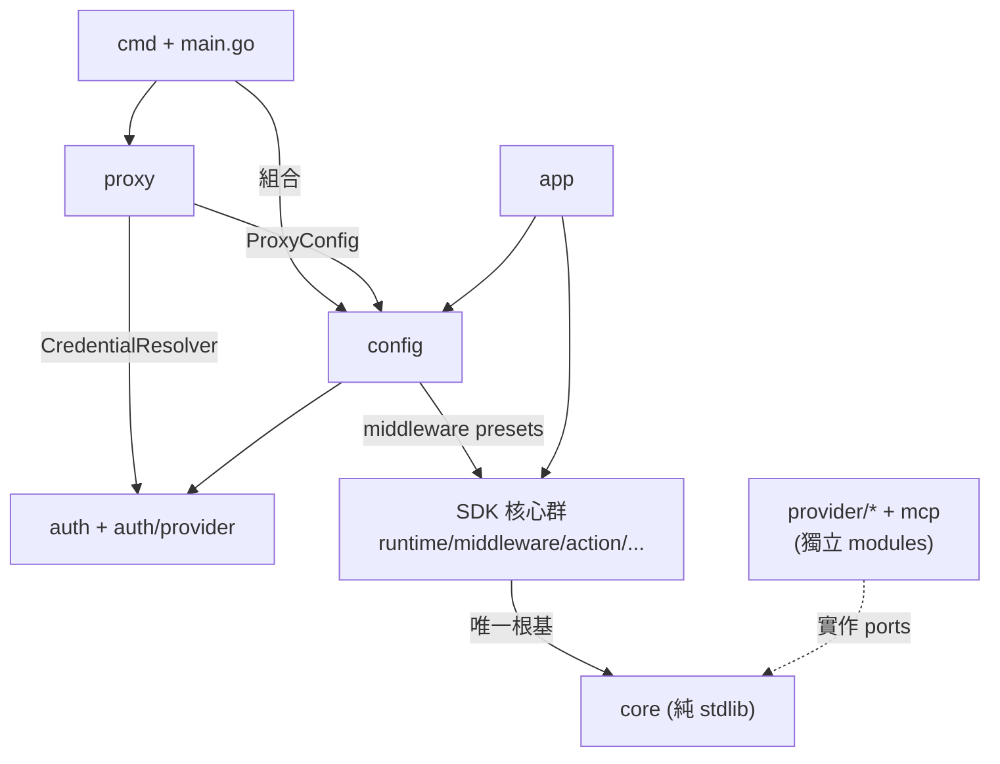
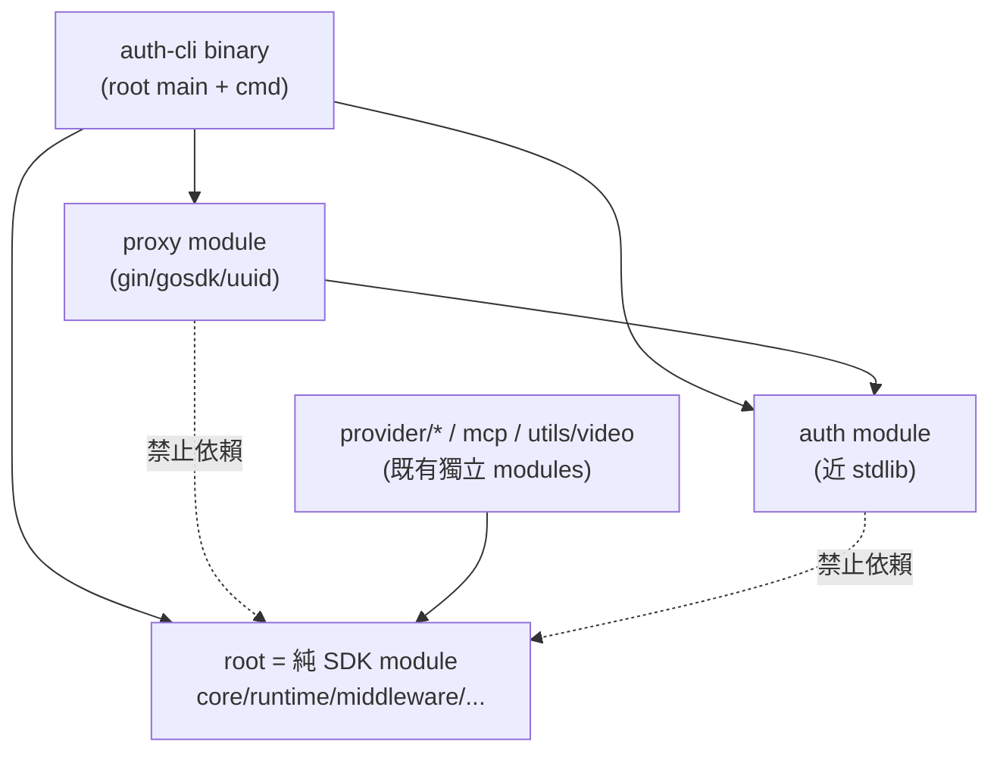
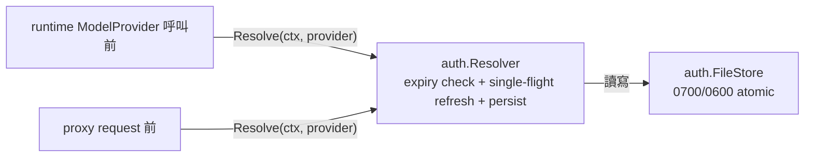

# 架構計畫 — module-split-roadmap

日期：2026-07-18
狀態：已完成（7 步全數執行完畢，2026-07-18 同日落地）
範圍：root module 的整合流程整理、未來發展方向、以及後續 module 拆分路線

執行結果摘要：

- workspace 12 → 14 modules（新增 `auth`、`proxy`），`perception/` 刪除。
- root 直接依賴剩 `gosdk`、OTel(trace)、cobra/viper/jsonschema；gin、uuid、OTel metric 隨 proxy 遷出（gosdk 因 `config.OpenForCLI`/`app` 需留在 root，修正本計畫步驟 5 原「root go.mod 無 gin/gosdk」的過度預期）。
- refresh 語義統一：`auth.Resolver`（active.json → 字母序 → env → 過期換發）+ proxy thin adapter + `config.NewRefreshingProvider`。
- 額外修正：`app.Run` 空名稱 guard 恢復（`56df827` 誤改造成的 pre-existing 紅測）；`cmd/use.go` active.json 邏輯收斂到 `auth.SaveActiveName`。
- 追加步驟 8（user 指示）：CLI 指令集隨 module 走 — `auth/cmd.Install(root, appName)` 掛載憑證指令集（store 目錄解析改 stdlib，`config.OpenAuthStore` 刪除）、`proxy/cmd.NewCommand()` 提供 `proxy` 指令；root `cmd/` 縮為純聚合殼（~50 行），CLI 對外介面不變，三組指令可被任何 cobra root 單獨掛載。
- 追加步驟 9（user 指示）：`auth`、`proxy` module root 各建 `main.go`（binary-first 佈局），函式庫檔案移入 `auth/auth`、`proxy/proxy` 子套件（package 名不變，import path 加一層，git mv 保留歷史）；全 workspace import path 同步改寫；依賴方向 main → cmd → 函式庫 → 下游，`go list -deps` 驗證函式庫不反向依賴 cmd（無環）。兩 binary 與 `auth-cli` 共用設定/憑證目錄。
- 追加步驟 10（user 指示，二階段 MVC 拆分）：
  - **stage A（已完成）**：auth 內部從 `auth/auth` 拆為第一層語意通用 package — `model/`（Credential/Kind/Option/VerifyResult/Authenticator/errors）、`svc/`（OAuth/Device/APIKey/PKCE/Cookie/Resolver flows）、`utils/`（FileStore/active.json/PKCE/OpenBrowser/PrintDeviceCode）。理由：檔名比 package 名更易識別（`auth/auth/store.go` 看不出是憑證檔邏輯；`auth/utils/store.go` 一眼知道是工具層）。`model.Options.OpenBrowser`/`ShowDeviceCode` 預設改 nil（caller 注入），簽名改 `func(any)` — model 不反向依賴 svc.DeviceCode 型別，維持單向。`SetMetadata` 從 svc 搬到 model（local-type method 要求）。全 workspace ~40 檔 import path `auth/auth` → `auth/{model,svc,utils}`，外加 `sdkauth`/`auth` alias 與各檔實質使用的子 package alias 同步處理。11 個 auth 套件全綠。
  - **stage B（已完成）**：proxy 內部從 `proxy/proxy` 拆為第一層通用 package — `handlers/`（server/handler/middleware/observability，Gin HTTP surface 與 OTel 觀測）、`config/`（LoadConfig/Config/ServerConfig/StatsConfig）、`model/`（原 protocol 套件，package 改名為 `model`，包含 anthropic/chat/responses 三個 sub-format 套件）、`svc/{route,transform,upstream}/`（第二層 domain，route 為「qualified model → provider」、transform 為 9 組 pairwise transforms、upstream 為「HTTP client + profile + credential resolver」）。理由：handler/config/model 是跨 module 一致的層級命名（與 auth/model-svc-utils 同語意）；svc/* 是 proxy-specific 業務 domain。保留 `config/config.go` 既有 `Providers`/`LegacyAPIKeys` 設定結構（他人階段進度）。修兩個 pre-existing 變數遮蔽問題：`router.go` 的 `func Resolve(format, model string)` 參數 `model` 在 package 改名為 `model` 後會遮蔽 import，故改名為 `modelName`；`handler.go` 的 `HandleCountTokens` closure 中 `request, model, err := ...` 同樣改名。其他 alias 處理：`auth/model` 與 `proxy/model` 同名衝突用 `authmodel` 區隔。Stage B 完成後 proxy module 8 套件 + 全 14 modules workspace 測試綠。

## 1. 目標與範圍 (Goal & Scope)

目標：

- 整理 agentsdk 現有 12 個 module 的整體架構與三條整合流程（agent loop、proxy、auth）。
- 延續 `utils/video` 抽離模式（見 git `0635f14`..`383b4bc`），規劃下一波 module 拆分方向。
- 收斂未來發展方向：credential 自動 refresh 統一、streaming 一致化、`perception/` 去留、`provider/minimax`。

Out of scope：

- 不改動 proxy 的 pairwise `3×3` transform 架構（已由 [`2026-07-16-pairwise-agent-provider-transform.md`](../docs/specs/2026-07-16-pairwise-agent-provider-transform.md) 定案）。
- 不處理 continuous logdoctor 的實作細節（已有獨立 spec [`2026-07-18-continuous-logdoctor-minimax.md`](../docs/specs/2026-07-18-continuous-logdoctor-minimax.md)）。
- 不做 `/admin/*` API 設計。

## 2. 現況架構 (Current Architecture)

### 2.1 Module 分群（12 modules）

```text
root (github.com/bizshuk/agentsdk)
├── SDK 核心群      core / planning / action / tool / memory / middleware / runtime / cli / perception
├── 組合層          app / config / cmd / main.go
├── 認證            auth / auth/provider/*（6 個 provider 包）
└── proxy           protocol / route / transform / upstream
獨立 modules
├── mcp                          # action.ToolSource adapter
├── provider/{anthropic,google,openaicompat}
├── utils/video                  # 2026-07-18 剛抽離
└── sample/*（6 個）
```

### 2.2 root module 內部依賴實測（`go list` 驗證）



### 2.3 外部依賴分佈（拆分依據）

| 群組 | 外部依賴 | 重量 |
| --- | --- | --- |
| `core`、`runtime`、`cli`、`memory`、`planning` | 無（testify 僅測試） | 零 |
| `action`、`middleware/observability` | `invopop/jsonschema`、OTel | 輕 |
| `auth` | `viper`（僅 `auth/provider/antigravity`） | 輕 |
| `proxy` | `gin`、`gosdk/mw`、`gosdk/router`、`uuid`、OTel | 重 |
| `cmd`、`config`、`app` | `cobra`、`viper`、`gosdk` | 中 |

### 2.4 三條整合流程

```text
1. agent loop：app.Run → runtime.Engine → core.Decide → middleware chain
              → action/tool 或 provider adapter → memory WAL/state → cli JSONL
2. proxy    ：HTTP → route.Router → transform.Registry → upstream.Profile
              → upstream.CredentialResolver(auth) → safe client → reverse transform
3. auth     ：cmd login → auth/provider.ROUTES → Verify → FileStore
              → proxy 端有自動 refresh；runtime 端「呼叫前 refresh」尚缺（README.todo）
```

### 2.5 耦合熱點（本計畫的核心發現）

- `config` 職責混雜：`config/proxy.go`（proxy 專用設定）與 `config/default.go`+`app.go`（SDK middleware presets、CLI dirs）同居一個 package。`proxy → config` 因此把整個 SDK 核心群（`action`、`middleware`）拉進 proxy 的編譯依賴。
- credential refresh 邏輯只存在 `proxy/upstream` 的 `CredentialResolver`，runtime 的 `ModelProvider` path 沒有等價機制 — 同一責任兩種待遇。
- `perception/` 無 production consumer，是孤立套件。

## 3. 架構位置與邊界 (Placement & Boundaries)

### 3.1 目標終態（module 邊界）



邊界規則（單向依賴）：

- `auth` 不認識 SDK：只留 credential mechanism 與 provider 包，viper 依賴收斂到 `antigravity` 或改為注入。
- `proxy` 只依賴 `auth` 與自己的 config；不得 import SDK 核心群。
- root（SDK）不依賴 `gin`、`gosdk`、`cobra`、`viper` — 這些留在 proxy module 與 binary 組合層。
- 拆分順序上 `config` 先解體：`ProxyConfig` 移入 `proxy/`，SDK presets 留在 root `config`。

### 3.2 拆分優先序

| 順位 | 拆分對象 | 理由 | 前置 |
| --- | --- | --- | --- |
| 1 | `config` 解體（package 級，不新增 module） | 打斷 `proxy → SDK` 的間接耦合，是後兩步的前置 | 無 |
| 2 | `auth` → 獨立 module | 近 stdlib、被 proxy/cmd 共用、可獨立 tag release | 順位 1 |
| 3 | `proxy` → 獨立 module | 唯一 gin/gosdk 重依賴使用者，root 立即減重 | 順位 1、2 |
| 4 | `provider/minimax` 新 module | 已有 spec，委派 `provider/anthropic` | 獨立可並行 |
| 5 | `perception/` 刪除或併入 runtime | 孤立套件，README.todo 既有待辦 | 獨立可並行 |

## 4. 介面與資料流 (Interfaces & Data Flow)

跨 module 介面固定為 5 個，不新增：

| 介面 | 位置 | 連接 | 異動 |
| --- | --- | --- | --- |
| `core.ModelProvider` | root SDK | SDK ↔ provider adapters | 不變 |
| `auth.Credential` / `Store` | auth module | auth ↔ proxy / cmd / runtime | 不變 |
| `CredentialResolver`（refresh 語義） | 現在 `proxy/upstream` | proxy ↔ auth | 上提到 `auth`，runtime 與 proxy 共用 |
| `action.ToolSource` | root SDK | SDK ↔ mcp | 不變 |
| `cli.Envelope`（9 種 type） | root SDK | SDK ↔ 外部 consumer | 不變 |

Refresh 統一後的資料流：



## 5. 清晰與可擴充性檢查 (Clarity & Scalability Check)

- 單一職責：`config` 解體後，proxy 設定歸 proxy、SDK presets 歸 root，混雜消除。✅
- 依賴方向：終態全部單向（binary → proxy → auth；binary → SDK ← providers），無反向或跨層循環，符合 workspace 分層規範。✅
- 可替換性：`auth.Resolver` 上提後，proxy 與 runtime 用同一 refresh 語義，任一端可獨立替換 store 實作。✅
- 水平擴充：新 provider（如 minimax）只加獨立 module + `ROUTES` entry + profile，不動 core。✅
- 擴充點：pairwise transform registry 的 `3×3` 完整性驗證保留；新 protocol format 進場成本為一整排 pair，是已接受的設計取捨。✅
- 風險：`auth` 拆 module 後 root 的 `cmd` 需跨 module import；`go.work` 下開發體驗不變，但 release 時需先 tag `auth` 再 tag root — 依 `utils/video` 已走過的相同流程處理。

## 6. 漸進落地步驟 (Incremental Steps)

每步獨立可交付、可回滾（回滾 = revert 該步 commits；`go.work` 保證每步全綠）。全部 7 步已於 2026-07-18 完成，各步驗證條件均達成。

1. `config 解體`：`config/proxy.go` 的 `ProxyConfig` 與 defaults 移入 `proxy/`（如 `proxy/config.go`），`cmd` 改 import；root `config` 只剩 `AppConfig` + middleware presets。驗證：`go build ./... && go test ./...`，並確認 `go list` 中 `proxy` 不再依賴 `@/config`。
2. `auth resolver 上提`：把 `proxy/upstream` 的 credential 選取 + expiry + refresh + persist 邏輯抽成 `auth` 內的共用 `Resolver`；proxy 改用之。驗證：proxy 既有測試綠。
3. `runtime 接上 refresh`：`ModelProvider` 呼叫前經 `auth.Resolver` 檢查 `Credential.Expired()` 並自動換發，關閉 README.todo M6 最後一項。驗證：新增 table-driven 測試覆蓋 expired → refresh → persist。
4. `auth 拆獨立 module`：`auth/` + `auth/provider/*` 建 `go.mod`，加入 `go.work`；root 與 proxy 改跨 module 依賴。驗證：全 workspace 測試綠、`0700/0600` 權限測試不變。
5. `proxy 拆獨立 module`：`proxy/` 建 `go.mod`（gin、gosdk、uuid、OTel 隨之遷出 root），root `go.mod` 減重；`cmd proxy` 改組合 proxy module 的 command（比照 `utils/video/cmd.NewCommand()` 模式）。驗證：`go run . proxy` 行為不變、root `go.mod` 無 gin/gosdk。
6. `perception 收尾`：確認無 consumer 後刪除（或降級為 doc），關閉 README.todo pending 項。驗證：`go build ./...` 綠、`CLAUDE.md` 結構樹同步。
7. `文件同步`：`CLAUDE.md`（module 數、結構樹、模組對應表）、`README.md`（若業務範疇變動）、`README.todo` 一併更新。

後續（本計畫之外的發展方向，依 spec 另行執行）：

- `provider/minimax` + continuous logdoctor：依 [`2026-07-18-continuous-logdoctor-minimax.md`](../docs/specs/2026-07-18-continuous-logdoctor-minimax.md)。
- streaming 一致化：`provider/anthropic`、`provider/google` 改原生 SSE stream（目前以 `Generate` 折 chunk），拉平與 `openaicompat` 的落差。
- `/admin/*`：決定實作或移除 placeholder，避免被誤認為穩定 API。
- module split 完成後，各 module 可獨立 semver tag，對外以 SDK / auth / proxy 三個產品面發布。
