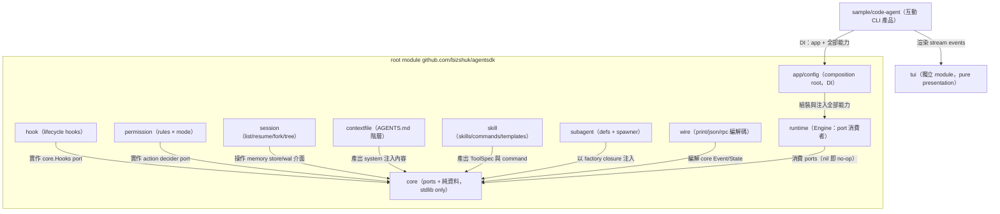

# Harness 與 UX 模組化計畫（learn from claude-code / codex / pi）

日期：2026-07-19。前置調查見 [`docs/memory/2026-07-19-agent-client-feature-catalog.md`](../docs/memory/2026-07-19-agent-client-feature-catalog.md)。

## 目標

把 claude-code 的 `harness`（hooks、permission rules、sessions、skills、subagents、context files）與 `UX`（TUI、headless wire）能力，以 pi 的模組化紀律（單向依賴、每個能力一個低耦合 package、composition root 做 DI）落進 agentsdk。auth 與 proxy 不在範圍（已由 `bizshuk/auth`、`bizshuk/proxy` 覆蓋）。

## 設計原則（從 pi 學到的紀律）

1. 單向依賴：新 package 只准依賴 `core`（+ stdlib）；package 之間禁止水平 import。
2. Port 在共用底層：跨 package 的資料型別與 port interface 放 `core`（維持 stdlib-only、純資料）；consumer（`runtime`）持有可為 nil 的 port，nil = no-op。
3. DI 從 agent level：所有能力在 composition root（`app` / sample CLI）組裝注入，`runtime.Engine` 不 new 任何實作。
4. 重依賴隔離：需要外部依賴或可獨立發佈的（`tui`、未來 `mcp`）比照 `proxy`/`auth` 開獨立 go module。
5. 借鏡 codex：permission 拆成 approval（誰批准）× sandbox（能碰什麼）兩個正交可注入維度，取代單軸 L0-L4 思維。

## 目標模組地圖

`tui` 不 import agentsdk 任何 package（如 pi-tui 對 pi-ai 零依賴）；由 `sample/code-agent` 把 engine stream events 轉成 component 更新。

## 各模組設計

### core 增量（純資料 + ports，不做 I/O）

- `HookEvent{Name, ToolName, Payload}`、`HookDecision{Block, Reason, ReplaceInput, SystemNote}`、`Hooks` port（`Fire(ctx, HookEvent) (HookDecision, error)`）。
- `StreamEvent`（message/thinking/tool delta，含 `ContentIndex`，對齊 pi-ai event 化 streaming）與 `EventSink` port，供 `wire`/`tui` 消費。
- 既有 `Message`/`Part`/`Instruction` 不動。

### hook（dep：core）

- Event 名對齊 claude-code：`PreToolUse`/`PostToolUse`/`UserPromptSubmit`/`Stop`/`SessionStart`/`SessionEnd`/`PreCompact`/`Notification`。
- `Matcher`（tool name pattern）+ 兩種 handler：`Func`（in-process）與 `Command`（外部程式，JSON stdin/stdout，exit 2 = block，timeout 必設）。
- `hook.Runner` 實作 `core.Hooks`；設定來源由 app 注入（不自己讀檔）。

### permission（dep：core、action port）

- 兩軸：`Mode`（`default`/`acceptEdits`/`plan`/`bypass`）× 既有 sandbox 等級。
- Rule：`allow`/`ask`/`deny` + specifier（`Bash(git:*)`、`Edit(src/**)`）；自寫 `**` matcher（`filepath.Match` 的 `*` 不跨 `/`，不可直接用）。
- 實作既有 approval 決策 port，`DefaultApprovalPolicy` 降級為其中一組 preset；HITL ask 仍走 runtime `request_approval` instruction。

### session（dep：core、memory 介面）

- 在 `memory` 的 StateStore/WAL 之上加管理層：`Meta{ID, Parent, Title, Cwd, CreatedAt}`（`meta.json`）。
- `List`（按 cwd 過濾）、`Continue`（最新）、`Resume(id)`、`Fork(id)`（複製 state+WAL 成新 runID、記 parent）、`Tree`（由 parent 鏈組樹）。
- Transcript single source of truth = 既有 WAL JSONL（對齊四家 client 的共識）。

### contextfile（dep：stdlib）

- 檔名清單可設定（`AGENTS.md`、`CLAUDE.md`）；層級：user dir → repo root → cwd 沿路父目錄。
- 支援 `@relative/path` import 展開、循環偵測、總量上限；輸出合併後的 instruction 文字，由 app 注入初始 `State`。

### skill（dep：core）

- `SKILL.md` frontmatter（`name`/`description`/`allowed-tools`）+ progressive disclosure：registry 只把 name+description 進 system prompt，body 於invoke 時載入。
- Slash commands（`commands/*.md`、`$ARGUMENTS` 替換）與 prompt templates（`{{var}}`）。
- 探索路徑：user `~/.config/<app>/skills` + project `.agentsdk/skills`（trust 決策交 hook/permission）。
- 對外形式：一個 `skill` TypedTool + CLI 端 slash 解析 API。

### subagent（dep：core）

- Definition：markdown frontmatter（`name`/`description`/`tools`/`provider`/`model`）。
- `Spawner`：吃 app 注入的 `func(Def, prompt) (result, error)` closure（不 import runtime），對外註冊成 `task` tool；深度上限、預設拒絕遞迴 spawn。

### wire（dep：core；復活原 cli/ 但這次有 caller）

- `stream-json`（每行一個 event envelope）、`json`（單一 result）、`rpc`（LF-delimited JSONL request/response）、`print`（純文字）。
- Envelope 型別最小集：`event`/`result`/`error`/`approval_request`/`human_decision`；欄位保證 JSON round-trip。

### tui（獨立 go module；dep：stdlib + `golang.org/x/term`）

- Differential renderer：全量首繪 / 寬度變更重繪 / 游標定位局部更新；CSI 2026 synchronized output；不用 alternate screen（保留 scrollback，pi-tui 的核心決策）。
- `Component` 契約：`Render(width) []Line` + optional `HandleInput`；Container 樹 + focus。
- 首發 component：`Text`、`Markdown`（輕量渲染）、`Editor`（單行起步：history、slash/file autocomplete、bracketed paste 摺疊）、`Loader`、`SelectList`、`Box`/`Spacer`。
- ANSI 工具：`VisibleWidth`/`Truncate`/`Wrap`（ANSI-aware，沿用 go-ansi-table 教訓：手動 padding，不用 tabwriter）。
- `Terminal` 抽象：`ProcessTerminal` + `VirtualTerminal`（headless 測試）。

### runtime 增量

- Engine 增加可注入 ports：`Hooks`（Run 起訖、pre/post tool、pre-compact 觸發）、`EventSink`（streaming delta 外送）。
- Steering / follow-up queue（pi 的殺手級 UX）：`Engine.Steer(msg)` tool 執行中插話、`Engine.FollowUp(msg)` 收尾後追問；loop 邊界 drain。

### app / sample/code-agent（composition root）

- `app` 增加 wiring option：`WithHooks`、`WithPermission`、`WithSessions`、`WithContextFiles`、`WithSkills`、`WithSubagents`、`WithSink`。
- 新 `sample/code-agent`：互動 TUI（tui module）+ `-p`/`--mode json|rpc`（wire）+ session flags（`-c`/`-r`/`--fork`），內建 6 工具 + skills + subagent，走 `SecureMiddleware`。

## 里程碑

| 里程碑 | 內容 | 驗證 |
| --- | --- | --- |
| H1 | `hook` + `permission` + core ports + runtime 接點 | 單元測試：block/mutate/exit-2、rule matcher、mode 矩陣 |
| H2 | `session` + `contextfile` + steering/follow-up queue | fork/tree round-trip、import 展開、插話順序 |
| H3 | `skill` + `subagent` | frontmatter 解析、progressive disclosure、spawn depth guard |
| H4 | `wire`（print/json/rpc/stream-json） | envelope round-trip、RPC framing |
| H5 | `tui` 獨立 module + `sample/code-agent` | VirtualTerminal 快照測試、`--fake` E2E |
| H6（另開 plan） | `mcp` 重新落地、packages/extensions 發佈、ACP | — |

每個里程碑收尾：`go build ./...` + 全 module `go test`，同步 `CLAUDE.md`（結構、模組對應表、狀態表）。

## 執行狀態（2026-07-19，全模組 skeleton 完成）

使用者選定 `全模組 skeleton` 路線：全部 package 落地 + core ports + 最小可用實作與測試，細節分次補。

| 模組 | 狀態 | 備註 |
| --- | --- | --- |
| core ports（Hooks/EventSink） | ✅ | `core/hook.go`、`core/stream.go` |
| runtime 接點 | ✅ | PreToolUse block→失敗 ToolResult、PostToolUse SystemNote、Run 起訖 hook/sink、Steer/FollowUp queue |
| hook | ✅ | Func + Command handler（exit 2 block、timeout）、`\|` glob matcher |
| permission | ✅ | Mode × rules、`deny > ask > allow`、`**` matcher、Fallback 注入 |
| session | ✅ | meta sidecar、List/Latest/Fork/Tree；in-place tree branching 待補 |
| contextfile | ✅ | user→root→cwd 階層、`@import` 循環偵測、budget cap |
| skill | ✅ | SKILL.md、commands `$ARGUMENTS`、`{{var}}` templates、progressive disclosure |
| subagent | ✅ | frontmatter Def、`task` tool、depth guard、RunFunc closure DI |
| wire | ✅ | Envelope/stream-json/RPC/print、`core.EventSink` adapter |
| tui（獨立 module） | ✅ skeleton | ANSI 工具、差分 Renderer、Text/Loader/Container；Editor/Markdown/raw-mode 待補 |
| sample/code-agent | ✅ | 2026-07-19 同日落地：互動 TUI（cooked-mode line input + Steer）/ `-p` print / `--json` wire、session flags、`--fake` smoke 全過 |

驗證：root module + tui + 6 samples `go build`/`go test` 全綠；後續細節項集中在 `README.todo` 的 Harness/UX 段。

## 風險與取捨

- `tui` 是最大工作量；先出「可用最小集」（上述 component），對標 pi-tui 全功能（IME、image、overlay 九錨點）留待後續。
- steering queue 需要 Engine loop 邊界重整，動到 `runtime` 核心；以既有測試 + 新增插話測試護航。
- `.agentsdk/` project dir 是新慣例（對齊 `.claude`/`.pi`）；只放 skills/commands/settings，不放 runtime data（維持 `~/.config/<app>/` 慣例）。
