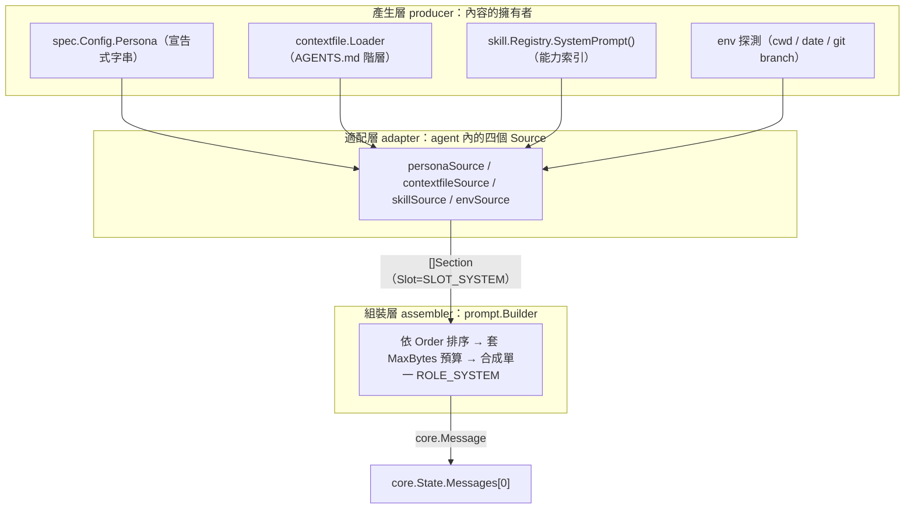
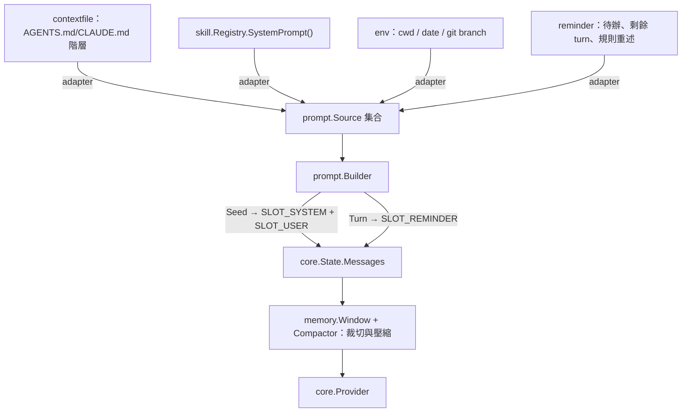
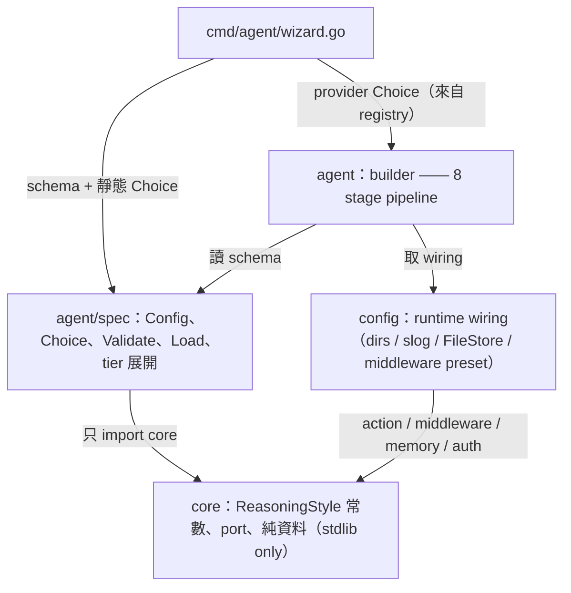
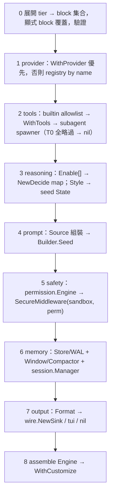

# Agent Skeleton：tier 階梯 × 兩層 opt-in × prompt content management

日期：2026-07-22（v3：`M1`–`M7` 全數落地，實作結果回填）。前置：[`plans/2026-07-19-harness-ux-modularization.md`](2026-07-19-harness-ux-modularization.md)。

## 目標

在 `runtime` 與 `app` 之間補上組裝層 `agent`，讓應用層只宣告`要爬到哪一階`與`每階用哪個實作`，不必知道組裝順序。

三個修訂重點：

| 主題 | 決策 |
| --- | --- |
| opt-in 有兩層 | 層 `1` = feature 開關（block pointer，`nil` = 關）；層 `2` = variant 選擇（block 內具名字串）。`planning` 再多一層：`註冊哪些 rule` vs `這次跑哪個` |
| engagement 是階梯不是開關集合 | `T0 oneshot`（不建 Engine，單次 provider）→ `T1 basic` → `T2 standard` → `T3 full`（= `sample/code-agent`），單調包含 |
| `contextfile` 只是 content management 的一個來源 | 新增 `prompt` package 管三個 slot（system / user / reminder）；`contextfile` 降為其中一個 `Source`，不擴張自己的職責 |

## 一、兩層 opt-in

同一套慣例套用到每個 block，應用層只要記一條規則：

```text
層 1 feature：block 是 pointer —— JSON 缺 key = nil = 關；{} = 開且用預設
層 2 variant：block 內的具名欄位 —— 空字串 = 該 feature 的預設實作
```

| block | 層 1 開關 | 層 2 variant 欄位 | 可選值 |
| --- | --- | --- | --- |
| `Model` | 必開 | `Provider` | `minimax` `anthropic` `google` `grok` `ollama` |
| `Reasoning` | 必開 | `Style` / `Enable[]` | `think_then_act` `plan_then_run` `do_then_review` `one_shot` `learn_from_failure` `choose_agent` |
| `Middleware` | 預設開 | `Preset` | `none` `default` `secure` |
| `Memory` | 預設開 | `Store` / `Compaction` | `none` `file` / `none` `headline` |
| `Safety` | opt-in | `Mode` | `default` `acceptEdits` `plan` `bypassPermissions` |
| `Prompt` | opt-in | `Sources[]` | `files` `skills` `env` `reminder` |
| `Output` | opt-in | `Format` | `text` `json` `tui` |
| `Sessions` `Subagents` `Hooks` | opt-in | 無 variant（只有參數） | — |

### planning 的第三層：註冊 vs 選用

`core.NewDecide` 收的是 `map[ReasoningStyle]DecisionRule`，而 `State.ReasoningStyle` 才決定這一步派給誰。這是兩件事，設定要分開：

```go
type Reasoning struct {
    Style  string   `json:"style,omitempty"`  // 這次跑哪個 → seed State.ReasoningStyle；空 = think_then_act
    Enable []string `json:"enable,omitempty"` // 註冊哪些 → NewDecide 的 map key；空 = 只註冊 Style 那一個
}
```

只註冊一個是預設，因為未註冊的 style 會讓 `NewDecide` 回 `NOTIFY error`。需要`跑到一半換策略`（`choose_agent` 當 router、或 `learn_from_failure` 接手失敗回合）時才把多個 rule 一起註冊：

```yaml
reasoning:
  style: choose_agent
  enable: [choose_agent, think_then_act, plan_then_run]
```

（`M2` 更正）六個 rule 都已是完整的 phase FSM，沒有 stub。`core/thinking.go` 原先對 `one_shot` / `learn_from_failure` / `choose_agent` 標的 `STUB` 是 doc drift——實作與 `TestRulesReachDone` 等測試都已完備，註解已於 `M2` 移除。設定層不需要 stub warning。

## 二、Tier 階梯

`engagement` 不是一堆獨立開關，而是四階單調包含。tier 只是 block 集合的展開簡寫，展開後顯式 block 覆蓋（explicit wins）。

| tier | 內容 | 走 Engine | 對應現況 |
| --- | --- | --- | --- |
| `T0 oneshot` | 只有 provider，單次 `Generate`/`Stream` | 是（`one_shot` rule，其餘 port 全 nil） | `cmd/provider.go` |
| `T1 basic` | `+` 一個 planning strategy `+` default middleware `+` store/WAL/log | 是 | `sample/greet-agent` |
| `T2 standard` | `+` 內建工具 `+` permission/sandbox `+` session `+` prompt(files) | 是 | `sample/file-agent` `sample/logdoctor` |
| `T3 full` | `+` skills `+` subagents `+` hooks `+` output(json/tui) | 是 | `sample/code-agent` |

### T0 不是結構性斷點（v2 修正）

初版把 `T0` 設計成繞過 Engine 的獨立 code path。實測後推翻：`planning.OneShotReasoning` 已經就是「只呼叫一次 provider」的 rule，而 `runtime.Engine` 對 `Tools`/`Store`/`Log`/`Middleware`/`Approval`/`Hooks`/`Sink` 全部 nil-safe。所以 `T0` 只是`一組 nil block 的 config`，不需要第二條路徑。

驗證（probe test，已跑過後刪除）：`one_shot` rule + `NewEngine(step, prov, nil)` 且其餘欄位全 nil →
`RequestCount=1`、`turns=1`、`messages=2`、`status=completed`。

不要另外寫 no-op `Decide`。一個「每次都回 `[CALL_MODEL, DONE]`」的 rule 會違反 `core.Decide` 的純函式不變式——retry 或 WAL replay 會重發 model call。這正是 `one_shot` 從舊 STUB 改成 two-phase FSM 的原因，理由寫在 [`planning/one_shot.go`](../planning/one_shot.go) 的型別註解裡：`think` 只觸發一次，之後每次都回 `DONE`。

補充：`core/thinking.go` 對 `REASON_ONE_SHOT` 仍標 `STUB`，但實作與測試（`TestOneShotThinkEmitsCallModel` / `TestOneShotDoneEmitsDone` / `TestOneShotUnknownPhaseEmitsDone` / `TestRulesReachDone`）都已完備——那行註解是 doc drift，`M1` 順手修掉。

因此 API 收斂成一組，`Once` 只是 facade 不是另一條路：

```go
// T1+：建 Agent，實作 app.Agent 介面
func New(cfg Config, opts ...Option) (*Agent, error)   // Config = spec.Config（type alias）
func MustNew(cfg Config, opts ...Option) *Agent

// T0 facade：內部就是 tier=oneshot 的 New + Run，不繞過 Engine
func Once(ctx context.Context, cfg Config, prompt string) (string, error)
func OnceStream(ctx context.Context, cfg Config, prompt string, fn func(core.StreamEvent)) error
```

`T0` 走 Engine 換到的東西（全部免費，因為 nil = no-op）：升級到 `T1` 只改 config 不改 API、`WithSink` 直接可用、要加 retry 只要把 `Middleware` block 打開、`Budget.MaxTurns` 與 `Status` 生命週期一致。代價只有建一個 `State` 與跑一圈 loop。

### T0 預設關 Store / Log（決議）

理由不是效能，是`必填欄位`：`config.OpenForCLI` 開頭就擋空 appName，所以只要 `T0` 預設開持久化，`Name` 就從「`T1+` 必填」變成「永遠必填」——最低配多一個必填欄位，與 tier 階梯的意義矛盾。

```go
// 關 → 這樣就能跑，沒有 Name、沒有副作用
agent.Once(ctx, agent.Config{Model: agent.Model{Provider: "minimax"}}, "ping")

// 開 → 被迫變成
agent.Once(ctx, agent.Config{Name: "???", Model: ...}, "ping")
```

次要理由：`Once` 的典型用途是嵌在別人的服務裡跑一次分類或摘要，在對方的 `~/.config/` 底下建目錄、寫 state/wal/log 是意外副作用。

升級成本一行，正是 tier 設計要的：

```yaml
tier: oneshot
memory: {}      # 打開持久化（此時 Name 才變必填）
```

邊界剛好落在 `T0` / `T1`，也就是 `Once` / `New` 的分界：`T1+` 走 `app.Main` 時由 [`app/app.go`](../app/app.go) 的 Bootstrap 後回填自動取得 `Store`/`Log`，不需要 config 明寫。

### tier × reasoning 是正交的，不驗證衝突（決議）

`tier: oneshot` 同時給 `reasoning` block 是`合法`的，不報錯也不忽略——一次 agent loop reasoning 可接受。

`tier` 只決定 `feature block` 的開關集合，`Reasoning` 是獨立軸，永遠可覆寫。這個決議之所以安全不是因為政策寬鬆，而是因為`結構上有界`：`T0` 沒有工具 → provider 收不到 tool spec → `ModelResult.ToolCalls` 恆空 → [`runtime/loop.go:391`](../runtime/loop.go) 的 short-circuit 在 `Decide` 之前就把 run 收成 `COMPLETED`。任何 strategy 到了 `T0` 都退化成一次 model call。

驗證（probe test，已跑過後刪除）：四個 rule 各給 `3` 則排隊回應、`MaxTurns=8`，實測——

```text
style=one_shot        calls=1 turns=1 status=completed
style=think_then_act  calls=1 turns=1 status=completed
style=plan_then_run   calls=1 turns=1 status=completed
style=do_then_review  calls=1 turns=1 status=completed
```

所以驗證層只保留兩條真正的錯誤，其餘一律放行：

| 檢查 | 行為 |
| --- | --- |
| `Style` 不是六個已知值之一 | 報錯（`NewDecide` 會回 `NOTIFY error`，晚報不如早報） |
| `Style` 不在 `Enable[]` 內 | 報錯（同上，這是拼寫錯誤而非設計選擇） |
| `tier: oneshot` + 任何 `reasoning` | 放行 |
| `tier: oneshot` + `tools` / `skills` 等 feature block | 放行，且 tier 展開後由顯式 block 覆蓋（explicit wins，此時已不是 `T0`） |

四階的應用層長相：

```go
// T0 —— 最小接觸面：一行，內部仍是 Engine
out, err := agent.Once(ctx, agent.Config{Model: agent.Model{Provider: "minimax"}}, "ping")

// T1 —— basic
app.Main(agent.MustNew(agent.Config{
    Name: "my-agent", Tier: "basic",
    Model: agent.Model{Provider: "minimax"},
}))

// T2 —— standard，只覆寫一個 variant
app.Main(agent.MustNew(agent.Config{
    Name: "file-agent", Tier: "standard",
    Model:     agent.Model{Provider: "anthropic"},
    Reasoning: agent.Reasoning{Style: "plan_then_run"},
}))

// T3 —— full，再加無法序列化的注入
app.Main(agent.MustNew(cfg,
    agent.WithTools(myDeployTool),
    agent.WithHooks(hook.Rule{Event: core.HOOK_PRE_TOOL_USE, Match: "bash",
        Handlers: []hook.Handler{hook.Func(blockRootRM)}}),
))
```

## 三、prompt：content management

### 問題

`contextfile` 目前只做一件事：走 `UserDir → repo root → cwd` 讀 `AGENTS.md`/`CLAUDE.md`、展開 `@import`、回傳合併文字。它是`檔案載入器`，不是 content manager。

真正要管的是`進到 context window 的全部內容`，目前散在四處：`contextfile`（檔案）、`skill.Registry.SystemPrompt()`（skill 索引）、`compose.go` 的 `mergeSystem` + `newState`（拼裝）、`memory.Window`/`Compactor`（歷史裁切）。沒有人擁有「這一輪送什麼進去」這個決策。

### 命名：`prompt`（決議）

| 候選 | 判定 |
| --- | --- |
| `context` | 淘汰。語意最準（context window management），但撞 stdlib `context`——每個同時 import 兩者的檔案都要 alias，是明確反模式 |
| `contextwin` / `ctxwin` | 淘汰。避開撞名但難唸，且 `window` 語意已被 `memory.Window` 佔用 |
| `compose` | 淘汰。描述動作而非物，且與 composition root 的 `compose.go` 概念混淆 |
| `content` | 備案。中性、無撞名、呼應「content management」；缺點是太泛，`content` 可指任何東西 |
| `prompt` | 採用 |

採用 `prompt` 的三個理由：

1. 單字、無撞名（全 repo 只以字串字面值出現），符合 package 命名慣例。
2. 名副其實——`Builder.Seed` / `Builder.Turn` 回傳的就是 `[]core.Message`，那正是送進 model 的 prompt 的具體形式。
3. 與 `memory` 形成清楚對照：`prompt` 決定`放什麼進去`，`memory` 決定`放不下時砍什麼`。

唯一疑慮是被誤讀成「prompt 樣板工具」。用職責分工消除並寫進 package doc：樣板渲染留在 [`skill.RenderTemplate`](../skill/skill.go)，`prompt` 只做`組裝與預算`，不提供 `{{var}}` 替換。

### system prompt 在哪一層組

三層分工，各自只做一件事：



| 片段 | 擁有者 | 可用 tier | 說明 |
| --- | --- | --- | --- |
| persona | `spec.Config.Persona` | 全部，含 `T0` | 應用自己寫的固定身分 |
| context files | `contextfile.Loader` | `>= standard` | 專案規則，從檔案系統蒐集 |
| skill 索引 | `skill.Registry.SystemPrompt()` | `== full` | progressive disclosure 的名稱與描述 |
| env | `agent` 自行探測 | `>= standard` | cwd / date / git branch |
| 工具清單 | `不進 system` | — | 走 `core.ModelRequest.Tools`，由 `runInstruction` 帶 `e.Tools.List()` |
| subagent persona | `subagent.Def.Prompt` | — | sub-run 有自己的 Builder，不共用主 run 的 |

### persona 是 top-level，不放 `Prompt` block

`Prompt` block 是 opt-in 且 tier `>= standard` 才展開，但 persona 連 `T0` 都需要——[`cmd/provider.go`](../cmd/provider.go) 今天就有 `--system` 旗標，一個 one-shot 分類器當然要能指定身分。所以兩者分開：

```go
type Config struct {
    Name    string
    Tier    string
    Persona string `json:"persona,omitempty"` // 固定身分，所有 tier 可用；T0 等價於 provider --system
    ...
    Prompt  *Prompt `json:"prompt,omitempty"`  // 只管「從外部蒐集」，opt-in
}
```

界線是`內容從哪來`：自己寫死的進 `Persona`，要去檔案系統或 registry 蒐集的進 `Prompt`。

### SLOT_SYSTEM 內的順序：由不變到易變

```text
Order 10  persona        幾乎不變
Order 20  context files  改 AGENTS.md 才變
Order 30  skill 索引     裝新 skill 才變
Order 40  env            每次都變
```

理由是 prompt caching：Anthropic 與多數 provider 的 cache 命中要求`前綴穩定`，把每次都變的 env 放最後，前面三段才可能落在 cache prefix 內。反過來排會讓整段 system prompt 每次都 miss。

### 合成單一 `ROLE_SYSTEM`，不發多則

`Builder.Seed` 把所有 `SLOT_SYSTEM` section 併成`一則` `core.Message`，維持 [`compose.go`](../sample/code-agent/cmd/compose.go) 現行 `mergeSystem` 的行為。理由是 provider 形狀不一致——Anthropic 有獨立的 `system` 參數、OpenAI Chat 用 system message；`core.State` 保持一則，讓差異留在 adapter 層處理，不外洩到狀態模型。

### 設計：三個 slot、一組 Source

新增 `prompt` package（只依賴 `core`，維持零水平 import）：

```go
type Slot string
const (
    SLOT_SYSTEM   Slot = "system"   // persona / context files / skill 索引 / env —— seed 一次
    SLOT_USER     Slot = "user"     // 展開後的使用者輸入：command 展開、@mention、template
    SLOT_REMINDER Slot = "reminder" // 每回合重新注入：待辦、剩餘預算、規則重述
)

type Section struct {
    Slot  Slot
    Name  string // 來源標識，供除錯與去重
    Text  string
    Order int    // 同 slot 內排序；相同則依註冊順序
}

type Source interface {
    Sections(ctx context.Context, req Req) ([]Section, error)
}

type Req struct {
    Cwd    string
    Turn   int
    Input  string     // 這一輪的原始使用者輸入（SLOT_USER 用）
    State  core.State // 唯讀：讓 reminder 能看預算與歷史
}

type Builder struct {
    Sources  []Source
    MaxBytes int // 總量上限；沿用 contextfile.DEFAULT_MAX_BYTES 的作法
}

func (b Builder) Seed(ctx context.Context, req Req) ([]core.Message, error)  // 開場：system + 第一則 user
func (b Builder) Turn(ctx context.Context, req Req) ([]core.Message, error)  // 每回合：reminder + user
```

`contextfile` 不改職責，由 `agent` 寫 adapter 把它變成一個 `Source`；`skill.Registry` 同理。這樣 `prompt` 不 import `contextfile`/`skill`，紀律不破。



### 「last response」歸誰管

不歸 `prompt`。歷史轉錄的裁切與壓縮已由 `memory.Window` 與 `memory.Compactor` 擁有，兩者職責界線是：

- `prompt.Builder` 決定`要放什麼進去`（policy，純資料組裝）
- `memory` 決定`放不下時砍什麼`（mechanism，已有 `TokenCounter` 與 `HeadlineCompactor`）

需要「把上一則回應摘要後重新注入」時，做法是寫一個讀 `Req.State.Messages` 的 reminder `Source`，而不是讓 `memory` 反過來組 prompt。合併兩者會讓「注入」與「裁切」互相遞迴，是這個設計刻意避開的坑。

## 四、Config 全貌

### schema 放哪：`agent/spec` 子套件（決議）

`Config` 與 `Choice` 是`宣告式資料`，與 runtime 物件分屬不同層，這點成立。但不放 `config/`——因為 `config/` 名字像宣告、實質是 runtime wiring：它開目錄、換 slog handler、建 `FileStore`、組 middleware chain，import 了 `action`、`middleware/*`、`memory/filestore`、`auth/*`、`gosdk/config`。把純 schema 塞進去，等於任何只想讀 schema 的消費者（驗證工具、web 表單、schema 產生器）都得背上 `gosdk` 與 `auth` 的重量。

結論：開 `agent/spec` 子套件（比照 `memory/filestore`、`middleware/harness` 的既有作法），只 import `core` 與 stdlib。



無循環，因為三個事實：

| 事實 | 意義 |
| --- | --- |
| 六個 `ReasoningStyle` 常數在 [`core/thinking.go`](../core/thinking.go)，不在 `planning/` | 列舉 style 只需 `core`，不必 import `planning` |
| tier 與 variant 是 `spec` 自己的詞彙 | 純 literal，無外部知識 |
| 只有 provider 清單需要「誰被編進來」的知識 | 由 `M5` 的 provider registry 在 `agent` 層提供，`spec` 不碰 |

因此 `Choice` 拆成兩處，界線是`需不需要知道編譯進了什麼`：

```go
package spec

type Choice struct {
    Value, Label, Note string
    Default            bool
}

func TierChoices() []Choice           // 純 literal
func StyleChoices() []Choice          // 來自 core.ReasoningStyle 常數
func VariantChoices(block string) []Choice // middleware / memory / safety / output

package agent

func ProviderChoices() []spec.Choice   // 來自 provider registry —— 唯一需要編譯期知識的

// 型別別名：讓應用層只 import agent 就能寫 agent.Config{...}，真相仍在 spec
type Config = spec.Config
type Choice = spec.Choice
```

`config/` 維持現狀不動。名字與職責不符是既有的技術債，本計畫不順手改名（會動到 `app` 與全部 sample 的 import）。

### 型別定義

```go
type Config struct {
    Name string `json:"name"`           // T1+ 必填；~/.config/<name>
    Tier string `json:"tier,omitempty"` // oneshot | basic | standard | full；空 = basic

    Model     Model     `json:"model"`               // 必填（除非 WithProvider 覆寫）
    Reasoning Reasoning `json:"reasoning,omitempty"`
    Limits    Limits    `json:"limits,omitempty"`    // MaxTurns / MaxWallTime / Autonomy

    // 層 1 開關：nil = 關
    Middleware *Middleware `json:"middleware,omitempty"`
    Memory     *Memory     `json:"memory,omitempty"`
    Tools      *Tools      `json:"tools,omitempty"`
    Safety     *Safety     `json:"safety,omitempty"`
    Prompt     *Prompt     `json:"prompt,omitempty"`
    Skills     *Skills     `json:"skills,omitempty"`
    Subagents  *Subagents  `json:"subagents,omitempty"`
    Sessions   *Sessions   `json:"sessions,omitempty"`
    Output     *Output     `json:"output,omitempty"`
    Telemetry  *Telemetry  `json:"telemetry,omitempty"`
}

type Prompt struct {
    Sources    []string `json:"sources,omitempty"`     // 空 = ["files"]；full tier = ["files","skills","env","reminder"]
    UserDir    string   `json:"user_dir,omitempty"`    // 空 = ~/.config/<name>
    ProjectDir string   `json:"project_dir,omitempty"` // 空 = ".agentsdk"
    MaxBytes   int      `json:"max_bytes,omitempty"`   // 空 = contextfile.DEFAULT_MAX_BYTES
}
```

### 注入用 `agent.Option`，不用 `Deps` struct（決議）

無法序列化者一律走 functional option，沿用 repo 既有慣例——`type Option func(*x)` 在 [`app/options.go`](../app/options.go) 與七個 provider adapter 共出現 `8` 次，是本 repo 對 DI 的標準答案。初版的 `New(cfg, deps ...Deps)` 用 variadic struct 模擬 optional，是繞過語言而非順著語言，捨棄。

```go
package agent

type Option func(*builder) error

func WithProvider(p core.Provider) Option          // 覆寫 Model block（測試 fake 走這裡）
func WithTools(t ...core.Tool) Option              // 應用自有工具
func WithHooks(r ...hook.Rule) Option              // closure-based 安全閘
func WithSources(s ...prompt.Source) Option        // 自訂 content 來源
func WithRules(r ...core.DecisionRule) Option      // 自訂推理策略（超出內建六個）
func WithSink(s core.EventSink) Option
func WithNotifier(n core.Notifier) Option
func WithCustomize(fn func(*runtime.Engine) error) Option // 最終逃生艙

func New(cfg Config, opts ...Option) (*Agent, error)   // Config = spec.Config（type alias）
func MustNew(cfg Config, opts ...Option) *Agent
```

回傳 `error` 而非 `func(*builder)`：注入本身可能失敗（工具重名、rule 的 `Kind()` 與 `Enable[]` 不符），及早報比在 stage 8 才炸好。這是與 `app.Option`（`func(*options)`，不會失敗）唯一的差異，值得。

「應用層要知道注入什麼」的可發現性不靠 struct 欄位，靠把全部 `With*` 集中在 `agent/options.go` 一個檔案——godoc 會把它們列在一起，`app/options.go` 現在就是這樣被閱讀的。

### `Choice` 不併進 `Option`

「option 也有 choice 的語意」在英文成立，在 Go 不成立。兩者方向與生命週期都相反：

| | `spec.Choice` | `agent.Option` |
| --- | --- | --- |
| 本質 | 資料（可序列化） | 程式（closure） |
| 方向 | `spec` → 人 → `Config` 檔案 | 應用程式碼 → builder |
| 生命週期 | 寫進 YAML，`下一個 process` 讀回來 | 只存在於本 process |
| 可列舉 | 是——wizard 要先`列出全部`才能讓人選 | 否——`func(*builder) error` 無法自我描述 |
| 可預設 | 是（`Default: true`） | 無此概念 |

決定性的一條是`可列舉`：wizard 必須在套用前先枚舉。`app.WithTimeout(5*time.Minute)` 不是「在候選中挑一個」，它是一次 mutation——你無法問一個 closure「你可能是哪些值」。

兩者確實會相遇，但在`輸出端`而非型別層：wizard 的 `--print-go` 就是把選好的 `Choice` 印成等價的 `With*` 呼叫。同一份決策，兩種載體。

## 五、Build pipeline



順序約束（不可調換的理由）：

- `2` 在 `1` 之後：`subagent.NewSpawner` 的 `RunFunc` 需要已建好的 provider 才能開 sub-engine。
- `4` 在 `2`/`3` 之後：skill 索引與工具清單都要進 system slot，且 `Builder.Seed` 產出的是 seed `State.Messages`。
- `5` 產出的 `permission.Engine` 同一實例要同時餵 `Engine.Approval` 與 `config.SecureMiddleware(sandbox, perm)`；分開建會讓 middleware 與 gate 判斷不一致。
- `8` 最後：`Customize` 必須看得到完整組裝結果。

## 六、wizard：逐階段挑預設、最後產出設定

新增 root 子指令 `wizard`（alias `w`），掛在 `main.go` 與 `provider` 並列，用同一套 `cmd.NewXxxCommand()` 建構子慣例。

```bash
agentsdk w                          # 互動：逐階段問，Enter 收預設
agentsdk w -y --tier full           # 非互動：全採預設，一行生出完整設定
agentsdk w --edit agent.yaml        # 以既有設定當預設值，逐階段確認（升級舊專案）
agentsdk w -o -                     # 輸出到 stdout 而非檔案
```

### 階段序列就是 build pipeline

wizard 的階段刻意與第五節的 8 stage 一對一，讓使用者問完一輪就懂組裝順序：

| stage | 問題 | 出現條件 |
| --- | --- | --- |
| `0` tier | `oneshot` / `basic` / `standard` / `full` | 永遠 |
| `1` model | provider → model 名稱 → `base_url` / `api_key_env` | 永遠 |
| `2` reasoning | `Style`（六選一）→ `Enable[]`（多選，預設只註冊 `Style`） | 永遠（與 tier 正交，見第二節決議） |
| `3` tools | builtin allowlist、working dir | tier `>= standard` |
| `4` safety | `Mode` → deny / ask / allow 規則 → sandbox | tier `>= standard` |
| `5` prompt | `Sources[]`、`ProjectDir`、`MaxBytes` | tier `>= standard` |
| `6` skills / subagents | 探索目錄、`MaxDepth`、`MaxTurns` | tier `== full` |
| `7` memory | `Store` / `Compaction` | tier `>= basic` |
| `8` output | `text` / `json` / `tui` | 永遠 |
| `9` review | 顯示完整 YAML → 確認 → 寫檔 | 永遠 |

`oneshot` 只會被問到 `0` `1` `2` `8` `9` 五個階段——最短路徑是一路 Enter。

### 紀律：wizard 沒有自己的真相

選項清單一律來自 `agent` package 匯出的中繼資料，不在 wizard 內硬寫字串陣列。否則新增一個 strategy 或 provider 要改兩個地方，必然漂移。

```go
package agent

type Choice struct {
    Value   string // 寫進 Config 的值
    Label   string // 顯示名稱
    Default bool   // Enter 直接採用
    Note    string // 提示：如 "需要 ANTHROPIC_API_KEY"
}

func TierChoices() []Choice
func StyleChoices() []Choice            // 來自 planning 六個 rule
func ProviderChoices() []Choice         // 來自 M5 的 provider registry
func VariantChoices(block string) []Choice // middleware / memory / safety / output
```

同一份 `Choice` 之後也供 `--list` 輸出、TUI 表單、以及設定檔 schema 產生使用。

### 產出與驗證

- 寫檔前一律先跑 `Config.Validate()`；驗證失敗就退回該階段重問，不寫出壞設定。
- 預設寫 `./agent.yaml`；`-o <path>` 覆寫，`-o -` 輸出 stdout。
- `--print-go` 額外印出等價的 Go literal，給不想用設定檔的人直接貼進 `main.go`。
- 檔案已存在時預設拒絕覆寫，需 `--force`。

wizard `不`做的事：不建 Agent、不打 provider、不驗證憑證——那是 `Preflight` 的職責。它純粹是 Config 產生器。`--verify` 是選項而非預設，選了才在最後呼叫一次 `agent.Once` 做 smoke test。

## 七、落地步驟

| 階段 | 狀態 | 內容 | 驗收 |
| --- | --- | --- | --- |
| `M1` | 完成 | `agent/spec`：Config/Choice、tier 展開、variant 驗證、`Load`（只 import core） | JSON round-trip；tier 單調性 table test；未知 `Style` 與 `Style ∉ Enable[]` 報錯；`tier: oneshot` + `reasoning` 明確斷言`不`報錯 |
| `M2` | 完成 | `agent.Once` / `OnceStream` facade（tier=oneshot），順手修 `core/thinking.go` 的 stale `STUB` 註解 | 保留 probe：`one_shot` + 全 nil port 走 Engine，`RequestCount==1` 且 `status==completed`；`cmd/provider.go` 改呼叫 `agent.Once` 後行為等價 |
| `M3` | 完成 | `prompt` package：Slot/Section/Source/Builder + `agent` 內的四個 adapter | Builder 三個 slot 順序與 MaxBytes 截斷測試；zero-source = 空 seed |
| `M4` | 完成 | `agent/build.go` + `agent/options.go`：8 stage pipeline、`New`/`Bootstrap`/`Preflight`、全部 `With*` | 每個 block nil/非 nil 各一組 assert Engine 欄位 |
| `M5` | 完成 | provider registry（name → constructor），與 `cmd/provider.go` 共用 | `--list-providers` 與 Config 同一份來源 |
| `M6` | 完成 | 用 `agent` 重寫 `sample/code-agent/cmd/compose.go`，`333` 行 → `<80` | 現有 `compose_test.go` 與互動/print/json 三模式行為不變 |
| `M7` | 完成 | `agent.ProviderChoices()` + `cmd/agent/wizard.go`（`wizard` / `w`），掛進 `main.go` | `-y --tier <每一階>` 產出的四份 YAML 都通過 `Validate()`；`--edit` round-trip 不失真；階段跳過規則 table test |

## 不做的事

- 不新增 `core` port，不動 `runtime.Engine` 公開 API。
- 不讓 `prompt` 吃掉 `memory`：注入是 policy、裁切是 mechanism，合併會產生遞迴。
- 不擴張 `contextfile`：它維持成單純的檔案載入器，只是多一個 adapter。
- 不吃掉 `app`：嵌入式情境只要 `agent` 不要 `app`。
- 不把 cron、fan-out、audit trail 等應用慣例放進來。
