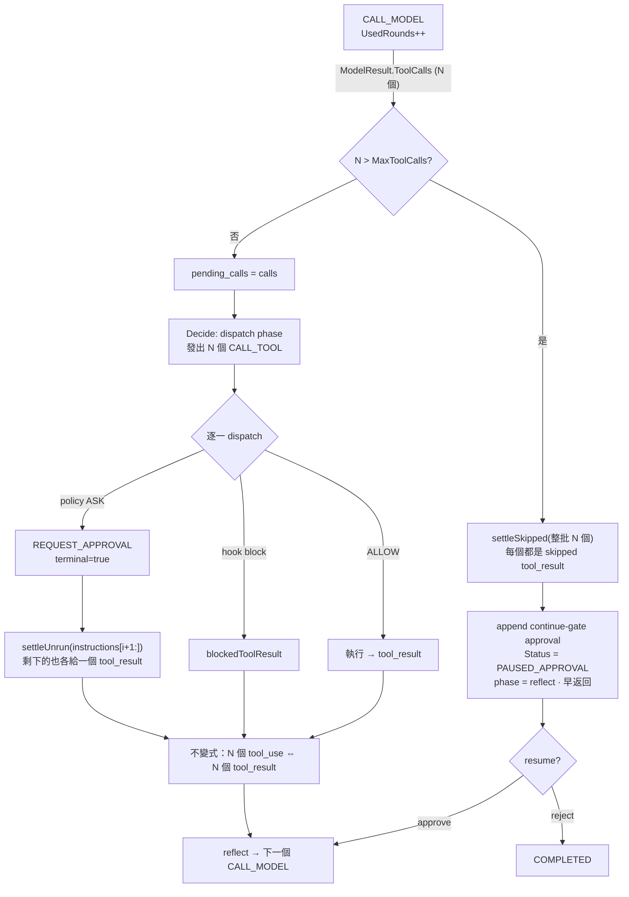
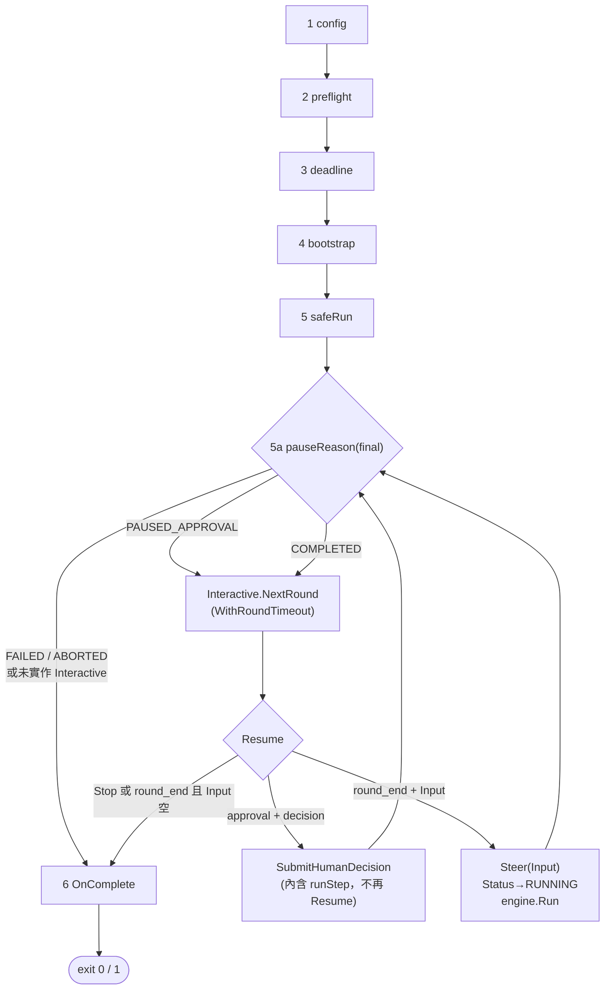

# Round / Tool-call Batch / Interactive Seam

> 取代並合併：
> [`docs/superpowers/plans/2026-07-23-agent-approval-resolver.md`](../docs/superpowers/plans/2026-07-23-agent-approval-resolver.md)、
> [`docs/superpowers/plans/2026-07-23-approval-flow-diagram.md`](../docs/superpowers/plans/2026-07-23-approval-flow-diagram.md)。
> 兩份原稿的錯誤修正清單見 §11。

`Goal`：把 `round` / `tool call batch` / `next-round input` 三件事收斂成`一條不變式`加`一個介面`，並修掉沿路發現的兩個 live bug。

`狀態 2026-07-24`：`全部 Task（0–5）已完成`並全綠（root module + `8` 個 sample module，skeleton-demo live 驗證 `rounds:2`）。已切 branch `feat/round-batch-interactive-seam`，skeleton 與本工作各自獨立 commit。實作差異已回寫對應段落。

`Scope`：`core`、`planning`、`runtime`、`app`、`agent/spec`、`sample/skeleton-demo`、docs。

`Non-goals`：`sample/logdoctor` 全面改寫（其 `cmd/` 八個檔案的 cobra 分派不動）、provider adapter、proxy、TUI。

---

## 1. 術語決策（先定案，後面全部引用）

| 術語 | 定義 | 出處 |
| --- | --- | --- |
| `round` | 一次 `INSTRUCTION_CALL_MODEL` dispatch，以及它引發的全部 tool call。使用者面的計量單位 | `runtime/loop.go::runInstruction` |
| `turn` | 一次 `Decide` 迭代，`core.State.Turn`。內部 runaway guard，非使用者面 | `runtime/loop.go:438` |
| `tool call batch` | 單一 `ModelResult.ToolCalls` 切片 —— 一個 `round` 內的全部 operation | `core/input.go::ModelResult` |
| `settlement` | batch 內每個 call 恰好產生一個 `tool_result` message，無論它執行、被 hook 擋、被 approval 暫停、或被 budget skip | 本 plan Task 1 |
| `pause reason` | run 停下但非終局的原因：`approval` / `round_end` / `tool_limit` | 本 plan Task 3 |

關鍵：`ReAct` 的一個 `round` 會燒 `3` 個 `turn`（`reason` → `dispatch` → `reflect`）。今天的 `Budget.MaxTurns` 計的是 `turn`，所以 `MaxTurns: 10` 只有約 `3` 輪。本 plan `不改` `MaxTurns` 語意（loopguard 依賴它），改為`新增` `MaxRounds` 承載使用者面的「幾輪」。

---

## 2. 驅動一切的不變式

> 一個 assistant message 裡的 `N` 個 `tool_use` part，必須在下一次 `CALL_MODEL` 之前，對應到 `N` 個 `tool_result` message。

這條不變式一口氣解釋了三件事：

- 為什麼現在有 live bug —— `runtime/loop.go:415` 只取 `ToolCalls[0]`，但 `loop.go:99-122` 已經把全部 `N` 個 `tool_use` 寫進 `Messages`。下一次 `CALL_MODEL` 送出 `N` 個 `tool_use` 配 `1` 個 `tool_result`，Anthropic-format provider 直接 `400`
- 為什麼 `MaxToolCalls` 超限不能只是「不執行」—— 被跳過的 call 仍要產生 `tool_result`，否則同樣違反不變式（超限的處置語意見 §4：整批 skip + 暫停等 resume）
- 為什麼 approval 在 batch 中途暫停很麻煩 —— `loop.go:507-513` 的 `break` 讓後面的 `CALL_TOOL` 永遠不執行也永遠沒有結果

三個情境同一個機制：`settle`。這就是本 plan 最大的收斂。

---

## 3. 唯一的互動縫

`3` 個介面（`PauseHandler` / `ApprovalResolver` / `RejectionHandler`）收成 `1` 個。理由：approval decision 與 follow-up input 是`同一個問題`在不同 `pause reason` 下被問到 —— 「run 停了但不是終局，下一步做什麼」。

```go
// app/agent.go
type Interactive interface {
    NextRound(ctx context.Context, p Pause) (Resume, error)
}
```

吸收關係：

| 原介面 | 去處 |
| --- | --- |
| `PauseHandler.OnPauseApproval` | `NextRound` 開頭做 —— 同 ctx、同 State、同 call site，沒有多一個介面的理由 |
| `RejectionHandler.OnReject` | 回傳 `REJECT` 的那個分支做，或 `OnComplete` 讀 `final.PendingApprovals` |
| `Engine.FollowUp` 佇列 | `PAUSE_ROUND_END` 時回 `Resume{Input: "..."}` |

不實作 `Interactive` = 維持今天語意（`Run` 返回，`PendingApprovals` 留給外部 verb）。

---

## 4. 決策點

`D1`：`MaxToolCalls` 超限後怎麼收尾？

`已定案 2026-07-24`（使用者指定，Task 2 已按此落地）：`整批 skip + settle 全部 + 暫停等 resume 決策`。

- 超過 `MaxToolCalls` 時，`整個 batch` 全部 skip（`不`部分執行），每個 call 合成 `tool_result{OK:false}` 維持不變式
- run 進 `RUN_STATUS_PAUSED_APPROVAL`，附一筆 `ToolCall == nil` 的 continue-gate approval（`Reason: "tool_call_budget"`）
- 停在這裡（pending），由 operator / `ApprovalResolver` / 外部 verb 決定：
    - `approve` → resume：FSM 停在 `reflect`，下一個 Decide 讓 model 重讀被 skip 的結果並`重新規劃`（`不`重發原批次）
    - `reject` → run 完成（`COMPLETED`），不再呼叫 model
- backstop：resume 後每次 `CALL_MODEL` 仍 `UsedRounds++`，`MaxRounds` 最終會擋住頑固重試

`為什麼不部分執行`：執行 model 沒完整選擇的子集，等於讓 model 在殘缺的前提下行動；整批 skip + 人工 gate 把決定權交回 operator。

`為什麼 approve = 重讀而非重發`：`resume` 在本 SDK 的既有語意是「續跑暫停的 run」，不是「重跑被跳過的工作」。重發原批次需要在 resume 時 bypass budget check，否則立即再次 pause 成無限迴圈；重讀讓 model 自行縮小批次，與既有 `reflect` phase 完全對齊。

`未採用`：

- `dispatch 前 n + settle 其餘 + 續跑`（本 plan 初版）：model 只拿到自己沒挑的子集結果，且無人工 gate
- 立即 `RUN_STATUS_FAILED`：model 永遠不知情，且假終局把 gate 語意也丟了

`實作位置`：`runtime/loop.go` 的 batch seeding block（skip 全部 + pending + `PAUSED` + `phase=reflect` + 早返回）與 `consumeApprovedPendingCall`（新增 `ToolCall == nil` 的 approve 分支 = 純 resume）。

---

## 5. Global Constraints

- Go `1.26.0`，module `github.com/bizshuk/agentsdk`，stdlib only（不加新依賴）
- 常數 `SCREAMING_SNAKE_CASE`；變數/型別/函式 `MixedCaps`
- 錯誤 `fmt.Errorf("...: %w", err)` wrap；`app.Run` 回 exit code 不 panic
- `core/` 維持 stdlib only；`runtime` `不得` import `planning`（今天靠字面字串 key 維持，本 plan 沿用）
- 測試 table-driven + `t.Run`，`testify/assert` + `require`
- 公開 API 只增不改：既有 `Agent` / `Preflighter` / `Completer` 簽章不動

---

## 6. File Structure

| 檔案 | 職責 | Task |
| --- | --- | --- |
| `core/state.go` | `Budget` 加 `MaxRounds`/`UsedRounds`；`Exceeded()` 加 `round_budget`；加 `MaxToolCalls` | 0 |
| `agent/spec/spec.go` | `Limits` 加 `MaxRounds`/`MaxToolCalls` | 0 |
| `agent/spec/tier.go` | 四階 tier 的 `MaxRounds`/`MaxToolCalls` 預設 | 0 |
| `agent/spec/validate.go` | 兩個新欄位的範圍檢查 | 0 |
| `agent/build.go` | `Limits` → `core.Budget` 映射 | 0 |
| `planning/helpers.go` | `scratchCalls` + `decodeCalls`（修 JSON round-trip bug） | 1 |
| `planning/think_then_act.go` | `dispatch` phase 發 `N` 個 `CALL_TOOL` | 1 |
| `runtime/harness.go` | `settleSkipped` / `settleUnrun` / `skippedToolResult` | 1 |
| `runtime/loop.go` | batch seeding、mid-batch settlement、`UsedRounds++` | 1, 2 |
| `app/agent.go` | `Interactive` / `Pause` / `Resume` / `PauseReason` | 3 |
| `app/options.go` | `WithRoundTimeout`（`options.go` `已存在`，不是新檔） | 3 |
| `app/app.go` | `Run` 的 round loop + `pauseReason` / `resolveRound` / `advance` | 3 |
| `sample/skeleton-demo/main.go` | `stdinAgent` 實作 `Interactive` | 4 |
| `docs/terminology.md`、`CLAUDE.md`、`README.todo` | 同步 | 5 |

---

## 7. Task 0 — 術語欄位落地（純新增，無行為變更）

- [x] `Step 1` `core/state.go::Budget` 加三個欄位

```go
type Budget struct {
	MaxTurns    int           `json:"max_turns"`
	UsedTurns   int           `json:"used_turns"`

	// MaxRounds caps CALL_MODEL dispatches. A round is one model
	// request plus every tool call it triggers — the unit an operator
	// actually reasons about. MaxTurns counts Decide iterations
	// instead, which for ReAct is ~3x higher for the same work; it
	// stays as the runaway guard loopguard depends on.
	MaxRounds  int `json:"max_rounds,omitempty"`
	UsedRounds int `json:"used_rounds,omitempty"`

	// MaxToolCalls caps operations within ONE round. Zero = unbounded.
	// Excess calls are settled with a failed tool_result rather than
	// dropped — see runtime.settleSkipped.
	MaxToolCalls int `json:"max_tool_calls,omitempty"`

	MaxTokens   int           `json:"max_tokens"`
	UsedTokens  int           `json:"used_tokens"`
	MaxWallTime time.Duration `json:"max_wall_time"`
	StartedAt   time.Time     `json:"started_at"`
	NowFunc     func() time.Time `json:"-"`
}
```

- [x] `Step 2` `Exceeded()` 在 `MaxTurns` 檢查`之後`加一段（順序重要：round 是使用者面的，錯誤訊息優先報它）

```go
	if b.MaxRounds > 0 && b.UsedRounds >= b.MaxRounds {
		return true, "round_budget"
	}
```

- [x] `Step 3` `agent/spec/spec.go::Limits` 加兩個欄位

```go
type Limits struct {
	MaxTurns     int    `json:"max_turns,omitempty"`
	MaxRounds    int    `json:"max_rounds,omitempty"`
	MaxToolCalls int    `json:"max_tool_calls,omitempty"`
	MaxWallTime  string `json:"max_wall_time,omitempty"`
	Autonomy     string `json:"autonomy,omitempty"`
}
```

- [x] `Step 4` `agent/spec/tier.go` 的 `MaxTurns` 預設 switch 之後加平行的 `MaxRounds` / `MaxToolCalls`

`實作差異`：原稿寫四階獨立值，實際採用`三分支`——與既有 `MaxTurns` switch 逐分支對齊（`oneshot` / `>= standard` / `default`）。`TIER_FULL` 與 `TIER_STANDARD` 共用分支是既有形狀，另開第四分支會讓 `MaxTurns` 與 `MaxRounds` 不對稱。

```text
TIER_ONESHOT      → MaxRounds 1,  MaxToolCalls 未設 (0 = 無上限；T0 不註冊工具)
TIER_BASIC        → MaxRounds 10, MaxToolCalls 4
TIER_STANDARD 以上 → MaxRounds 30, MaxToolCalls 8
```

`必要修正`（實作時由測試抓到）：`Expand` 填 `MaxRounds` 預設後必須 `min(MaxRounds, MaxTurns)`。否則呼叫端只寫 `MaxTurns: 7` 時，tier 會補上 `MaxRounds: 10`，`Step 5` 的 validate 就會拒絕一組使用者從沒寫過的組合（`agent/build_test.go` 兩個既有測試因此紅燈）。

- [x] `Step 5` `agent/spec/validate.go:70` 是現有的 `limits.max_turns` 負值檢查，緊接其後加：兩個新欄位皆須 `>= 0`；且 `MaxRounds > 0 && MaxTurns > 0 && MaxTurns < MaxRounds` 時回錯（`turn` 必然多於 `round`，反過來代表填錯欄位）

- [x] `Step 6` `agent/build.go:546` 的 `Budget: core.Budget{MaxTurns: a.cfg.Limits.MaxTurns}` 補兩個欄位：

```go
		Budget: core.Budget{
			MaxTurns:     a.cfg.Limits.MaxTurns,
			MaxRounds:    a.cfg.Limits.MaxRounds,
			MaxToolCalls: a.cfg.Limits.MaxToolCalls,
		},
```

`agent/build.go:363` 是 subagent 的 budget（`core.Budget{MaxTurns: maxTurns}`，`maxTurns` 來自 `Subagents.MaxTurns`）。subagent `不`繼承父層的 `MaxRounds`／`MaxToolCalls` —— 它有自己的 `Subagents` 設定區塊，混用會讓「限制到底來自哪一層」不可判讀。此處`不動`，但在 doc comment 註明是刻意的。

- [x] `Step 7` 驗證

```bash
cd /Users/shuk/projects/ai/agentSDK
go build ./... && go test ./core/... ./agent/... -count=1
```

- [x] `Step 8` commit：Task 0-3 合併為單一 commit `f453073`（branch `feat/round-batch-interactive-seam`），與 pre-staged skeleton（`6cb327c`）分開

---

## 8. Task 1 — Batch settlement（修 live bug）

`Consumes`：`core.ToolCall`、`core.ToolResult`、既有 `appendToolResultMessage`（`runtime/harness.go:130`）
`Produces`：一個 `round` 內的 `N` 個 tool call 全部執行且全部 settle

- [x] `Step 1` 先寫失敗測試 `runtime/loop_test.go`

```go
// TestMultiToolCallBatchSettlesEveryCall pins the invariant: an assistant
// message carrying N tool_use parts must be followed by N tool_result
// messages. Before this change the engine dispatched ToolCalls[0] and
// silently dropped the rest, producing a transcript that Anthropic-format
// providers reject with 400.
func TestMultiToolCallBatchSettlesEveryCall(t *testing.T) {
	// scripted provider: round 1 returns 3 tool calls, round 2 ends turn.
	// assert: state.Messages contains exactly 3 ROLE_TOOL messages whose
	// CallIDs match the 3 requested calls, in request order.
}
```

執行：`go test ./runtime/... -run TestMultiToolCallBatchSettlesEveryCall -count=1` → 預期 `FAIL`（只有 `1` 個 tool result）

- [x] `Step 2` `planning/helpers.go` 加 `scratchCalls` + `decodeCalls`

```go
// scratchCalls reads a pending tool-call batch from working memory.
func scratchCalls(state core.State, key string) []core.ToolCall {
	if state.WorkingMemory == nil {
		return nil
	}
	return decodeCalls(state.WorkingMemory[key])
}

// decodeCalls normalizes every shape a pending-call entry can take.
//
// Working memory survives a JSON round-trip through StateStore, so a
// value written in-process as core.ToolCall reads back after Resume as
// map[string]any. The old plain type assertion returned false there, and
// ThinkThenAct's dispatch phase emitted DONE instead of re-issuing the
// call — a crash mid-dispatch silently completed the run. Accepting the
// decoded shape removes that whole class of bug.
//
// The singular case is kept because persisted state written before this
// change stores one ToolCall under the legacy key.
func decodeCalls(v any) []core.ToolCall {
	switch x := v.(type) {
	case nil:
		return nil
	case []core.ToolCall:
		return x
	case core.ToolCall:
		return []core.ToolCall{x}
	default:
		raw, err := json.Marshal(x)
		if err != nil {
			return nil
		}
		var many []core.ToolCall
		if err := json.Unmarshal(raw, &many); err == nil && len(many) > 0 {
			return many
		}
		var one core.ToolCall
		if err := json.Unmarshal(raw, &one); err == nil && one.Name != "" {
			return []core.ToolCall{one}
		}
		return nil
	}
}
```

`planning/helpers.go` 需新增 `encoding/json` import（stdlib，不違反依賴紀律）。

`實作差異`：原稿保留 `scratchCall` 作為單筆讀取器，實際`刪除`——改用 `scratchCalls` 後全 repo 已無 caller，留著就是死碼（linter 直接報 `unusedfunc`）。單筆語意由 `decodeCalls` 的 `core.ToolCall` 分支承接。

- [x] `Step 3` `planning/think_then_act.go` 加常數並改 `dispatch` phase

```go
	// THINK_THEN_ACT_PENDING_CALLS holds the whole batch. The legacy
	// singular key is still read (see decodeCalls) so persisted state
	// from before the batch change resumes cleanly.
	THINK_THEN_ACT_PENDING_CALLS = "think_then_act.pending_calls"
```

```go
	case THINK_THEN_ACT_DISPATCH:
		calls := scratchCalls(state, THINK_THEN_ACT_PENDING_CALLS)
		if len(calls) == 0 {
			// Fall back to the legacy single-call key so a state file
			// written before this change still dispatches.
			if one, ok := scratchCall(state, THINK_THEN_ACT_PENDING_CALL); ok {
				calls = []core.ToolCall{one}
			}
		}
		if len(calls) == 0 {
			return state, []core.Instruction{doneInstruction()}
		}
		next := state.Clone()
		scratchSet(&next, THINK_THEN_ACT_PHASE, THINK_THEN_ACT_REFLECT)
		// Consume the batch so a re-entry cannot re-dispatch it.
		delete(next.WorkingMemory, THINK_THEN_ACT_PENDING_CALLS)
		delete(next.WorkingMemory, THINK_THEN_ACT_PENDING_CALL)
		insts := make([]core.Instruction, 0, len(calls))
		for _, c := range calls {
			insts = append(insts, callToolInstruction(c))
		}
		return next, insts
```

`實作差異`：`SeedDispatch` 改為`可變參數` `SeedDispatch(s *core.State, calls ...core.ToolCall)`，寫入 `THINK_THEN_ACT_PENDING_CALLS`。原稿說「簽章不變」，但可變參數對既有單筆 caller 完全相容，又讓測試能一次 seed 整批——沒有理由保留只能收一筆的形狀。

另新增 `internal/testutil.ScriptedProvider.EnqueueToolCalls(calls ...core.ToolCall)`，讓測試能腳本化一次回傳整批的 model response。

- [x] `Step 4` `runtime/harness.go` 加三個 settle helper

```go
// settleSkipped closes out tool calls that will never dispatch.
//
// The invariant it protects: an assistant message carrying N tool_use
// parts must be followed by N tool_result messages before the next
// CALL_MODEL. Anthropic-format providers reject the request otherwise,
// and every model reads a missing result as "still running". A pause, a
// tool-call budget trip, or a mid-batch terminal instruction all leave
// calls unrun — each one gets an explicit failed result instead of
// vanishing.
func settleSkipped(s core.State, calls []core.ToolCall, reason string) core.State {
	for _, c := range calls {
		s = appendToolResultMessage(s, skippedToolResult(c, reason))
	}
	return s
}

// settleUnrun is settleSkipped over the tail of an instruction slice,
// for the mid-batch pause case where the remaining work is still in
// instruction form.
func settleUnrun(s core.State, rest []core.Instruction, reason string) core.State {
	calls := make([]core.ToolCall, 0, len(rest))
	for _, inst := range rest {
		if inst.Kind == core.INSTRUCTION_CALL_TOOL && inst.CallTool != nil {
			calls = append(calls, inst.CallTool.Call)
		}
	}
	return settleSkipped(s, calls, reason)
}

// skippedToolResult mirrors blockedToolResult: the model must be able to
// tell "did not run" apart from "ran and failed".
func skippedToolResult(call core.ToolCall, reason string) core.ToolResult {
	return core.ToolResult{CallID: call.ID, Name: call.Name, OK: false, Error: reason}
}
```

- [x] `Step 5` `runtime/loop.go:414-416` 改成播種整批

```go
		if event.ModelResult != nil && len(event.ModelResult.ToolCalls) > 0 {
			// Key is a literal, not a planning constant: runtime must not
			// import planning (see CLAUDE.md dependency discipline).
			preStep.WorkingMemory["think_then_act.pending_calls"] = event.ModelResult.ToolCalls
		}
```

- [x] `Step 6` `runtime/loop.go` 指令迴圈改成帶 index，並在 terminal break 前 settle 尾巴

把 `for _, inst := range instructions {` 改為 `for i, inst := range instructions {`，並把 `if term {` 區塊改成：

```go
			if term {
				terminal = true
				if out != nil {
					nextEvent = out
				}
				// Anything still queued behind a terminal instruction
				// (typically an approval pause rewritten from CALL_TOOL)
				// will never dispatch. Settle it so the assistant turn's
				// tool_use parts stay 1:1 with tool_result.
				next = settleUnrun(next, instructions[i+1:], "skipped: run paused before dispatch")
				break
			}
```

- [x] `Step 7` 測試轉綠

```bash
cd /Users/shuk/projects/ai/agentSDK
go test ./runtime/... ./planning/... -count=1
```

- [x] `Step 8` 加 resume 回歸測試 `planning/planning_test.go`

```go
// TestDispatchSurvivesJSONRoundTrip pins the crash-recovery path: state
// persisted mid-dispatch decodes pending calls back into ToolCall rather
// than map[string]any, so Resume re-issues the call instead of DONE.
func TestDispatchSurvivesJSONRoundTrip(t *testing.T) {
	// seed dispatch → json.Marshal(state) → json.Unmarshal → NextStep
	// assert: instructions[0].Kind == INSTRUCTION_CALL_TOOL
}
```

- [x] `Step 9` commit：併入 `f453073`（見 Task 0 Step 8）

---

## 9. Task 2 — `MaxToolCalls` / `MaxRounds` 生效

- [x] `Step 1` `runtime/loop.go::runInstruction` 的 `CALL_MODEL` 分支，在 `e.Model.Generate` `之前`加：

```go
		s.Budget.UsedRounds++
```

放在 `Generate` 之前。

`實作差異`：原稿的理由（「讓失敗的 round 也計數，否則持續失敗的 provider 無限重試而不觸發 round budget」）在本 codebase `不成立`，讀 `middleware/harness/retry.go` 後確認：retry 每次重試都以`原始 state` 重新呼叫 `next`（line 76），失敗時回傳的也是原始 state（line 82/95），所以 `Generate` 前的遞增在失敗路徑會被 retry `丟棄`；且 retry 的 `N` 有上限，本來就不會無限重試；最終失敗時 run 進 `FAILED`。因此正確定位是：`計數`是 runtime 的職責（永遠遞增），`enforcement`是 Budget middleware 的職責（下次 dispatch 前讀 `UsedRounds`）。成功的 round（即使歷經 N 次 provider 重試）恰好計一次。註解已照此改寫，不再宣稱「失敗也計數」。

- [x] `Step 2` 確認 `Budget` middleware 已在鏈上會自動擋（`middleware/harness/budget.go` 每次 dispatch 前呼叫 `state.Budget.Exceeded()`），無須改動。加測試驗證 `round_budget` 會被回報為 `BudgetExceededError.Reason`。

- [x] `Step 3` `runtime/loop.go` 的 batch 播種處（Task 1 Step 5 那段）改成含 skip：

```go
		if event.ModelResult != nil && len(event.ModelResult.ToolCalls) > 0 {
			calls := event.ModelResult.ToolCalls
			if n := preStep.Budget.MaxToolCalls; n > 0 && len(calls) > n {
				// Over budget. Dispatch the first n and settle the rest,
				// so the model sees exactly which operations were dropped
				// and why — a silent truncation makes it re-request the
				// same batch next round.
				skipped := calls[n:]
				reason := fmt.Sprintf("skipped: tool call budget %d exceeded (%d requested)", n, len(calls))
				preStep = settleSkipped(preStep, skipped, reason)
				names := make([]string, 0, len(skipped))
				for _, c := range skipped {
					names = append(names, c.Name)
				}
				slog.Warn("tool_call_budget_exceeded",
					"run_id", preStep.RunID,
					"turn", preStep.Turn,
					"limit", n,
					"requested", len(calls),
					"skipped", names)
				calls = calls[:n]
			}
			preStep.WorkingMemory["think_then_act.pending_calls"] = calls
		}
```

`slog` 呼叫帶 `5` 個結構化欄位含 `run_id`，符合 negative-log 慣例。`runtime/loop.go` 需新增 `log/slog` import。

- [x] `Step 4` 測試

```go
// TestToolCallBudgetSkipsExcessAndSettles: MaxToolCalls=2, model returns 4.
// assert: 2 real ToolResults + 2 skipped ToolResults, all 4 CallIDs present,
// skipped ones have OK=false and Error containing "tool call budget".
func TestToolCallBudgetSkipsExcessAndSettles(t *testing.T) { ... }

// TestRoundBudgetTripsOnCallModel: MaxRounds=2, model never ends turn.
// assert: errors.As(err, &harness.BudgetExceededError{}) with Reason "round_budget".
func TestRoundBudgetTripsOnCallModel(t *testing.T) { ... }
```

- [x] `Step 5` commit：併入 `f453073`

---

## 10. Task 3 — `Interactive` 縫

- [x] `Step 1` `app/agent.go` 接在 `Completer` 之後

```go
// PauseReason classifies why a run stopped without the application being
// done with it.
type PauseReason string

const (
	// PAUSE_APPROVAL — the run holds an undecided PendingApproval.
	PAUSE_APPROVAL PauseReason = "approval"
	// PAUSE_ROUND_END — the loop completed a round and would exit, but
	// the application may still have something to say.
	PAUSE_ROUND_END PauseReason = "round_end"
)

// Pause is what Run hands the application when it needs an answer.
type Pause struct {
	State  core.State
	Reason PauseReason
}

// Resume is the application's answer.
//
// Decision is read only when Reason == PAUSE_APPROVAL; an empty value
// there is treated as REJECT, because "no answer" must never be read as
// consent for a call the policy already flagged.
//
// Input is appended as a user message before the next Decide, whatever
// the reason — approving a call AND adding a correction in the same
// answer is one round trip, not two.
//
// Stop ends the run immediately. At PAUSE_ROUND_END an empty Input with
// Stop=false also ends it: nothing to add means done.
type Resume struct {
	Decision core.ApprovalDecision
	Input    string
	Stop     bool
	By       string
}

// Interactive is the single seam for everything a run needs from the
// application mid-flight: approval decisions AND follow-up input. They
// are the same question — "the run stopped and is not terminal, what
// next?" — asked at different pause reasons, so they are one method.
//
// The Agent owns the input side and decides where the answer comes from:
// stdin, an HTTP endpoint, a Kafka topic, a policy lookup, a channel fed
// by Sink callbacks. Notification, audit, and rollback belong INSIDE
// NextRound; they need the same ctx and the same State and would earn
// nothing as separate interfaces.
//
// Implementations MUST honor ctx cancellation: Run blocks here until an
// answer arrives or the process is asked to stop (SIGINT/SIGTERM,
// WithRoundTimeout, or WithTimeout).
//
// An Agent that does not implement Interactive keeps today's behavior:
// Run returns on the pause and the persisted PendingApprovals are left
// for an out-of-process verb to decide.
type Interactive interface {
	NextRound(ctx context.Context, p Pause) (Resume, error)
}
```

- [x] `Step 2` `app/options.go`（`既有檔案`，不是新檔）加一個 knob

```go
// DEFAULT_ROUND_TIMEOUT caps how long a single NextRound call may block.
// Generous because an operator-in-the-loop decision can take minutes.
// Non-positive disables the per-round deadline, leaving only WithTimeout.
const DEFAULT_ROUND_TIMEOUT = 30 * time.Minute

// WithRoundTimeout bounds ONE NextRound call. Each pause gets a fresh
// deadline, so this caps per-answer latency, not the run's total
// interactive time — that is WithTimeout's job.
func WithRoundTimeout(d time.Duration) Option {
	return func(o *options) { o.roundTimeout = d }
}
```

`options` struct 加 `roundTimeout time.Duration`；`defaultOptions()` 設 `roundTimeout: DEFAULT_ROUND_TIMEOUT`。

- [x] `Step 3` 先寫失敗測試 `app/app_test.go`

```go
// TestRunConsultsInteractiveOnApprovalPause drives Run with an Agent that
// implements Interactive, and asserts the pause was routed to NextRound
// and an APPROVE answer carried the run to COMPLETED.
func TestRunConsultsInteractiveOnApprovalPause(t *testing.T) {
	var seen []app.PauseReason
	a := &interactiveTestAgent{
		next: func(ctx context.Context, p app.Pause) (app.Resume, error) {
			seen = append(seen, p.Reason)
			if p.Reason == app.PAUSE_APPROVAL {
				return app.Resume{Decision: core.APPROVAL_DECISION_APPROVE, By: "tester"}, nil
			}
			return app.Resume{Stop: true}, nil
		},
	}
	exit := app.Run(context.Background(), a,
		app.WithLogToStdout(), app.WithRoundTimeout(5*time.Second))
	require.Equal(t, app.EXIT_OK, exit)
	assert.Contains(t, seen, app.PAUSE_APPROVAL)
	assert.Equal(t, core.RUN_STATUS_COMPLETED, a.final.Status)
}

// TestRunExitsOnPauseWithoutInteractive: an Agent implementing NOTHING
// still exits cleanly, leaving PendingApprovals for an external verb.
func TestRunExitsOnPauseWithoutInteractive(t *testing.T) { ... }
```

`interactiveTestAgent` 必須把 `OnComplete` 收到的 `final` 存進欄位，測試才有東西可斷言（原稿的 `finalStatus` 宣告後從未賦值，斷言必失敗）。

- [x] `Step 4` `app/app.go` 在 `safeRun` 與 `Completer` 之間插入 round loop

```go
	// 5. Run under panic recovery.
	start := time.Now()
	log.Info("run_start", "run_id", state.RunID)
	final, runErr := safeRun(ctx, engine, state)
	if runErr != nil {
		log.Error("run_failed",
			"run_id", state.RunID,
			"dur_ms", time.Since(start).Milliseconds(),
			"turns", final.Turn,
			"err", runErr)
		return EXIT_ERROR
	}

	// 5a. Interactive rounds. A run that stopped is asking the
	//     application a question — approve this call, or give me the next
	//     input. An Agent that does not implement Interactive skips this
	//     entirely and keeps the out-of-process semantics.
	if in, ok := a.(Interactive); ok {
		for {
			reason, asks := pauseReason(final)
			if !asks {
				break
			}
			res, err := resolveRound(ctx, in, o.roundTimeout, Pause{State: final, Reason: reason})
			if err != nil {
				log.Error("next_round_failed",
					"run_id", final.RunID, "reason", string(reason), "err", err)
				return EXIT_ERROR
			}
			if res.Stop || (reason == PAUSE_ROUND_END && res.Input == "") {
				break
			}
			next, err := advance(ctx, engine, final, reason, res)
			if err != nil {
				log.Error("advance_failed",
					"run_id", final.RunID, "reason", string(reason), "err", err)
				return EXIT_ERROR
			}
			final = next
			log.Info("round_advanced",
				"run_id", final.RunID,
				"reason", string(reason),
				"decided_by", res.By,
				"status", string(final.Status))
		}
	}

	// 6. Completion hook.
	if c, ok := a.(Completer); ok {
		if err := c.OnComplete(ctx, final); err != nil {
			log.Error("on_complete failed", "run_id", final.RunID, "err", err)
			return EXIT_ERROR
		}
	}

	log.Info("run_done",
		"run_id", final.RunID,
		"dur_ms", time.Since(start).Milliseconds(),
		"turns", final.Turn,
		"rounds", final.Budget.UsedRounds,
		"status", string(final.Status))
	return EXIT_OK
```

原本 `safeRun` 後那行 `dur := time.Since(start)` 要刪掉 —— round loop 會讓它嚴重低估，改為在使用點現算。

- [x] `Step 5` `app/app.go` 加三個 helper

```go
// pauseReason classifies a stop. FAILED and ABORTED return false: those
// are terminal, and asking the application to continue a failed run
// would paper over the failure.
func pauseReason(s core.State) (PauseReason, bool) {
	switch s.Status {
	case core.RUN_STATUS_PAUSED_APPROVAL:
		return PAUSE_APPROVAL, true
	case core.RUN_STATUS_COMPLETED:
		return PAUSE_ROUND_END, true
	default:
		return "", false
	}
}

// resolveRound bounds one NextRound call.
//
// cancel is deferred inside THIS function, which returns per call — a
// defer placed in the caller's loop would hold every pause's timer alive
// until Run itself returned.
func resolveRound(ctx context.Context, in Interactive, d time.Duration, p Pause) (Resume, error) {
	if d <= 0 {
		return in.NextRound(ctx, p)
	}
	rctx, cancel := context.WithTimeout(ctx, d)
	defer cancel()
	return in.NextRound(rctx, p)
}

// advance applies one Resume and drives the engine to its next stop.
//
// Two non-obvious mechanics:
//
// SubmitHumanDecision ALREADY re-enters runStep and drives the run
// forward (runtime/loop.go). Calling Resume afterwards would load the
// persisted state, find no undecided approval, fall through to WAL
// replay, and re-execute every logged event — duplicate tool calls and
// duplicate model calls. So it is deliberately NOT called here.
//
// Steer, not FollowUp, carries the new input. FollowUp only fires from
// inside runStep when the loop would otherwise complete; by the time Run
// sees a status the engine has already returned, so the queue would
// never be read. Steer is drained at the top of the next Decide, which
// is exactly where a new user message belongs.
func advance(ctx context.Context, e *runtime.Engine, s core.State, reason PauseReason, res Resume) (core.State, error) {
	if res.Input != "" {
		e.Steer(res.Input)
	}
	if reason == PAUSE_APPROVAL {
		by := res.By
		if by == "" {
			by = "interactive"
		}
		decision := res.Decision
		if decision == "" {
			// No answer is not consent for a call the policy flagged.
			decision = core.APPROVAL_DECISION_REJECT
		}
		return e.SubmitHumanDecision(ctx, s.RunID, decision, by)
	}
	// PAUSE_ROUND_END: runStep short-circuits on a COMPLETED status, so
	// the run has to be reopened before the steered message can be seen.
	next := s.Clone()
	next.Status = core.RUN_STATUS_RUNNING
	delete(next.WorkingMemory, "think_then_act.phase")
	return e.Run(ctx, next)
}
```

- [x] `Step 6` 驗證

```bash
cd /Users/shuk/projects/ai/agentSDK
go test ./app/... -count=1 -v -run 'Interactive|Pause'
go test ./... -count=1 -timeout=120s
```

- [x] `Step 7` commit：併入 `f453073`

---

## 11. Task 4 — sample 落地（`skeleton-demo`）

選 `sample/skeleton-demo` 而非 `sample/logdoctor`：前者已經是 `app.Main(agent.MustNew(cfg))` 形狀，`stdinAgent` 只覆寫 `Bootstrap`，加一個 `NextRound` 就是完整可跑的示範；後者要動 `cmd/` 八個檔案的 cobra 分派，與本 plan 的縫無關。

- [x] `Step 1` `sample/skeleton-demo/main.go` 給 `stdinAgent` 加方法

```go
// NextRound makes the demo interactive: an approval pause prints the
// proposal and reads y/n from the terminal; a finished round offers one
// more line of input. Blank input ends the run.
//
// Notification (the Fprintf) lives here rather than in a separate hook —
// it needs the same State and the same ctx as the answer, so a second
// interface would only add a call site.
func (s stdinAgent) NextRound(ctx context.Context, p app.Pause) (app.Resume, error) {
	switch p.Reason {
	case app.PAUSE_APPROVAL:
		if n := len(p.State.PendingApprovals); n > 0 {
			pa := p.State.PendingApprovals[n-1]
			name := "(none)"
			if pa.ToolCall != nil {
				name = pa.ToolCall.Name
			}
			fmt.Fprintf(os.Stderr, "\n[approval] tool=%s risk=%s reason=%s\n  approve? [y/N] ",
				name, pa.Risk, pa.Reason)
		}
		line, err := readLine(ctx)
		if err != nil {
			return app.Resume{}, err
		}
		if line == "y" || line == "yes" {
			return app.Resume{Decision: core.APPROVAL_DECISION_APPROVE, By: "operator"}, nil
		}
		return app.Resume{Decision: core.APPROVAL_DECISION_REJECT, By: "operator"}, nil

	default: // PAUSE_ROUND_END
		fmt.Fprint(os.Stderr, "\n[next] anything else? (blank to finish) ")
		line, err := readLine(ctx)
		if err != nil {
			return app.Resume{}, err
		}
		return app.Resume{Input: line}, nil
	}
}

// readLine reads one line of stdin without blocking ctx cancellation:
// the scan runs on its own goroutine so a SIGINT or a WithRoundTimeout
// deadline returns immediately instead of waiting for the operator.
func readLine(ctx context.Context) (string, error) {
	type result struct {
		text string
		err  error
	}
	ch := make(chan result, 1)
	go func() {
		sc := bufio.NewScanner(os.Stdin)
		if sc.Scan() {
			ch <- result{text: strings.TrimSpace(sc.Text())}
			return
		}
		ch <- result{err: sc.Err()}
	}()
	select {
	case <-ctx.Done():
		return "", ctx.Err()
	case r := <-ch:
		return r.text, r.err
	}
}
```

注意：`Bootstrap` 已經 `io.ReadAll(os.Stdin)` 把 stdin 吃光，所以互動模式需要在 `Bootstrap` 改成只在 stdin 是 pipe 時整份讀取（`os.Stdin.Stat()` 檢查 `ModeCharDevice`），tty 時留給 `readLine`。這一步要一併做，否則 `NextRound` 永遠讀到 EOF。

- [x] `Step 2` `app.Main` 呼叫加 `app.WithRoundTimeout(2*time.Minute)`

- [x] `Step 3` 更新 `sample/skeleton-demo/README.md` 的對比表，加一列說明 `Interactive`

- [x] `Step 4` 驗證

```bash
cd /Users/shuk/projects/ai/agentSDK/sample/skeleton-demo
go build ./...
# pipe 模式（非互動，NextRound 在 round_end 收到 EOF → 空字串 → 結束）
echo "Payment page throws 500" | go run .
# tty 模式：手動確認 [next] 提示會出現，輸入空行結束
go run .
```

- [x] `Step 5` commit：done（`feat(skeleton-demo): implement app.Interactive as a stdin REPL`）

---

## 12. Task 5 — 文件同步

- [x] `Step 1` `docs/terminology.md` 的 `Core / Runtime` 表加六列：`round`、`turn`、`tool call batch`、`settlement`、`pause reason`、`Interactive`（定義照 §1 與 §3，出處填實際檔案路徑）

- [x] `Step 2` `CLAUDE.md`
  - 模組對應表 `app/config` 列補 `Interactive`（mid-run HITL + follow-up input）、`WithRoundTimeout`
  - 核心架構決策加一條：batch settlement 不變式（§2 那句）
  - 「目前明確未完成或刻意保留」移除已解決項

- [x] `Step 3` `README.todo` 把 approval / tool budget 相關項目移進 `## Archive`

- [x] `Step 4` 兩份原稿加 superseded banner 指向本檔

- [x] `Step 5` commit：docs 合併進本輪 docs commit

---

## 13. 相對兩份原稿的修正清單

| # | 原稿位置 | 問題 | 本 plan 處置 |
| --- | --- | --- | --- |
| 1 | resolver plan Task 2 Step 1 | 稱 `app/options.go` 不存在，要求把 Option 加進 `app/app.go` | `options.go` 已存在 `54` 行；新 knob 加在該檔（§10 Step 2） |
| 2 | resolver plan Task 1 Step 5 | `var _ pauseImpl = (*resolveImpl)(nil)` —— pointer-to-interface 不實作 interface，編譯失敗 | 刪除。改用真正跑 `Run` 的行為測試（§10 Step 3） |
| 3 | resolver plan Task 3 Step 4 | `SubmitHumanDecision` 後再呼叫 `Resume` → WAL replay → 重複執行 tool 與 model | `advance` 只呼叫 `SubmitHumanDecision`，理由寫進 doc comment |
| 4 | resolver plan Task 3 Step 4 | `defer cancel()` 在 `for` 迴圈內，`N` 次 pause 累積 `N` 個未釋放 timer | 抽出 `resolveRound`，defer 在每次呼叫都返回的函式內 |
| 5 | resolver plan Task 1 vs Task 3 | `PauseHandler` 註解說無 resolver 時仍會跑，程式碼卻先 `break` | 介面收成 `1` 個，矛盾消失 |
| 6 | resolver plan Task 3 Step 2 | 測試的 `finalStatus` 宣告後從未賦值，斷言必失敗 | agent 存 `final` 欄位供斷言 |
| 7 | resolver plan Task 4 | `a.fixture` vs 欄位 `Fixture`；`app.Main` 後的不可達 `if err := error(nil)`；`os.Args[i+2]` 越界 | 整個 Task 換成 `skeleton-demo`（§11） |
| 8 | 兩稿皆 | `turn` / `round` 混用，且實碼 `Turn` 是 Decide 次數 | §1 定案，Task 0 落地 `MaxRounds` |
| 9 | resolver plan §Companion | `MaxToolCalls` 列為 not planned | 併入 Task 2，與 settlement 共用同一段程式碼 |
| 10 | 兩稿皆未發現 | `runtime/loop.go:415` 只取 `ToolCalls[0]`，違反 §2 不變式（live bug） | Task 1 |
| 11 | 兩稿皆未發現 | `planning/helpers.go::scratchCall` 直接型別斷言，JSON round-trip 後永遠 false → 崩潰後 Resume 靜默完成（live bug） | Task 1 Step 2 |
| 12 | diagram plan §8 | 稱 resolver panic「需擴充 panic recovery」 | round loop 在 `safeRun` 外，`NextRound` panic 會炸掉 process。已知取捨，寫進 §15 |

---

## 14. 流程圖（修正版）

### 一輪的生命週期



### `app.Run` lifecycle



---

## 15. 已知取捨

- `NextRound` 在 `safeRun` `之外`執行，沒有 panic recovery。應用自己的 input 程式碼 panic 會炸掉 process 而非留下 `FAILED` state。刻意如此：`safeRun` 的 recovery 是為了保住 engine 的 store 一致性，把應用的 I/O 也包進去會讓「誰該負責」變模糊
- approval 在 batch 中途暫停時，同批剩餘的 call 是 `settle 成 skipped` 而不是排隊等 resume。model 在下一輪會看到它們被跳過，要就重新請求。排隊版本需要在 `State` 存一份 batch 續傳游標，複雜度不值得
- `PAUSE_ROUND_END` 的重開靠 `delete(WorkingMemory, "think_then_act.phase")`，這是 `runtime/loop.go:403` 既有 follow-up 路徑用的同一個 seam。其餘五個 rule 的通用 reset 慣例仍待補（`README.todo` 既有項）
- `MaxToolCalls` 只約束 `round` 內的 batch 大小，`不`累計整個 run。跨 run 的總量由 `MaxRounds × MaxToolCalls` 隱含上界

---

## 16. 全域驗證

```bash
cd /Users/shuk/projects/ai/agentSDK
go build ./... && go test ./... -count=1 -timeout=120s

for mod in . sample/code-agent sample/file-agent sample/greet-agent sample/logdoctor \
  sample/memory-demo sample/middleware-demo sample/skeleton-demo sample/strategy-demo; do
  (cd "$mod" && go build ./... && go test ./... -count=1 -timeout=120s) || echo "FAIL $mod"
done

# 依賴紀律：宣告層只准看到 core
go list -deps ./agent/spec | grep agentsdk
go list -deps ./prompt     | grep agentsdk
# runtime 不得 import planning
go list -deps ./runtime | grep -c 'agentsdk/planning'   # 必須是 0
```
