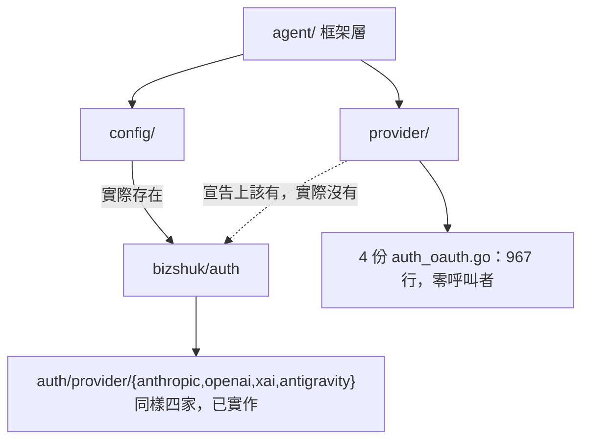

# auth 沉入 provider 之下，`config/` 解體

`狀態 2026-07-26`：`Phase A / B / C1 / C2 全部落地`，root + 8 個 sample module 全綠
（build + vet + test）。分層由 `go list -deps` 驗收：`agent` 與 `provider` registry 本體對
`bizshuk/auth` 皆為 `0`，只有 `provider/credential` 非零；`config/` 目錄已消失。
in-tree OAuth `967` → `194` 行。實作與本文的差異已回寫對應段落。

`未關閉`：OAuth 登入流程未經實跑驗證（見「風險」第一列）；`provider/credential` 尚無 caller。

## Context

架構審查（2026-07-26）列出六項落差，其中 `3`/`4`/`5` 與 sample 分類已落地。剩下的兩項互相糾纏，因為 `agent → auth` 的那條線正好穿過 `config/`：



### 調查推翻了初版判斷

初版建議是「新建 `provider/credential` 收納 OAuth 機制」。實際掃過之後，這個題目`主要是刪除，不是抽取`：

| 事實 | 量測 |
| --- | --- |
| `NewWithOAuth` 在整個 repo 的呼叫點 | `0` — OAuth 登入流程從未接上任何 CLI 或 agent |
| `config.RefreshingProvider` 呼叫點 | `0`（`agent/builder_options.go:72` 只有一處註解提及） |
| `AppConfig.AuthStore` / `AuthDir` 外部呼叫點 | `0` |
| `AppConfig.LogDir` / `LogFile` 外部呼叫點 | `0` |
| in-tree OAuth 總行數 | `967`（anthropic `238`、codex `258`、grok `244`、antigravity `227`）|
| 其中逐字相同的函式 | `IsExpired` 4/4、`GeneratePKCE` 3/4、`openBrowser` 2/4 |

而 `bizshuk/auth` 已經有全套且涵蓋同一批 provider：

```text
auth/utils     GeneratePKCE / S256Challenge / GenerateState / OpenBrowser / FileStore
auth/svc       OAuthClient(authorize/exchange/refresh) / CallbackServer / Resolver
auth/model     Credential（含 Expired(skew)、Validate、VerifyResult）
auth/provider  anthropic_oauth / openai_oauth / xai_oauth / antigravity_oauth  ← 正好對上我們複製的四家
```

也就是說：`967` 行 in-tree OAuth 是外部 module 的重複實作，而且`沒有任何呼叫者能證明它是對的`。

### 重複已經漂移

比對兩份 `anthropic` OAuth 常數，五個值裡有三個不一致：

| 欄位 | agentsdk in-tree | bizshuk/auth |
| --- | --- | --- |
| `CLIENT_ID` | `9d1c250a-…-5944d1962f5e` | 相同 |
| `TOKEN_URL` | `console.anthropic.com/v1/oauth/token` | `api.anthropic.com/v1/oauth/token` |
| `REDIRECT_URI` | `console.anthropic.com/oauth/code/callback`（貼回碼） | `http://localhost:54545/callback`（本機 server） |
| `SCOPES` | `org:create_api_key user:profile user:inference` | `user:profile user:inference` |

兩邊都沒有 caller，所以`哪一份是對的無法從程式碼判斷`。這是本計畫最大的未知數，見「風險」。

## 設計

### 目標分層

```text
tier 4  agent/               框架層：組裝 + lifecycle + AppConfig（config/app.go 併入）
tier 3  agentsdk 元件         planning action tool memory runtime prompt permission session skill wire tui
                             middleware/ + middleware/preset（config/default.go 併入）
tier 2  provider/            registry + adapter；provider/credential 是唯一看得到 auth 的子套件
tier 1  bizshuk/auth         credential mechanism，只被 provider/credential 看見
tier 0  core/                純型別與 port
```

規則一句話：`agent` 不得出現 `auth` 於傳遞依賴中；`provider`（registry 本體）也不得，只有 `provider/credential` 可以。

### Phase A — 切斷死掉的 auth 連線（零新增程式碼）

`config` 對 `auth` 的依賴只有兩處，兩處都零呼叫者：

- `config/provider.go` 的 `RefreshingProvider` → `auth/model` + `auth/svc`
- `AppConfig.AuthStore` / `AuthDir` → `auth/utils`

處理方式`不是刪除而是搬遷`：refresh-before-call 這個 decorator 機制本身是對的，只是住錯層。搬到 `provider/credential/` 之後它仍然存在、仍可被 wire，但 `agent` 看不到它。

- `config/provider.go` + `config/provider_test.go` → `provider/credential/refreshing.go` + `_test.go`
- `AppConfig` 移除 `AuthStore` / `AuthDir` 兩個欄位（順手移除同樣零呼叫者的 `LogDir` / `LogFile`？`不`——那兩個是 log 路徑，屬於 AppConfig 的本職，只是目前無人讀；保留）

落地後 `config` 不再 import auth，`agent` 的傳遞依賴中 auth 消失。這一步`獨立可交付、零風險`。

### Phase B — `config/` 解體

| 現在 | 去處 | 新名稱 | 理由 |
| --- | --- | --- | --- |
| `config/app.go` | `agent/apphost.go` | `agent.AppConfig` / `agent.OpenForCLI` | `agent.Run` 的 step 1 本來就在做這件事；AppConfig 只被 agent 與 sample 消費 |
| `config/default.go` | `middleware/preset/preset.go` | `preset.Default()` / `preset.Secure()` | preset 是 middleware 的組合，該與 middleware 同住 |
| `config/provider.go` | （Phase A 已搬走） | `credential.RefreshingProvider` | — |

`config/` 目錄消失。順帶解掉「五個東西都叫 config」的命名衝突（`config.AppConfig` / `agent.Config` / `spec.Config` / `utils/configfile` / `*.yaml`）。

原本 `config/default.go` 的註解宣稱 preset 不能住 `runtime/` 是因為會與 `middleware/` 成環——那是真的，但 `middleware/preset` 是 middleware 的`子套件`，方向是 `preset → middleware`，不成環。`runtime/m4_hitl_e2e_test.go` 是 `package runtime_test`（外部測試套件），改 import `preset` 同樣不成環。

破壞性 API 變更只有一個，但涵蓋所有 sample：

```go
// 之前
Bootstrap(ctx context.Context, cfg *config.AppConfig) (*runtime.Engine, core.State, error)
// 之後
Bootstrap(ctx context.Context, cfg *agent.AppConfig) (*runtime.Engine, core.State, error)
```

`Runner` / `Preflighter` 兩個介面各一處，5 個 sample 各一處實作。純機械改動。

### Phase C1 — 七個 adapter 統一到 `core.Auth`，credential 改 per-request decorator

這一步是 2026-07-26 討論補上的，原版計畫沒有。它`不吃 auth 依賴`，純 in-repo，做完就已經是目標架構——`C2` 只是把 decorator 的來源從 env 換成 auth。

出發點：`core.Auth` 早就存在（`core/port.go:119`），而且正是所需的 union。

```go
type Auth struct {
    APIKey  string            // x-api-key 或 Bearer，看 provider
    Bearer  string            // OAuth access token
    Headers map[string]string // anthropic-beta、ChatGPT-Account-ID …
    BaseURL string
}
```

`anthropic` 的兩條 credential 路徑差異就只是這個 struct 的欄位不同——`api_key` 是
`{APIKey: key}`，`oauth` 是 `{Bearer: token, Headers: {"anthropic-beta": "true"}}`，request
端一段照著它分岔的 header 注入。也就是說 request decorator 已經被實作了一半，只是寫死在一個
adapter 裡：`7` 個 adapter 只有 `anthropic` 用 `core.Auth`，其餘 `6` 個手刻同形狀欄位。

```text
anthropic     auth core.Auth              ← 唯一做對的
antigravity   apiKey string, bearer string
codex         apiKey string, bearer string, accountID string   ← accountID 其實是個 header
grok          apiKey string, bearer string
google        apiKey string
minimax       apiKey string
ollama        apiKey string
```

前提已查證：`credential kind 只影響 header`，不影響 base URL 也不影響 body。四家
OAuth-capable adapter 全部成立（`ResolveBaseURL` 不看 credential kind）。所以「注入一個
request decorator」足夠涵蓋 api_key 與 oauth 兩種，不需要讓 credential 去改 endpoint 或
normalize body。

設計：

```text
core.Auth              資料（已存在，不動）
provider.Decorator     行為：type Decorator func(context.Context) (core.Auth, error)
provider.Options       加一個 Decorator 欄位
provider/credential    唯一 import auth 之處（Phase C2 才接上）
```

兩個關鍵約束：

- decorator 型別定義在 `provider`，`不`能定義在 `auth`。否則每個接受它的 adapter 都得
  import `auth`，「adapter 自我包含」就沒了——而那正是當初複製 `967` 行的理由。
- 注入的是 `func(ctx) (core.Auth, error)` 而`不`是 `core.Auth` 值。OAuth token 會在 run
  中途過期，建構時定案的 header 撐不過一小時。在 HTTP 層每次解析，順帶涵蓋 retry、SSE
  重連、`ListModels`、`CountTokens`，而且 token 輪替時不需要重建 adapter——現行
  `RefreshingProvider` 是包在 `Generate`/`Stream` 外層，輪替時整個 adapter 重建。

### Phase C2 — 收掉 967 行重複 OAuth

adapter 的職責是「拿到 token 之後怎麼跟 API 說話」，`取得 token 是另一件事`。四個 adapter 之所以複製，理由寫在註解裡：「kept local so this package stays self-contained (no cross-module import)」——這個顧慮是對的，但解法不是複製，是`把流程移出 adapter`。

```text
provider/<name>/auth_oauth.go   → 只留 vendor 常數 + NewWithOAuth(token) 建構子   （~40 行 ×4）
provider/credential/            → 擁有流程：PKCE、authorize、exchange、refresh、
                                  callback server、browser open；全部委派給 auth/svc + auth/utils
                                  並持有 registry name → auth provider id 的對照表
```

對照表（我們的 registry key → `auth/provider.ROUTES` 的 id）：

```text
anthropic    → anthropic_oauth
codex        → openai_oauth
grok         → xai_oauth
antigravity  → antigravity_oauth
```

落地後每家 vendor 的 OAuth 常數只存在於 `bizshuk/auth` 一處。

`1:N 要維持成軸`，不要被 `auth/provider.ROUTES` 的扁平 id 汙染上層。ROUTES 今天把
`anthropic` 與 `anthropic_oauth` 攤成兩個 id；agentsdk 的兩軸模型（`Model.Provider` +
`Model.CredentialKind`，item `4` 剛收斂完）才是對的那個。扁平 id 只存在於上面那張對照表內，
不冒到 `spec.Model.Provider`——否則就把剛建好的軸壓回去了。

`Phase C2 必須先解決常數漂移`（見風險），因此排在最後，也可以獨立延後。

### 執行順序

階段名以本檔的 `Phase` 為準；括號內是架構審查的原始項次，兩者刻意不同序：

```text
Phase A   切斷死連線            (審查項 1)  獨立、零風險、立即可交付
Phase B   config 解體           (審查項 2)  依賴 Phase A（config/provider.go 已搬走）
Phase C1  七家統一到 core.Auth   (審查項 1)  不吃 auth 依賴；做完就已經是目標架構
Phase C2  收 OAuth 重複          (審查項 1)  風險最高，需先驗證哪份常數正確；可無限期延後
```

這個切法的好處：停在 `1C1` 仍然是完整可用的設計。若 `auth` release 卡住，`1C2` 可以無限期擱置而不影響前三步的價值。

## 修改檔案清單

### Phase A

新增：

- `provider/credential/refreshing.go`（自 `config/provider.go` 搬移，改 package 名與錯誤前綴）
- `provider/credential/refreshing_test.go`（自 `config/provider_test.go` 搬移）

修改：

- `config/app.go` — 移除 `AuthStore` / `AuthDir` 欄位與 `auth/utils` import
- `config/app_test.go` — 移除對應斷言
- `agent/builder_options.go:72` — 註解中的 `config.NewRefreshingProvider` → `credential.NewRefreshingProvider`

刪除：

- `config/provider.go`、`config/provider_test.go`

### Phase B

新增：

- `agent/apphost.go`（自 `config/app.go`）、`agent/apphost_test.go`
- `middleware/preset/preset.go`（自 `config/default.go`）、`middleware/preset/preset_test.go`

修改：

- `agent/contract.go` — `Runner` / `Preflighter` 簽章的 `*config.AppConfig` → `*AppConfig`
- `agent/build.go` — 移除 `appconfig` import；`SecureMiddleware`/`DefaultMiddleware` → `preset.*`
- `agent/lifecycle.go` — `config.OpenForCLI` → `OpenForCLI`
- `runtime/loop.go` — 4 處註解 `config.DefaultMiddleware()` → `preset.Default()`
- `runtime/m4_hitl_e2e_test.go` — import 改 `preset`
- `sample/{code-agent,file-agent,greet-agent,skeleton-agent}/…` — `config.AppConfig` → `agent.AppConfig`
- `sample/logdoctor-agent/cmd/{run,resume}.go` — `config.SecureMiddleware` → `preset.Secure`
- `CLAUDE.md` — 結構樹、模組對應表、`config/` 相關的三則決策段落

刪除：

- `config/` 整個目錄

### Phase C1

修改：

- `provider/adapter.go` — 新增 `type Decorator func(context.Context) (core.Auth, error)`
- `provider/registry.go` — `Options` 加 `Decorator` 欄位；`Resolve` 在無 Decorator 時維持現行 env 行為
- `provider/{antigravity,codex,google,grok,minimax,ollama}/provider.go` — `apiKey`/`bearer`/`accountID`
  欄位收斂為 `auth core.Auth`（`accountID` → `Headers["ChatGPT-Account-ID"]`）
- 7 個 adapter 的 request 建構點 — header 注入改為統一讀 `core.Auth`，並在有 Decorator 時每次呼叫前解析

### Phase C2

修改（4 個 adapter，pattern 一致）：

- `provider/{anthropic,antigravity,codex,grok}/auth_oauth.go` — 縮為常數 + 型別
- `provider/credential/oauth.go` — 新增，委派 `auth/svc` + `auth/utils`，持有 `(name, kind) → route id` 對照表

## 風險與取捨

| 風險 | 影響 | 對策 |
| --- | --- | --- |
| `anthropic` OAuth 常數兩份不一致，且都無 caller 可證 | Phase C2 選錯會讓 OAuth 登入靜默失敗 | 動工前先用任一份實跑一次 login 流程確認；`確認不了就不做 Phase C2`（停在 C1 仍是完整設計） |
| `Runner.Bootstrap` 簽章變更 | 所有外部實作者需同步 | pre-1.0（`v0.1.0`），且 5 個實作全在本 repo；接受破壞 |
| `agent` 吸收 AppConfig 後變更肥 | agent 已 import 14 個 package，再加 gosdk/viper | 可接受：`agent` 本來就是組裝層，而 `agent.Run` 已經在呼叫 `OpenForCLI`；真正的分層收益是 auth 離開，不是行數 |
| 搬走 `RefreshingProvider` 後仍然零呼叫者 | 只是換個地方放死碼 | 明知故犯：它是 credential rotation 的正確機制，住對層之後才有機會被 wire。若 6 個月後仍無 caller，該刪 |
| `docs/specs/` 與 `plans/` 內的舊路徑 | 文件指向不存在的目錄 | 不改寫歷史紀錄；只同步 `CLAUDE.md` / `README.md` / `docs/terminology.md` / `docs/tutorials/` |

刻意`不`做的事：

- 不動 `provider/*/auth_api.go`（API key 路徑正常運作且有 caller）
- 不把 `auth` 變成 `provider` 本體的依賴——只有 `provider/credential` 可以看到它
- 不在本計畫實作 login CLI；Phase C2 只做去重，接線是另一個題目

## 驗證

```bash
cd /Users/shuk/projects/ai/agentSDK

# 1. 分層不變式（Phase A 之後就該全部成立）
go list -deps ./agent    | grep bizshuk/auth   # 必須為空
go list -deps ./provider | grep bizshuk/auth   # 必須為空
go list -deps ./provider/credential | grep bizshuk/auth   # 必須非空（唯一允許處）
go list -deps ./agent/spec | grep agentsdk     # 只該有 core 與 agent/spec
go list -deps ./prompt     | grep agentsdk     # 只該有 core 與 prompt

# 2. config 已消失（Phase B 之後）
test ! -d config && echo "config/ dissolved"
grep -rn "agentsdk/config" --include=*.go .    # 必須為空

# 3. 全 workspace build + vet + test
for m in . sample/code-agent sample/demo-memory sample/demo-middleware sample/demo-strategy \
         sample/file-agent sample/greet-agent sample/logdoctor-agent sample/skeleton-agent; do
  (cd "$m" && go build ./... && go vet ./... && go test ./... -count=1 -timeout=120s) || echo "FAIL $m"
done

# 4. middleware 順序未變（preset 搬家不得改動鏈的組成）
go test ./middleware/... ./runtime/... -count=1 -run 'Middleware|Chain|Secure'

# 5. Phase C2 專屬：確認 vendor 常數只剩一份
grep -rn "OAuthClientID\|OAuthTokenURL\|OAuthScope" provider/ | wc -l   # 應大幅下降
wc -l provider/*/auth_oauth.go                                          # 目標 ~40 行/檔
```

CLI 煙霧測試（Phase B 之後，行為不得改變）：

```bash
go run . provider --list-providers
go run . w -y --tier full -o -
cd sample/skeleton-agent && echo "ping" | go run .
```
