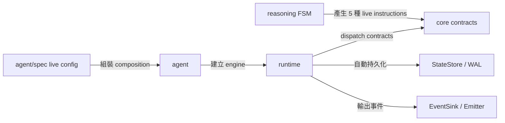

# Evolution Plan — Live Contract Surface

Status: applied

## Outcome

縮小 SDK 的公開契約面，只保留 production path 真正會產生或消費的 instruction 與 agent config；維持既有 `core → reasoning → runtime → agent` 高階架構、套件依賴方向與實際能力。

## Scope

納入：

- 移除沒有 producer 的 `checkpoint`、`emit` instruction kinds 與 payload。
- 移除沒有 composition/runtime consumer 的 `limits.max_wall_time`、`memory.compaction` config。
- 同步 production tests、wizard、範例設定與現行文件。

不納入：

- 不改仍在使用的 instruction JSON wire shape。
- 不拆分 `runtime/loop.go`。
- 不移除 `memory` 的 compaction mechanism 或 `sample/demo-memory`。
- 不移除 `agent.WithTimeout`、`runtime` 自動 persistence、`core.EventSink` 或 `Engine.Emitter`。
- 不回寫歷史 plans/specs。

## Evidence

| Surface | Current evidence | Replacement or owner |
| --- | --- | --- |
| `INSTRUCTION_CHECKPOINT` | 只有 declaration、runtime dispatch case 與 tracing label；沒有 producer，payload reason 未被使用 | `runtime` 經 `StateStore` / `WriteAheadLog` 自動持久化 |
| `INSTRUCTION_EMIT` | 只有 declaration、runtime no-op case 與 tracing label；沒有 producer | `core.EventSink` 與 `Engine.Emitter` |
| `Limits.MaxWallTime` | 只有 schema、validation、examples 與 tests；沒有 composition/runtime consumer | `agent.WithTimeout` / `RunOpts.Timeout` |
| `Memory.Compaction` | 只有 schema、defaults、choices、wizard 與 tests；沒有 composition/runtime consumer | `memory/compaction` mechanism 保持獨立，由 caller 明確組裝 |

## Placement

## Landing Steps

1. 移除 dead instruction kinds、payloads、runtime cases 與 tracing labels。
2. 移除 no-op config fields、defaults、choices、validation、wizard surface 與相關 tests。
3. 同步 README、CLAUDE、live tutorial、config examples 與 README.todo。
4. 執行 formatting、targeted tests、root/sample build/vet/test 與 dependency boundary checks。

## Acceptance

- Production Go source 不再包含四個 dead surfaces。
- Live config examples 與 tutorial 不再承諾無效設定。
- 仍保留五種 live instruction、runtime persistence、event output、timeout API 與 compaction mechanism。
- Root 與所有 sample modules 的 build、vet、test 通過。
- `agent/spec` 仍只依賴 `core`；`core` 仍維持 stdlib-only。

## Rollback

此變更是一個可整體 revert 的 cohesive diff；若外部 caller 證明仍依賴被移除的 compile-time API，可回復該 surface，再為它建立真實 composition path。

## Result

- Live instruction kinds 由 `7` 收斂為 `5`；payload structs 由 `5` 收斂為 `3`，`Instruction` optional payload fields 由 `6` 收斂為 `4`。
- `agent/spec` 移除 `2` 個沒有 consumer 的 serialized fields，wizard、choices、validation、examples 與 tutorial 同步收斂。
- Production/docs tracked diff 為 `+22 / -87`；高階 package boundary、runtime persistence、event output、timeout API 與 compaction mechanism 均保留。
- Root `build` / `vet` / `test`、8 個 sample module 的 `build` / `vet` / `test`、`gopls check`、XML validation 與 dependency boundary checks 全部通過。
