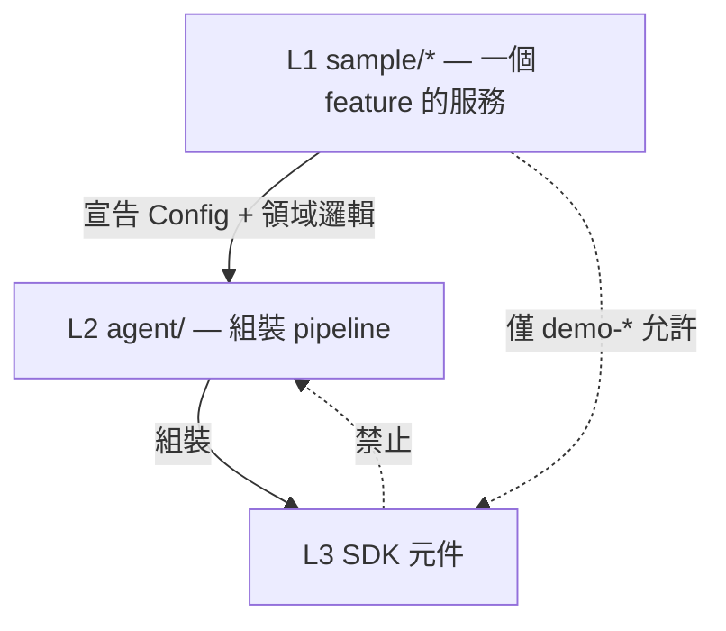

# 三層契約符合性稽核 (Three-Layer Conformance Audit)

`狀態 2026-07-26 13:20`：Phase A / B2 / C / D 全部落地。

## 落地結果

| Phase | 完成 | 檔案 |
| --- | --- | --- |
| `A` 清結構殘留 | ✅ | `skeleton-demo` binary 移除；`apphost.go` doc comment 改為 `apphost`；`config.example.yaml` 與 `config.agent.example.yaml` 引用修正；`file-agent.yaml` 引用修正 |
| `B1` utils 留原地 | ✅（使用者決定） | `utils/agentconfig` 維持原路徑，`utils/` 視為三層外的 utility umbrella |
| `B2` Engine 型別別名 | ✅ | `agent.Engine = runtime.Engine`；`Runner.Bootstrap` / `Parts.Engine` / 3 個 sample 不再 import `runtime` |
| `C` 拆 process 宿主 | ✅ | `agent.Host` + `agent.Open` (可嵌入)；`agent/cli/` (signal, dir, slog, os.Exit)；`agent.AppConfig = Host` deprecated；5 個 sample 改 `cli.Main`/`cli.MustOpenForCLI`；`tests` 改 `agent.Host` |
| `D` logdoctor 遷 L2 | ✅ | `agent.NewEngine`、`agent.ReActStep`、`agent.Perform`、`agent.ResumeRun`、`agent.ListRuns`、`agent.Approve` 六個 L2 seam；logdoctor 五個 subcommand 改走 seam，不再 import `runtime` 或 `planning` |
| `E` wizard 詞彙下沉 | ✅ | `agent.Choice` alias 移除；`ProviderChoices`/`ModelChoices` 改成 `ProviderEntries()`/`ProviderCatalog()`（raw data）；`providerNote`/`modelNote` 搬到 `cmd/agent/wizard/notes.go`；wizard 包內的 `providerChoices()` 包 `agent.ProviderEntries()` 為 `[]spec.Choice`；`once_test.go` 改測 raw entries；wizard 新增 `notes_test.go` |

### Phase C 重點

- `agent.Open` 是 embeddable 入口（無 globals、無 mkdir、無 slog）；`agent/cli.OpenForCLI` 在它之上做 process 級動作。
- `Runner.Bootstrap` 簽章 `*AppConfig` → 等價於 `*Host`（型別別名），既有呼叫端零修改。
- 三個 sample 從 `agent.Main(a)` 改 `cli.Main(a)`。
- `lifecycle_test.go` 改用 `testHost(name)` 提供 in-memory `Store` + `WAL`。

### Phase D 重點

- `agent/runtime_ops.go`：5 個 seam (`NewEngine` / `Perform` / `ResumeRun` / `ListRuns` / `Approve`) 加 `agent/engine_ctor.go`：`ReActStep` 提供 default reasoning rule。
- logdoctor 五個 subcommand 改走 seam：
    - `run`：`agent.NewEngine` + `agent.ReActStep` + `agent.Open` → `engine.RunWithEvent`
    - `resume`：`agent.NewEngine` + `agent.Open` + `agent.ListRuns` + `agent.ResumeRun`
    - `list`：`agent.Open` + `agent.ListRuns`
    - `approve`：`agent.Open` + `agent.Approve`
    - `watch`：M4 scaffolding 仍 stub，但已從 `runtime.NewEngine` 改 `agent.Engine` 型別
- logdoctor 仍 import `core`/`action`/`middleware/preset`：這些都是 L3 但屬 domain logic（tool 註冊、security 策略選擇、message shape）。runtime 與 planning 已不再直接接觸。

### 驗收

```text
root module:        go test ./... 全綠 (37 packages ok)
8 sample modules:   go test ./... 全綠
依賴方向:           utils 留原地 (P0 結案)；其他 SDK package 不看見 agent/
L2 職責:            grep 'os.Exit\|slog.SetDefault\|signal\.' agent/*.go → 僅 doc comment
L1 邊界:            grep 'agentsdk/runtime\|agentsdk/planning' sample/logdoctor-agent/cmd/*.go → empty
```

## 0. 契約 (Contract)

| 層 | 位置 | 定義 | 允許的依賴方向 |
| --- | --- | --- | --- |
| `L1 service` | `sample/*` | 為`單一 feature` 而跑的服務 | 只看 `L2`（demo-\* 例外：刻意只看 `L3` 單一元件） |
| `L2 framework` | `agent/` | 用 `L3` 元件組裝 e2e agent flow，對外提供 pipeline | 只看 `L3` |
| `L3 sdk` | `core` `planning` `action` `tool` `memory` `runtime` `middleware` `prompt` `skill` `provider` `utils` | 各自獨立、可當單一函式使用的元件 | 只看 `L3`（同層或 `core`） |



## 1. 不符項目 (Mismatches)

七項。P0 是唯一真正的依賴反向，其餘是職責歸屬與簽章外洩。

| # | 嚴重度 | 位置 | 違反 | 證據 |
| --- | --- | --- | --- | --- |
| `1` | `P0` | `utils/agentconfig` | `L3` → `L2` 反向依賴 | `go list -deps ./utils/agentconfig` 出現 `agent/spec` |
| `2` | `P1` | `sample/logdoctor-agent` | `L1` 重造 `L2` | `cmd/run.go:92`、`cmd/resume.go:104` 各自 `core.NewDecide` + `runtime.NewEngine` |
| `3` | `P1` | `agent/lifecycle.go`、`agent/apphost.go` | `L2` 持有 process 宿主職責與全域狀態 | `os.Exit`(L34)、`signal.NotifyContext`(L32)、`slog.SetDefault`(apphost L123) |
| `4` | `P2` | `agent.Runner.Bootstrap`、`agent.Parts.Engine` | 簽章逼 `L1` import `L3` | `file-agent` / `greet-agent` / `skeleton-agent` import `runtime` 只為回傳型別 |
| `5` | `P2` | `spec.Choice`、`agent.ProviderChoices`、`agent.ModelChoices` | wizard 呈現詞彙住在宣告層與組裝層 | `Choice{Label, Note, Default}`、`provider_catalog.go:specsToChoices` |
| `6` | `P3` | repo root | 結構殘留 | 空目錄 `skeleton-demo/`（未追蹤）、工作檔 `agent.yaml` 已入版控 |
| `7` | `P3` | 三份 example / 一處 package doc | 文件宣告不存在的結構 | `config.sdk.example.yaml` 不存在、`agentsdk run -c` 子指令不存在、`apphost.go:1` 仍寫 `Package config` |

### 1.1 P0 — `utils/agentconfig` 反向依賴

`utils/` 的契約是「根層共用 utilities」——`frontmatter` / `configfile` / `testutil` 三者都只看 stdlib。
`agentconfig` 不同：它的全部工作是 encode/decode `spec.Config`，因此 import `agent/spec`。
這是全 repo 唯一一條 `L3 → L2` 的箭頭（`go list -deps` 對其餘 10 個 SDK package 皆為空）。

它同時讓三個 sample 為了讀設定檔而 import `utils/*`，而不是只碰 `L2`。

### 1.2 P1 — `logdoctor-agent` 重造 pipeline

`logdoctor-agent` import 了 `planning` / `runtime` / `middleware/preset` / `action` / `memory/filestore` /
`provider/{anthropic,google,ollama}`，在 `run.go` 與 `resume.go` 兩處各自組出 Engine。
`bd83a07` 的理由是`操作介面`：五個 subcommand（run / watch / resume / list / approve）
與 out-of-band 核准，都在 `agent.Main` 的邊界之外。

理由成立，但結論不成立——它指出的是 `L2` 的縫不夠，而不是 `L1` 該自己組裝。缺的三個縫：

```text
agent/ 目前提供                  logdoctor 需要而沒有
  Run(ctx, Runner)          →    對「已持久化的 run」做 resume/approve（不重跑 lifecycle）
  Parts{Engine, Sessions}   →    不經 Run 就能取得 Engine（Bootstrap 可以，但要自帶 AppConfig）
  Interactive.NextRound     →    跨 process 的核准（decision 由另一個 subcommand 寫入）
```

### 1.3 P1 — `L2` 持有 process 宿主職責

`agent.Main` 綁 signal、呼叫 `os.Exit`；`OpenForCLI` 建目錄並 `slog.SetDefault`。
兩者都是`服務怎麼被啟動`，屬 `L1`。實質後果是 `L2` 無法被嵌入非 CLI 宿主
（HTTP server 內跑多個 agent 時，全域 logger 會被第一個 agent 換掉）。
`AppConfig` 六個欄位有四個是檔案系統路徑，型別名亦寫死 `ForCLI`。

### 1.4 P2 — 簽章外洩 `*runtime.Engine`

```go
Bootstrap(ctx context.Context, cfg *AppConfig) (*runtime.Engine, core.State, error)
Parts.Engine *runtime.Engine
```

三個 sample 對 `runtime` 的唯一用途就是寫出這個回傳型別（`grep 'runtime\.'` 各只有一行）。

### 1.5 P2 — wizard 詞彙上移

`Choice{Value, Label, Note, Default}` 是 UI 呈現資料。`spec` 宣稱「只 import core 的純資料層」成立，
但 `Label` / `Note` 本身是 `L1 tooling` 的關切；`agent.ProviderChoices` 的存在理由
（「只有 agent 知道哪些 adapter 被 link 進來」）其實已由 `provider.Entries()` 回答。

## 2. 修正計畫 (Plan)

四階段，依風險遞增；每階段結束都要求 `go build ./...` + 全 module `go test` 全綠。

### Phase A — 清殘留（零風險，無行為變更）

1. 刪空目錄 `skeleton-demo/`（未追蹤）。
2. `agent/apphost.go:1` 的 `Package config` 改為 `Package agent` 敘述。
3. 三份 example 修正：合併 `config.example.yaml` 與 `config.agent.example.yaml`（後者引用的
   `config.sdk.example.yaml` 不存在）；移除 `agentsdk run -c` 的引用，或補上該子指令（見 Phase D 選項）。
4. `agent.yaml` 移出版控（加入 `.gitignore`）或改名 `agent.example.yaml`。

### Phase B — 修依賴方向（P0 + P2 簽章）

1. `utils/agentconfig` → `agent/config`（package 名維持 `agentconfig`）。
   呼叫端：`cmd/agent/wizard/*`、`sample/{file,greet,skeleton}-agent`。
   驗收：`go list -deps ./utils/... | grep 'agentsdk/agent'` 必須為空。
2. `agent` 新增 `type Engine = runtime.Engine`，`Runner.Bootstrap` 與 `Parts.Engine` 改用別名。
   別名不破壞既有呼叫端（同一型別），三個 sample 得以刪掉 `runtime` import。
   驗收：`grep -l 'agentsdk/runtime' sample/{file,greet,skeleton}-agent/main.go` 必須為空。

### Phase C — 拆 process 宿主（P1，破壞性）

把 `agent/` 切成`可嵌入`與`CLI 專用`兩半：

```text
agent/                 Host{DataDir, LogDir, RunID, Store, WAL, Logger *slog.Logger}
                       Open(HostOptions) — 不碰全域、不建 process 級狀態
agent/cli/             Main / Run / os.Exit / signal / slog.SetDefault / OpenForCLI
```

- `AppConfig` 保留為 `Host` 的 deprecated alias 一個 release。
- `Runner.Bootstrap` 的參數型別隨之改為 `*Host`；5 個 sample 同步（與 `config/` 解體時同型的破壞面）。
- 驗收：`grep -rn 'os.Exit\|slog.SetDefault\|signal\.' agent/*.go` 必須為空（只准出現在 `agent/cli/`）。

### Phase D — 補 `L2` 缺的縫，再遷 logdoctor（P1，最大）

先補縫，後遷移；縫沒補之前不動 logdoctor。

1. `agent` 新增對已持久化 run 的操作（`Parts` 之上，不經 `Run` 的 lifecycle）：
   `ResumeRun(ctx, runID)`、`Decide(ctx, runID, decision, by)`、`ListRuns(ctx)`。
   三者今日各自散在 `logdoctor-agent/cmd/{resume,approve,list}.go`，是可上收的共通形狀。
2. logdoctor 的五個 subcommand 改為 `L1` 只保留：flag 定義、`agent.Config` 宣告、
   domain tool 註冊（`tool/`）、listener（`core/listener.go`）。
3. 若 (1) 做完仍有 logdoctor 專屬而無法上收的部分，該部分即為`真正的 L1 領域邏輯`，
   保留並在 README 記錄；屆時 `bd83a07` 的註記改寫為「已收斂，剩餘 X 為領域邏輯」。

`Phase D 的替代方案`：不遷移，改為把 logdoctor 重新歸類為 `demo-*`（手接 SDK 元件的展示）。
成本最低但代價是：`*-agent` 這個分類從此不再保證「走 `L2`」，
分類的判準會從`是什麼`退化為`怎麼建的`——與 2026-07-26 的命名決策相反，故列為次選。

### Phase E — wizard 詞彙下沉（P2，選作）

`Choice` 移到 `cmd/agent/wizard`；`spec` 只留 `Values()` 這類純列舉；
`provider.Entries()` 已足以讓 wizard 自行組出 Label/Note。
影響面小但觸及 `spec` 公開 API，建議與 Phase C 的破壞性變更同一個 release 一起做。

## 3. 驗收指令 (Verification)

```bash
cd /Users/shuk/projects/ai/agentSDK

# 依賴方向：L3 不得看見 L2
for p in core planning action tool memory runtime middleware prompt skill provider utils; do
  go list -deps ./$p/... 2>/dev/null | grep 'agentsdk/agent' && echo "VIOLATION: $p"
done

# L1 不得看見 L3 的 runtime（demo-* 除外）
grep -l 'agentsdk/runtime' sample/*-agent/**/*.go

# L2 不得持有 process 宿主職責（Phase C 之後）
grep -rn 'os.Exit\|slog.SetDefault\|signal\.' agent/*.go

# 全 module 綠燈
for mod in . sample/code-agent sample/file-agent sample/greet-agent sample/logdoctor-agent \
  sample/demo-memory sample/demo-middleware sample/skeleton-agent sample/demo-strategy; do
  (cd "$mod" && go build ./... && go test ./... -count=1 -timeout=120s)
done
```
