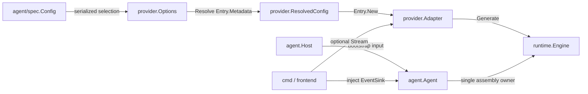

# Agent framework / AgentSDK 契約對齊簡化計畫

狀態：`Phase 4 ready for review`

日期：`2026-07-27`

執行進度：

- `Phase 0`：`Completed`
- `Phase 1`：`Completed`
- `Phase 2`：`Completed`
- `Phase 3`：`Completed`
- `Phase 4`：`Ready for review`
- `Phase 5`–`Phase 6`：`Pending`

## 結論

目前的分層方向已正確：`agent/` 依賴 SDK package，SDK production package 不反向
依賴 `agent/`。本次不需要搬目錄或再增加 facade；應集中消除「同一責任有兩個 owner」
以及「同一建構資料被逐層換成同形 struct」。

優先順序：

1. 先修正 `agent.Run` 與 `Agent.Bootstrap` 的雙重組裝，避免停用的 persistence 被重新接回，
   並移除 provider 的雙重建構。
2. 移除沒有真實 consumer 的宣告面：`spec.Output`、`Parts.Prompt`、
   `Parts.Config`、`AppConfig` compatibility alias。
3. 讓工具、reasoning、autonomy 的 vocabulary owner 自己完成 name-to-implementation 映射，
   `agent/` 只負責組裝。
4. 收窄 `core.Provider` 為 runtime 真正需要的能力，registry metadata 與 catalog 只留在
   `provider.Entry`。
5. 將七組 adapter-local `config + Option + register converter` 收斂成一個
   `provider.ResolvedConfig`，但保留真正跨語意邊界的 projection。
6. wire DTO 只在 contract test 證明相容後局部共用，不因欄位相似就全域合併。

## 範圍

納入：

- framework：`agent/`
- SDK：`core/`、`reasoning/`、`runtime/`、`tool/`、`memory/`、
  `middleware/`、`prompt/`、`skill/`、`provider/`
- composition caller：`cmd/`，僅在 public contract 變更時同步
- canonical docs：`README.md`、`CLAUDE.md`、`README.todo`

排除：

- `sample/`：實際目錄名稱是 singular；不作為設計輸入，只在實作階段作編譯相容 fixture
- `utils/`
- repository root 目前沒有 `agents/` 目錄；若日後新增，另行審查
- 外部 `auth` module 與外部 `proxy` module 的內部設計

各 phase 依序實作並在 checkpoint 停止供 review；未經確認不進入下一 phase。

## 現況證據

### 已正確的邊界

- production SDK package 沒有 import `agent`；依賴方向仍是 `agent → SDK`。
- `agent/spec` 只 import `core`，可獨立供 wizard/schema/config tooling 使用。
- `ToolCall`、`ToolResult`、`ModelRequest` 已是 canonical payload，不再建立平行 DTO。
- `Event`、`HookEvent`、`StreamEvent` 雖有相似欄位，但 producer、consumer 與穩定性不同，
  不應合併。

### 應簡化的重複

| 優先級 | 證據 | 問題 |
| --- | --- | --- |
| `P0` | `agent/build.go:81-95`、`agent/lifecycle.go:56-65`、`agent/host.go:119-128` | `Bootstrap` 依 config 決定 persistence 後，`Run` 又以 `Host` 將 nil store/WAL 補回；memory disabled 可能失效 |
| `P0` | `agent/agent.go:92-95`、`agent/lifecycle.go:43-48`、`agent/build.go:48-52` | registry provider 在 `Preflight` 與 `Bootstrap` 各建構一次 |
| `P0` | `agent/lifecycle.go:28` | `Host` 尚未驗證就被 dereference |
| `P1` | `agent/spec/spec.go:57,174-177`、`agent/build.go:396-412` | `output.format=text/tui` 不產生 sink；只有 `json` 有 consumer，presentation ownership 混入 serialized config |
| `P1` | `agent/agent.go:47-55` | `Parts.Config` 重複 `Agent.Config()`；`Parts.Prompt` 無 production caller；`AppConfig` 是 deprecated alias |
| `P1` | 七份 `provider/*/register.go` | 每份重複把 `provider.Options` 轉成 adapter-local `WithModel/WithAPIKey/WithBaseURL` |
| `P1` | 七份 `provider/*/options.go` | 重複 private `config{apiKey, baseURL, model}` 與 functional options；四份還各自接 viper |
| `P1` | `provider/adapter.go:18-30`、`provider/registry.go:61-66` | `Adapter.Metadata()` 無 production caller，與 `Entry.Metadata` 是雙真相 |
| `P1` | `core/provider.go:11-30`、`runtime/loop.go:97` | runtime 只呼叫 `Generate`，卻要求 adapter 實作 identity、catalog、auth schemes、stream、token count |
| `P1` | `provider/registry_options.go:86-119` | `Resolve` 回傳同一個 `Options` 型別，無法從型別區分 unresolved/resolved；OAuth env 也被放入 `APIKey` |
| `P2` | 四份 `provider/*/auth_oauth.go` | `OAuthCredentials` 帶 refresh token/expiry，但 production decorator 只交付 request-time `core.Auth` |
| `P2` | `provider/credential/refreshing.go` | 舊的 rebuild-provider 路徑零 production caller，且已被 per-request decorator 取代 |
| `P2` | `agent/build.go:169-211,281-315,446-462` | built-in tool、reasoning rule、autonomy vocabulary 的 converter 由 composition root 手刻，owner 容易 drift |
| `P3` | `provider/google/dto.go`、`provider/ollama/dto.go` | DTO 除 package/comment 外相同；可候選局部共用，但尚未證明所有 encode/decode 行為相同 |

### 基線品質

- `go test ./...`：通過。
- 系統既有 `staticcheck` 由 Go `1.25.4` 建置，無法載入 Go `1.26.0` module。
- 改用 `go run honnef.co/go/tools/cmd/staticcheck@latest ./...` 後可執行，現有
  `14` 個 findings，包含反向 deprecated alias、未使用 helper 與一個 dead assignment。
- `gopls check` 指出七個 provider SSE scanner 與 `tool/builtin/grep.go` 都缺少
  `scanner.Err()` terminal check。

這些 findings 是現況基線；實作各 phase 時不得新增，最後需清零。

## 目標架構



Owner 規則：

- `agent/spec`：只保存可序列化的使用者意圖。
- `agent`：唯一 composition root；一次完成 provider、tools、reasoning、prompt、
  safety、persistence、sink injection 與 engine assembly。
- `core`：只保存 runtime 必須共享的 data contract 與最小 port。
- `provider.Entry`：provider name、metadata、catalog、factory 的唯一真相。
- adapter：接收已解析的 construction config，只負責 vendor protocol。
- frontend / `cmd`：決定 text、JSON、TUI，不把 presentation mode 寫進 agent config。

## 目標 contract

### 1. Agent lifecycle

```go
type Runner interface {
	Name() string
	Bootstrap(context.Context, *Host) (*Engine, core.State, error)
}

func Run(context.Context, Runner, *Host, ...RunOption) error
```

規則：

- `Run` 先驗證 `Runner`、`Host` 與 context，再呼叫一次 `Bootstrap`。
- `Bootstrap` 回傳的 `Engine` 是完整 engine；`Run` 不再以 `bindHost` 猜測缺少的 dependency。
- 移除 optional `Preflighter`。建構錯誤直接由 `Bootstrap` 回報，避免 provider 建兩次。
- process exit code 只屬於 `agent/cli`；`agent.Run` 回傳 error，`cli.Run/Main` 才轉成
  `EXIT_OK` / `EXIT_ERROR`。

### 2. Agent public parts

目標縮成：

```go
type Parts struct {
	Engine   *Engine
	Sessions *session.Manager
	Skills   *skill.Registry
	Host     *Host
	Cwd      string
}
```

- `Agent.Config()` 是 prepared config 唯一 accessor，移除 `Parts.Config`。
- `Parts.Prompt` 在 `Turn()` 有 production wiring 前移除；若日後恢復，必須以明確的
  conversation prompt contract 回歸，不暴露半接線的 `prompt.Builder`。
- `Host` 為 canonical 名稱，移除 `AppConfig` alias。

### 3. Provider construction data

只保留三個語意不同的 shape：

```go
// package agent/spec
// Serializable user intent.
type Model struct {
	Provider       string
	Name           string
	BaseURL        string
	APIKeyEnv      string
	CredentialKind string
}

// package provider
// Unresolved live inputs owned by provider registry.
type Options struct {
	Model          string
	BaseURL        string
	APIKey          string
	APIKeyEnv       string
	CredentialKind string
	LookupEnv      func(string) string
	Decorator      Decorator
}

// Resolved construction input owned by provider registry.
type ResolvedConfig struct {
	Model   string
	BaseURL string
	Auth    core.Auth
}
```

`Options.Resolve(Metadata)` 改回傳 `ResolvedConfig`：

- OAuth env → `Auth.Bearer`
- API key env → `Auth.APIKey`
- endpoint → `ResolvedConfig.BaseURL`
- `Decorator` 不進 `ResolvedConfig`；由 `provider.New` 在 factory 完成後套用
- adapter 不再自行查 env，也不再 import viper

### 4. Provider runtime capability

```go
// package core
type Provider interface {
	Generate(context.Context, ModelRequest) (ModelResult, error)
}

type StreamProvider interface {
	Stream(context.Context, ModelRequest) (<-chan ModelChunk, error)
}

// package provider
type Adapter interface {
	core.Provider
	core.StreamProvider
}

type Factory func(ResolvedConfig) (Adapter, error)
```

- `Entry.Name`、`Entry.Metadata`、`Entry.Catalog` 是 discovery/config owner。
- 從 required runtime port 移除 `ID`、`Name`、`Models`、`AuthSchemes`、
  `CountTokens`、`Metadata`。
- `CREDENTIAL_KIND_*` 暫留在 `core.Auth` vocabulary 旁，讓 `agent/spec` 維持
  core-only；同步移除其註解中對 `Provider.AuthSchemes` 的依賴敘述。
- `core.ModelLister` 保持 optional live-catalog port。
- `CountTokens` 目前無 production consumer，先移除；有 consumer 時再以小型 optional
  interface 恢復。
- `Decorator` 只包 `Generate` / `Stream`，provider name 由 `Entry.Name` 傳入錯誤訊息，
  不依賴 runtime `ID()`。

### 5. Vocabulary factory

- `tool/builtin` 新增 allowlist-aware registration API，由該 package 擁有
  `name → constructor`；`agent.registerBuiltins` 移除 switch。
- `reasoning` 新增 built-in rule factory，由該 package 擁有
  `style → DecisionRule`；`agent.ruleFor` 移除。
- `core` 新增嚴格的 `ParseAutonomyLevel(string) (AutonomyLevel, error)`；
  `agent.autonomyLevel` 與 spec 的第二份清單收斂。
- 不引入 reflection、generic converter registry 或新的 umbrella config。

## 明確不合併

| Shape | 保留分開的理由 |
| --- | --- |
| `spec.Model` / `provider.Options` / `provider.ResolvedConfig` | 分別是 serializable intent、unresolved live input、resolved secret-bearing construction input |
| `spec.Limits` / `core.Budget` | 前者是上限設定；後者含 used counters、timestamps 與 runtime state |
| `agent.Option` / `spec.Config` | closure 只活在 process；config 必須可序列化與列舉 |
| `core.Event` / `core.HookEvent` / `core.StreamEvent` | state transition、policy interception、presentation stream 是不同 consumer contract |
| vendor request/response DTO / `core.Model*` | vendor wire format 是邊界 projection，不是 domain canonical model |
| safety config slices / `permission.Rule` | grouped declarative policy 與 ordered executable rules 語意不同 |

## 分階段落地

### Phase 0 — 鎖定不變式與清理基線

變更：

- 清除 `staticcheck` 已證明的 dead private helpers、dead assignment 與
  `agent/cli` 反向 deprecated alias。
- 七個 SSE scanner 與 grep scanner 補 `scanner.Err()` handling；transport read
  失敗時不得送出成功的 `Done` terminal chunk。
- streaming consumer 驗證 terminal chunk；channel 在 `Done` 前關閉視為 error。

驗收：

- `go test ./...`
- `go run honnef.co/go/tools/cmd/staticcheck@latest ./...`
- `gopls check` 對 production Go files 無輸出。

Rollback：

- 純測試與 dead private code 可單獨 revert，不改 public contract。

### Phase 1 — 單一 lifecycle owner

變更：

- 先加入 regression tests：
  - memory disabled 時，`Run` 不得把 `Host.StateStore/WAL` 接回 engine。
  - registry provider factory 每次 run 只呼叫一次。
  - nil `Host` 回傳明確錯誤，不 panic。
- `agent.Run` 改回傳 `error`，移除 framework exit constants。
- `agent/cli` 成為 exit code 唯一 owner。
- 移除 `Preflighter`、`Agent.Preflight` 與 `bindHost`。
- `Agent.Bootstrap` 完整決定 persistence；custom `Runner.Bootstrap` 亦須回傳完整 engine。
- `Host` 在任何 field access 前驗證。

驗收：

- provider factory call count 為 `1`。
- `memory.store != file` 時 engine store/WAL 保持 nil。
- `memory.store=file` 時 store/WAL 與 session lineage 都正常。
- lifecycle、interactive、timeout、completion tests 全通過。

Rollback：

- 此 phase 單獨 commit；若 external caller 尚未遷移，可先保留 deprecated
  `RunCode` compatibility wrapper 一個 release，但不得讓它重新組裝 engine。

### Phase 2 — 移除假 config 與重複 public surface

變更：

- 移除 `spec.Output`、`Config.Output`、tier default、choice、validation、wizard step、
  `agent.Output` alias 與 `buildSink`。
- JSON/front-end 由 `agent.WithSink` 或 bootstrap 後的 frontend wiring 決定。
- `Parts` 收斂為 `Engine/Sessions/Skills/Host/Cwd`。
- 移除 `AppConfig` alias，callers 改用 `Host`。

驗收：

- `rg 'Output|output\.format|AppConfig|Parts\.Prompt|Parts\.Config'` 在 production
  contract 中無殘留。
- JSONL round-trip tests 留在 `agent/wire`，不綁回 config。
- wizard schema/choices tests 更新後全通過。

Rollback：

- 可將 `Output` block 恢復為 deprecated parser-only field，但不得讓 `text/tui`
  再成為無效 runtime 選項。

實作結果（2026-07-27）：

- `spec.Output`、tier/choice/validation/wizard output surface 與 `buildSink` 已移除；
  `Bootstrap` 收斂為 7-stage pipeline，sink 只由 `WithSink` / frontend 注入。
- `Parts` 精確收斂為 `Engine/Sessions/Skills/Host/Cwd`，`AppConfig` alias 與 sample
  caller 已遷移至 `Host`。
- 舊設定中的 `output:` 由 strict decoder 明確拒絕；`agent/wire` JSONL tests 保持獨立通過。
- root 與 8 個 sample module 的 test/vet、最新版 `staticcheck`、changed production files
  的 `gopls check`、dependency boundary checks 全部通過。

### Phase 3 — 將 converter 移回 vocabulary owner

變更：

- `tool/builtin` 接管 allowlist registration。
- `reasoning` 接管 built-in rule construction。
- `core.ParseAutonomyLevel` 接管 autonomy parsing。
- 保留現有 vocabulary drift tests，改成直接驗證 owner API。

驗收：

- `agent/build.go` 不再出現 built-in/reasoning/autonomy switch。
- unknown name 仍 fail closed，error 由 vocabulary owner 回傳。
- custom tools 與 injected reasoning rules 仍可覆蓋 built-in。

Rollback：

- 三項互不依賴，分三個小 commit，可逐項回退。

實作結果（2026-07-27）：

- `tool/builtin.Register` 接管空 allowlist = 全部、name → constructor 與
  all-or-nothing registration；`RegisterDefaults` 保留為全選 convenience wrapper。
- `reasoning.NewRule` 接管六個 built-in style → `DecisionRule`，injected rules 仍以
  later-wins 覆寫同 Kind 的 built-in。
- `core.ParseAutonomyLevel` 成為嚴格 parser；`agent/spec` validation、choice values、
  root/subagent state seeding 共用同一 owner，不再把未知值默認成 `L2`。
- `agent.registerBuiltins`、`agent.ruleFor`、`agent.autonomyLevel` 已移除；cross-package
  vocabulary tests 直接驗證 spec choices 可由 owner API 建構或解析。
- root 與 8 個 sample module 的 build/test/vet、最新版 `staticcheck`、changed
  production files 的 `gopls check`、dependency boundary checks 全部通過。

### Phase 4 — 收窄 provider capability

變更：

- `core.Provider` 只保留 `Generate`；新增 optional `core.StreamProvider`。
- `provider.Adapter` 只組合 generate + stream。
- `Entry` 成為 name/metadata/static catalog/factory 唯一 owner。
- CLI 以 `Entry.Catalog` 作 static fallback，以 `core.ModelLister` 作 live catalog。
- 移除 required `ID/Name/Models/AuthSchemes/CountTokens/Metadata` methods。

驗收：

- runtime fake provider 只需實作 `Generate`。
- `cmd provider` 的 generate、stream、list-models tests 維持原行為。
- 七個 adapter 不再各自實作六個無 runtime consumer 的 boilerplate methods。
- `provider.New` 對 agent 仍回傳可直接注入的 `core.Provider`。

實作結果（2026-07-27）：

- `core.Provider` 已收斂為單一 `Generate` method；`core.StreamProvider` 與既有
  `core.ModelLister` 分別承擔 optional stream / live catalog capability。
- `provider.Adapter` 只組合 Generate + Stream；七個 `register.go` 直接在 `Entry`
  literal 宣告 name / metadata / static catalog / factory，不再透過
  `adapterMetadata()` 或 constructed adapter methods 維持雙真相。
- root CLI 的 stream helper 改收 `core.StreamProvider`；static catalog 直接由
  `Entry.Catalog` 傳入，live catalog 仍以 `core.ModelLister` type assertion 選用。
- 七個 adapter、credential wrapper 與兩組 scripted fake 已移除
  `ID/Name/Models/AuthSchemes/CountTokens/Metadata` boilerplate；configured/default
  model 改由實際 outbound request test 驗證。
- `CountTokens` restoration criterion 已記入 `README.todo`：出現真 consumer 後以
  optional `core.TokenCounter` + provider-native semantics 與 integration tests 恢復。
- root 與 8 個 sample module 的 build/test/vet、`staticcheck 2026.1`、changed
  production files 的 `gopls check`、auth / agent subpackage dependency boundary checks
  全部通過。

Rollback：

- 先以 optional interface 遷移 consumer，再刪舊 methods；每一步保持可編譯。

### Phase 5 — 單一 provider config pipeline

變更：

- 先加入 regression test，證明 OAuth env resolve 為 `core.Auth.Bearer`、
  API key env resolve 為 `core.Auth.APIKey`。
- `Options.Resolve` 回傳 `ResolvedConfig`，不再回傳自身。
- `Entry.New` 直接接 `ResolvedConfig`。
- 七個 adapter 的 `New` 改接 `ResolvedConfig`；移除 private `config`、
  `Option`、`WithModel`、`WithAPIKey`、`WithBaseURL`、`WithViper`。
- adapter 不再查 env；所有 lookup 統一經 `provider.Options.LookupEnv`。
- 移除零 production caller 的四組 `OAuthCredentials/NewWithOAuth`。
- OAuth request headers 由 `ResolvedConfig.Auth` / per-request decorator 表達；
  Codex account ID 保留在 `Auth.Headers`，Anthropic beta header 由 adapter 依
  `Auth.Bearer` 自動加入。
- 移除 `provider/credential.RefreshingProvider`。

`BaseURL` 決策 gate：

- 預設方案：endpoint 是 construction config，從 `core.Auth` 移除 `BaseURL`。
- 實作前先加 contract test，確認沒有已支援的 caller 依賴 request-time endpoint rotation。
- 若確有動態 endpoint 需求，建立獨立 resolver；不可繼續把 endpoint 偽裝成 credential。

驗收：

- 每個 adapter 只有一個 construction config。
- `rg 'type config struct|type OAuthCredentials|NewWithOAuth|WithViper' provider`
  無 production 殘留。
- OAuth/API-key header golden tests 覆蓋七個 adapter。
- `go list -deps ./agent` 與 `go list -deps ./provider` 仍不含
  `github.com/bizshuk/auth`；只有 `provider/credential` 可依賴它。

實作結果（2026-07-27）：

- `provider.Options.Resolve` 現回傳 `ResolvedConfig{Model, BaseURL, Auth}`；OAuth env
  明確進 `Auth.Bearer`，API key env 進 `Auth.APIKey`，`Decorator` 留在 registry
  factory 外層並可在 strict OAuth 模式下延後到每個 request 解析。
- 七個 adapter 的 `New` 全部直接接 `ResolvedConfig`；七份 private config /
  functional options、七份 adapter env resolver 與七個 register converter 已移除。
  六個遠端 adapter 以 `Metadata.CredentialRequired` 在 registry boundary 維持缺
  credential fail-fast；keyless Ollama 與既有 custom entries 不需 opt-out。
- 四組零 production caller 的 `OAuthCredentials/NewWithOAuth` 與舊
  `credential.RefreshingProvider` 已移除；stored OAuth 只走
  `credential.Source.Decorator()`。Codex account ID 保留在 `Auth.Headers`，
  Anthropic 在 `Auth.Bearer` 存在時自動送 `anthropic-beta: oauth-2025-04-20`。
- `BaseURL` 已從 `core.Auth` 移除並以 structural contract test 鎖定；
  `credential.toAuth` 不再把 stored endpoint 投影成 request credential。
- 七個 adapter 的 API-key/OAuth header tests、root 與 8 個 sample module 的
  build/test/vet、`staticcheck 2026.1`、changed production files 的 `gopls check`
  與 auth dependency boundary checks 全部通過。

Rollback：

- 先讓舊 constructors delegate 到 `ResolvedConfig`，完成 caller migration 後再刪；
  若需要 compatibility window，最多保留一個 release。

### Phase 6 — 只抽取已證明相容的 wire codec

變更：

- 先為 Google / Ollama 建 request JSON、non-stream response、SSE chunk golden tests。
- 只有 golden bytes 與 error semantics 都一致時，抽到
  `provider/internal/openaichat`。
- Grok、Anthropic、MiniMax、Codex、Antigravity 維持各自 DTO，除非另外通過同等測試。
- shared SSE decoder 必須保留 context cancellation、terminal chunk、usage、
  malformed event 與 `scanner.Err()` semantics。

驗收：

- refactor 前後 golden request bytes 與 folded `core.ModelResult/ModelChunk` 完全相同。
- live endpoint 不列為完成條件；至少需 httptest covering generate + stream + failure。
- 若抽取後參數或 branch 數量高於原本兩份實作，放棄共用並保留重複 DTO。

Rollback：

- internal codec 不暴露 public API，可直接回復 provider-local implementation。

## 跨 phase 驗收

每個 phase：

```bash
gofmt -w <changed-go-files>
go test ./...
for module in sample/*; do
    if [ -f "$module/go.mod" ]; then
        (cd "$module" && go test ./...)
    fi
done
go run honnef.co/go/tools/cmd/staticcheck@latest ./...
go list -deps ./agent
go list -deps ./agent/spec
git diff --check
```

完成全部 phase 後：

- `agent/` 仍是唯一 framework/composition layer。
- SDK production package 仍不 import `agent`。
- `agent/spec` 仍只依賴 `core` + stdlib。
- `provider/credential` 仍是唯一 `auth` importer。
- public config 中每個欄位都有 production consumer。
- 每個 converter 都必須跨真實語意邊界；純 name switch 由 vocabulary owner 處理。
- 更新 `README.md`、`CLAUDE.md`、`README.todo`，並將完成計畫歸檔至
  `docs/specs/2026-07-27-agent-sdk-contract-alignment.md`。

## 不在本計畫處理

- 不恢復沒有 producer/consumer 的 `INSTRUCTION_CHECKPOINT`、`INSTRUCTION_EMIT`、
  `MaxWallTime`、`Memory.Compaction`。
- 不合併 `prompt` 與 `memory`。
- 不將 presentation/TUI 放回 SDK root。
- 不以共用大 DTO 吞掉 vendor-specific protocol。
- 不重新設計 samples；只做 public API 變更所需的 mechanical migration。
