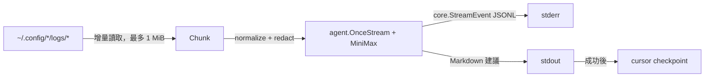

# Continuous Log Analysis

日期：2026-07-27

狀態：Simplification Stage 2 complete
範圍：`sample/logdoctor-agent`

## 目標

完成既有 `logdoctor watch`：

- 啟動時掃描一次，之後預設每分鐘掃描 `~/.config/*/logs/*`。
- 每輪只讀尚未成功分析的內容，所有檔案合計最多 `1 MiB`。
- 每個非空 chunk 透過 `agent.OnceStream` 呼叫一次 MiniMax。
- LLM 只輸出診斷與修復建議，不取得 Write、Edit 或 Bash。
- Canonical `core.StreamEvent` 以 JSONL 寫到 stderr；Markdown 診斷寫到 stdout。
- 成功輸出後才保存 cursor；失敗時下輪重試。

不新增另一個 sample、不修改 root agent/runtime contract、不保存 raw logs。

## 設計

沿用既有型別：

- `agent.Config`：agent 宣告。
- `core.Provider`：provider contract。
- `agent.OnceStream`：每個 chunk 的 one-shot analysis 與 event stream。
- `provider.DEFAULT_NAME`：MiniMax provider registry entry。
- `agent.Open("logdoctor").DataDir`：cursor 位置。

只新增 sample-local `Chunk`、`ChunkSource` 與 checkpoint types，不建立轉換層。



## Reader Contract

- 只掃描 direct regular files，不遞迴、不跟隨 symlink。
- 固定排除 `~/.config/logdoctor/logs/*`，避免 self-feedback。
- 首次遇到既有檔案時只讀最後最多 `64 KiB`。
- 每個 source 每輪 round-robin pass 最多讀 `64 KiB`，合計最多 `1 MiB`。
- `backlog=true` 表示仍有未讀內容，下輪接續，不丟棄。
- 檔案縮小或開頭 anchor 改變時，從 offset `0` 重新讀取。
- Cursor 只保存 relative source、offset 與 anchor hash。
- Checkpoint 使用 `0600` atomic write；格式錯誤時 fail closed。
- Provider 未成功前不 commit，因此語意是 at-least-once。

`1 MiB` 指 raw log bytes 合計，即 `1,048,576 bytes`。Prompt metadata 不計入；
實際 LLM request 會略大。英文 log 的 `1 MiB` 可能接近 `250k tokens`，provider
若拒絕，cursor 不推進。

## 檔案

```text
sample/logdoctor-agent/
├── core/
│   ├── chunk.go
│   ├── chunk_test.go
│   ├── discovery.go
│   ├── tail.go
│   ├── checkpoint.go
│   ├── checkpoint_test.go
│   ├── redact.go
│   └── redact_test.go
└── cmd/
    ├── analyze.go
    ├── analyze_test.go
    ├── watch.go
    └── watch_test.go
```

不新增 interface；測試以 temporary root 與 function/channel injection 隔離真實
home、clock 與 provider。

## Stages

每個 stage 完成後停止，等待 code review 與 `next`。

### Stage 1 — Incremental reader（complete）

- Discovery、self-exclusion、round-robin 與 `1 MiB` limit。
- Cursor load/atomic commit。
- Truncate/replace detection。
- UTF-8 normalization 與 common-secret redaction。
- 只使用 temporary filesystem tests，不讀真實 logs。

驗證：`go test ./core -count=1`

### Stage 2 — Analyzer（complete）

- `Chunk` 直接建立 untrusted-data prompt。
- `agent.Config` + `agent.OnceStream` + MiniMax registry default。
- 不為 analyzer 建立另一套 fake provider。
- `core.StreamEvent` 直接 JSONL encode，不建立 envelope/converter。
- Prompt、provider selection 與 stderr event tests。

驗證：`go test ./cmd -count=1`

### Stage 3 — Watch loop（complete）

- 移除 placeholder 與無作用的 `--fixture`。
- `--interval` 預設 `1m`；保留 `--max-runs`。
- Immediate first cycle、single-flight ticker、idle 不呼叫 LLM但保存 discovery cursor。
- 刪除 generic `provider.go` 與 `internal/fake`；所有 model-backed commands 固定 MiniMax。
- 移除 root `--provider` / `--fake`；`--max-turns` 只留在需要它的 `run/resume`。
- Markdown 寫 stdout、events 寫 stderr；兩者成功後才 commit cursor。
- Provider/output/checkpoint 失敗不 commit，下個 tick 重試同一 chunk。

驗證：`go test ./... -count=1 && go vet ./...`

### Simplification Stage 1 — Single-purpose surface（complete）

- 保留唯一 production path：`watch → ChunkReader → agent.OnceStream`。
- 移除舊 `run` / `resume` / `list` / `approve` commands。
- 移除舊 tool registry、todo、listener、dedupe、fixture 與 sample runtime state。
- 不修改 reader、MiniMax、stdout/stderr 或 cursor 行為。

驗證：`go test ./... -count=1 && go vet ./... && go build ./...`

### Simplification Stage 2 — CLI composition（complete）

- 移除 global command registration 與多餘的 root/subcommand wiring。
- 保留 `go run . watch --interval 1m` 外部介面。
- `cmd.New()` 每次建立獨立 command/flags；不再透過 `init()` 修改共享狀態。
- Cobra 不直接印錯誤與 usage；process boundary 在 stderr 只輸出一次錯誤。
- 關閉未使用的 default `completion` command；使用者 command 只剩 `watch`。

### Simplification Stage 3 — Reader structure

- 收斂 reader 檔案與 private types，但保留 `1 MiB`、cursor、rotation、
  self-exclusion、redaction 與 at-least-once 契約。
- 不為減少行數犧牲既有安全行為。

### Simplification Stage 4 — Tests and guide

- 擴充 sample README 的操作指南，並完成 root README / CLAUDE.md 最終核對。
- 說明 privacy、MiniMax、本機 cursor、rotation、retry 與 `1 MiB`。
- 執行 sample `test`、`vet`、`build`。

不在自動驗證中掃描真實 logs 或呼叫真實 provider。

## 完成條件

- Default watch 每分鐘 single-flight 分析新 logs。
- 每輪 raw bytes 不超過 `1 MiB`，idle 不呼叫 LLM。
- Log data 被標示為 untrusted，常見 secrets 在送出前被遮罩。
- LLM 只能建議，不能直接修改系統。
- 失敗不推進 cursor；成功才 atomic commit。
- Tests、vet、build 通過，文件與實際行為一致。
