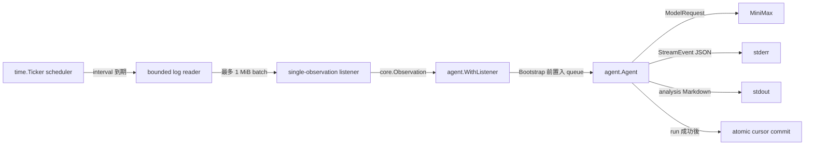

# Log Agent V2 Architecture

Status: completed on 2026-07-27

## Goal

新增獨立範例 `sample/log-agent-v2`，以完整 `agent/` lifecycle 分析
`~/.config/*/logs/*` 的新增內容：

1. 排程器先等待下一個 interval。
2. Reader 再建立最多 `1 MiB`、尚未 commit 的 log batch。
3. Batch 透過 `core.ObservationSource` 傳給 `agent.WithListener`。
4. 每個 batch 都由新的 `agent.Agent` run 呼叫 MiniMax。
5. `agent.Run` 成功後才 commit cursor。
6. 分析結果寫 stdout；agent event 與 lifecycle log 寫 stderr。

目錄使用現有 sample 命名慣例 `log-agent-v2`，不使用底線
`log_agent_v2`。

## Scope

包含：

- 修正 `agent.WithListener` 的第一筆 observation 競態。
- 新增獨立的 scheduled log sample。
- 固定掃描 gosdk 慣例的 `~/.config/<app>/logs/`，不新增 path config。
- 每批總 raw log 上限 `1 MiB`。
- 本地 secrets redaction、untrusted-log prompt boundary。
- cursor 僅在成功分析後以 atomic write commit。
- 使用 `provider/minimax`，不提供 fake provider 或 provider selector。

不包含：

- 修改既有 `sample/logdoctor-agent`。
- 自動修改被分析的專案或執行修復指令。
- tools、approval、session UI、TUI 或 HTTP service。
- 並行 LLM calls；batch 依序分析，避免重複與失序。
- 將兩個 sample 互相 import。

## Why One Agent Run Per Batch

`agent.WithListener` 目前把 observation 放入同一個 Engine steering queue。
若一個 run 永遠重用：

- `Budget.UsedRounds` 持續增加；`basic` tier 預設會在有限 rounds 後停止。
- 舊 log transcript 持續留在 context，token 成本與 prompt 大小無界增長。
- 一批失敗時，難以只保留該批 cursor 而不影響下一批。

因此 process 是 continuous，但每個 batch 是獨立 run：

```text
watch process
└── schedule tick
    └── one batch
        └── one listener
            └── one agent.Run
```

這保留完整 `agent/` composition，同時讓 budget、transcript、RunID 與錯誤
邊界維持在單一 batch。

## Resolved Framework Gap

Stage 1 前，`Agent.Bootstrap` 先回傳 opening state，再以 goroutine 執行
`pumpListener`。`agent.Run` 可能在 listener 呼叫 `Engine.Steer` 前就完成
第一次 model call。

對 scheduled one-batch source 而言，可能產生：

1. MiniMax 只收到 persona，沒有 log。
2. run 已完成後，log 才留在無人消費的 steering queue。
3. listener goroutine 在 run 結束後仍等待 process context。

Stage 1 已讓第一筆非空 observation 在 `Bootstrap` return 前排入 queue，
並讓 `agent.Run` 結束時取消 listener context。V2 不使用 sleep 或
placeholder prompt 避開競態。

## Target Flow



## Framework Contract

### `agent.WithListener`

`WithListener(source)` 仍接受既有 `core.ObservationSource`，不新增 mode 或
第二組 listener config。

Bootstrap 行為改為：

1. 呼叫 `source.Observations(ctx)` 一次。
2. 同步略過空 payload，等待第一筆非空 observation。
3. 先呼叫 `Engine.Steer(payload)`。
4. 第一筆已排入 queue 後，`Bootstrap` 才回傳。
5. 剩餘 observation 才交給背景 pump。

結果是第一個 model request 一定看得到第一筆 observation。

若 source 在第一筆非空 observation 前關閉，Bootstrap 回傳明確錯誤；
若 context 取消，回傳 context error。

### Listener Lifetime

`agent.Run` 為單次 run 建立 child context，return 時一定 cancel。listener
pump 使用該 context，因此 run 結束後不殘留 goroutine。

這不新增公開 option，也不改 `core.ObservationSource`。

## V2 Components

```text
sample/log-agent-v2/
├── main.go          # flags、signal、schedule、agent.New/agent.Run
├── listener.go      # one batch -> one core.Observation
├── reader.go        # discovery、bounded incremental read、cursor commit
├── redact.go        # local secret masking
├── output.go        # stdout report + stderr JSON events
├── *_test.go
├── README.md
└── go.mod
```

保持單層 package `main`；沒有 `cmd/`、`service/`、fake provider 或平行
domain struct。

核心資料只保留兩個 application types：

- `Batch`: 本輪總 bytes 與各 source slice，並攜帶待 commit cursor。
- `LogPart`: source、offset range、content。

`core.Observation` 是 listener boundary，不再建立相同用途的 event DTO。

## Scheduling Contract

排程在 log 讀取與 listener 建立之前：

```go
for {
    select {
    case <-ctx.Done():
        return ctx.Err()
    case <-ticker.C:
    }

    batch, err := reader.Next(ctx)
    // empty batch: continue

    source := newBatchListener(batch)
    runner := agent.MustNew(config, agent.WithListener(source), agent.WithSink(sink))
    err = agent.Run(ctx, runner, runHost, runOptions...)
    // success: reader.Commit(batch)
}
```

不在 start 時立即分析；第一次掃描發生在第一個 interval 到期後。

同一時間只允許一個 in-flight batch。若 MiniMax 分析超過一分鐘，下一次
掃描在本次完成後才進行，不累積並行 calls。

## Log Safety And Cursor Rules

- 僅讀取 `~/.config/<app>/logs/<direct-regular-file>`。
- 不跟隨 app、logs directory 或 log file symlink。
- 排除 `log-agent-v2` 自己，避免 output feedback loop。
- 跨檔案合計最多 `1 << 20` bytes。
- invalid UTF-8 轉為 replacement rune；移除非必要 control characters。
- 傳給 provider 前遮罩 authorization、bearer token、password、secret、
  API key 等常見值。
- prompt 以 `<UNTRUSTED_LOG_DATA>` 包住 log，明示內容只能作為 evidence。
- `Next` 不修改 on-disk cursor。
- `agent.Run` 或 event output 失敗時不 commit；下次重新讀同一批。
- commit 使用 temp file、`fsync`、atomic rename。
- log 被 truncate 時 offset 回到 `0`；V2 不做 inode/anchor fingerprint。

## Output Contract

- stdout：每個 batch 一份 MiniMax Markdown diagnosis，不輸出 JSON。
- stderr：
  - `agent.Run` 的 `run_start`、`run_done`、error。
  - 每個 `core.StreamEvent` 一行 JSON。
  - log discovery/read warning。
- 不在 stdout 再重複 event envelope 裡的 message。

## Incremental Stages

### Stage 1 — Listener lifecycle guarantee

Status: completed on 2026-07-27

修改 `agent/`：

- 第一筆非空 observation 在 Bootstrap return 前送入 steering queue。
- `agent.Run` return 時 cancel listener child context。
- tests 驗證：
  - 第一個 provider request 一定含 listener payload。
  - 空 payload 被略過。
  - source 提前 close 產生明確錯誤。
  - context cancel 能停止等待與 pump。
  - 無 listener 的既有 agent 行為不變。

完成後停下，讓使用者 review framework code。

### Stage 2 — Scheduled reader and listener

Status: completed on 2026-07-27

建立 `sample/log-agent-v2` 的：

- direct-file discovery。
- bounded incremental reader。
- atomic cursor。
- local redaction。
- single-observation listener。
- `go.mod` 與 `go.work` entry，讓本階段即可使用 workspace local root 測試。
- deterministic tests，以手動 tick channel 與 temp directories 驗證，
  不呼叫真實 provider。

完成後停下，讓使用者 review I/O boundary。

### Stage 3 — Full agent composition

Status: completed on 2026-07-27

加入：

- fixed MiniMax registration/config。
- `agent.New` + `agent.WithListener` + `agent.WithSink`。
- 每 batch 唯一 RunID。
- serialized scheduler loop。
- SIGINT/SIGTERM shutdown。
- stdout/stderr routing。

完成後停下，讓使用者 review runtime wiring。

### Stage 4 — Guide and verification

Status: completed on 2026-07-27

加入 `README.md`，說明：

- v1 `OnceStream` 與 v2 full `agent.Run` 的差異。
- 一分鐘 schedule、`1 MiB` 上限、at-least-once cursor。
- stdout/stderr 各會看到什麼。
- 執行命令：

  ```bash
  MINIMAX_API_KEY=... go run ./sample/log-agent-v2 --interval 1m
  ```

驗證結果：

- `go test -race ./agent/... ./sample/log-agent-v2/... -count=1 -timeout=120s`
- `go vet ./agent/... ./sample/log-agent-v2/...`
- `staticcheck ./agent/... ./sample/log-agent-v2/...`
- root `go test ./... -count=1 -timeout=120s`
- `go.work` 全部 `10` 個 modules 逐一 `go build ./...` +
  `go test ./... -count=1 -timeout=120s`
- `go run ./sample/log-agent-v2 -h`
- automated tests 只使用 temp directories 與 scripted provider，未讀取真實
  `~/.config`，也未呼叫 MiniMax。

完成後同步更新 `README.md`、`CLAUDE.md` 與 relevant plan status。

## Acceptance Criteria

- 排程 tick 前不掃描 log、不建立 observation、不呼叫 provider。
- 每個非空 batch 恰好進入一個新 `agent.Run`。
- 第一個 MiniMax request 必定含該 batch，無 listener race。
- 任一 batch raw bytes 永不超過 `1 MiB`。
- provider/run failure 後 cursor 不前進。
- process 可持續運作，且 transcript/budget 不跨 batch 累積。
- stdout 僅有可讀 diagnosis；stderr 可連續看到 lifecycle/event logs。
