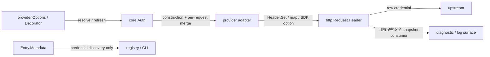
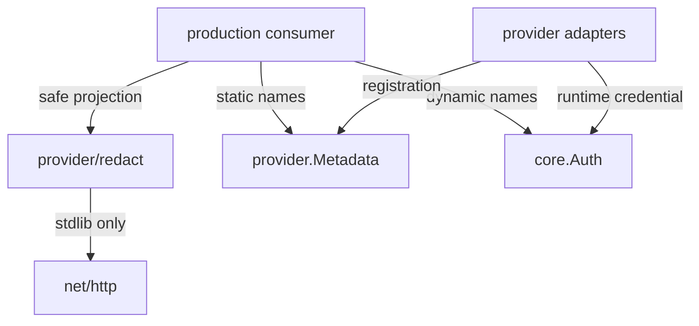
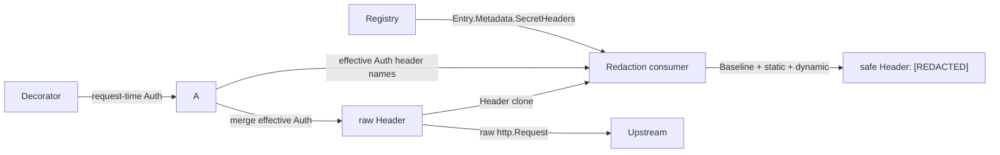

# Provider Header Redaction 架構計畫

`狀態 2026-07-28`：Planned，尚未實作。

## 1. 目標與範圍 (Goal and Scope)

### 目標

為 provider HTTP 診斷、追蹤或其他 observation surface 建立一個單一且可驗證的
header redaction contract：

```text
redact.Baseline()
+ provider.Metadata.SecretHeaders
+ core.Auth.SecretHeaderNames()
→ redact.Set.Header(http.Header)
→ key 保留、所有敏感 value 固定為 [REDACTED]
```

這三個來源各自負責不同資訊：

- `Baseline`：與特定 provider 無關的 HTTP 常見敏感 header。
- `Metadata.SecretHeaders`：adapter 編譯期已知、實際會寫出的固定敏感 header。
- `Auth.SecretHeaderNames`：單次 request 才知道的 `Auth.Headers` 開放 map keys。

成功條件：

1. redaction 不修改真正送往 upstream 的 `http.Header`。
2. header 名稱以 HTTP case-insensitive 規則匹配。
3. 每個命中的 header 保留原 key，全部 values 換成單一 `[REDACTED]`。
4. 七個 built-in provider 的固定敏感 header 有完整 registry 宣告。
5. construction auth、decorator auth 與 per-request override 的動態 headers 均能納入。
6. 至少有一個具名 production consumer 使用完整三來源；只有測試不算 consumer。

### 範圍內

- 新增 stdlib-only `provider/redact`。
- `provider.Metadata` 新增 `SecretHeaders []string`。
- `core.Auth` 新增 `SecretHeaderNames() []string`。
- 七個 built-in adapter 宣告其固定敏感 header。
- 加入 redactor unit tests、registry exact-contract tests、adapter request coverage 與
  production consumer integration test。
- package tree 與安全契約同步到 `CLAUDE.md`。

### 範圍外

- 不新增 request/response logging、debug flag 或新的 observability backend。
- 不遮罩 request body、prompt、tool output、URL query、upstream error body。
- 不改變 credential precedence、header wire format、provider endpoint 或 retry 行為。
- 不處理直接 marshal `core.Auth`、`core.ModelRequest` 或 `core.Instruction` 時的 secret；
  那是另一個 serialization redaction contract。
- 不修改外部 `proxy` repo；若 consumer 位於外部 repo，必須先記錄 exact repo/path 與
  integration test，再視為本計畫的 production consumer。

## 2. 現況架構 (Current Architecture)

### 現況資料流



目前：

- `core.Auth.Headers` 是任意 `map[string]string`，adapter 會在固定 credential header
  之後逐項寫入 request。
- `provider.Metadata` 只有 label、credential env、base URL env 與 required flag，
  沒有 redaction vocabulary。
- repo 內沒有 `provider/redact`，也沒有 provider request header logging consumer。
- header 寫入不只一種形狀：
    - `req.Header.Set(...)`
    - `map[string]string` 交給 `provider/utils.Fetch`
    - Anthropic SDK request options
- 因此只以 AST 或 `rg 'Header.Set'` 建 completeness test 會漏掉 live catalog 與 SDK path。

### Built-in 固定 header 盤點

`SecretHeaders` 即使與 `Baseline` 重複也要完整自我宣告；baseline 是防禦縱深，
metadata 是 adapter contract。

| Provider | `Metadata.SecretHeaders` | 來源 |
| --- | --- | --- |
| `anthropic` | `Authorization`, `X-Api-Key` | SDK/manual generate、stream、live catalog |
| `antigravity` | `Authorization`, `X-Api-Key` | generate、stream |
| `codex` | `Authorization` | generate、stream |
| `google` | `Authorization`, `X-Goog-Api-Key` | chat/image 與 native live catalog |
| `grok` | `Authorization` | chat/image、stream、live catalog |
| `minimax` | `X-Api-Key` | generate、stream、live catalog |
| `ollama` | `Authorization` | optional auth 的 chat、stream、live catalog |

`ChatGPT-Account-ID` 不屬於 Codex adapter 的固定 wire header；它由
`provider/credential` 放進 `core.Auth.Headers`，由 `SecretHeaderNames()` 動態覆蓋。
同理，caller 注入的任何其他 `Auth.Headers` key 一律保守視為敏感。

### 現行 completeness seam

`provider/providers_test.go` 已 blank-import `provider/all`，所以 registry test binary
會載入全部 built-in adapters。`provider/registry_test.go::TestEveryEntryIsSelfDescribing`
是新增完整性檢查的既有 seam，但只檢查 `len(SecretHeaders) > 0` 不足以抓到 partial
declaration，例如 Google 漏掉 `X-Goog-Api-Key`。

## 3. 架構位置與邊界 (Placement and Boundaries)

### Package ownership

| 位置 | 擁有責任 | 禁止 |
| --- | --- | --- |
| `core/credential.go` | request-time auth data 與動態 header names | vendor 名稱、`net/http`、redaction policy |
| `provider/adapter.go` | registry entry 的固定 secret-header metadata | secret values、request mutation |
| `provider/<name>` | 實際 header wire behavior 與同檔 declaration | generic redaction algorithm |
| `provider/redact` | case-insensitive match、clone、mask | import `core`、root `provider` 或任一 adapter |
| production consumer | 合併三來源並只輸出 safe header copy | 記錄 raw header 或自行重做 redaction |

依賴方向：



約束：

- `provider/redact` 不知道 `Metadata` 或 `Auth`，避免 generic transform 與 domain
  discovery 耦合。
- `core` 不 import `provider/redact`，維持純 contract layer。
- adapter 不因 redaction 新增 logging side effect。
- raw request 照常送 upstream；只有 observation copy 經 `Set.Header()`。

### Header declaration co-location

「與 header write 同檔」的目標是讓 code review 能同時看到：

```text
這個檔案新增敏感 header write
→ 同檔 secret-header declaration 必須同步
→ register.go 將該 declaration 放入 Metadata
```

做法：

- 每個實際 credential header write 所在檔案，放 package-local
  `secretHeaders` declaration 或對應的小型 declaration function。
- `register.go` 只引用 declaration，不重打 header literals。
- 若同一 adapter 有第二個 transport 檔案使用不同 header，例如
  `google/models.go` 的 `X-Goog-Api-Key`，該檔案擁有自己的 declaration，
  `register.go` 合併兩份。
- 不為了物理同檔而搬動 request encoding、stream parser 或其他不相關邏輯。

目前 working tree 在 2026-07-28 已有 reasoning/stream 的未提交修改，且與多個
`provider.go` 重疊。實作前必須重跑 `git status --short` 與 header inventory，只做
窄幅 patch，不覆寫或回退既有變更。

## 4. 公開契約 (API Contracts)

只新增五個 contract，不加第二套 builder 或 config option。

### 4.1 `provider/redact.Set`

```go
type Set map[string]struct{}
```

- set 只保存 header names，不保存 secret values。
- caller 可將 metadata 與 auth names 逐項加入。
- duplicate 與不同 casing 在 `Header` matching 時視為同一名稱。

### 4.2 `provider/redact.Baseline`

```go
func Baseline() Set
```

每次回傳新的 set，不暴露可變 global。初始 contract：

```text
Authorization
Proxy-Authorization
Cookie
Set-Cookie
X-Api-Key
```

`X-Goog-Api-Key` 刻意由 Google metadata 宣告；baseline 不演化成無邊界的
「看起來可能敏感」字典。新增 baseline 名稱需要測試與具體 consumer evidence。

### 4.3 `redact.Set.Header`

```go
func (s Set) Header(src http.Header) http.Header
```

語意：

- `src == nil` 時安全回傳 nil。
- 先 clone map 與 value slices；不得 alias 或修改 `src`。
- 對實際 header keys 與 set names 做 case-insensitive matching。
- 命中時保留 clone 中原本的 key，values 換成
  `[]string{"[REDACTED]"}`。
- 非敏感 header 的 key、values 與 value order 維持不變。
- empty value 仍遮罩，因為 header presence 本身應保留但 value 不應被信任。

### 4.4 `provider.Metadata.SecretHeaders`

```go
SecretHeaders []string
```

- 只放 adapter 靜態知道會承載 credential/sensitive identity 的 names。
- 使用 canonical spelling、不得空字串、不得 case-insensitive duplicate。
- 不放 `Content-Type`、`Accept`、API version、`User-Agent` 等非敏感 headers。
- keyless default 不代表永遠無 secret：Ollama 支援 optional auth，仍須宣告
  `Authorization`。

### 4.5 `core.Auth.SecretHeaderNames`

```go
func (a Auth) SecretHeaderNames() []string
```

- 只回傳 `a.Headers` keys，不推測 `APIKey` 或 `Bearer` 最終映射。
- 不回傳、複製或格式化任何 value。
- 回傳新的、以原字串排序的 slice，提供 deterministic tests。
- nil/empty map 回傳空 slice。
- 不做 HTTP canonicalization；case-insensitive policy 只由 `provider/redact` 擁有。

### 組合範例

```go
secrets := redact.Baseline()
for _, name := range entry.Metadata.SecretHeaders {
	secrets[name] = struct{}{}
}
for _, name := range auth.SecretHeaderNames() {
	secrets[name] = struct{}{}
}
safeHeader := secrets.Header(request.Header)
```

production consumer 只能接收 `safeHeader`；不得同時把 raw `request.Header` 傳入
logger、OTel attribute、error 或 wire envelope。

## 5. Consumer Gate 與資料流 (Consumer Gate and Data Flow)

### Merge gate

動工前先指定一個 exact production consumer：

```text
repo/module:
package/file:
observation surface:
呼叫時可取得的資料:
  - http.Header
  - provider.Metadata
  - effective core.Auth
```

目前 repo 沒有符合條件的 consumer。若選定的 consumer 只能看到
`http.Request`，卻看不到 effective merged `Auth`，`Auth.SecretHeaderNames()` 就無法
覆蓋動態 headers；此時不可假裝三層已接通。應先在 request construction boundary
產生 safe snapshot 或把已合成的 `redact.Set` 注入 consumer，不能讓 logger
重新解析 credential。

若沒有具名 consumer：

- 本計畫維持 `Planned`。
- 不新增公開 package、Metadata field 或 Auth method。
- 不以 unit test、example 或 README snippet 冒充 production usage。

### 目標資料流



若實際 consumer 位於 adapter 外部，資料流可以改由 consumer 組合，但三份資料與
「raw 只送 upstream」的不變式不得改變。

## 6. 測試策略 (Test Strategy)

### `provider/redact` unit tests

table-driven tests 至少包含：

1. nil header / empty set。
2. baseline `Authorization`。
3. header key 與 set name 使用不同 casing。
4. multi-value `Cookie` / custom header 全部縮成單一 placeholder。
5. 非敏感 header 完整保留。
6. input map 與 value slice 未被修改、未 alias。
7. `Baseline()` 兩次回傳互不影響。
8. placeholder exact match `[REDACTED]`，不保留 prefix、suffix 或長度。

### `core.Auth` tests

- nil / empty `Headers`。
- multiple keys deterministic sort。
- 不包含 `APIKey`、`Bearer` values 或任何衍生字串。
- 修改回傳 slice 不影響原 `Auth`。

### Registry exact-contract tests

在 `provider/registry_test.go` 新增
`TestBuiltInSecretHeadersAreComplete`，建立上節七家的 exact expected map：

- 實際 `provider.Names()` 與 expected map keys 必須完全相等；新增 built-in
  adapter 而沒補 contract 時 CI 失敗。
- 每個 `SecretHeaders` 與 expected names 做 case-insensitive exact set compare。
- 驗證無 empty、無 case-insensitive duplicate。
- 不只做 `NotEmpty`，避免 partial declaration 通過。

### Adapter request tests

沿用既有 httptest/captured-request tests，對真實 wire behavior 加 contract assertion：

- API key 與 OAuth 兩條 path。
- construction auth、decorator auth、per-request override。
- `Generate` 與 `Stream`。
- Google/Grok image path。
- live model catalog，尤其 Google `X-Goog-Api-Key`。
- dynamic `Auth.Headers`，至少使用 mixed-case `ChatGPT-Account-ID` 與另一個 custom key。

每個測試使用唯一 sentinel，先證明 upstream 收到原值，再證明 observation copy：

```text
保留 header key
不含 sentinel
value == [REDACTED]
原 request 仍含 sentinel
```

不要以 source-code regex 當唯一 coverage，因為它會漏掉 header map 與 SDK options。

### Production consumer integration test

consumer 必須有一個不打外網的 integration test：

1. fake upstream 擷取 raw header。
2. consumer 擷取 safe header。
3. raw upstream request 收到完整 credential。
4. safe output 找不到 API key、Bearer、account id 與 custom header sentinel。
5. safe output 不包含 `core.Auth` 的 JSON/string dump。

## 7. 漸進落地步驟 (Incremental Landing)

### Task 0 — 鎖定 consumer 與資料可得性

輸出：

- 在本計畫 `Consumer Gate` 補上 exact repo/package/file。
- 畫出該 call site 如何取得 metadata、effective Auth 與 Header。
- 先寫 failing integration test，要求 observation output 保留 header key 且不含
  sentinel；若 consumer 尚未輸出 headers，failure 應是缺少 safe projection，
  不得為了製造 red case 先加入 raw logging。

驗收：

- consumer 是 production path，不是 test/example-only。
- 三份資料均實際可得；沒有隱含 global registry lookup 或 credential re-resolution。

回滾：

- 尚未變更公開 API；直接保留本 plan。

### Task 1 — 落地純 redactor

新增：

- `provider/redact/redact.go`
- `provider/redact/redact_test.go`

先寫 unit tests，再實作 `Set`、`Baseline()`、`Set.Header()`。只使用 stdlib。

驗收：

```bash
go test ./provider/redact -count=1
go list -deps ./provider/redact
```

dependency list 不得出現其他 agentsdk package 或第三方 package。

回滾：

- 刪除獨立 package，不影響其他 code。

### Task 2 — 補 request-time dynamic layer

修改：

- `core/credential.go`
- `core/credential_test.go`

加入 `Auth.SecretHeaderNames()` 與 deterministic tests；不改 `Merge`、`Token`、
JSON tags 或 credential precedence。

驗收：

```bash
go test ./core -run 'TestAuth' -count=1
go list -deps ./core
```

回滾：

- 移除單一 method 與 tests；資料模型 layout 不變。

### Task 3 — 補 registry static layer

修改：

- `provider/adapter.go`
- `provider/{anthropic,antigravity,codex,google,grok,minimax,ollama}/register.go`
- 各 adapter 實際 header write 所在的 `provider.go` / `models.go`
- `provider/registry_test.go`
- 既有 adapter request tests

步驟：

1. 先加入 exact expected registry test，讓七家全部 fail。
2. 逐家把 declaration 放到實際 header write 所在檔案。
3. `register.go` 引用 declaration 填入 `Metadata.SecretHeaders`。
4. 補 Google live catalog 與動態 Auth headers coverage。

驗收：

```bash
go test ./provider -run '^TestBuiltInSecretHeadersAreComplete$' -count=1
go test ./provider/... -count=1
```

回滾：

- 先移除 registry assertions/declarations，再移除 Metadata field；wire behavior從未改變。

### Task 4 — 接上 production consumer

只在 Task 0 已通過時執行：

1. 在 observation boundary 合併 baseline、metadata 與 effective Auth names。
2. 只把 `Set.Header()` 回傳的 clone 交給 consumer。
3. 不在 adapter 內新增 logger global、不 log-and-return。
4. 跑 sentinel integration test。

驗收：

- upstream raw header 完整。
- observation output 全部 redacted。
- consumer 沒有任何 raw-header bypass。

回滾：

- 先移除 consumer wiring；Tasks 1–3 可保留的前提是已有另一個具名 external
  production consumer，否則連同公開 surface 一起回滾。

### Task 5 — 文件與全 workspace 驗收

修改：

- `CLAUDE.md`：package tree、provider metadata、redaction/consumer ownership、
  serialization redaction out-of-scope。

不修改：

- `README.md`，因業務範圍與 user workflow 不變。
- `README.todo`，本 plan 已是進行中工作的 canonical record；若中止並保留未完成項，
  才將剩餘 gate 摘入 TODO。

驗收：

```bash
git diff --check
gofmt -w \
  provider/redact/*.go \
  core/credential.go core/credential_test.go \
  provider/adapter.go provider/registry_test.go \
  provider/{anthropic,antigravity,codex,google,grok,minimax,ollama}/register.go \
  provider/{anthropic,antigravity,codex,google,grok,minimax,ollama}/provider.go \
  provider/{anthropic,google,grok,minimax,ollama}/models.go

go build ./...
go vet ./...
go test ./... -count=1

for mod in sample/code-agent sample/file-agent sample/greet-agent \
  sample/log-agent-v2 sample/logdoctor-agent sample/skeleton-agent \
  sample/demo-memory sample/demo-middleware sample/demo-strategy; do
  (cd "$mod" && go build ./... && go vet ./... && go test ./... -count=1)
done
```

另做 boundary 檢查：

```bash
go list -deps ./provider/redact \
  | rg '^github.com/bizshuk/agentsdk/' \
  | rg -v '/provider/redact$' \
  && echo 'unexpected agentsdk dependency'

rg -n 'slog\\.|log\\.|RecordError|SetAttributes|json\\.Marshal' provider \
  | rg 'Header|Auth|Credential|APIKey|Bearer'
```

第二個命令是 review inventory，不以「無輸出」作機械判定；逐筆確認只接觸 safe
projection，不允許 raw credential。

## 8. 風險與決策 (Risks and Decisions)

| 風險 | 防線 |
| --- | --- |
| redactor 修改 live request，導致 upstream 401 | clone + aliasing test；先送 raw、只觀察 safe copy |
| HTTP header casing 造成漏遮罩 | `Header()` case-insensitive match；mixed-case tests |
| registry 只驗非空，漏掉第二個 header | 七家 exact expected sets + actual request tests |
| baseline 已含 `X-Api-Key`，掩蓋 metadata 漏宣告 | metadata exact-contract test 獨立於 redactor |
| `Auth.Headers` 新 key 未更新 metadata | 所有 `Auth.Headers` keys 動態且保守視為敏感 |
| keyless Ollama 被錯誤排除 | 依「可承載 credential」而非 `CredentialRequired` 判斷 |
| SDK/map path 逃過 `Header.Set` 搜尋 | httptest sentinel coverage，不依賴 AST-only test |
| `SecretHeaders` 名稱未涵蓋 account id 等 PII | contract 定義為「必須遮罩」，不只 cryptographic secret |
| `Auth` 本身被 marshal 而洩漏 | 明列 out-of-scope；不得把 header redaction 宣稱為 object redaction |
| 新公開 API 無 consumer | Task 0 merge gate；無 production consumer 就不實作 |
| concurrent provider edits 被覆寫 | 實作前重掃 worktree，窄 patch，保留 unrelated changes |

## 9. 完成定義 (Definition of Done)

- [ ] exact production consumer 已記錄並有 failing-then-passing integration test。
- [ ] `provider/redact` stdlib-only、non-mutating、case-insensitive。
- [ ] `core.Auth.SecretHeaderNames()` 只暴露排序後的 keys。
- [ ] 七家 `Metadata.SecretHeaders` 與實際 request paths 完整對應。
- [ ] Google `X-Goog-Api-Key`、MiniMax `X-Api-Key`、optional Ollama auth 已覆蓋。
- [ ] dynamic `ChatGPT-Account-ID` 與 custom Auth header 已覆蓋。
- [ ] raw upstream request 未被修改，所有 observation values 為 `[REDACTED]`。
- [ ] root 與九個 sample modules 的 build/vet/test 全綠。
- [ ] dependency boundary、`git diff --check` 與 `CLAUDE.md` 同步完成。
