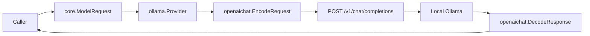
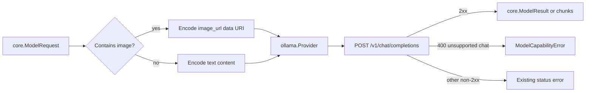

# Ollama Vision Input Hardening Implementation Plan

> **For agentic workers:** REQUIRED SUB-SKILL: Use `test-driven-development`
> while implementing each task, then use `verification-before-completion`
> before claiming the plan complete.

**Goal:** 讓 AgentSDK 的 Ollama image input（vision）具備 adapter-level
contract、可辨識的 model capability error、可信的 default catalog，以及不讀取真實
receipt 的 opt-in live verification。

**Architecture:** 保留現有
`core.Part{Kind: PART_KIND_IMAGE}` → `openaichat.EncodeRequest` →
`POST /v1/chat/completions` 資料流；這條 wire path 已符合 Ollama 官方
OpenAI-compatible vision contract。這次不另加 `/api/chat` 或 `/api/generate`
fallback，而是在 `provider/ollama` boundary 精準辨識 upstream 的 unsupported-chat
response，並以 adapter test 證明 image bytes 沒有在 provider layer 遺失。

**Tech Stack:** Go 1.26、stdlib `net/http` / `encoding/json` / `image/png`、
AgentSDK `core.ModelRequest`、shared `provider/protocol/openaichat`、
`testify`、Ollama OpenAI-compatible API。

## Global Constraints

- 這裡的 image 是 model input（vision），不是
  `provider.ImageGenerator` 的 image output。
- 不改 `core.Part`、`core.Provider`、`provider.Adapter` 或 provider registry
  contracts。
- 不建立新的 native Ollama transport；目前沒有證據顯示它能修復目標 model。
- 不對 model error 做 silent model fallback；caller 指定的 model 必須原樣使用。
- 不讀取、辨識、搬移或改名 `collections/pkg/receipts/` 的真實文件。
- Live test 只使用程式產生的純色 PNG，且必須以 build tag 與 environment variable
  雙重 opt-in。
- 保留現有 `/v1/chat/completions`、optional Bearer auth、timeout 與
  OpenAI-compatible server behavior。
- 保留工作樹中 MiniMax video capability 的既有未完成修改；本計畫不得修改
  `provider/minimax/`、`provider/video.go`、`provider/registry.go` 或
  `provider/capability.go`。
- 不 commit、push 或 tag；若之後的 execution session 要 commit，必須另行明確要求。

---

## 1. 目標與範圍 (Goal & Scope)

### In scope

1. 以 Ollama adapter-level `httptest` 證明 `core.Part.Image` 會成為
   `messages[].content[].image_url` data URI。
2. 將 upstream `400 ... does not support chat` 轉成可由 `errors.Is` /
   `errors.As` 判斷的 typed error。
3. 確保 blocking `Generate` 與 `Stream` 在同一類 upstream error 下回傳一致結果。
4. 從 bundled catalog 移除目前無法被 Ollama chat 或 generate API 執行的
   `z-uo/qwen2.5vl_tools:7b`；它仍可由 caller 透過 `Options.Model` 明確指定，
   catalog 不是 allowlist。
5. 新增 opt-in live vision test，驗證健康的本機 Ollama + vision model 能完成一次
   generated-image request。
6. 同步 README、CLAUDE 與 CHANGELOG 的 single-owner documentation。

### Out of scope

- Receipt prompt、metadata schema、HEIC conversion 或 collections CLI。
- 自動 pull、re-pull、delete、stop 或 unload Ollama models。
- `/api/chat`、`/api/generate`、model-template repair 或 Modelfile rebuild。
- Remote image URL download；caller 仍提供 decoded `[]byte`。
- Image resize、compression、EXIF rotation 或 MIME sniffing。
- Vision accuracy benchmark；live gate 只證明 transport + model execution，
  不宣稱 OCR accuracy。
- Text-to-image generation；該能力繼續由 `provider.ImageGenerator` 擁有。

## 2. 現況與證據 (Current Architecture & Evidence)

現有 source 已經具備 request-side image encoding：

- `core/message.go`：`Part.Image []byte` 與 `Part.ImageMIME`。
- `provider/protocol/openaichat/codec.go`：將 image bytes base64 encode。
- `provider/protocol/openaichat/dto.go`：產生 OpenAI-compatible
  `image_url` content part。
- `provider/protocol/openaichat/vision_test.go`：已有 codec-level tests。
- `provider/ollama/provider.go`：固定送至 `/chat/completions`，但 adapter-level
  tests 尚未鎖定 image wire bytes，也沒有 typed model-capability error。



### 2026-07-31 diagnostic baseline

- AgentSDK `v0.0.22` 已包含 OpenAI-compatible vision encoding。
- 本機 Ollama `0.24.0` 對
  `z-uo/qwen2.5vl_tools:7b` 的 `/v1/chat/completions` 回覆
  `does not support chat`。
- 同一 model 對 `/api/generate` 也回覆 `does not support generate`，
  `/api/show` 則找不到該 model。
- 因此 native generate fallback 無法解決目前 failure；它只會把同一個
  incompatibility 延後到第二次 request。
- `qwen2.5vl:3b` 的 live call 在本次診斷因 model load/resource error 未完成，
  所以不能把 unit tests 描述成 live recognition proof。

官方 contract：

- [Ollama OpenAI compatibility](https://docs.ollama.com/api/openai-compatibility)
  明列 `/v1/chat/completions` vision request 的 `image_url` data URI。
- [Ollama generate API](https://docs.ollama.com/api/generate) 雖接受
  base64 `images`，但目標 model 的本機 server 已明確拒絕 generate operation。
- [Ollama show model details](https://docs.ollama.com/api-reference/show-model-details)
  的 `capabilities` 可描述 vision support，但不應在每次 request 前增加隱藏的
  network preflight。

## 3. 目標架構 (Target Architecture)

Transport 不變；新增的是 provider boundary 的 proof 與 error semantics。



### Boundary decisions

1. `openaichat` 繼續擁有 wire encoding；`ollama` 不複製 base64 / data URI logic。
2. `ollama` 擁有 vendor-specific error recognition，因為
   `does not support chat` 是 Ollama model runtime semantics，不是 shared
   OpenAI Chat protocol semantics。
3. Typed error 只分類已辨識的 unsupported-chat response；其他 status/body 保持
   現有 error text，避免把 unrelated API failures 一起重寫。
4. `DefaultCatalog` 只列出 SDK 願意推薦的 stable entries；移除 bundled entry
   不會禁止 caller 使用自訂 model name。
5. Live test 不進 default `go test ./...`，避免開發與 CI 無意載入數 GB model。

## 4. Interfaces

本計畫只新增一個 public error contract；其他 interfaces 保持不變。

| Interface | Signature / shape | Owner |
| --- | --- | --- |
| Vision request | `core.ModelRequest{Messages: []core.Message}` with `PART_KIND_IMAGE` | `core` |
| Wire encoder | `openaichat.EncodeRequest(req, model, stream)` | `provider/protocol/openaichat` |
| Sentinel | `var ErrUnsupportedModelCapability error` | `provider/ollama` |
| Typed error | `ModelCapabilityError{Model, Capability, Message string}` | `provider/ollama` |
| Live opt-in | `OLLAMA_VISION_MODEL` + `-tags=integration` | `provider/ollama` tests |

Typed error contract：

```go
var ErrUnsupportedModelCapability = errors.New(
	"unsupported Ollama model capability",
)

type ModelCapabilityError struct {
	Model      string
	Capability string
	Message    string
}

func (e *ModelCapabilityError) Error() string
func (e *ModelCapabilityError) Unwrap() error
```

`Capability` 本次固定為 `"chat"`。它不用 `core.Modality`，因為 chat 是 operation，
不是 text/image/audio input modality。

## 5. File Map

| File | Responsibility | Action |
| --- | --- | --- |
| `provider/ollama/error.go` | Ollama error envelope parsing + typed capability error | Create |
| `provider/ollama/error_test.go` | Parser unit contract | Create |
| `provider/ollama/provider.go` | Generate/Stream HTTP status routing | Modify |
| `provider/ollama/provider_test.go` | Adapter-level image wire + status behavior | Modify |
| `provider/ollama/models.go` | Bundled catalog only | Modify |
| `provider/ollama/vision_live_test.go` | Opt-in generated-image live gate | Create |
| `README.md` | Public usage: image input versus image generation | Modify |
| `CLAUDE.md` | Provider ownership and verification boundary | Modify |
| `docs/CHANGELOG.md` | Completed historical change | Modify |

不修改 `provider/protocol/openaichat/*`：codec-level image behavior 已有 tests，
這次新增的是 adapter coverage。

---

### Task 1: Lock the adapter-level image wire contract

**Files:**

- Modify: `provider/ollama/provider_test.go`

**Interfaces:**

- Consumes: existing `ollama.New(provider.ResolvedConfig)`.
- Consumes: existing `core.Part{Kind, Image, ImageMIME}`.
- Produces: no new production symbol; this is a characterization contract.

- [ ] **Step 1: Add the adapter characterization test**

在 `provider/ollama/provider_test.go` 加入：

```go
func TestProviderSendsVisionImageToChatCompletions(t *testing.T) {
	var gotPath string
	var gotBody []byte
	srv := httptest.NewServer(http.HandlerFunc(func(w http.ResponseWriter, r *http.Request) {
		gotPath = r.URL.Path
		var err error
		gotBody, err = io.ReadAll(r.Body)
		require.NoError(t, err)
		w.Header().Set("Content-Type", "application/json")
		_, _ = w.Write([]byte(
			`{"choices":[{"message":{"content":"red"},"finish_reason":"stop"}]}`,
		))
	}))
	t.Cleanup(srv.Close)

	client, err := ollama.New(provider.ResolvedConfig{
		BaseURL: srv.URL,
		Model:   "qwen2.5vl:3b",
	})
	require.NoError(t, err)

	result, err := client.Generate(context.Background(), core.ModelRequest{
		Messages: []core.Message{{
			Role: core.ROLE_USER,
			Parts: []core.Part{
				{Kind: core.PART_KIND_PLAIN_TEXT, Text: "name the color"},
				{
					Kind:      core.PART_KIND_IMAGE,
					ImageMIME: "image/png",
					Image:     []byte{0x89, 0x50, 0x4e, 0x47},
				},
			},
		}},
	})
	require.NoError(t, err)
	assert.Equal(t, "red", result.Text)
	assert.Equal(t, "/chat/completions", gotPath)

	var body struct {
		Messages []struct {
			Content []struct {
				Type     string `json:"type"`
				Text     string `json:"text"`
				ImageURL struct {
					URL string `json:"url"`
				} `json:"image_url"`
			} `json:"content"`
		} `json:"messages"`
	}
	require.NoError(t, json.Unmarshal(gotBody, &body))
	require.Len(t, body.Messages, 1)
	require.Len(t, body.Messages[0].Content, 2)
	assert.Equal(t, "text", body.Messages[0].Content[0].Type)
	assert.Equal(t, "name the color", body.Messages[0].Content[0].Text)
	assert.Equal(t, "image_url", body.Messages[0].Content[1].Type)
	assert.Equal(
		t,
		"data:image/png;base64,iVBORw==",
		body.Messages[0].Content[1].ImageURL.URL,
	)
}
```

同步加入 `io` import。測試只送 4-byte fixture 到 `httptest`，不碰 real image。

- [ ] **Step 2: Run the characterization test**

```bash
go test ./provider/ollama \
  -run TestProviderSendsVisionImageToChatCompletions \
  -count=1
```

Expected: PASS on the current source. 若失敗，先修正 test 對既有 wire shape 的誤解；
不要在尚未理解差異前修改 codec。

- [ ] **Step 3: Re-run the shared codec contract**

```bash
go test ./provider/protocol/openaichat \
  -run 'TestEncodeRequest(SendsImagePartAsDataURI|DefaultsImageMIMEToJPEG|SkipsEmptyImage)' \
  -count=1
```

Expected: PASS.

### Task 2: Return a typed unsupported-model capability error

**Files:**

- Create: `provider/ollama/error.go`
- Create: `provider/ollama/error_test.go`
- Modify: `provider/ollama/provider.go`
- Modify: `provider/ollama/provider_test.go`

**Interfaces:**

- Produces: `ollama.ErrUnsupportedModelCapability`.
- Produces: `ollama.ModelCapabilityError`.
- Consumes: the same response body already read by `Generate` / `Stream`; no
  extra network request.

- [ ] **Step 1: Write failing parser tests**

`provider/ollama/error_test.go` 使用 package `ollama`，覆蓋：

```go
func TestStatusErrorClassifiesUnsupportedChat(t *testing.T) {
	err := statusError(
		"z-uo/qwen2.5vl_tools:7b",
		400,
		[]byte(`{"error":{"message":"\"z-uo/qwen2.5vl_tools:7b\" does not support chat","type":"invalid_request_error"}}`),
	)

	require.ErrorIs(t, err, ErrUnsupportedModelCapability)
	var capabilityErr *ModelCapabilityError
	require.ErrorAs(t, err, &capabilityErr)
	assert.Equal(t, "z-uo/qwen2.5vl_tools:7b", capabilityErr.Model)
	assert.Equal(t, "chat", capabilityErr.Capability)
	assert.Contains(t, capabilityErr.Message, "does not support chat")
}

func TestStatusErrorPreservesUnknownFailure(t *testing.T) {
	err := statusError(
		"qwen2.5vl:3b",
		429,
		[]byte(`{"error":"rate-limited"}`),
	)

	require.EqualError(t, err, `ollama: status 429: {"error":"rate-limited"}`)
	require.NotErrorIs(t, err, ErrUnsupportedModelCapability)
}
```

- [ ] **Step 2: Verify RED**

```bash
go test ./provider/ollama \
  -run 'TestStatusError(ClassifiesUnsupportedChat|PreservesUnknownFailure)' \
  -count=1
```

Expected: compile failure because `statusError`,
`ErrUnsupportedModelCapability`, and `ModelCapabilityError` do not exist.

- [ ] **Step 3: Implement the minimal error owner**

Create `provider/ollama/error.go`:

```go
package ollama

import (
	"encoding/json"
	"errors"
	"fmt"
	"strings"
)

// ErrUnsupportedModelCapability identifies an installed Ollama model that
// cannot execute the requested operation.
var ErrUnsupportedModelCapability = errors.New(
	"unsupported Ollama model capability",
)

// ModelCapabilityError preserves the model and rejected operation without
// requiring callers to parse upstream JSON text.
type ModelCapabilityError struct {
	Model      string
	Capability string
	Message    string
}

func (e *ModelCapabilityError) Error() string {
	return fmt.Sprintf(
		"ollama: model %q lacks %s capability: %s",
		e.Model,
		e.Capability,
		e.Message,
	)
}

func (e *ModelCapabilityError) Unwrap() error {
	return ErrUnsupportedModelCapability
}

func statusError(model string, status int, body []byte) error {
	message := upstreamErrorMessage(body)
	if status == 400 &&
		strings.Contains(strings.ToLower(message), "does not support chat") {
		return &ModelCapabilityError{
			Model:      model,
			Capability: "chat",
			Message:    message,
		}
	}
	return fmt.Errorf("ollama: status %d: %s", status, string(body))
}

func upstreamErrorMessage(body []byte) string {
	var envelope struct {
		Error json.RawMessage `json:"error"`
	}
	if err := json.Unmarshal(body, &envelope); err != nil ||
		len(envelope.Error) == 0 {
		return strings.TrimSpace(string(body))
	}

	var nested struct {
		Message string `json:"message"`
	}
	if err := json.Unmarshal(envelope.Error, &nested); err == nil &&
		nested.Message != "" {
		return nested.Message
	}

	var plain string
	if err := json.Unmarshal(envelope.Error, &plain); err == nil {
		return plain
	}
	return strings.TrimSpace(string(envelope.Error))
}
```

不要在此加入 retry、fallback、model substitution 或 `/api/show` call。

- [ ] **Step 4: Route blocking status errors through `statusError`**

在 `provider/ollama/provider.go` 的 non-2xx branch 改為：

```go
if resp.StatusCode/100 != 2 {
	return core.ModelResult{}, statusError(p.model, resp.StatusCode, respBody)
}
```

- [ ] **Step 5: Write the failing adapter error tests**

在 `provider/ollama/provider_test.go` 新增兩個 tests：

1. `TestProviderReturnsTypedUnsupportedChatError`：fake server 回 user report
   中的 nested error body，assert `errors.Is` 與 `errors.As`。
2. `TestProviderStreamChecksHTTPStatusBeforeParsing`：fake server 回相同 400，
   assert `Stream` 直接回 typed error 且 channel 為 nil。

`Stream` test 的核心 assertion：

```go
chunks, err := client.Stream(context.Background(), textOnlyRequest())
assert.Nil(t, chunks)
require.ErrorIs(t, err, ollama.ErrUnsupportedModelCapability)
```

若 `textOnlyRequest` 不存在，直接在 test 內建立一個 single-user
`core.ModelRequest`，不要新增 production helper。

- [ ] **Step 6: Verify RED for Stream**

```bash
go test ./provider/ollama \
  -run 'TestProvider(ReturnsTypedUnsupportedChatError|StreamChecksHTTPStatusBeforeParsing)' \
  -count=1
```

Expected: blocking test 可在 Step 4 後通過；stream test 失敗，因為目前 `Stream`
不檢查 status。

- [ ] **Step 7: Add bounded Stream status handling**

在 `Stream` 的 `p.client.Do` 後、`openaichat.ParseStream` 前加入：

```go
if resp.StatusCode/100 != 2 {
	defer resp.Body.Close()
	body, readErr := io.ReadAll(io.LimitReader(resp.Body, 1<<20))
	if readErr != nil {
		return nil, fmt.Errorf("ollama: read error response: %w", readErr)
	}
	return nil, statusError(p.model, resp.StatusCode, body)
}
```

成功 stream 不可在 `Stream` return 前 `defer resp.Body.Close()`，否則 caller
收到 channel 時 response body 已被關閉。成功 stream 的 close lifecycle 不在本次
status-classification scope，若另行修正必須補 transport EOF/cancellation tests。

- [ ] **Step 8: Verify GREEN and shared compatibility**

```bash
go test ./provider/ollama ./provider \
  -run 'Test(Provider|OpenAIChat)' \
  -count=1
```

Expected: PASS，且 `TestOpenAIChatErrorSemantics/ollama/status` 的既有 unknown
status string 完全不變。

### Task 3: Stop recommending the incompatible third-party model

**Files:**

- Modify: `provider/ollama/models.go`
- Modify: `provider/ollama/provider_test.go`

**Interfaces:**

- Consumes: `DefaultCatalog() []core.ModelSpec`.
- Produces: unchanged default `qwen2.5vl:3b` with text + image input modalities.

- [ ] **Step 1: Strengthen the catalog test**

將既有 `TestProviderModelsCatalog` 擴充為：

```go
func TestProviderModelsCatalog(t *testing.T) {
	catalog := ollama.DefaultCatalog()
	require.NotEmpty(t, catalog)

	byID := make(map[string]core.ModelSpec, len(catalog))
	for _, spec := range catalog {
		byID[spec.ID] = spec
	}

	vision, ok := byID["qwen2.5vl:3b"]
	require.True(t, ok)
	assert.ElementsMatch(
		t,
		[]core.Modality{core.MODALITY_TEXT, core.MODALITY_IMAGE},
		vision.Input,
	)
	assert.NotContains(t, byID, "z-uo/qwen2.5vl_tools:7b")
}
```

- [ ] **Step 2: Verify RED**

```bash
go test ./provider/ollama -run TestProviderModelsCatalog -count=1
```

Expected: FAIL because the bundled catalog still contains
`z-uo/qwen2.5vl_tools:7b`.

- [ ] **Step 3: Remove only the unsupported bundled entry**

Delete the `z-uo/qwen2.5vl_tools:7b` `ModelSpec` literal from
`provider/ollama/models.go`。不要刪 local model、不要建立 alias，也不要在
`resolveModel` 中偷偷轉成 `qwen2.5vl:3b`。

- [ ] **Step 4: Verify GREEN**

```bash
go test ./provider/ollama -run TestProviderModelsCatalog -count=1
```

Expected: PASS.

### Task 4: Add an opt-in live vision gate with generated pixels

**Files:**

- Create: `provider/ollama/vision_live_test.go`

**Interfaces:**

- Consumes: `OLLAMA_VISION_MODEL`; absent means skip.
- Optionally consumes: `OLLAMA_VISION_BASE_URL`; absent uses
  `ollama.DefaultBaseURL`.
- Produces: no production API.

- [ ] **Step 1: Add the integration-tagged test**

Create `provider/ollama/vision_live_test.go`:

```go
//go:build integration

package ollama_test

import (
	"bytes"
	"context"
	"image"
	"image/color"
	"image/png"
	"os"
	"strings"
	"testing"
	"time"

	"github.com/bizshuk/agentsdk/core"
	"github.com/bizshuk/agentsdk/provider"
	"github.com/bizshuk/agentsdk/provider/ollama"
	"github.com/stretchr/testify/require"
)

func TestLiveVision(t *testing.T) {
	model := strings.TrimSpace(os.Getenv("OLLAMA_VISION_MODEL"))
	if model == "" {
		t.Skip("set OLLAMA_VISION_MODEL to an installed chat-capable vision model")
	}
	baseURL := strings.TrimSpace(os.Getenv("OLLAMA_VISION_BASE_URL"))
	if baseURL == "" {
		baseURL = ollama.DefaultBaseURL
	}

	pixels := image.NewRGBA(image.Rect(0, 0, 32, 32))
	for y := 0; y < 32; y++ {
		for x := 0; x < 32; x++ {
			pixels.Set(x, y, color.RGBA{R: 255, A: 255})
		}
	}
	var encoded bytes.Buffer
	require.NoError(t, png.Encode(&encoded, pixels))

	client, err := ollama.New(provider.ResolvedConfig{
		Model:   model,
		BaseURL: baseURL,
		Timeout: 2 * time.Minute,
	})
	require.NoError(t, err)

	ctx, cancel := context.WithTimeout(context.Background(), 2*time.Minute)
	defer cancel()
	result, err := client.Generate(ctx, core.ModelRequest{
		MaxTokens: 16,
		Messages: []core.Message{{
			Role: core.ROLE_USER,
			Parts: []core.Part{
				{
					Kind: core.PART_KIND_PLAIN_TEXT,
					Text: "Name the dominant color in one word.",
				},
				{
					Kind:      core.PART_KIND_IMAGE,
					ImageMIME: "image/png",
					Image:     encoded.Bytes(),
				},
			},
		}},
	})
	require.NoError(t, err)
	require.NotEmpty(t, strings.TrimSpace(result.Text))
	t.Logf("model=%s response=%q", model, result.Text)
}
```

這個 test 不 assert `"red"`；不同 model 的 wording 不是 transport contract。

- [ ] **Step 2: Confirm default tests do not load Ollama**

```bash
go test ./provider/ollama -count=1
```

Expected: PASS without executing `TestLiveVision`。

- [ ] **Step 3: Run the explicit live gate**

先確認 Ollama process 與可用 RAM，不 stop 或 unload 其他 user process。然後執行：

```bash
OLLAMA_VISION_MODEL=qwen2.5vl:3b \
  go test -tags=integration ./provider/ollama \
  -run TestLiveVision \
  -count=1 \
  -v
```

Expected on a healthy local installation: PASS with one non-empty response。

若回 `model failed to load`，記錄為 live environment/resource blocker；unit tests
仍只能證明 request encoding，不能宣稱 live recognition 已驗證。

### Task 5: Synchronize canonical documentation and run full verification

**Files:**

- Modify: `README.md`
- Modify: `CLAUDE.md`
- Modify: `docs/CHANGELOG.md`

**Interfaces:**

- Documents: image input ownership and typed error handling.
- Does not document one-off local model/RAM measurements as permanent invariants.

- [ ] **Step 1: Add the public usage distinction to README**

在 image/video optional capability 說明附近加入一個短 subsection，內容必須包含：

```go
result, err := model.Generate(ctx, core.ModelRequest{
	Messages: []core.Message{{
		Role: core.ROLE_USER,
		Parts: []core.Part{
			{Kind: core.PART_KIND_PLAIN_TEXT, Text: "Describe this image."},
			{
				Kind:      core.PART_KIND_IMAGE,
				ImageMIME: "image/png",
				Image:     imageBytes,
			},
		},
	}},
})
```

並明確說明：

- vision input 走 `core.Provider.Generate`；
- text-to-image output 才走 `provider.NewImage`；
- Ollama model 必須同時可執行 chat 且具備 vision input；
- `errors.Is(err, ollama.ErrUnsupportedModelCapability)` 可辨識 incompatible
  installed model。

- [ ] **Step 2: Update CLAUDE ownership**

在 Provider wire sharing / media boundary 補上：

- `openaichat` 擁有 image data URI encoding；
- `provider/ollama` 擁有 Ollama-specific unsupported-model classification；
- adapter tests 與 opt-in live tests 的 truth boundary；
- bundled catalog 是 recommendation，不是 model allowlist。

不要把 local Ollama version、當下 RAM 或單次 error count 寫成 invariant。

- [ ] **Step 3: Add one CHANGELOG entry**

以完成日期記錄：

- adapter-level vision wire contract；
- typed unsupported model capability error；
- 移除 broken third-party bundled catalog entry；
- integration-tagged generated-image live gate。

不要把 unfinished downstream collections model change 寫成已完成。

- [ ] **Step 4: Run focused verification**

```bash
go test ./provider/protocol/openaichat ./provider/ollama ./provider -count=1
```

Expected: PASS.

- [ ] **Step 5: Run repository verification**

```bash
go test ./...
bash scripts/verify-workspace.sh
git diff --check
```

Expected:

- root tests PASS；
- all modules selected by `go.work` build/test PASS；
- `git diff --check` has no whitespace errors。

若 workspace verification 命中既有 MiniMax dirty work 的 failure，先以 focused
tests 證明本計畫範圍，再明確列出 baseline failure；不要修改 MiniMax files 來讓
本計畫變綠。

- [ ] **Step 6: Review scope**

```bash
git status --short
git diff -- \
  provider/ollama \
  README.md \
  CLAUDE.md \
  docs/CHANGELOG.md
```

Expected: 本計畫只新增/修改 File Map 所列檔案；MiniMax video dirty work 保持原樣。

## 6. Acceptance Criteria

- `core.Part.Image` 在 Ollama adapter test 中可見於
  `/chat/completions` request body，格式為正確 MIME + base64 data URI。
- Blocking 與 streaming 兩條 path 都會把 unsupported-chat 400 轉成
  `ErrUnsupportedModelCapability` / `ModelCapabilityError`。
- Unknown upstream errors 保留既有 status/body error semantics。
- Default catalog 保留 `qwen2.5vl:3b` 的 text + image modalities，不再推薦
  `z-uo/qwen2.5vl_tools:7b`。
- Default test suite 不啟動或呼叫 Ollama。
- Opt-in live test 只使用記憶體產生的 PNG，不讀取 project documents。
- Docs 清楚區分 vision input、image generation output、unit wire proof 與
  live model truth。
- 沒有 native fallback、silent model substitution 或 receipt data mutation。

## 7. Rollback

每個 production change 都可獨立回滾：

1. 移除 `error.go` 並把 `provider.go` status branch 還原，即恢復 raw error。
2. 把 third-party `ModelSpec` 加回 `models.go`，不影響 installed model files。
3. 刪除 integration-tagged test，不影響 runtime。
4. Adapter characterization test 與 docs 可保留，因為它們描述既有 wire behavior。

不需 database migration、config migration 或 persistent state rollback。

## 8. Downstream Handoff

AgentSDK plan 完成後，collections 仍需獨立 review：

1. 等 live gate 使用 chat-capable vision model 通過。
2. 將 `ollama.process_model` 從 incompatible third-party model 改為已驗證 model。
3. 升級 AgentSDK released version，移除任何 temporary local replace。
4. 只用 synthetic fixture 做 automated verification；真實 receipt 的 manual
   `analyze` 由使用者明確執行。

這是 separate consumer change，不包含在本計畫的 AgentSDK file scope。
