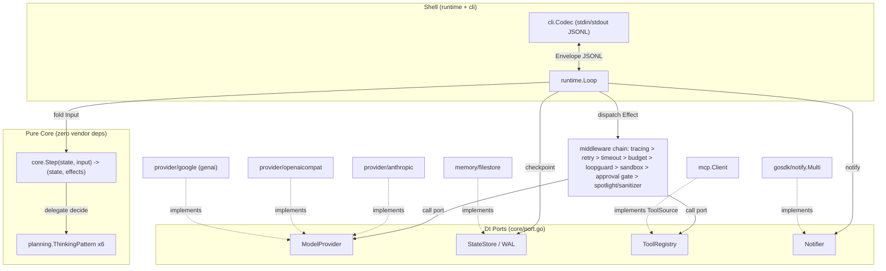

# agentsdk — Go Agentic Loop SDK + Log Doctor Sample 實作計畫

## Context（背景）

建立一個全新的 Go 語言 Agent SDK（模組 `github.com/bizshuk/agentsdk`），實作目標導向控制迴圈 (Goal-directed Control Loop)，涵蓋使用者定義的四大步驟：認知架構、系統韌性、工具生態與安全、架構解耦。並以一個 `log doctor` 風格的 sample（監聽 log 檔 → 診斷錯誤 → 把補救任務 1/2/3 加入 todo list → 高風險修復走 HITL 審批）驗證 SDK 的每一層原語。

- 目標目錄：`/Users/shuk/projects/playground/agentsdk`（目前只有 `plans/`）
- 重用 `github.com/bizshuk/gosdk`（config / log / notify / metric），不重造輪子
- gosdk 完全沒有 LLM / agent / tool-calling 程式碼，這些全部是新設計
- 概念前身：`vscode-plugin-experiment/log_doctor/`（TypeScript 版），Go sample 沿用其 domain 流程（listener → dedupe → queue → fixer → risk gate → applier），但改建於 agentsdk 原語之上
- 執行分四個 milestone（M1–M4 對應 Step 1–4），由 Sonnet 依序執行；每個 milestone 有獨立驗證

## 決策摘要（Decisions）

| 決策 | 選擇 | 理由 |
|------|------|------|
| 模組切分 | `go.work` 多模組：root（core SDK）+ `provider/*` + `mcp` + `sample/logdoctor` 各自 `go.mod` | 同時滿足 core purity（root 零 LLM vendor 依賴）與「每子專案獨立 go.mod」慣例 |
| 四大支柱 | 直接成為頂層 package：`perception/` `memory/` `planning/` `action/` | 架構即文件 |
| 核心純粹性 | `core/` 是純狀態機 `Step(state, input) → (state, effects)`，只用 stdlib，連 gosdk 都不 import | 可獨立發佈；gosdk wiring 只發生在 sample 組合根 |
| LLM Providers | 三個 adapter：`anthropic-sdk-go`、OpenAI-compatible（Ollama/LM Studio）、`google.golang.org/genai` | 使用者指定，驗證 DI 可抽換 |
| Tool schema | `invopop/jsonschema` struct 反射產生 + 手寫最小 required-field 驗證 | Go 最接近 Pydantic/Zod 的方案，避免第二個重量級驗證依賴 |
| MCP | `github.com/modelcontextprotocol/go-sdk`，包成 `action.ToolSource`（discover first, inject later） | runtime 不直接 import mcp，只有 sample 組合根 wiring |
| 持久化 | 預設 file-based（JSON snapshot + JSONL WAL）於 `config.GetAppDataDir()`；gorm/SQLite 留為可選 adapter | 依賴輕量；慣例優先不加路徑設定 |
| Token 計數 | `CountTokens` 放在 `ModelProvider` 介面上（Anthropic/genai 有原生端點；openaicompat 用 chars/4 啟發式） | 避免 cgo tiktoken |

## 架構總覽



## 目錄結構

```
agentsdk/
├── go.work                                # use: . ./provider/* ./mcp ./sample/logdoctor
├── go.mod                                 # module github.com/bizshuk/agentsdk (root, Go 1.26)
├── core/                                  # 純狀態機 + 全部 DI port 介面（僅 stdlib）
│   ├── state.go                           # State, RunStatus, Budget
│   ├── input.go                           # Input, InputKind, Percept
│   ├── effect.go                          # Effect, EffectKind
│   ├── step.go                            # Step func type, NewStep(patterns)
│   ├── message.go                         # Message, Role, Chunk, ChunkKind（多模態）
│   ├── thinking.go                        # ThinkingPattern 介面, ThinkingKind 常數
│   ├── tool.go                            # ToolCall, ToolSchema, ToolResult, RiskLevel
│   ├── autonomy.go                        # AutonomyLevel L0-L4, ApprovalPolicy 介面
│   ├── approval.go                        # PendingApproval, ApprovalDecision
│   └── port.go                            # ModelProvider, StateStore, WAL, ToolRegistry, Notifier
├── perception/                            # 支柱 1：感知
│   ├── source.go                          # Source 介面 (Percepts(ctx) <-chan core.Percept)
│   └── normalize.go
├── memory/                                # 支柱 2：記憶 + Step 2 韌性
│   ├── window.go                          # Window, TokenCounter 介面（滾動窗口）
│   ├── compactor.go                       # Compactor 介面, SummarizingCompactor
│   ├── checkpoint/checkpointer.go         # Checkpointer{Store, Log}, Checkpoint(), Recover()
│   └── filestore/                         # 預設實作
│       ├── statestore.go                  # FileStateStore（每 run 一個 JSON snapshot）
│       └── wal.go                         # FileWAL（每 run 一個 append-only JSONL）
├── planning/                              # 支柱 3：規劃 — 六種思考範式
│   ├── react.go                           # 實作（直覺）
│   ├── planner_executor.go                # 實作（藍圖）
│   ├── executor_critic.go                 # 實作（審慎）
│   ├── cot_singleshot.go                  # STUB
│   ├── reflexion.go                       # STUB
│   └── router.go                          # STUB（Router/Orchestrator）
├── action/                                # 支柱 4：行動
│   ├── tool.go                            # Tool 介面, TypedTool[TArgs] 泛型包裝
│   ├── schema.go                          # invopop/jsonschema 反射 + 最小驗證
│   ├── registry.go                        # Registry（靜態 tools + ToolSource）
│   ├── approval_policy.go                 # DefaultApprovalPolicy（L0-L4 閘控）
│   └── sandbox.go                         # 路徑/指令 allowlist
├── middleware/
│   ├── middleware.go                      # Middleware, Next, Chain()
│   ├── harness/{retry,budget,timeout}.go
│   ├── loopguard/loopguard.go             # 指紋 + 無進展偵測 → 強制轉 RequestApproval
│   ├── security/{spotlight,sanitizer,sandbox_mw}.go
│   └── observability/tracing.go           # OTel span（重用 gosdk/metric.Tracer）
├── runtime/loop.go                        # Shell：Loop{Step, ports, Middleware}, Run/Resume/SubmitApproval
├── cli/{envelope,codec}.go                # 純 CLI JSONL 協定
├── internal/testutil/                     # FakeProvider（決定性腳本化 ModelProvider）
├── provider/
│   ├── anthropic/{go.mod,provider.go}     # anthropic-sdk-go
│   ├── openaicompat/{go.mod,provider.go}  # Ollama / LM Studio
│   └── google/{go.mod,provider.go}        # google.golang.org/genai
├── mcp/{go.mod,client.go}                 # 實作 action.ToolSource
└── sample/logdoctor/
    ├── go.mod
    ├── cmd/{root,run,watch,resume,approve,list}.go   # gosdk 慣例 cmd/<verb>.go (cobra)
    ├── core/{listener,dedupe,todo}.go     # gosdk 慣例 core/<noun>.go（app domain 層）
    └── tool/{read_log_tail,add_todo,list_todos,complete_todo,propose_fix,notify}.go
```

注意：`sample/logdoctor/core/`（gosdk noun 層慣例）與 SDK 的 `agentsdk/core`（純狀態機）撞名但屬不同 module import path，編譯安全；在 sample README 明文標註，不改名（慣例衝突 flag，非自行發明選項）。

## 核心介面（關鍵型別簽名）

常數一律 SCREAMING_SNAKE_CASE（使用者慣例，偏離 Go 官方 ST1003；如上 golangci-lint 需加例外）。

### core — 狀態機

```go
type AutonomyLevel int
const (
    AUTONOMY_L0 AutonomyLevel = iota // 全手動
    AUTONOMY_L1                      // 低風險自動、其餘閘控 ┐ 企業級
    AUTONOMY_L2                      // 多數自動、高風險閘控 ┘ 預設上限
    AUTONOMY_L3
    AUTONOMY_L4
)

type State struct {
    RunID            string
    Turn             int
    Autonomy         AutonomyLevel
    ThinkingKind     ThinkingKind
    Messages         []Message
    Scratch          map[string]any    // 規劃支柱的 blueprint/working memory
    PendingApprovals []PendingApproval // HITL — 即是脫水暫停點
    Budget           Budget
    Status           RunStatus         // running/paused_for_approval/completed/failed/aborted
    UpdatedAt        time.Time
}

type Budget struct {
    MaxTurns, UsedTurns   int
    MaxTokens, UsedTokens int
    MaxWallTime           time.Duration
    StartedAt             time.Time
}
func (b Budget) Exceeded() (bool, string)

// Input 驅動一次 Step；Kind: PERCEPT / MODEL_RESULT / TOOL_RESULT / APPROVAL_DECISION / RESUME
type Input struct {
    Kind             InputKind
    Percept          *Percept
    ModelResult      *ModelResult
    ToolResult       *ToolResult
    ApprovalDecision *ApprovalDecision
}

// Effect 是描述副作用的資料 — core 絕不做 I/O
// Kind: CALL_MODEL / CALL_TOOL / REQUEST_APPROVAL / NOTIFY / CHECKPOINT / EMIT / DONE
type Effect struct {
    Kind            EffectKind
    CallModel       *CallModelEffect
    CallTool        *CallToolEffect
    RequestApproval *RequestApprovalEffect
    Notify          *NotifyEffect
    Checkpoint      *CheckpointEffect
    Emit            *EmitEffect
}

// 純轉移函式：給定 (state, input) 決定性、無 I/O
type Step func(state State, input Input) (State, []Effect)
func NewStep(patterns map[ThinkingKind]ThinkingPattern) Step  // 唯一的 dispatch 點
```

### core — 多模態 Chunk

```go
type ChunkKind string // text / audio / image / tool_use / tool_result
type Chunk struct {
    Kind       ChunkKind
    Text       string
    Audio      []byte; AudioMIME string
    Image      []byte; ImageMIME string
    ToolUse    *ToolUseChunk
    ToolResult *ToolResultChunk
    Done       bool
}
type Message struct { Role Role; Chunks []Chunk; Ts time.Time }
```

### core — ThinkingPattern（planning 實作）

```go
type ThinkingPattern interface {
    Kind() ThinkingKind
    Decide(state State) (State, []Effect) // 純函式，只描述 effect 不執行
}
// react / planner_executor / executor_critic 實作；cot_single_shot / reflexion / router 為 STUB
```

### core — DI Ports

```go
type ModelProvider interface {
    Name() string
    Generate(ctx context.Context, req ModelRequest) (ModelResult, error)
    Stream(ctx context.Context, req ModelRequest) (<-chan Chunk, error)
    CountTokens(ctx context.Context, msgs []Message) (int, error)
}
type StateStore interface {
    Save(ctx context.Context, s State) error
    Load(ctx context.Context, runID string) (State, error)
    List(ctx context.Context) ([]string, error)
    Delete(ctx context.Context, runID string) error
}
type WAL interface {
    Append(ctx context.Context, runID string, seq int, in Input) error
    Replay(ctx context.Context, runID string, sinceSeq int) ([]Input, error)
    Truncate(ctx context.Context, runID string, uptoSeq int) error
}
// Notifier 與 gosdk/notify.Notifier 方法集完全相同 {Notify(ctx, string) error}
// → gosdk notify.NewMulti(...) 結構性滿足，無需 adapter
```

### action — Tool 與 schema

```go
type Tool interface {
    Name() string
    Description() string
    Schema() (json.RawMessage, error)
    Risk() core.RiskLevel // low / high
    Call(ctx context.Context, args json.RawMessage) (core.ToolResult, error)
}

// 原子化工具標準寫法：TArgs 是帶 json + jsonschema tag 的 struct，schema 反射一次後快取
type TypedTool[TArgs any] struct {
    NameV string; DescV string; RiskV core.RiskLevel
    Fn    func(ctx context.Context, args TArgs) (core.ToolResult, error)
}

type ToolSource interface { // MCP 形狀：discover first, inject later
    Discover(ctx context.Context) ([]core.ToolSchema, error)
    Call(ctx context.Context, name string, args json.RawMessage) (core.ToolResult, error)
}
```

### middleware — 鏈

```go
type Next func(ctx context.Context, state core.State, eff core.Effect) (core.Input, error)
type Middleware func(Next) Next
func Chain(mws ...Middleware) Middleware
```

組合順序（外 → 內）：tracing（最外層才能涵蓋 retry）→ retry → timeout → budget → loopguard（可把第 N 次重複 CallTool 強制轉成 RequestApproval）→ sandbox（可直接 DENY）→ approval gate（依 ApprovalPolicy，ASK 時 append PendingApproval 並暫停）→ spotlight/sanitizer（回程：ToolResult 進入下一個 Input 前打標/掃描）→ base dispatcher（runtime 內，真正呼叫 port）。

### cli — JSONL 協定

```go
// MessageType: percept / assistant / tool_call / tool_result / approval_request /
//              approval_decision / checkpoint / result / error
type Envelope struct {
    Type       MessageType            `json:"type"`
    RunID      string                 `json:"run_id,omitempty"`
    // ... 對應各型別的 optional payload 欄位
}
type Codec struct{ /* bufio.Scanner in, json.Encoder out */ }
```

### runtime — Loop

```go
type Loop struct {
    Step       core.Step
    Model      core.ModelProvider
    Tools      core.ToolRegistry
    Store      core.StateStore
    WAL        core.WAL
    Approval   core.ApprovalPolicy
    Notifier   core.Notifier
    Middleware middleware.Middleware
    Emit       func(core.Effect, core.Input) // → cli.Codec.WriteEnvelope
}
func (l *Loop) Run(ctx context.Context, s core.State) (core.State, error)
func (l *Loop) Resume(ctx context.Context, runID string) (core.State, error)
func (l *Loop) SubmitApproval(ctx context.Context, d core.ApprovalDecision) error
```

## gosdk Wiring

| gosdk 套件 | 接點 | 方式 |
|-----------|------|------|
| `config` | `sample/logdoctor/cmd/root.go` | `config.Default(config.WithAppName("logdoctor"))` 於 PersistentPreRunE；`MODEL_PROVIDER`/`MODEL_NAME`/`MODEL_BASE_URL` 走 viper；資料/日誌目錄一律 `GetAppDataDir()`/`GetAppLogDir()`，不加路徑 flag |
| `log` | import 副作用 | `LOG_LEVEL`/`LOG_FORMAT` 必須是 process 啟動前的 OS env（gosdk log 的 init() 早於 config.Default()，無 re-init 函式）；sample README 記載 `LOG_LEVEL=debug go run ...` |
| `notify` | `runtime.Loop.Notifier` | `notify.NewMulti(&notify.StdoutNotifier{}, notify.NewSlackNotifier(...))` 直接傳入（方法集相同，結構性滿足） |
| `metric` | `middleware/observability` + `cmd/root.go` | `metric.Tracer("agentsdk")` 每個 CallModel/CallTool effect 一個 span；root 呼叫 `InitTracerProvider` + `CobraCMDHook(root)`，離開時 `ShutdownOTel` |
| `db` | 不用（可選 adapter） | 預設 filestore；日後要可查詢 run history 再於 sample 加 gorm StateStore adapter，不動 SDK |
| `utils` | sample e2e | `utils.CreateIfNotExist` 種 demo log 檔 |
| `scheduler` | 刻意不重用 | cooldown 需要有狀態計算（canRun/msUntilNextRun），非固定 tick；照 TS 版手刻 |

## Milestones

### M1 — Step 1：核心範式與認知架構 + sample 骨架

建立檔案：
- `go.mod`（root）、`go.work`
- `core/` 全部檔案（`StateStore`/`WAL` 只宣告介面，尚無實作）
- `planning/`：react、planner_executor、executor_critic 實作；cot_singleshot、reflexion、router 為 STUB（介面合規、`// STUB:` 註解 + TODO）
- `perception/`：介面
- `action/`：`tool.go`、`registry.go`（僅記憶體靜態註冊，schema/sandbox/MCP 後補）
- `runtime/loop.go`（最小版：直接 dispatch，無 middleware）
- `internal/testutil/fake_provider.go`（決定性腳本化 ModelProvider）
- `sample/logdoctor`：`go.mod`、`cmd/root.go`、`cmd/run.go`、`core/listener.go`（tail + regex，先無 dedupe）、`tool/read_log_tail.go`、`tool/notify.go`

依賴順序：core → planning → action → runtime → testutil → sample。

驗證：
- `go test ./core/... ./planning/... ./action/... ./runtime/...`：table-driven + t.Run + testify；三個實作 pattern 的 Step 轉移（percept→CallModel、tool_use→CallTool、end_turn→DONE）；stub 回固定 no-op effect 不 panic
- e2e：`go run ./sample/logdoctor run --once --fixture testdata/error.log` 用 FakeProvider（零網路），斷言 JSONL 輸出為 read_log_tail → notify → done

### M2 — Step 2：系統韌性與循環防禦

建立檔案：
- `memory/window.go`、`compactor.go`、`checkpoint/checkpointer.go`、`filestore/{statestore,wal}.go`
- `middleware/middleware.go`、`harness/{retry,budget,timeout}.go`、`loopguard/loopguard.go`
- `runtime/loop.go` 接上 middleware chain（tracing/sandbox/approval 留 M3/M4）
- `sample/logdoctor`：`cmd/resume.go`；`core/dedupe.go`（移植 TS 版 `sha1(ruleId+text)[:12]` 指紋 + cooldown）

驗證：
- 單元：Budget 到頂即停；Retry 注入暫時錯誤重試 N 次後 surface；FileStateStore/FileWAL round-trip；`Checkpointer.Recover` 模擬 crash 後重建出完全相同 State（testify.Equal），且 FakeProvider 呼叫計數在 replay 中不增加（證明不重呼叫 LLM）
- e2e：跑 sample、中途 kill process、`logdoctor resume <run-id>` 從最後 WAL turn 續跑
- 循環防禦：同 tool+args 指紋重複 5 次且無新觀察 → 斷言 loopguard 把第 5 次 CallTool 轉成 `RequestApproval{Reason: "loop_detected"}`

### M3 — Step 3：工具生態與執行期安全

建立檔案：
- `action/schema.go`（invopop/jsonschema 反射 + required-field 驗證）、`action/sandbox.go`
- `middleware/security/{spotlight,sanitizer,sandbox_mw}.go`、`observability/tracing.go`
- `mcp/{go.mod,client.go}`（`modelcontextprotocol/go-sdk`，實作 `action.ToolSource`）
- `sample/logdoctor`：`tool/{add_todo,list_todos,complete_todo}.go`、`core/todo.go`、`cmd/list.go`；既有 tools 改用 `TypedTool[TArgs]`

驗證：
- 單元：每個 tool 的 Args struct schema 含 required 欄位；sandbox allow/deny table；spotlight 以分隔符標記 untrusted 工具輸出；sanitizer 命中 fixture 注入字串（"ignore previous instructions ..."）；tracing 用 in-memory OTel exporter 斷言 span 數/屬性；`mcp.Client.Discover` 對本地測試 MCP server 回傳宣告工具
- e2e：注入含 prompt injection payload 的 log 行；斷言 transcript 中工具結果已被 spotlight 標記 untrusted，且 `list_todos` 只含合法補救任務

### M4 — Step 4：架構解耦與全場景泛化 + 完整 HITL

建立檔案：
- `action/approval_policy.go`（L1/L2 企業預設：high risk 一律 ASK 直到 L3+；low risk L1+ 自動）
- `cli/{envelope,codec}.go`
- `provider/anthropic`、`provider/openaicompat`、`provider/google`（三者只依賴 root module 的 core port 型別，可平行開發）
- `sample/logdoctor`：`cmd/watch.go`、`cmd/approve.go`、`tool/propose_fix.go`（RiskLevel high）；`cmd/root.go` 接 provider 選擇

驗證：
- 單元：含 mid-run PendingApproval 的 State JSON round-trip（脫水/復水）；ApprovalGate 使 run 進入 `RUN_STATUS_PAUSED_APPROVAL`；approve/reject 分歧正確；`cli.Codec` 對每個 MessageType round-trip；DI 抽換測試 — 同一 `runtime.Loop` 換兩個 FakeProvider，斷言 runtime/core 無 provider 型別洩漏；`Chunk{Kind: IMAGE}` 全程穿透 Message 不損毀（證明多模態抽象成立）
- 完整 e2e（目標使用者故事）：`logdoctor watch <path> --interactive` → append ERROR 行 → JSONL 流：percept → ReAct tool calls → `add_todo` x3 → `propose_fix` 觸發 `approval_request` → 另一個 process 執行 `logdoctor approve <approval-id>`（證明透過 StateStore 的非同步 out-of-band resume）→ 修復套用、`complete_todo`、StdoutNotifier 摘要
- Provider 實測：openaicompat 指向本地 Ollama（免憑證，作為預設檢查）；有 ANTHROPIC_API_KEY / GOOGLE_API_KEY 時各跑一次 anthropic 與 google provider

## 風險與注意事項（Risks）

1. 外部套件版本未驗證：本地 module cache 只有 `google.golang.org/genai@v1.62.0`；`anthropic-sdk-go`、`modelcontextprotocol/go-sdk`、`invopop/jsonschema` 需在對應 milestone 開頭 `go get` 後確認 API 形狀再寫 adapter
2. WAL replay 與非決定性 LLM：WAL 只記錄已解析的 Input（ModelResult/ToolResult 事實），不記「呼叫意圖」，replay 天然決定性、不重呼叫 LLM。真正缺口在「effect 執行完成」與「WAL append」之間 crash 會掉一筆結果 → 每個 ToolCall/model call 給穩定 ID，Recover 檢查最後 dispatch 的 effect 結果是否已 append 再決定是否重派（M2 必須顯式處理 idempotency key）
3. loopguard 誤判：sample 本來就會重複輪詢 `read_log_tail` → 指紋必須排除揮發性參數（tail offset/cursor），並以「工具結果內容無新資訊」而非「同名工具再次呼叫」為判準，否則會殺掉 sample 自己的核心用例
4. SCREAMING_SNAKE_CASE 常數違反 staticcheck ST1003 → repo 層 `.golangci.yml` 需為 const 宣告加例外
5. `sample/logdoctor/core` 與 `agentsdk/core` 撞名：不同 module path 編譯安全，sample README 明文說明，兩邊慣例都不改
6. openaicompat 無原生 token 計數：文件化 chars/4 啟發式（或 Ollama `/api/tokenize` 可用時採用）；`memory.Window` 不假設任何計數策略
7. `gosdk/log` init 順序限制為既有行為（非本專案引入），sample 文件照實記載

## Verification（整體驗收）

1. `go build ./...` 於 go.work 全模組通過；`go vet ./...` 乾淨
2. 每個 milestone 的單元測試全綠（table-driven + testify）
3. M1/M2/M3 的 e2e 均以 `testutil.FakeProvider` 離線可重現
4. M4 完整故事以本地 Ollama 實測一次：watch → ERROR → todo 1/2/3 → approval_request → 另一 process approve → resume → 完成通知
5. crash-recovery 演練：kill -9 中途、resume 後 State 與 WAL replay 重建一致
6. 完成後把本計畫轉為 `docs/specs/` 規格文件（依使用者全域慣例）
